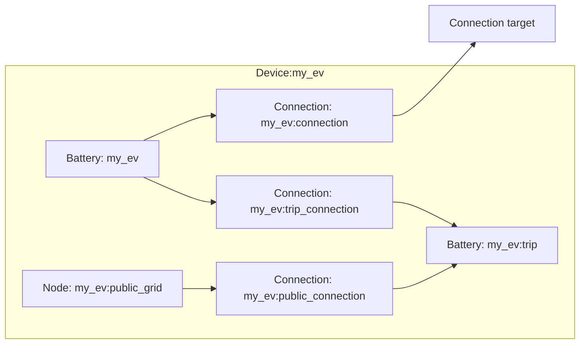

# EV modeling

The EV device composes two [Battery](../model-layer/elements/battery.md) elements, one [Node](../model-layer/elements/node.md), and three [Connection](../model-layer/connections/connection.md) elements.
The main battery represents the physical EV battery, while a secondary trip battery captures per-trip energy requirements from calendar data.

## Model elements created

The adapter creates six model elements:

| Model Element                                          | Name                       | Purpose                                                    |
| ------------------------------------------------------ | -------------------------- | ---------------------------------------------------------- |
| [Battery](../model-layer/elements/battery.md)          | `{name}`                   | Physical EV battery with SOC tracking                      |
| [Connection](../model-layer/connections/connection.md) | `{name}:connection`        | Home charging path (EV ↔ network), active when connected   |
| [Battery](../model-layer/elements/battery.md)          | `{name}:trip`              | Trip energy sink, capacity set from calendar events        |
| [Connection](../model-layer/connections/connection.md) | `{name}:trip_connection`   | EV battery → trip battery, active when disconnected        |
| [Node](../model-layer/elements/node.md)                | `{name}:public_grid`       | Source-only node representing public charging availability |
| [Connection](../model-layer/connections/connection.md) | `{name}:public_connection` | Public grid → trip battery with optional pricing           |

## Architecture details

### Connected and disconnected states

The EV alternates between two states driven by a binary sensor:

- **Connected** (plugged in at home): The home charging connection is active, trip connections are zeroed
- **Disconnected** (away on trip): The home charging connection is zeroed, trip connections are active

This is implemented by multiplying power limits with a connected/disconnected flag array aligned to the optimization horizon.

### Trip energy modeling

Calendar events define trip windows.
For each trip, the required energy is:

$$
E_{\text{trip}} = d \cdot r
$$

where $d$ is the trip distance (from the calendar event location field) and $r$ is the energy-per-distance rate.

The trip battery's capacity is set to the required trip energy during the trip window and zero otherwise.
This forces the optimizer to transfer energy from the EV battery into the trip battery during the trip, modeling energy consumption.

### Mid-trip energy tracking

When the car is mid-trip and the odometer updates, HAEO reduces the remaining trip energy requirement:

$$
E_{\text{remaining}} = E_{\text{trip}} - (o_{\text{current}} - o_{\text{disconnect}}) \cdot r
$$

where $o_{\text{current}}$ is the current odometer reading and $o_{\text{disconnect}}$ is the odometer at disconnection.

If the odometer does not update while driving, HAEO conservatively assumes no progress and reserves the full trip energy.

### Public charging

The public grid node is a source-only node that can supply energy to the trip battery through the public connection.
When a public charging price is configured, the optimizer can choose between:

- Pre-charging the EV at home prices before the trip
- Using public charging during the trip at the configured price

The optimizer selects the cheaper option based on current and forecast prices.

## Devices created

The EV element creates a single Home Assistant device:

| Device | Name     | Created when | Purpose                                 |
| ------ | -------- | ------------ | --------------------------------------- |
| EV     | `{name}` | Always       | Power, energy, SOC, trip, shadow prices |

## Parameter mapping

| User configuration         | Model element(s)                      | Model parameter        | Notes                            |
| -------------------------- | ------------------------------------- | ---------------------- | -------------------------------- |
| `capacity`                 | Battery `{name}`                      | `capacity`             | kWh, time-series boundary array  |
| `current_soc`              | Battery `{name}`                      | `initial_charge`       | Converted from percentage to kWh |
| `max_charge_rate`          | Connection `{name}:connection`        | Power limit segment    | Masked by connected flag         |
| `max_discharge_rate`       | Connection `{name}:connection`        | Power limit segment    | Masked by connected flag         |
| `energy_per_distance`      | Trip capacity calculation             | Multiplied by distance | kWh/distance unit                |
| `public_charging_price`    | Connection `{name}:public_connection` | Pricing segment        | Optional, \$/kWh                 |
| `efficiency_source_target` | Connection `{name}:connection`        | Efficiency segment     | Discharge direction              |
| `efficiency_target_source` | Connection `{name}:connection`        | Efficiency segment     | Charge direction                 |
| `max_power_source_target`  | Connection `{name}:connection`        | Power limit segment    | Combined with discharge rate     |
| `max_power_target_source`  | Connection `{name}:connection`        | Power limit segment    | Combined with charge rate        |

## Output mapping

The adapter maps model outputs to EV-specific sensor names:

| Model output                     | Sensor name                 | Description                    |
| -------------------------------- | --------------------------- | ------------------------------ |
| `BATTERY_POWER_CHARGE`           | `power_charge`              | Charge power                   |
| `BATTERY_POWER_DISCHARGE`        | `power_discharge`           | Discharge power                |
| Calculated                       | `power_active`              | Net power (discharge − charge) |
| `BATTERY_ENERGY_STORED`          | `energy_stored`             | Energy in EV battery           |
| Calculated                       | `state_of_charge`           | SOC percentage                 |
| `BATTERY_POWER_BALANCE`          | `power_balance`             | Power balance shadow price     |
| Trip `BATTERY_ENERGY_STORED`     | `trip_energy_required`      | Trip energy requirement        |
| `CONNECTION_POWER_SOURCE_TARGET` | `public_charge_power`       | Public charging power          |
| Power limit shadow               | `power_max_charge_price`    | Charge limit shadow price      |
| Power limit shadow               | `power_max_discharge_price` | Discharge limit shadow price   |

See [EV Configuration](../../user-guide/elements/ev.md#sensors-created) for complete sensor documentation.

## Next steps

- :material-file-document:{ .lg .middle } **EV configuration**

    ---

    Configure EVs in your Home Assistant setup.

    [:material-arrow-right: EV configuration](../../user-guide/elements/ev.md)

- :material-battery-charging:{ .lg .middle } **Battery model**

    ---

    Mathematical formulation for battery storage.

    [:material-arrow-right: Battery model](../model-layer/elements/battery.md)

- :material-connection:{ .lg .middle } **Connection model**

    ---

    How power limits, efficiency, and pricing are applied.

    [:material-arrow-right: Connection formulation](../model-layer/connections/connection.md)

