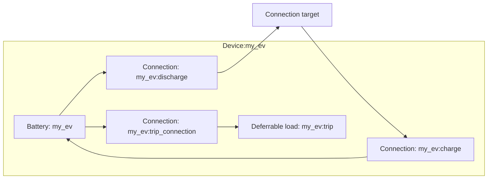

# EV modeling

The EV device composes a [Battery](../model-layer/elements/battery.md), a deferrable load, and three [Connection](../model-layer/connections/connection.md) elements.
The battery represents the physical EV pack, while the deferrable trip load captures per-trip energy requirements from calendar data.

## Model elements created

```mermaid
graph LR
    subgraph deviceEV["Device:my_ev"]
        Battery["Battery: my_ev"]
        TripLoad["Deferrable load: my_ev:trip"]
        ChargeConn["Connection: my_ev:charge"]
        DischargeConn["Connection: my_ev:discharge"]
        TripConn["Connection: my_ev:trip_connection"]
    end
    Target[Connection target]
    Target --> ChargeConn
    ChargeConn --> Battery
    Battery --> DischargeConn
    DischargeConn --> Target
    Battery --> TripConn
    TripConn --> TripLoad
```

The adapter creates five model elements:

| Model Element                                          | Name                     | Purpose                                             |
| ------------------------------------------------------ | ------------------------ | --------------------------------------------------- |
| [Battery](../model-layer/elements/battery.md)          | `{name}`                 | Physical EV battery with SOC tracking               |
| [Connection](../model-layer/connections/connection.md) | `{name}:charge`          | Home charging (network → EV), active when connected |
| [Connection](../model-layer/connections/connection.md) | `{name}:discharge`       | V2G discharge (EV → network), active when connected |
| Deferrable load                                        | `{name}:trip`            | Trip energy requirement with a priced shortfall     |
| [Connection](../model-layer/connections/connection.md) | `{name}:trip_connection` | EV battery → trip load, active when away            |

## Architecture details

### Connected and disconnected states

The EV alternates between two states:

- **Connected** (plugged in at home): The home charge/discharge connections are active, trip connections are zeroed
- **Away** (on a trip): The home connections are zeroed and the trip connection is active

The trip calendar is authoritative for the future: the away mask is derived from calendar event windows aligned to the horizon.
The live plugged-in binary sensor overrides the current interval, so early returns and unplanned absences are reflected immediately.
A car plugged in during an open trip also ends that trip (see [early return](#early-return)).
The plugged-in field accepts only a sensor; without one the calendar governs the current interval as well.
Without a calendar the sensor value applies across the whole horizon, and with neither source the EV is always connected.
The masks multiply the connection power limits.

### Trip energy modeling

Calendar events define trip windows.
For each trip, the required energy is:

$$
E_{\text{trip}} = d \cdot r
$$

where $d$ is the trip distance and $r$ is the energy-per-distance rate.
The distance is read from the first of the event's location, summary, or description fields that contains a parseable distance.

Trip windows become the windows of the [deferrable trip load](../model-layer/elements/deferrable_load.md), prepared the same way as for the [deferrable load device](deferrable_load.md#window-scheduling):
overlapping trips merge into one window with their distances summed, touching trips stay separate, and a trip running past the horizon end is due at the final boundary.
Only trips with a positive distance form windows; an event without a distance still marks the car away but asks for no energy.

The trip load counts the energy each trip receives from zero at the trip's start.
At each trip's end its requirement $E_{\text{trip}}$ is settled:

- **Shortfall** below the requirement is priced at the public charging price $p_{\text{public}}$ at that boundary.
- **Overage** is not allowed: the trip load has no overage price, so a trip never takes more energy than it needs.

$$
\text{cost} = \sum_{\text{trips}} p_{\text{public}}(e) \cdot \max\left(0,\ E_{\text{trip}} - E_{\text{delivered}}(e)\right)
$$

where $e$ is the trip's end boundary.
This models topping up publicly during the trip: the optimizer covers trip energy from the EV pack whenever home charging is cheaper than the public price, and a trip can never make the optimization infeasible.
A missed trip stays priced at its own end, and the next trip starts from zero.

The pack's initial charge clamps to $[0, C]$ so a glitched state-of-charge sensor cannot overfill the model.

### Reserve demand pricing

An optional reserve keeps a buffer in the pack while away.
Because the home connections are masked off during trips, the pack can only drain while away — so the lowest level hit during a trip window equals the level at the window's end.
The reserve is therefore priced with one check per trip end boundary $e$:

$$
\text{cost} = \sum_{e} p_{\text{reserve}}(e) \cdot \max\left(0,\ E_{\text{reserve}} - E_{\text{pack}}(e)\right)
$$

This is demand-level pricing: the charge is on the depth of each trip's dip below the reserve, not integrated over time spent below it.
The price defaults to the public charging price.

### Mid-trip energy tracking

When the car is away during a trip window that covers the current interval and the odometer updates, HAEO credits the distance already driven to that trip as the trip load's initial energy:

$$
E_{\text{initial}} = \max(0,\ o_{\text{current}} - o_{\text{disconnect}}) \cdot r
$$

where $o_{\text{current}}$ is the current odometer reading and $o_{\text{disconnect}}$ is the odometer at disconnection.
Odometer readings in any length unit are converted to kilometres first.
A negative or non-finite difference, or a missing reading, credits nothing.

The credited energy already left the pack, which the live state of charge reflects, so the model never draws it again:

- **Under target**: the remaining $E_{\text{trip}} - E_{\text{initial}}$ stays due at the trip's end.
- **Over target**: the trip's settled requirement becomes $\max(E_{\text{trip}}, E_{\text{initial}})$, so the trip is complete, takes no new energy, and the overshoot is neither priced nor infeasible.

The credit seeds only the trip window open now and never reaches later trips.
No credit applies when no trip window is open.
If the odometer does not update while driving, HAEO conservatively assumes no progress and reserves the full trip energy.

### Early return

When the plugged-in sensor reports the car at home while the calendar says a trip is open, the open trip is treated as over.
Its requirement and reserve checks are dropped, and the car counts as home until the trip's scheduled end.
This keeps a trip that ended early from demanding driving energy or pricing a phantom public top-up.
Later trips are unaffected.

### Public charging

Public charging is modeled as the price on the trip load's shortfall rather than as an explicit grid element.
The optimizer chooses between:

- Pre-charging the EV at home prices before the trip
- Leaving a shortfall to be topped up publicly during the trip at the configured price

The optimizer selects the cheaper option based on current and forecast prices.
Without a configured price the default \$10/kWh applies, which strongly discourages a shortfall without forbidding it.
The shortfall still keeps trips from making the optimization infeasible, and if effective home charging costs more than \$10/kWh the optimizer can deliberately leave one.
The expected public top-up is exposed as the trip energy shortfall output.

## Devices created

The EV element creates a single Home Assistant device:

| Device | Name     | Created when | Purpose                                 |
| ------ | -------- | ------------ | --------------------------------------- |
| EV     | `{name}` | Always       | Power, energy, SOC, trip, shadow prices |

## Parameter mapping

| User configuration         | Model element(s)              | Model parameter             | Notes                                      |
| -------------------------- | ----------------------------- | --------------------------- | ------------------------------------------ |
| `capacity`                 | Battery `{name}`              | `capacity`                  | kWh, time-series boundary array            |
| `current_soc`              | Battery `{name}`              | `initial_charge`            | SOC ratio × capacity                       |
| `trip_calendar`            | Deferrable load `{name}:trip` | Window masks, `requirement` | Trip energy due at each trip's end         |
| `max_charge_rate`          | Connection `{name}:charge`    | Power limit segment         | Masked by connected flag                   |
| `max_discharge_rate`       | Connection `{name}:discharge` | Power limit segment         | Masked by connected flag                   |
| `reserve_soc`              | Battery `{name}`              | `reserve_level`             | Fraction of capacity, checked at trip ends |
| `reserve_price`            | Battery `{name}`              | `reserve_price`             | Defaults to the public charging price      |
| `energy_per_distance`      | Trip energy calculation       | Multiplied by distance      | Wh/km and kWh/100km converted to kWh/km    |
| `odometer` pair            | Deferrable load `{name}:trip` | `initial_energy`            | Mid-trip progress credit                   |
| `public_charging_price`    | Deferrable load `{name}:trip` | `deficit_price`             | Defaults to \$10/kWh                       |
| `efficiency_source_target` | Connection `{name}:discharge` | Efficiency segment          | Discharge direction                        |
| `efficiency_target_source` | Connection `{name}:charge`    | Efficiency segment          | Charge direction                           |
| `max_power_source_target`  | Connection `{name}:discharge` | Power limit segment         | Combined with discharge rate               |
| `max_power_target_source`  | Connection `{name}:charge`    | Power limit segment         | Combined with charge rate                  |

## Output mapping

The adapter maps model outputs to EV-specific sensor names:

| Model output               | Sensor name                 | Description                                                            |
| -------------------------- | --------------------------- | ---------------------------------------------------------------------- |
| `{name}:charge` power      | `power_charge`              | Home charge power                                                      |
| `{name}:discharge` power   | `power_discharge`           | V2G discharge power                                                    |
| Calculated                 | `power_active`              | Net power (discharge − charge)                                         |
| `BATTERY_ENERGY_STORED`    | `energy_stored`             | Energy in EV battery                                                   |
| Calculated                 | `state_of_charge`           | SOC ratio                                                              |
| Trip load energy delivered | `trip_energy_delivered`     | Energy used by the current trip                                        |
| Trip load energy shortfall | `trip_energy_shortfall`     | Expected public top-up energy for each trip, at its end                |
| Battery reserve shortfall  | `reserve_shortfall`         | Dip below the reserve per trip (only when `reserve_soc` is configured) |
| Power limit shadow         | `power_max_charge_price`    | Charge limit shadow price                                              |
| Power limit shadow         | `power_max_discharge_price` | Discharge limit shadow price                                           |

See [EV Configuration](../../user-guide/elements/ev.md#sensors-created) for complete sensor documentation.

## Next steps

- :material-file-document:{ .lg .middle } **EV configuration**

    ---

    Configure EVs in your Home Assistant setup.

    [:material-arrow-right: EV configuration](../../user-guide/elements/ev.md)

- :material-battery-charging:{ .lg .middle } **Battery model**

    ---

    Mathematical formulation for battery storage.

    [:material-arrow-right: Battery model](../model-layer/elements/battery.md)

- :material-connection:{ .lg .middle } **Connection model**

    ---

    How power limits, efficiency, and pricing are applied.

    [:material-arrow-right: Connection formulation](../model-layer/connections/connection.md)

