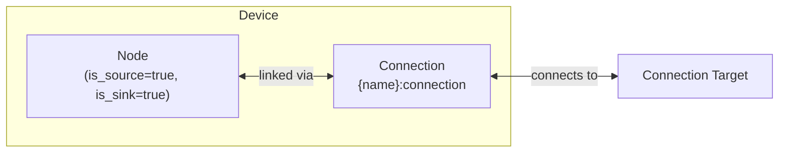

# Grid Modeling

The Grid device composes a [Node](../model-layer/elements/node.md) (bidirectional power source/sink) with an implicit [Connection](../model-layer/connections/connection.md) to model utility grid connections with time-varying import and export pricing.

## Model Elements Created

| Model Element                                          | Name                | Parameters From Configuration          |
| ------------------------------------------------------ | ------------------- | -------------------------------------- |
| [Node](../model-layer/elements/node.md)                | `{name}`            | is_source=true, is_sink=true           |
| [Connection](../model-layer/connections/connection.md) | `{name}:connection` | power-limit and pricing segment values |

## Devices Created

Grid creates 1 device in Home Assistant:

| Device  | Name     | Created When | Purpose                                   |
| ------- | -------- | ------------ | ----------------------------------------- |
| Primary | `{name}` | Always       | Bidirectional grid connection and pricing |

## Parameter mapping

The adapter transforms user configuration into connection segments.
Pricing fields come from the Pricing section, and demand pricing fields come from the Demand pricing section.
Grid demand pricing uses import (source-to-target) fields only.

| User Configuration                    | Segment              | Segment Field                         | Notes                                   |
| ------------------------------------- | -------------------- | ------------------------------------- | --------------------------------------- |
| `price_source_target`                 | PricingSegment       | `price_source_target`                 | Cost per kWh imported                   |
| `price_target_source`                 | PricingSegment       | `price_target_source`                 | Stored as negative to represent revenue |
| `max_power_source_target`             | PowerLimitSegment    | `max_power_source_target`             | Maximum import power (optional)         |
| `max_power_target_source`             | PowerLimitSegment    | `max_power_target_source`             | Maximum export power (optional)         |
| `demand_price_source_target`          | DemandPricingSegment | `demand_price_source_target`          | Optional demand price per kW            |
| `demand_current_energy_source_target` | DemandPricingSegment | `demand_current_energy_source_target` | Optional, kWh already used              |
| `demand_peak_cost_source_target`      | DemandPricingSegment | `demand_peak_cost_source_target`      | Optional, peak demand charge            |
| `demand_block_minutes`                | DemandPricingSegment | `demand_block_hours`                  | Converted to hours (defaults to 0.5 h)  |
| `connection`                          | Connection           | `target`                              | Node to connect to                      |
| —                                     | Node                 | `is_source=true`                      | Grid can supply power                   |
| —                                     | Node                 | `is_sink=true`                        | Grid can absorb power                   |

## Sensors Created

### Grid Device

| Sensor                   | Unit    | Update    | Description                        |
| ------------------------ | ------- | --------- | ---------------------------------- |
| `power_import`           | kW      | Real-time | Import power                       |
| `power_export`           | kW      | Real-time | Export power                       |
| `cost_import`            | \$      | Real-time | Cost of imports (when priced)      |
| `cost_export`            | \$      | Real-time | Revenue from exports (when priced) |
| `cost_net`               | \$      | Real-time | Net cost (when any price exists)   |
| `power_max_import`       | kW      | Real-time | Max import power (when limited)    |
| `power_max_export`       | kW      | Real-time | Max export power (when limited)    |
| `power_max_import_price` | \\\$/kW | Real-time | Max import power shadow price      |
| `power_max_export_price` | \\\$/kW | Real-time | Max export power shadow price      |

The `power_max_*` sensors are only created when the corresponding limit is configured.
The `cost_*` sensors are only created when the corresponding price is configured.

See [Grid Configuration](../../user-guide/elements/grid.md) for detailed sensor and configuration documentation.

## Configuration Examples

### Time-of-Use Pricing

| Field            | Value                           |
| ---------------- | ------------------------------- |
| **Name**         | Main Grid                       |
| **Import Price** | sensor.electricity_import_price |
| **Export Price** | sensor.electricity_export_price |
| **Connection**   | Home Bus                        |

### With Capacity Limits

| Field            | Value                           |
| ---------------- | ------------------------------- |
| **Name**         | Limited Grid                    |
| **Import Price** | sensor.electricity_import_price |
| **Export Price** | sensor.electricity_export_price |
| **Import Limit** | 10.0                            |
| **Export Limit** | 5.0                             |
| **Connection**   | Home Bus                        |

## Typical Use Cases

**Time-of-Use Optimization**:
Grid with time-varying prices enables battery arbitrage—charge during low prices, discharge during high prices.

**Feed-in Tariff Systems**:
Configure export pricing to model solar export revenue and optimize when to export vs. store in battery.

**Demand-Limited Connections**:
Use import/export limits to model connection capacity constraints and prevent exceeding utility limits.

## Physical Interpretation

Grid represents the utility connection that can supply power (import) when local generation is insufficient, or absorb excess power (export) from solar or battery discharge.

### Configuration Guidelines

- **Import/Export Pricing**: Use [sensor](../../user-guide/forecasts-and-sensors.md) or [forecast](../../user-guide/forecasts-and-sensors.md) for time-varying prices. Ensure export prices are always less than import prices to prevent unrealistic arbitrage.
- **Power Limits**: Configure limits to model connection capacity constraints. If omitted, grid has unlimited capacity.
- **Pricing Strategy**: Flat pricing provides limited optimization value (battery only useful for solar storage). Time-varying pricing enables full optimization benefits.
- **Zero Prices**: Avoid setting both import and export prices to zero simultaneously—optimizer has no economic preference and may produce unexpected results.

## Next Steps

- :material-file-document:{ .lg .middle } **Grid configuration**

    ---

    Configure grids in your Home Assistant setup.

    [:material-arrow-right: Grid configuration](../../user-guide/elements/grid.md)

- :material-power-plug:{ .lg .middle } **Node model**

    ---

    Underlying model element for Grid.

    [:material-arrow-right: Node formulation](../model-layer/elements/node.md)

- :material-connection:{ .lg .middle } **Connection model**

    ---

    How power limits and pricing are applied.

    [:material-arrow-right: Connection formulation](../model-layer/connections/connection.md)

