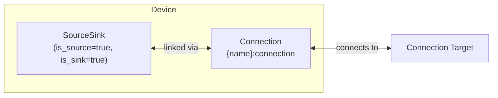

# Grid Modeling

The Grid device composes a [SourceSink](../model-layer/source-sink.md) (bidirectional power source/sink) with an implicit [Connection](../model-layer/connection.md) to model utility grid connections with time-varying import/export pricing.

## Model Elements Created

| Model Element                               | Name                | Parameters From Configuration              |
| ------------------------------------------- | ------------------- | ------------------------------------------ |
| [SourceSink](../model-layer/source-sink.md) | `{name}`            | is_source=true, is_sink=true               |
| [Connection](../model-layer/connection.md)  | `{name}:connection` | import/export limits, import/export prices |

## Devices Created

Grid creates 1 device in Home Assistant:

| Device  | Name     | Created When | Purpose                                   |
| ------- | -------- | ------------ | ----------------------------------------- |
| Primary | `{name}` | Always       | Bidirectional grid connection and pricing |

## Parameter Mapping

The adapter transforms user configuration into model parameters:

| User Configuration | Model Element | Model Parameter           | Notes                           |
| ------------------ | ------------- | ------------------------- | ------------------------------- |
| `import_price`     | Connection    | `price_target_source`     | Cost per kWh imported           |
| `export_price`     | Connection    | `price_source_target`     | Revenue per kWh exported        |
| `import_limit`     | Connection    | `max_power_target_source` | Maximum import power (optional) |
| `export_limit`     | Connection    | `max_power_source_target` | Maximum export power (optional) |
| `connection`       | Connection    | `target`                  | Node to connect to              |
| —                  | SourceSink    | `is_source=true`          | Grid can supply power           |
| —                  | SourceSink    | `is_sink=true`            | Grid can absorb power           |

## Sensors Created

### Grid Device

| Sensor                   | Unit   | Update    | Description                         |
| ------------------------ | ------ | --------- | ----------------------------------- |
| `power_imported`         | kW     | Real-time | Power imported from grid            |
| `power_exported`         | kW     | Real-time | Power exported to grid              |
| `price_import`           | \$/kWh | Real-time | Current import price                |
| `price_export`           | \$/kWh | Real-time | Current export price                |
| `power_max_import`       | kW     | Real-time | Maximum import power (when limited) |
| `power_max_export`       | kW     | Real-time | Maximum export power (when limited) |
| `power_max_import_price` | \$/kW  | Real-time | Value of additional import capacity |
| `power_max_export_price` | \$/kW  | Real-time | Value of additional export capacity |

The `power_max_*` sensors are only created when the corresponding limit is configured.

See [Grid Configuration](../../user-guide/elements/grid.md#sensors-created) for detailed sensor documentation.

## Configuration Examples

### Time-of-Use Pricing

| Field            | Value                           |
| ---------------- | ------------------------------- |
| **Name**         | Main Grid                       |
| **Import Price** | sensor.electricity_import_price |
| **Export Price** | sensor.electricity_export_price |
| **Connection**   | Home Bus                        |

### With Capacity Limits

| Field            | Value                           |
| ---------------- | ------------------------------- |
| **Name**         | Limited Grid                    |
| **Import Price** | sensor.electricity_import_price |
| **Export Price** | sensor.electricity_export_price |
| **Import Limit** | 10.0                            |
| **Export Limit** | 5.0                             |
| **Connection**   | Home Bus                        |

## Typical Use Cases

**Time-of-Use Optimization**:
Grid with time-varying prices enables battery arbitrage—charge during low prices, discharge during high prices.

**Feed-in Tariff Systems**:
Configure export pricing to model solar export revenue and optimize when to export vs. store in battery.

**Demand-Limited Connections**:
Use import/export limits to model connection capacity constraints and prevent exceeding utility limits.

## Physical Interpretation

Grid represents the utility connection that can supply power (import) when local generation is insufficient, or absorb excess power (export) from solar or battery discharge.

### Configuration Guidelines

- **Import/Export Pricing**: Use [sensor](../../user-guide/forecasts-and-sensors.md) or [forecast](../../user-guide/forecasts-and-sensors.md) for time-varying prices. Ensure export prices are always less than import prices to prevent unrealistic arbitrage.
- **Power Limits**: Configure limits to model connection capacity constraints. If omitted, grid has unlimited capacity.
- **Pricing Strategy**: Flat pricing provides limited optimization value (battery only useful for solar storage). Time-varying pricing enables full optimization benefits.
- **Zero Prices**: Avoid setting both import and export prices to zero simultaneously—optimizer has no economic preference and may produce unexpected results.

## Next Steps

- :material-file-document:{ .lg .middle } **Grid configuration**

    ---

    Configure grids in your Home Assistant setup.

    [:material-arrow-right: Grid configuration](../../user-guide/elements/grid.md)

- :material-power-plug:{ .lg .middle } **SourceSink model**

    ---

    Underlying model element for Grid.

    [:material-arrow-right: SourceSink formulation](../model-layer/source-sink.md)

- :material-connection:{ .lg .middle } **Connection model**

    ---

    How power limits and pricing are applied.

    [:material-arrow-right: Connection formulation](../model-layer/connection.md)

