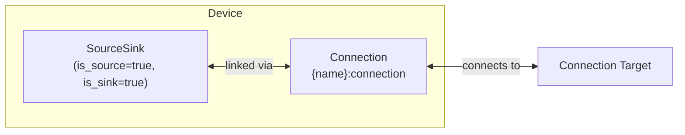

# Grid Modeling

The Grid element models bidirectional utility connection with time-varying pricing for import and export.

Grid creates a [SourceSink](../model-layer/source-sink.md) model (`is_source=true, is_sink=true`) plus an implicit [Connection](../model-layer/connection.md) that carries the import/export limits and pricing.

## Model Elements Created

| Model Element                               | Name                | Parameters From Configuration              |
| ------------------------------------------- | ------------------- | ------------------------------------------ |
| [SourceSink](../model-layer/source-sink.md) | `{name}`            | is_source=true, is_sink=true               |
| [Connection](../model-layer/connection.md)  | `{name}:connection` | import/export limits, import/export prices |

## Model Formulation

Grid creates a SourceSink with `is_source=true, is_sink=true` (can both import and export) plus a Connection with the following parameters:

### Decision Variables

For each time step $t$:

- $P_{\text{import}}(t)$: Power imported from grid (kW)
- $P_{\text{export}}(t)$: Power exported to grid (kW)

### Parameters

- $p_{\text{import}}(t)$: Import price (\$/kWh) - from `import_price` sensors
- $p_{\text{export}}(t)$: Export price (\$/kWh) - from `export_price` sensors
- $P_{\text{import}}^{\max}$: Max import (kW) - from `import_limit` config (optional)
- $P_{\text{export}}^{\max}$: Max export (kW) - from `export_limit` config (optional)

### Constraints

#### Non-negativity

$$
P_{\text{import}}(t) \geq 0, \quad P_{\text{export}}(t) \geq 0
$$

#### Power Limits

If configured:

$$
P_{\text{import}}(t) \leq P_{\text{import}}^{\max}, \quad P_{\text{export}}(t) \leq P_{\text{export}}^{\max}
$$

### Cost Contribution

$$
C_{\text{grid}} = \sum_{t=0}^{T-1} \left( P_{\text{import}}(t) \cdot p_{\text{import}}(t) - P_{\text{export}}(t) \cdot p_{\text{export}}(t) \right) \cdot \Delta t
$$

Import is positive cost. Export is negative cost (revenue).

## Physical Interpretation

**Import**: Grid supplies power when generation (solar, battery) is insufficient.

**Export**: Grid absorbs excess power from solar or battery discharge.

**Simultaneous import/export**: The optimizer will attempt this if arbitrage opportunities exist in the prices.
Ensure export prices are always less than import prices to prevent this behavior.
Even if both prices are zero, simultaneous flow can occur and cause poor optimization results, because the optimizer has no economic incentive to prefer import or export, and may select any feasible solution.

**Unlimited grid**: If no limits configured, grid can always balance power needs.

## Configuration Impact

| Parameter    | Lower Value                     | Higher Value                            |
| ------------ | ------------------------------- | --------------------------------------- |
| Import limit | Risk infeasibility if too low   | More flexibility, higher potential cost |
| Export limit | Wasted solar/battery if too low | More revenue potential                  |
| Import price | Lower grid costs                | Incentivizes self-consumption           |
| Export price | Less incentive to export        | More revenue from exports               |

**Time-varying prices**: Enable optimization value through time-shifting with battery.

**Flat pricing**: Limited optimization benefit - battery only useful for solar storage.

## Next Steps

- :material-file-document:{ .lg .middle } **Grid configuration**

    ---

    Configure grids in your Home Assistant setup.

    [:material-arrow-right: Grid configuration](../../user-guide/elements/grid.md)

- :material-power-plug:{ .lg .middle } **SourceSink model**

    ---

    Underlying model element for Grid.

    [:material-arrow-right: SourceSink formulation](../model-layer/source-sink.md)

- :material-connection:{ .lg .middle } **Connection model**

    ---

    How power limits and pricing are applied.

    [:material-arrow-right: Connection formulation](../model-layer/connection.md)

