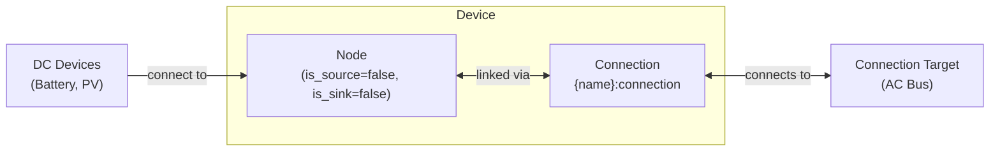

# Inverter Modeling

The Inverter device composes a [Node](../model-layer/elements/node.md) (as a DC bus junction) with an implicit [Connection](../model-layer/connections/connection.md) to model bidirectional DC/AC power conversion with separate efficiency and power limits per direction.

## Model Elements Created

| Model Element                                          | Name                | Parameters From Configuration                  |
| ------------------------------------------------------ | ------------------- | ---------------------------------------------- |
| [Node](../model-layer/elements/node.md)                | `{name}`            | is_source=false, is_sink=false (pure junction) |
| [Connection](../model-layer/connections/connection.md) | `{name}:connection` | efficiency and power-limit segment values      |

## Devices Created

Inverter creates 1 device in Home Assistant:

| Device  | Name     | Created When | Purpose                                         |
| ------- | -------- | ------------ | ----------------------------------------------- |
| Primary | `{name}` | Always       | DC/AC conversion tracking and DC bus monitoring |

## Parameter mapping

The adapter transforms user configuration into connection segments:

| User Configuration        | Segment           | Segment Field              | Notes                                 |
| ------------------------- | ----------------- | -------------------------- | ------------------------------------- |
| `efficiency_dc_to_ac`     | EfficiencySegment | `efficiency_source_target` | Efficiency when inverting (DC to AC)  |
| `efficiency_ac_to_dc`     | EfficiencySegment | `efficiency_target_source` | Efficiency when rectifying (AC to DC) |
| `max_power_source_target` | PowerLimitSegment | `max_power_source_target`  | Maximum inverting power (optional)    |
| `max_power_target_source` | PowerLimitSegment | `max_power_target_source`  | Maximum rectifying power (optional)   |
| `connection`              | Connection        | `target`                   | AC side node to connect to            |
| —                         | Node              | `is_source=false`          | DC bus is not a power source          |
| —                         | Node              | `is_sink=false`            | DC bus is not a power sink            |

## Sensors Created

### Inverter Device

| Sensor                     | Unit  | Update    | Description                              |
| -------------------------- | ----- | --------- | ---------------------------------------- |
| `power_dc_to_ac`           | kW    | Real-time | Power flowing from DC to AC (inverting)  |
| `power_ac_to_dc`           | kW    | Real-time | Power flowing from AC to DC (rectifying) |
| `power_active`             | kW    | Real-time | Net power (DC to AC - AC to DC)          |
| `dc_bus_power_balance`     | \$/kW | Real-time | DC bus power balance shadow price        |
| `max_power_dc_to_ac_price` | \$/kW | Real-time | Max DC to AC power shadow price          |
| `max_power_ac_to_dc_price` | \$/kW | Real-time | Max AC to DC power shadow price          |

The `max_power_*_price` sensors are only created when the corresponding limit is configured.

See [Inverter Configuration](../../user-guide/elements/inverter.md) for detailed sensor and configuration documentation.

## Configuration Examples

### Basic Hybrid Inverter

| Field                   | Value         |
| ----------------------- | ------------- |
| **Name**                | Main Inverter |
| **AC Connection**       | Home Bus      |
| **DC to AC Efficiency** | 97.0          |
| **AC to DC Efficiency** | 97.0          |

### With Power Limits

| Field                   | Value           |
| ----------------------- | --------------- |
| **Name**                | Hybrid Inverter |
| **AC Connection**       | Home Bus        |
| **DC to AC Efficiency** | 96.0            |
| **AC to DC Efficiency** | 95.0            |
| **Max DC to AC Power**  | 5.0             |
| **Max AC to DC Power**  | 5.0             |

## Typical Use Cases

**Hybrid Inverter Systems**:
Connect batteries and solar panels to the inverter's DC bus, with the AC side connecting to the home bus where loads and grid are attached.

**DC-Coupled Solar + Battery**:
When solar and battery share a DC bus, the inverter handles all DC/AC conversion.
This models systems where solar feeds the battery directly on the DC side.

**Asymmetric Power Ratings**:
Some inverters have different power ratings for inverting vs. rectifying.
Configure separate `max_power_source_target` and `max_power_target_source` to model this.

## Physical Interpretation

The Inverter represents a power electronics device that converts between DC and AC power.
The DC bus acts as a junction point where DC devices (batteries, solar panels with DC output) connect,
while the AC side connects to your home's AC network.

### Configuration Guidelines

- **Efficiency Values**: Typical modern inverters achieve 95-98% efficiency.
    Set slightly lower values to account for real-world losses.
- **Separate Efficiencies**: Rectifying (AC to DC) efficiency may differ from inverting (DC to AC).
    Measure or consult specifications for accurate values.
- **Power Limits**: Configure limits matching your inverter's continuous power rating.
    Peak/surge ratings should not be used as they are not sustainable.
- **DC Bus Connections**: Other elements (batteries, PV) should connect to the inverter's DC bus by specifying the inverter name as their connection target.

## Next Steps

- :material-power-plug:{ .lg .middle } **Node model**

    ---

    Underlying model element for the DC bus.

    [:material-arrow-right: Node formulation](../model-layer/elements/node.md)

- :material-connection:{ .lg .middle } **Connection model**

    ---

    How power limits and efficiency are applied.

    [:material-arrow-right: Connection formulation](../model-layer/connections/connection.md)

- :material-battery-charging:{ .lg .middle } **Battery modeling**

    ---

    Connect batteries to the inverter's DC bus.

    [:material-arrow-right: Battery modeling](battery.md)

- :material-weather-sunny:{ .lg .middle } **Solar modeling**

    ---

    Connect solar panels to the inverter's DC bus.

    [:material-arrow-right: Solar modeling](solar.md)

