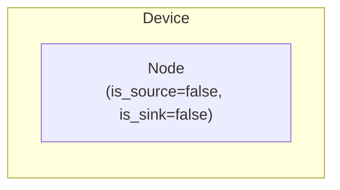

# Junction Modeling

The Junction device composes a [Node](../model-layer/elements/node.md) model element to represent an electrical bus where multiple elements connect and power must balance.

## Model Elements Created

| Model Element                           | Name     | Parameters From Configuration                  |
| --------------------------------------- | -------- | ---------------------------------------------- |
| [Node](../model-layer/elements/node.md) | `{name}` | is_source=false, is_sink=false (pure junction) |

Junction creates only a Node model element with no implicit Connection.

## Devices Created

Junction creates 1 device in Home Assistant:

| Device  | Name     | Created When | Purpose                          |
| ------- | -------- | ------------ | -------------------------------- |
| Primary | `{name}` | Always       | Junction point for power balance |

## Parameter Mapping

The adapter transforms user configuration into model parameters:

| User Configuration | Model Element | Model Parameter | Notes                                       |
| ------------------ | ------------- | --------------- | ------------------------------------------- |
| `name`             | Node          | `name`          | Element name                                |
| —                  | Node          | `is_source`     | Always `false`: a junction cannot add power |
| —                  | Node          | `is_sink`       | Always `false`: a junction cannot remove it |

A Junction device is always a pure junction.
Power enters and leaves the network only through device elements that bound and price it, such as [Grid](grid.md), [Solar](solar.md), and [Loads](loads.md).
The [Node](node.md) device exposes the model-layer source and sink flags for when unlimited production or consumption is wanted.

## Sensors Created

### Junction Device

| Sensor          | Unit   | Update    | Description                            |
| --------------- | ------ | --------- | -------------------------------------- |
| `power_balance` | \$/kWh | Real-time | Shadow price of power at this junction |

See [Junction Configuration](../../user-guide/elements/junction.md) for detailed sensor and configuration documentation.

## Configuration Examples

### Single Bus (Most Common)

| Field    | Value       |
| -------- | ----------- |
| **Name** | Switchboard |

### Multi-Bus Topology

**DC Bus:**

| Field    | Value  |
| -------- | ------ |
| **Name** | DC Bus |

**AC Bus:**

| Field    | Value  |
| -------- | ------ |
| **Name** | AC Bus |

## Typical Use Cases

**Single-Bus System**:
Most residential installations use the Switchboard junction created with the hub as the central connection point for all elements.

**DC/AC Separation**:
Systems with DC-coupled batteries and AC-coupled solar may use separate DC and AC buses connected by a converter.

**Multi-Site Systems**:
Large installations may use multiple junctions to represent different physical locations or voltage levels.

## Physical Interpretation

Junction represents an electrical bus where Kirchhoff's current law applies—total power flowing in must equal total power flowing out at every instant.

### Configuration Guidelines

- **Name Clearly**: Use descriptive names like `Switchboard`, `DC Bus`, `AC Bus` to clarify system topology.
- **Single Junction Sufficient**: Most home systems only need the Switchboard. Don't create more junctions unless you have a specific need (DC/AC separation, etc.).
- **No Storage**: Junctions have no capacity—power balance is instantaneous. Use Battery elements for energy storage.
- **Connection Target**: Other elements specify which junction they connect to via their `connection` field.

## Next steps

- :material-file-document:{ .lg .middle } **Junction configuration**

    ---

    Configure junctions in your Home Assistant setup.

    [:material-arrow-right: Junction configuration](../../user-guide/elements/junction.md)

- :material-power-plug:{ .lg .middle } **Node model**

    ---

    Underlying model element for the Junction device.

    [:material-arrow-right: Node formulation](../model-layer/elements/node.md)

- :material-connection:{ .lg .middle } **Connection model**

    ---

    Connect junctions to other elements.

    [:material-arrow-right: Connection formulation](../model-layer/connections/connection.md)

