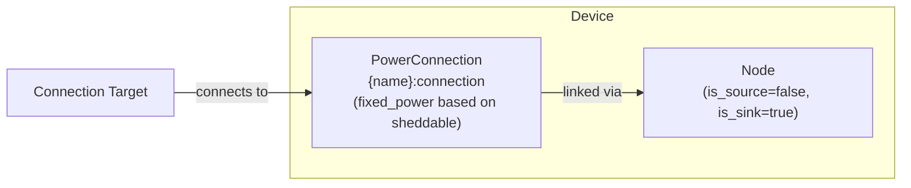

# Load Modeling

The Load device composes a [Node](../model-layer/elements/node.md) (power sink only) with an implicit [PowerConnection](../model-layer/connections/power-connection.md) to model power consumption based on forecast data.
Loads can optionally be configured as sheddable with a value when running.

## Model Elements Created

| Model Element                                                     | Name                | Parameters From Configuration                        |
| ----------------------------------------------------------------- | ------------------- | ---------------------------------------------------- |
| [Node](../model-layer/elements/node.md)                           | `{name}`            | is_source=false, is_sink=true                        |
| [PowerConnection](../model-layer/connections/power-connection.md) | `{name}:connection` | forecast, sheddable flag, and optional value pricing |

## Devices Created

Load creates 1 device in Home Assistant:

| Device  | Name     | Created When | Purpose                   |
| ------- | -------- | ------------ | ------------------------- |
| Primary | `{name}` | Always       | Load consumption tracking |

## Parameter Mapping

The adapter transforms user configuration into model parameters:

| User Configuration | Model Element   | Model Parameter           | Notes                                                          |
| ------------------ | --------------- | ------------------------- | -------------------------------------------------------------- |
| `forecast`         | PowerConnection | `max_power_target_source` | Power consumption at each time period                          |
| `connection`       | PowerConnection | `source`                  | Node to connect from                                           |
| `sheddable`        | PowerConnection | `fixed_power`             | `!sheddable` (true means sheddable, becomes fixed_power=false) |
| `value_running`    | PowerConnection | `price_target_source`     | Economic value in \$/kWh when load is running (optional)       |
| —                  | Node            | `is_source=false`         | Load cannot provide power                                      |
| —                  | Node            | `is_sink=true`            | Load consumes power                                            |

## Shedding Behavior

**Fixed loads** (`sheddable=false`, the default): The connection uses `fixed_power=true`, making consumption equal to the forecast at all times.
The optimizer must supply this power.

**Sheddable loads** (`sheddable=true`): The connection uses `fixed_power=false`, allowing consumption to be less than or equal to the forecast.
The optimizer can reduce or eliminate power to this load when economically favorable.

**Value pricing**: When `value_running` is specified, it adds a negative cost term (benefit) to the objective function.
The optimizer balances this benefit against energy costs:

- If energy cost < value: Load runs to capture the net benefit
- If energy cost > value: Load may be shed to avoid net loss

## Sensors Created

### Load Device

| Sensor                 | Unit   | Update    | Description                        |
| ---------------------- | ------ | --------- | ---------------------------------- |
| `power`                | kW     | Real-time | Power consumed by load             |
| `power_possible`       | kW     | Real-time | Maximum possible load (forecast)   |
| `value`                | \$/kWh | Real-time | Value when running (if configured) |
| `forecast_limit_price` | \$/kW  | Real-time | Marginal cost of serving this load |

See [Load Configuration](../../user-guide/elements/load.md#sensors-created) for detailed sensor documentation.

## Configuration Examples

### Fixed Load (Not Sheddable)

| Field          | Value                      |
| -------------- | -------------------------- |
| **Name**       | House Load                 |
| **Forecast**   | sensor.home_power_forecast |
| **Connection** | Home Bus                   |
| **Shedding**   | `false`                    |

### Sheddable Load with Value

| Field                  | Value                      |
| ---------------------- | -------------------------- |
| **Name**               | HVAC                       |
| **Forecast**           | sensor.hvac_power_forecast |
| **Connection**         | Home Bus                   |
| **Shedding**           | `true`                     |
| **Value When Running** | `0.35`                     |

### Constant Base Load

| Field          | Value     |
| -------------- | --------- |
| **Name**       | Base Load |
| **Forecast**   | 2.5       |
| **Connection** | Home Bus  |
| **Shedding**   | `false`   |

## Typical Use Cases

**Whole-House Consumption**:
Use historical data or forecasting services to predict total home power consumption.
Enables optimizer to time battery discharge and grid import optimally.
Typically configured as fixed (non-sheddable).

**Constant Base Load**:
Model always-on consumption (refrigerator, networking equipment) with a fixed power value.
Always configured as fixed (non-sheddable).

**Scheduled Loads**:
Model predictable loads like pool pumps, HVAC, or EV charging with time-varying forecasts.
Can be configured as sheddable with appropriate value when running.

**Discretionary Loads**:
Model comfort or convenience loads (air conditioning, pool heating, bitcoin mining) as sheddable with value when running.
Optimizer will run these loads when energy is cheap or value exceeds cost.

## Physical Interpretation

**Fixed loads** represent power consumption that must be satisfied by the system—either from grid, battery discharge, or solar generation.

**Sheddable loads** represent consumption that has value but can be deferred or eliminated when energy costs are high.
The optimizer treats the value when running as a negative cost (benefit) in the objective function.

### Configuration Guidelines

- **Forecast Accuracy**:
    Critical for optimization quality.
    Underestimating causes real system to import more than planned.
    Overestimating may cause infeasibility for fixed loads.
    See [Forecasts and Sensors](../../user-guide/forecasts-and-sensors.md).
- **Constant vs Variable**:
    Use constant values for stable always-on loads.
    Use forecast sensors for time-varying consumption patterns.
- **Multiple Loads**:
    Create separate Load elements for different consumption categories (base load, HVAC, EV charging) to track them independently.
- **Fixed vs Sheddable**:
    Use fixed loads for critical consumption that must always be met.
    Use sheddable loads for discretionary consumption that can be deferred.
- **Value When Running**:
    Set value to express the benefit of running the load.
    Optimizer will balance this value against energy costs.
    Higher values make loads less likely to be shed.

## Next Steps

- :material-file-document:{ .lg .middle } **Load configuration**

    ---

    Configure loads in your Home Assistant setup.

    [:material-arrow-right: Load configuration](../../user-guide/elements/load.md)

- :material-power-plug:{ .lg .middle } **Node model**

    ---

    Underlying model element for Load.

    [:material-arrow-right: Node formulation](../model-layer/elements/node.md)

- :material-connection:{ .lg .middle } **Connection model**

    ---

    How consumption constraints are applied.

    [:material-arrow-right: PowerConnection formulation](../model-layer/connections/power-connection.md)

