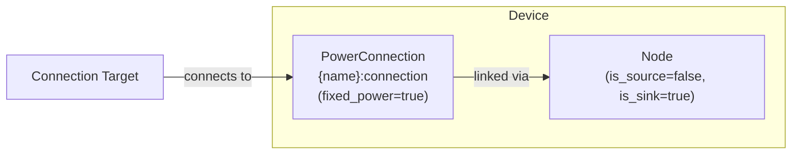

# Load Modeling

The Load device composes a [Node](../model-layer/elements/node.md) (power sink only) with an implicit [PowerConnection](../model-layer/connections/power-connection.md) to model power consumption based on forecast data.

## Model Elements Created

| Model Element                                   | Name                | Parameters From Configuration       |
| ----------------------------------------------- | ------------------- | ----------------------------------- |
| [Node](../model-layer/elements/node.md)                  | `{name}`            | is_source=false, is_sink=true       |
| [PowerConnection](../model-layer/connections/power-connection.md) | `{name}:connection` | forecast as fixed power requirement |

## Devices Created

Load creates 1 device in Home Assistant:

| Device  | Name     | Created When | Purpose                   |
| ------- | -------- | ------------ | ------------------------- |
| Primary | `{name}` | Always       | Load consumption tracking |

## Parameter Mapping

The adapter transforms user configuration into model parameters:

| User Configuration | Model Element   | Model Parameter           | Notes                             |
| ------------------ | --------------- | ------------------------- | --------------------------------- |
| `forecast`         | PowerConnection | `max_power_target_source` | Required consumption at each time |
| `connection`       | PowerConnection | `source`                  | Node to connect from              |
| —                  | PowerConnection | `fixed_power=true`        | Consumption must equal forecast   |
| —                  | Node            | `is_source=false`         | Load cannot provide power         |
| —                  | Node            | `is_sink=true`            | Load consumes power               |

## Sensors Created

### Load Device

| Sensor                 | Unit  | Update    | Description                        |
| ---------------------- | ----- | --------- | ---------------------------------- |
| `power`                | kW    | Real-time | Power consumed by load             |
| `power_possible`       | kW    | Real-time | Maximum possible load (forecast)   |
| `forecast_limit_price` | \$/kW | Real-time | Marginal cost of serving this load |

See [Load Configuration](../../user-guide/elements/load.md#sensors-created) for detailed sensor documentation.

## Configuration Examples

### Variable Load (Forecast)

| Field          | Value                      |
| -------------- | -------------------------- |
| **Name**       | House Load                 |
| **Forecast**   | sensor.home_power_forecast |
| **Connection** | Home Bus                   |

### Constant Load

| Field          | Value     |
| -------------- | --------- |
| **Name**       | Base Load |
| **Forecast**   | 2.5       |
| **Connection** | Home Bus  |

## Typical Use Cases

**Whole-House Consumption**:
Use historical data or forecasting services to predict total home power consumption.
Enables optimizer to time battery discharge and grid import optimally.

**Constant Base Load**:
Model always-on consumption (refrigerator, networking equipment) with a fixed power value.

**Scheduled Loads**:
Model predictable loads like pool pumps, HVAC, or EV charging with time-varying forecasts.

## Physical Interpretation

Load represents power consumption that must be satisfied by the system—either from grid, battery discharge, or solar generation.

### Configuration Guidelines

- **Forecast Accuracy**:
    Critical for optimization quality.
    Underestimating causes real system to import more than planned.
    Overestimating may cause infeasibility.
    See [Forecasts and Sensors](../../user-guide/forecasts-and-sensors.md).
- **Constant vs Variable**:
    Use constant values for stable always-on loads.
    Use forecast sensors for time-varying consumption patterns.
- **Multiple Loads**:
    Create separate Load elements for different consumption categories (base load, HVAC, EV charging) to track them independently.
- **Fixed Power**:
    Loads are NOT controllable—they represent consumption that will occur regardless of optimization decisions.
    The optimizer determines how to supply the power, not whether to supply it.

## Next Steps

- :material-file-document:{ .lg .middle } **Load configuration**

    ---

    Configure loads in your Home Assistant setup.

    [:material-arrow-right: Load configuration](../../user-guide/elements/load.md)

- :material-power-plug:{ .lg .middle } **Node model**

    ---

    Underlying model element for Load.

    [:material-arrow-right: Node formulation](../model-layer/elements/node.md)

- :material-connection:{ .lg .middle } **Connection model**

    ---

    How consumption constraints are applied.

    [:material-arrow-right: PowerConnection formulation](../model-layer/connections/power-connection.md)

