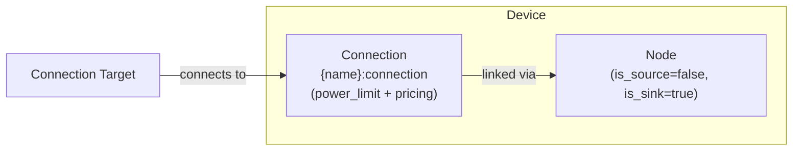

# Load modeling

The Load device composes a [Node](../model-layer/elements/node.md) (power sink only) with an implicit [Connection](../model-layer/connections/connection.md) to model power consumption based on forecast data.
The connection includes a power limit segment and an optional pricing segment.

## Model Elements Created

| Model Element                                          | Name                | Parameters From Configuration          |
| ------------------------------------------------------ | ------------------- | -------------------------------------- |
| [Node](../model-layer/elements/node.md)                | `{name}`            | is_source=false, is_sink=true          |
| [Connection](../model-layer/connections/connection.md) | `{name}:connection` | power-limit and pricing segment values |

## Devices Created

Load creates 1 device in Home Assistant:

| Device  | Name     | Created When | Purpose                   |
| ------- | -------- | ------------ | ------------------------- |
| Primary | `{name}` | Always       | Load consumption tracking |

## Parameter mapping

The adapter transforms user configuration into connection segments:

| User Configuration       | Segment           | Segment Field             | Notes                                                       |
| ------------------------ | ----------------- | ------------------------- | ----------------------------------------------------------- |
| `forecast`               | PowerLimitSegment | `max_power_target_source` | Maximum consumption at each time                            |
| `curtailment` (shedding) | PowerLimitSegment | `fixed`                   | True when curtailment is disabled (fixed demand)            |
| `price_target_source`    | PricingSegment    | `price_target_source`     | Negated in adapter to represent a consumption value/benefit |
| `connection`             | Connection        | `source`                  | Node to connect from                                        |
| —                        | PowerLimitSegment | `max_power_source_target` | Set to zero to prevent reverse flow                         |
| —                        | Node              | `is_source=false`         | Load cannot provide power                                   |
| —                        | Node              | `is_sink=true`            | Load consumes power                                         |

## Sensors Created

### Load Device

| Sensor                 | Unit  | Update    | Description                        |
| ---------------------- | ----- | --------- | ---------------------------------- |
| `power`                | kW    | Real-time | Power consumed by load             |
| `power_possible`       | kW    | Real-time | Maximum possible load (forecast)   |
| `forecast_limit_price` | \$/kW | Real-time | Marginal cost of serving this load |

See [Load Configuration](../../user-guide/elements/load.md) for detailed sensor and configuration documentation.

## Configuration Examples

### Variable Load (Forecast)

| Field          | Value                      |
| -------------- | -------------------------- |
| **Name**       | House Load                 |
| **Forecast**   | sensor.home_power_forecast |
| **Connection** | Home Bus                   |

### Constant Load

| Field          | Value     |
| -------------- | --------- |
| **Name**       | Base Load |
| **Forecast**   | 2.5       |
| **Connection** | Home Bus  |

## Typical Use Cases

**Whole-House Consumption**:
Use historical data or forecasting services to predict total home power consumption.
Enables optimizer to time battery discharge and grid import optimally.

**Constant Base Load**:
Model always-on consumption (refrigerator, networking equipment) with a fixed power value.

**Scheduled Loads**:
Model predictable loads like pool pumps, HVAC, or EV charging with time-varying forecasts.

## Physical Interpretation

Load represents power consumption that the system can choose to satisfy up to a forecast limit.
When curtailment (shedding) is disabled, the forecast is enforced exactly.
When enabled, the optimizer may shed the load if that reduces total system cost.

The model represents average power within each optimization period.
This means reduced power can be interpreted as partial operation in whatever way fits the physical device (duty cycle, throttling, staging, etc.).

### Configuration Guidelines

- **Forecast Accuracy**:
    Critical for optimization quality.
    Underestimating causes real system to import more than planned.
    Overestimating may cause infeasibility.
    See [Forecasts and Sensors](../../user-guide/forecasts-and-sensors.md).
- **Constant vs Variable**:
    Use constant values for stable always-on loads.
    Use forecast sensors for time-varying consumption patterns.
- **Multiple Loads**:
    Create separate Load elements for different consumption categories (base load, HVAC, EV charging) to track them independently.
- **Fixed Power**:
    When curtailment is disabled, consumption equals the forecast exactly.
    When enabled, consumption may be reduced below the forecast based on economics and constraints.

## Next Steps

- :material-file-document:{ .lg .middle } **Load configuration**

    ---

    Configure loads in your Home Assistant setup.

    [:material-arrow-right: Load configuration](../../user-guide/elements/load.md)

- :material-power-plug:{ .lg .middle } **Node model**

    ---

    Underlying model element for Load.

    [:material-arrow-right: Node formulation](../model-layer/elements/node.md)

- :material-connection:{ .lg .middle } **Connection model**

    ---

    How consumption constraints are applied.

    [:material-arrow-right: Connection formulation](../model-layer/connections/connection.md)

