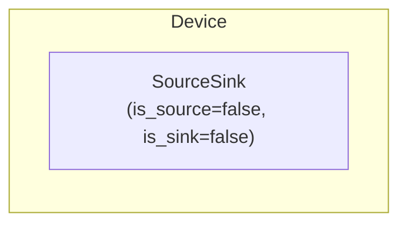
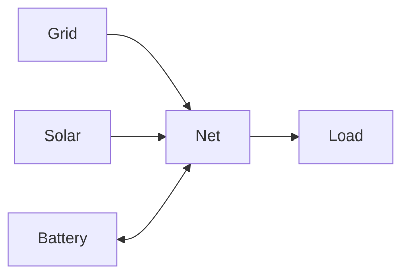
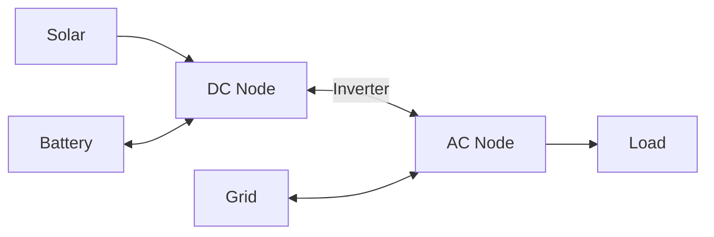

# Node Modeling

Virtual balance nodes that enforce power conservation (Kirchhoff's law).

Node creates a [SourceSink](../model-layer/source-sink.md) model (`is_source=false, is_sink=false`) which acts as a pure junction point.
Unlike other Device Layer elements, Node does not create an implicit Connection.

## Model Elements Created

| Model Element                               | Name     | Parameters From Configuration  |
| ------------------------------------------- | -------- | ------------------------------ |
| [SourceSink](../model-layer/source-sink.md) | `{name}` | is_source=false, is_sink=false |

Node is unique among Device Layer elements: it creates only a SourceSink with no implicit Connection.

## Model Formulation

Node creates a SourceSink with `is_source=false, is_sink=false` which enforces power balance (Kirchhoff's law):

### Decision Variables

None - nodes only enforce constraints.

### Parameters

None - nodes operate purely on connection power flows.

### Constraints

#### Power Balance

At each node and time step:

$$
\sum_{c \in \mathcal{C}_{\text{in}}} P_c(t) = \sum_{c \in \mathcal{C}_{\text{out}}} P_c(t)
$$

Where:

- $\mathcal{C}_{\text{in}}$: Inbound connections to node
- $\mathcal{C}_{\text{out}}$: Outbound connections from node
- $P_c(t)$: Power on connection $c$

### Cost Contribution

Nodes do not contribute to the objective function.
They exist solely to enforce power balance constraints.

## Physical Interpretation

**Virtual node**: Not a physical device, represents electrical junction.

**Kirchhoff's law**: Current in equals current out (applied to power).

**No storage**: Energy cannot accumulate at a node (unlike battery).

## Use Cases

**Single net (simple)**:

Central hub where all elements connect.

**Dual node (AC/DC)**:

Separate buses with inverter connection between them.

## Configuration Impact

| Topology       | Complexity | Use When                         |
| -------------- | ---------- | -------------------------------- |
| Single node    | Simple     | Standard residential             |
| Multiple nodes | Complex    | Hybrid inverters, multi-building |

**Well-formed network**: All elements must connect to at least one node, directly or indirectly.

## Next Steps

- :material-file-document:{ .lg .middle } **Node configuration**

    ---

    Configure nodes in your Home Assistant setup.

    [:material-arrow-right: Node configuration](../../user-guide/elements/node.md)

- :material-power-plug:{ .lg .middle } **SourceSink model**

    ---

    Underlying model element for Node.

    [:material-arrow-right: SourceSink formulation](../model-layer/source-sink.md)

- :material-connection:{ .lg .middle } **Connection model**

    ---

    Connect nodes to other elements.

    [:material-arrow-right: Connection formulation](../model-layer/connection.md)

