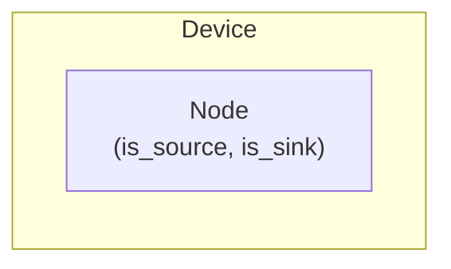

# Node Modeling

The Node device composes a [Node](../model-layer/elements/node.md) model element with user-configured source and sink flags.
It represents a point that can produce and/or consume unlimited power at no cost.
For a pure power balance point, see [Junction](junction.md).

## Model Elements Created

```mermaid
graph LR
    subgraph "Device"
        NodeModel["Node<br/>(is_source, is_sink)"]
    end
```

| Model Element                           | Name     | Parameters From Configuration                |
| --------------------------------------- | -------- | -------------------------------------------- |
| [Node](../model-layer/elements/node.md) | `{name}` | is_source, is_sink (from user configuration) |

Node creates only a Node model element with no implicit Connection.

## Devices Created

Node creates 1 device in Home Assistant:

| Device  | Name     | Created When | Purpose                               |
| ------- | -------- | ------------ | ------------------------------------- |
| Primary | `{name}` | Always       | Unlimited source and/or sink of power |

## Parameter Mapping

The adapter transforms user configuration into model parameters:

| User Configuration | Model Element | Model Parameter | Notes                                           |
| ------------------ | ------------- | --------------- | ----------------------------------------------- |
| `name`             | Node          | `name`          | Element name                                    |
| `is_source`        | Node          | `is_source`     | Whether node can produce power (default: false) |
| `is_sink`          | Node          | `is_sink`       | Whether node can consume power (default: false) |

`is_source` and `is_sink` are switch input entities, so they can change at runtime.
Their combination creates:

- **Grid-like nodes** (`is_source=true, is_sink=true`): Can import and export power
- **Load-like nodes** (`is_source=false, is_sink=true`): Can only consume power
- **Source-like nodes** (`is_source=true, is_sink=false`): Can only produce power
- **Balance nodes** (`is_source=false, is_sink=false`): Power must balance, as in a [Junction](junction.md)

The Node model element places no bound or cost on the power it produces or consumes.
The connections attached to a source or sink node must carry the power limits and prices.
Without them, the optimizer can fabricate energy at a source node or discard it for free at a sink node.

## Sensors Created

### Node Device

| Sensor          | Unit   | Update    | Description                        |
| --------------- | ------ | --------- | ---------------------------------- |
| `power_balance` | \$/kWh | Real-time | Shadow price of power at this node |

See [Node Configuration](../../user-guide/elements/node.md) for detailed sensor and configuration documentation.

## Physical Interpretation

A source or sink node represents an external supply or demand whose limits and prices are modeled on its connections rather than on the node itself.
It is a building block for custom endpoints that the dedicated device elements do not cover.

## Next steps

- :material-file-document:{ .lg .middle } **Node configuration**

    ---

    Configure nodes in your Home Assistant setup.

    [:material-arrow-right: Node configuration](../../user-guide/elements/node.md)

- :material-power-plug:{ .lg .middle } **Node model**

    ---

    Underlying model element for Node device.

    [:material-arrow-right: Node formulation](../model-layer/elements/node.md)

- :material-connection:{ .lg .middle } **Connection model**

    ---

    Bound and price the power a node produces or consumes.

    [:material-arrow-right: Connection formulation](../model-layer/connections/connection.md)

