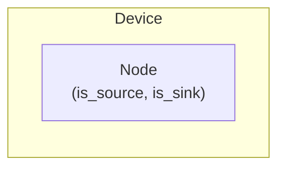

# Node Modeling

The Node device composes a [Node](../model-layer/elements/node.md) model element to represent an electrical bus where multiple elements connect and power must balance.

## Model Elements Created

| Model Element                           | Name     | Parameters From Configuration                |
| --------------------------------------- | -------- | -------------------------------------------- |
| [Node](../model-layer/elements/node.md) | `{name}` | is_source, is_sink (from user configuration) |

Node is unique among Device Layer elements: it creates only a Node model element with no implicit Connection.

## Devices Created

Node creates 1 device in Home Assistant:

| Device  | Name     | Created When | Purpose                          |
| ------- | -------- | ------------ | -------------------------------- |
| Primary | `{name}` | Always       | Junction point for power balance |

## Parameter Mapping

The adapter transforms user configuration into model parameters:

| User Configuration | Model Element | Model Parameter | Notes                                           |
| ------------------ | ------------- | --------------- | ----------------------------------------------- |
| `name`             | Node          | `name`          | Element name                                    |
| `is_source`        | Node          | `is_source`     | Whether node can produce power (default: false) |
| `is_sink`          | Node          | `is_sink`       | Whether node can consume power (default: false) |

In standard mode (Advanced Mode disabled), nodes are pure junctions (`is_source=false, is_sink=false`).
When Advanced Mode is enabled, `is_source` and `is_sink` can be configured to create:

- **Grid-like nodes** (`is_source=true, is_sink=true`): Can import and export power
- **Load-like nodes** (`is_source=false, is_sink=true`): Can only consume power
- **Source-like nodes** (`is_source=true, is_sink=false`): Can only produce power
- **Pure junctions** (`is_source=false, is_sink=false`): Power must balance (default)

## Sensors Created

### Node Device

| Sensor          | Unit  | Update    | Description                        |
| --------------- | ----- | --------- | ---------------------------------- |
| `power_balance` | \$/kW | Real-time | Shadow price of power at this node |

See [Node Configuration](../../user-guide/elements/node.md) for detailed sensor and configuration documentation.

## Configuration Examples

### Single Bus (Most Common)

| Field    | Value    |
| -------- | -------- |
| **Name** | Home Bus |

### Multi-Bus Topology

**DC Bus:**

| Field    | Value  |
| -------- | ------ |
| **Name** | DC Bus |

**AC Bus:**

| Field    | Value  |
| -------- | ------ |
| **Name** | AC Bus |

## Typical Use Cases

**Single-Bus System**:
Most residential installations use one node as the central connection point for all elements (grid, battery, solar, loads).

**DC/AC Separation**:
Systems with DC-coupled batteries and AC-coupled solar may use separate DC and AC buses connected by a converter.

**Multi-Site Systems**:
Large installations may use multiple nodes to represent different physical locations or voltage levels.

## Physical Interpretation

Node represents an electrical bus where Kirchhoff's current law applies—total power flowing in must equal total power flowing out at every instant.

### Configuration Guidelines

- **Name Clearly**: Use descriptive names like `home_bus`, `dc_bus`, `ac_bus` to clarify system topology.
- **Single Node Sufficient**: Most home systems only need one node. Don't create multiple nodes unless you have a specific need (DC/AC separation, etc.).
- **No Storage**: Nodes have no capacity—power balance is instantaneous. Use Battery elements for energy storage.
- **Connection Target**: All other elements (Grid, Battery, Solar, Loads) specify which node they connect to via their `connection.target` field.

## Next Steps

- :material-file-document:{ .lg .middle } **Node configuration**

    ---

    Configure nodes in your Home Assistant setup.

    [:material-arrow-right: Node configuration](../../user-guide/elements/node.md)

- :material-power-plug:{ .lg .middle } **Node model**

    ---

    Underlying model element for Node device.

    [:material-arrow-right: Node formulation](../model-layer/elements/node.md)

- :material-connection:{ .lg .middle } **Connection model**

    ---

    Connect nodes to other elements.

    [:material-arrow-right: PowerConnection formulation](../model-layer/connections/power-connection.md)

