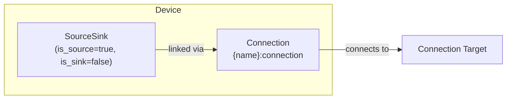

# Photovoltaics Modeling

The Photovoltaics device composes a [SourceSink](../model-layer/source-sink.md) (power source only) with an implicit [Connection](../model-layer/connection.md) to model solar generation with optional curtailment.

## Model Elements Created

| Model Element                               | Name                | Parameters From Configuration           |
| ------------------------------------------- | ------------------- | --------------------------------------- |
| [SourceSink](../model-layer/source-sink.md) | `{name}`            | is_source=true, is_sink=false           |
| [Connection](../model-layer/connection.md)  | `{name}:connection` | forecast as max_power, production price |

## Devices Created

Photovoltaics creates 1 device in Home Assistant:

| Device  | Name     | Created When | Purpose                              |
| ------- | -------- | ------------ | ------------------------------------ |
| Primary | `{name}` | Always       | Solar generation tracking and limits |

## Parameter Mapping

The adapter transforms user configuration into model parameters:

| User Configuration   | Model Element | Model Parameter           | Notes                                        |
| -------------------- | ------------- | ------------------------- | -------------------------------------------- |
| `forecast`           | Connection    | `max_power_source_target` | Upper bound on generation                    |
| `production_price`   | Connection    | `price_source_target`     | Cost/revenue per kWh generated (default: 0)  |
| `enable_curtailment` | Connection    | `fixed_power`             | false if curtailment enabled, true otherwise |
| `connection`         | Connection    | `target`                  | Node to connect to                           |
| —                    | SourceSink    | `is_source=true`          | PV provides power                            |
| —                    | SourceSink    | `is_sink=false`           | PV cannot consume power                      |

## Sensors Created

### Photovoltaics Device

| Sensor            | Unit  | Update    | Description                             |
| ----------------- | ----- | --------- | --------------------------------------- |
| `power`           | kW    | Real-time | Actual power generated                  |
| `power_available` | kW    | Real-time | Maximum available solar power           |
| `forecast_limit`  | \$/kW | Real-time | Value of additional generation capacity |

See [Photovoltaics Configuration](../../user-guide/elements/photovoltaics.md#sensors-created) for detailed sensor documentation.

## Configuration Examples

### Standard Solar (No Curtailment)

| Field           | Value                                |
| --------------- | ------------------------------------ |
| **Name**        | Rooftop Solar                        |
| **Forecast**    | sensor.solcast_pv_forecast_power_now |
| **Curtailment** | false                                |
| **Connection**  | Home Bus                             |

### With Curtailment Enabled

| Field                | Value                                |
| -------------------- | ------------------------------------ |
| **Name**             | Curtailable Solar                    |
| **Forecast**         | sensor.solcast_pv_forecast_power_now |
| **Curtailment**      | true                                 |
| **Price Production** | 0.0                                  |
| **Connection**       | Home Bus                             |

## Typical Use Cases

**Standard Solar**:
Leave curtailment enabled (default) so the optimizer can reduce generation when beneficial.
Set `curtailment: false` only when your inverter cannot support active power limiting.

**Negative Export Pricing**:
Enable curtailment when export prices can be negative.
Optimizer will curtail generation when it's economically beneficial to avoid paying to export.

**Export-Limited Systems**:
Curtailment allows optimizer to stay within export limits while managing battery and load efficiently.

## Physical Interpretation

Photovoltaics represents a solar generation system that produces power based on weather forecasts and system capacity.

### Configuration Guidelines

- **Forecast Accuracy**:
    Critical for optimization quality.
    Use high-quality forecast services like Solcast for best results.
    See [Forecasts and Sensors](../../user-guide/forecasts-and-sensors.md).
- **Curtailment**:
    Only enable if your inverter supports active power limiting.
- **Production Price**:
    Usually 0 (solar has no marginal cost).
    Set negative only if you have solar lease/contract costs that make generation costly.
    Set positive only for feed-in tariff modeling (rare).
- **Fixed Power**:
    When curtailment is disabled,
    generation equals forecast exactly.
    When enabled, generation can be reduced below forecast.

## Next Steps

- :material-file-document:{ .lg .middle } **Photovoltaics configuration**

    ---

    Configure solar generation in your Home Assistant setup.

    [:material-arrow-right: Photovoltaics configuration](../../user-guide/elements/photovoltaics.md)

- :material-power-plug:{ .lg .middle } **SourceSink model**

    ---

    Underlying model element for Photovoltaics.

    [:material-arrow-right: SourceSink formulation](../model-layer/source-sink.md)

- :material-connection:{ .lg .middle } **Connection model**

    ---

    How generation limits are applied.

    [:material-arrow-right: Connection formulation](../model-layer/connection.md)

