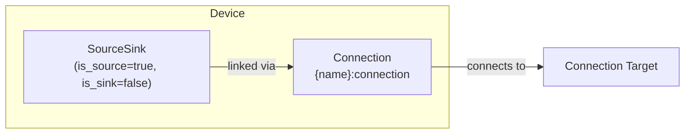

# Photovoltaics Modeling

Solar generation with optional curtailment for negative export price scenarios.

Photovoltaics creates a [SourceSink](../model-layer/source-sink.md) model (`is_source=true, is_sink=false`) plus an implicit [Connection](../model-layer/connection.md) that carries the generation forecast as a power limit.

## Model Elements Created

| Model Element                               | Name                | Parameters From Configuration           |
| ------------------------------------------- | ------------------- | --------------------------------------- |
| [SourceSink](../model-layer/source-sink.md) | `{name}`            | is_source=true, is_sink=false           |
| [Connection](../model-layer/connection.md)  | `{name}:connection` | forecast as max_power, production price |

## Model Formulation

Photovoltaics creates a SourceSink with `is_source=true, is_sink=false` (generation only) plus a Connection with the forecast as the power limit:

### Decision Variables

**Without curtailment** (default):

- $P_{\text{solar}}(t)$: Actual generation (kW) - constrained to equal forecast

**With curtailment enabled**:

- $P_{\text{solar}}(t)$: Actual generation (kW) - constrained to not exceed forecast

### Parameters

- $P_{\text{forecast}}(t)$: Solar forecast (kW) - from `forecast` sensors
- $c_{\text{production}}$: Production price (\$/kWh) - from `production_price` config (optional, default 0)

### Constraints

#### Without Curtailment

$$
P_{\text{solar}}(t) = P_{\text{forecast}}(t) \quad \forall t
$$

Generation exactly matches forecast.

#### With Curtailment

$$
0 \leq P_{\text{solar}}(t) \leq P_{\text{forecast}}(t) \quad \forall t
$$

Generation can be reduced below forecast.

### Cost Contribution

$$
C_{\text{solar}} = \sum_{t=0}^{T-1} P_{\text{solar}}(t) \cdot c_{\text{production}} \cdot \Delta t
$$

Usually $c_{\text{production}} = 0$ (solar generation has no marginal cost).
Production price can represent opportunity cost.
Setting it negative discourages curtailment by making unused generation costly.

## Physical Interpretation

**No curtailment**: Standard operation - use all available solar.

**Curtailment**: Reduce generation when:

- Export prices are negative (you pay to export)
- Export limits prevent sending power to grid
- Battery full and load satisfied

Curtailment requires inverter with active power limiting.

## Configuration Impact

| Parameter            | Impact                                           |
| -------------------- | ------------------------------------------------ |
| Curtailment disabled | Solar always at forecast, simplest               |
| Curtailment enabled  | Can reduce generation, needs compatible inverter |
| Production price > 0 | Models feed-in tariff (rare)                     |
| Production price < 0 | Models solar contract costs (very rare)          |

**Negative export prices**: Curtailment becomes economically beneficial.

**Forecast accuracy**: Directly affects optimization quality - inaccurate forecasts lead to sub-optimal decisions.

## Next Steps

- :material-file-document:{ .lg .middle } **Photovoltaics configuration**

    ---

    Configure solar generation in your Home Assistant setup.

    [:material-arrow-right: Photovoltaics configuration](../../user-guide/elements/photovoltaics.md)

- :material-power-plug:{ .lg .middle } **SourceSink model**

    ---

    Underlying model element for Photovoltaics.

    [:material-arrow-right: SourceSink formulation](../model-layer/source-sink.md)

- :material-connection:{ .lg .middle } **Connection model**

    ---

    How generation limits are applied.

    [:material-arrow-right: Connection formulation](../model-layer/connection.md)

