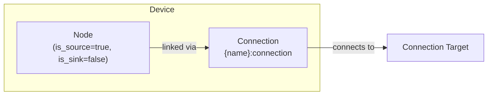

# Solar Modeling

The Solar device composes a [Node](../model-layer/elements/node.md) (power source only) with an implicit [Connection](../model-layer/connections/connection.md) to model solar generation with optional curtailment.

## Model Elements Created

| Model Element                                          | Name                | Parameters From Configuration          |
| ------------------------------------------------------ | ------------------- | -------------------------------------- |
| [Node](../model-layer/elements/node.md)                | `{name}`            | is_source=true, is_sink=false          |
| [Connection](../model-layer/connections/connection.md) | `{name}:connection` | power-limit and pricing segment values |

## Devices Created

Solar creates 1 device in Home Assistant:

| Device  | Name     | Created When | Purpose                              |
| ------- | -------- | ------------ | ------------------------------------ |
| Primary | `{name}` | Always       | Solar generation tracking and limits |

## Parameter mapping

The adapter transforms user configuration into connection segments:

| User Configuration | Segment           | Segment Field             | Notes                                       |
| ------------------ | ----------------- | ------------------------- | ------------------------------------------- |
| `forecast`         | PowerLimitSegment | `max_power_source_target` | Upper bound on generation                   |
| `curtailment`      | PowerLimitSegment | `fixed`                   | True when curtailment is disabled           |
| `price_source_target` | PricingSegment    | `price_source_target`     | Cost/revenue per kWh generated (default: 0) |
| `connection`       | Connection        | `target`                  | Node to connect to                          |
| —                  | Node              | `is_source=true`          | Solar provides power                        |
| —                  | Node              | `is_sink=false`           | Solar cannot consume power                  |

## Sensors Created

### Solar Device

| Sensor            | Unit  | Update    | Description                             |
| ----------------- | ----- | --------- | --------------------------------------- |
| `power`           | kW    | Real-time | Actual power generated                  |
| `power_available` | kW    | Real-time | Maximum available solar power           |
| `forecast_limit`  | \$/kW | Real-time | Value of additional generation capacity |

See [Solar Configuration](../../user-guide/elements/solar.md) for detailed sensor and configuration documentation.

## Configuration Examples

### Standard Solar (No Curtailment)

| Field           | Value                                |
| --------------- | ------------------------------------ |
| **Name**        | Rooftop Solar                        |
| **Forecast**    | sensor.solcast_pv_forecast_power_now |
| **Curtailment** | false                                |
| **Connection**  | Home Bus                             |

### With Curtailment Enabled

| Field                | Value                                |
| -------------------- | ------------------------------------ |
| **Name**             | Curtailable Solar                    |
| **Forecast**         | sensor.solcast_pv_forecast_power_now |
| **Curtailment**      | true                                 |
| **Price Production** | 0.0                                  |
| **Connection**       | Home Bus                             |

## Typical Use Cases

**Standard Solar**:
Leave curtailment enabled (default) so the optimizer can reduce generation when beneficial.
Set `curtailment: false` only when your inverter cannot support active power limiting.

**Negative Export Pricing**:
Enable curtailment when export prices can be negative.
Optimizer will curtail generation when it's economically beneficial to avoid paying to export.

**Export-Limited Systems**:
Curtailment allows optimizer to stay within export limits while managing battery and load efficiently.

## Physical Interpretation

Solar represents a solar generation system that produces power based on weather forecasts and system capacity.

### Configuration Guidelines

- **Forecast Accuracy**:
    Critical for optimization quality.
    Use high-quality forecast services like Solcast for best results.
    See [Forecasts and Sensors](../../user-guide/forecasts-and-sensors.md).
- **Curtailment**:
    Only enable if your inverter supports active power limiting.
- **Production Price**:
    Usually 0 (solar has no marginal cost).
    Set negative only if you have solar lease/contract costs that make generation costly.
    Set positive only for feed-in tariff modeling (rare).
- **Fixed Power**:
    When curtailment is disabled,
    generation equals forecast exactly.
    When enabled, generation can be reduced below forecast.

## Next Steps

- :material-file-document:{ .lg .middle } **Solar configuration**

    ---

    Configure solar generation in your Home Assistant setup.

    [:material-arrow-right: Solar configuration](../../user-guide/elements/solar.md)

- :material-power-plug:{ .lg .middle } **Node model**

    ---

    Underlying model element for Solar.

    [:material-arrow-right: Node formulation](../model-layer/elements/node.md)

- :material-connection:{ .lg .middle } **Connection model**

    ---

    How generation limits are applied.

    [:material-arrow-right: Connection formulation](../model-layer/connections/connection.md)

