# Grid Modeling

This page explains how HAEO models the electrical grid connection using linear programming.

## Overview

A grid connection in HAEO represents the bidirectional link to the electrical utility network with:

- **Import capability**: Drawing power from the grid to meet demand
- **Export capability**: Sending excess power back to the grid
- **Dynamic pricing**: Different prices for import and export that can vary by time
- **Power limits**: Optional constraints on maximum import/export rates
- **Cost optimization**: Minimizing total cost by timing imports and maximizing export revenue

The grid is typically the most flexible element in the system, providing or absorbing power as needed to maintain balance.

## Model Formulation

### Decision Variables

For each time step $t \in \{0, 1, \ldots, T-1\}$, HAEO creates optimization variables:

- $P_{\text{import}}(t)$: Power imported from grid (kW) - implemented as `{name}_import_{t}`
- $P_{\text{export}}(t)$: Power exported to grid (kW) - implemented as `{name}_export_{t}`

These variables are created using PuLP's `LpVariable` with non-negativity constraints.
The optimizer determines the optimal import/export at each time step based on prices and system needs.

**Implementation note**: In the code, import is `power_production` (grid producing power for us) and export is `power_consumption` (grid consuming our power).

### Parameters

The grid model requires these configuration parameters:

- $p_{\text{import}}(t)$: Import price at time $t$ (\$/kWh) - from `import_price` forecast sensors
- $p_{\text{export}}(t)$: Export price at time $t$ (\$/kWh) - from `export_price` forecast sensors
- $P_{\text{import}}^{\max}$: Maximum import power (kW) - `import_limit` (optional)
- $P_{\text{export}}^{\max}$: Maximum export power (kW) - `export_limit` (optional)
- $\Delta t$: Time step duration (hours) - `period`

Prices can vary over time to reflect time-of-use tariffs, real-time pricing, or feed-in tariffs.

### Constraints

#### Non-negativity

Import and export are always non-negative (cannot be negative):

$$
\begin{align}
P_{\text{import}}(t) &\geq 0 \\
P_{\text{export}}(t) &\geq 0
\end{align}
$$

**Physical interpretation**: You either import OR export at any given moment, but the LP doesn't explicitly prevent both.
In practice, the optimizer won't import and export simultaneously because it would increase costs without benefit.

These bounds are enforced when creating the power variables.

#### Power Limits

Optional constraints on maximum power flow:

$$
\begin{align}
0 \leq P_{\text{import}}(t) &\leq P_{\text{import}}^{\max} \\
0 \leq P_{\text{export}}(t) &\leq P_{\text{export}}^{\max}
\end{align}
$$

**When to use limits**:

- Import limit: Your utility service capacity or circuit breaker rating
- Export limit: Inverter rating or utility grid export restrictions

If limits are not specified, the grid has unlimited import/export capability.

This is implemented by setting `upBound` when creating the LP variables:

```python
power_import = [
    LpVariable(name=f"{name}_import_{i}", lowBound=0, upBound=import_limit)
    for i in range(n_periods)
]
power_export = [
    LpVariable(name=f"{name}_export_{i}", lowBound=0, upBound=export_limit)
    for i in range(n_periods)
]
```

### Cost Contribution

The grid contributes to the objective function through costs (imports) and revenue (exports):

$$
C_{\text{grid}} = \sum_{t=0}^{T-1} \left( P_{\text{import}}(t) \cdot p_{\text{import}}(t) - P_{\text{export}}(t) \cdot p_{\text{export}}(t) \right) \cdot \Delta t
$$

**Breaking it down**:

- **Import cost** (positive): $P_{\text{import}}(t) \cdot p_{\text{import}}(t) \cdot \Delta t$ (\$)
- **Export revenue** (negative cost): $-P_{\text{export}}(t) \cdot p_{\text{export}}(t) \cdot \Delta t$ (\$)

The negative sign on export revenue is critical: selling power to the grid reduces total system cost.

This is implemented as:

```python
# Import cost (we pay the grid)
if import_price is not None:
    for t in range(n_periods):
        objective += power_import[t] * import_price[t] * period

# Export revenue (grid pays us - negative cost)
if export_price is not None:
    for t in range(n_periods):
        objective -= power_export[t] * export_price[t] * period
```

## Physical Interpretation

### Bidirectional Power Flow

The grid connection enables two-way power flow:

**Import (Grid → Home)**:

- Meets demand when generation is insufficient
- Charges batteries during off-peak periods
- Provides unlimited reliable power (unless limited)

**Export (Home → Grid)**:

- Monetizes excess solar generation
- Earns revenue during peak price periods
- Discharges batteries when profitable

### Pricing Integration

The grid model integrates time-varying prices that drive optimization decisions:

**Time-of-Use (TOU) Pricing**:

- **Off-peak** (e.g., 00:00-07:00): Low import price → Charge batteries
- **Peak** (e.g., 17:00-21:00): High import price → Discharge batteries, reduce import
- **Mid-peak**: Moderate prices → Balance usage

**Feed-in Tariffs**:

- Fixed export price (often lower than import price)
- Incentivizes self-consumption over export
- May vary by time of day

**Negative Export Prices**:

- Occasionally export prices go negative (you pay to export)
- HAEO will curtail solar generation rather than pay to export
- Battery storage becomes even more valuable

### Power Balance Integration

The grid participates in network power balance as:

- **Import**: Power production (supplies power to the network)
- **Export**: Power consumption (removes power from the network)

From the network perspective:

$$
P_{\text{grid}}(t) = P_{\text{import}}(t) - P_{\text{export}}(t)
$$

## Example: Time-of-Use Pricing Optimization

Consider a system with time-of-use pricing:

| Time          | Import Price | Export Price | Optimal Strategy                   |
| ------------- | ------------ | ------------ | ---------------------------------- |
| 00:00-07:00   | \$0.10/kWh   | \$0.05/kWh   | Import, charge battery             |
| 07:00-17:00   | \$0.25/kWh   | \$0.05/kWh   | Self-consume, hold battery         |
| 17:00-21:00   | \$0.40/kWh   | \$0.05/kWh   | Discharge battery, minimize import |
| 21:00-24:00   | \$0.15/kWh   | \$0.05/kWh   | Self-consume, partial charging     |

```mermaid
gantt
    title Grid Import/Export Strategy
    dateFormat HH:mm
    axisFormat %H:%M

    section Import Price
    Off-Peak $0.10: 00:00, 07:00
    Peak $0.40: 17:00, 21:00
    Mid-Peak $0.25: 07:00, 17:00
    Evening $0.15: 21:00, 24:00

    section Grid Operation
    Import 8 kW (Charging): 00:00, 03:00
    Import 2 kW (Base Load): 03:00, 07:00
    Import 3 kW (Load): 07:00, 17:00
    Zero Import (Battery): 17:00, 21:00
    Import 4 kW (Load): 21:00, 24:00
```



### Cost Calculation Example

**Scenario**: 24-hour period with 10 kWh battery

1. **Off-peak (00:00-03:00)**:

    - Import: 10 kW for 3 hours = 30 kWh
    - Cost: $30 \times 0.10 = \$3.00$
    - Purpose: Charge battery to 100%

2. **Daytime (07:00-17:00)**:

    - Import: 2 kW average = 20 kWh
    - Cost: $20 \times 0.25 = \$5.00$
    - Purpose: Meet load (solar covers rest)

3. **Peak (17:00-21:00)**:

    - Import: 0 kW
    - Cost: \$0.00
    - Strategy: Battery supplies all load

4. **Evening (21:00-24:00)**:
    - Import: 3 kW for 3 hours = 9 kWh
    - Cost: $9 \times 0.15 = \$1.35$
    - Purpose: Meet remaining load

**Total cost**: $\$3.00 + \$5.00 + \$0.00 + \$1.35 = \$9.35$

**Without optimization** (constant 5 kW load, no battery):

- Total: $5 \times 24 = 120$ kWh
- Weighted cost: $\approx \$28.00$
- **Savings**: $\$28.00 - \$9.35 = \$18.65$ per day

## Numerical Considerations

### Units

HAEO uses kW for power and kWh for energy:

- **Power**: 5 kW (not 5000 W)
- **Energy**: 25 kWh = 5 kW × 5 hours
- **Time**: hours (not seconds)

This keeps variables in similar numerical ranges for better solver performance.

### Price Forecasts

Grid prices are provided through Home Assistant sensor forecasts:

- Must cover the entire optimization horizon
- Can be constant or time-varying
- Stored as sequences aligned with time steps

**Forecast integration**:

```python
import_price = [
    sensor_import.forecast[t].value for t in range(n_periods)
]
export_price = [
    sensor_export.forecast[t].value for t in range(n_periods)
]
```

### Solver Considerations

The grid model is the most flexible element:

- **No storage constraints**: Unlike batteries
- **No generation limits**: Unlike solar (unless import_limit is set)
- **High cost sensitivity**: Prices directly drive optimization

This flexibility often makes the grid the "slack" variable that balances the system.

## Configuration Impact

### Import/Export Limits

**Unlimited (default)**:

- ✅ Maximum flexibility
- ✅ Simpler model
- ❌ May not reflect physical constraints
- Use when: Grid connection is very large compared to system

**With limits**:

- ✅ Realistic physical constraints
- ✅ Prevents infeasible solutions
- ❌ May cause optimization failures if limits are too tight
- Use when: Service capacity, inverter limits, or utility restrictions apply

### Pricing Configuration

**Fixed prices**:

- Simple time-of-use schedules
- Predictable optimization behavior
- Less computational complexity

**Dynamic prices**:

- Real-time or day-ahead pricing
- More aggressive optimization
- Higher potential savings
- Requires accurate forecasts

**Negative export prices**:

- Enable solar curtailment in photovoltaics configuration
- HAEO will reduce export rather than pay to export
- Increases value of battery storage

### Price Differential

The import-export spread drives optimization strategy:

**Large spread** (import \$0.30, export \$0.05):

- Strong incentive for self-consumption
- Battery cycling is highly valuable
- Minimize export

**Small spread** (import \$0.15, export \$0.12):

- Less benefit from battery cycling
- Export is more attractive
- Simpler operation

**Export higher than import** (rare):

- Maximize generation and export
- Always prefer export over self-consumption
- Battery charges from solar only

## Related Documentation

- [Grid Configuration Guide](../user-guide/entities/grid.md) - User-facing configuration
- [Objective Function](objective-function.md) - How grid costs contribute to total cost
- [Power Balance](power-balance.md) - How grid integrates with network
- [Battery Modeling](battery.md) - How batteries work with grid pricing

## Next Steps

Explore related modeling topics:

- [Photovoltaics Modeling](photovoltaics.md) - Generation that reduces grid import
- [Battery Modeling](battery.md) - Storage that enables price arbitrage
- [Time Horizons](time-horizons.md) - How price forecasts affect optimization

[:octicons-arrow-right-24: Continue to Photovoltaics Modeling](photovoltaics.md)
