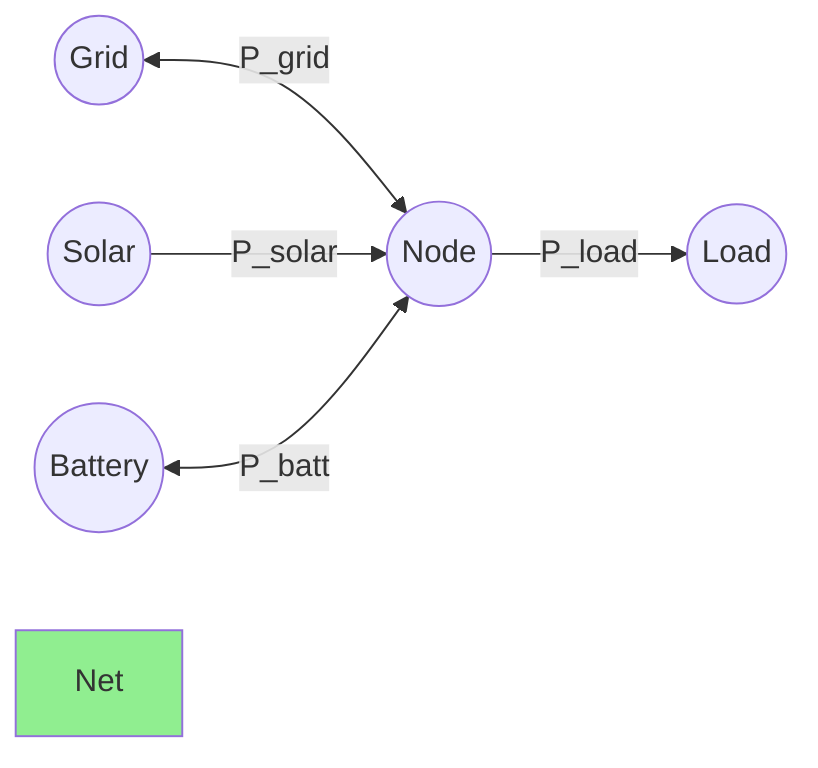
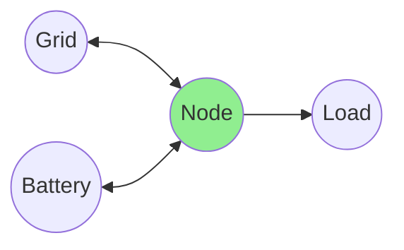

# Mathematical Modeling

HAEO uses linear programming (LP) to optimize energy flows across your network.
This section explains the mathematical formulation behind HAEO's optimization engine.

## Linear Programming Overview

Linear programming finds optimal values for decision variables that minimize (or maximize) an objective function subject to linear constraints.

**Standard LP form**:

$$
\begin{align}
\text{minimize} \quad & c^T x \\
\text{subject to} \quad & Ax \leq b \\
& A_{\text{eq}} x = b_{\text{eq}} \\
& l \leq x \leq u
\end{align}
$$

Where:

- $x$: Decision variables (what the optimizer chooses)
- $c$: Objective coefficients (costs/prices)
- $A$, $b$: Inequality constraint matrices
- $A_{\text{eq}}$, $b_{\text{eq}}$: Equality constraint matrices
- $l$, $u$: Variable bounds

**Linearity requirement**: All relationships must be linear.
No quadratic terms ($x^2$), products ($xy$), or nonlinear functions ($\sin(x)$, etc.).

### Why Linear Programming?

LP is ideal for energy optimization:

1. **Fast solving**: Modern solvers handle thousands of variables in seconds
2. **Global optimum**: Always finds the best solution when one exists
3. **Natural fit**: Power flows, energy balances, and costs are inherently linear
4. **Scalability**: Handles large time horizons efficiently

!!! info "HAEO Uses LP, Not MILP"

    HAEO uses pure linear programming, not Mixed-Integer Linear Programming (MILP).
    This avoids binary variables for on/off decisions, keeping solve times fast.
    Energy systems with continuous power flows don't need MILP's discrete decision capabilities.

## HAEO's Optimization Problem

HAEO formulates energy system optimization as a linear program:

$$
\begin{align}
\text{minimize} \quad & \sum_{t=0}^{T-1} \text{Cost}(t) \\
\text{subject to} \quad & \text{Power balance at each net} \\
& \text{Energy storage dynamics} \\
& \text{Power flow limits} \\
& \text{Energy capacity limits}
\end{align}
$$

Where:

- $t$: Time step index (0 to $T-1$)
- $T$: Number of time steps in optimization horizon

### Problem Scale

Typical residential system (48-hour horizon, 5-minute periods):

- **Time steps**: 576
- **Decision variables**: ~4000 (power flows, energy states)
- **Constraints**: ~5000 (power balance, limits, dynamics)
- **Solve time**: 0.5-2 seconds (HiGHS solver)

### Feasibility and Optimality

- **Feasible solution**: Satisfies all constraints (power balance, limits)
- **Optimal solution**: Feasible solution with minimum cost
- **Infeasible**: No solution exists (load exceeds supply capacity)

## Network Structure

HAEO models energy systems as directed graphs:

- **Nodes**: Elements (battery, grid, solar, load) and nodes (balance points)
- **Edges**: Connections with power flow variables
- **Direction**: Source → Target defines positive power flow direction

### Power Balance Constraint

At each node and every time step:

$$
\sum_{c \in \mathcal{C}_{\text{in}}} P_c(t) = \sum_{c \in \mathcal{C}_{\text{out}}} P_c(t)
$$

Where:

- $\mathcal{C}_{\text{in}}$: Connections with node as target (inflows)
- $\mathcal{C}_{\text{out}}$: Connections with node as source (outflows)
- $P_c(t)$: Power flow through connection $c$ at time $t$

This enforces Kirchhoff's current law: power in equals power out.

## Time Discretization

The optimization horizon is divided into discrete periods:

- **Horizon**: Total optimization period (hours)
- **Period**: Time step duration (minutes)
- **Time steps**: $T = \text{Horizon} / \text{Period}$

Each decision variable exists for every time step.

## Decision Variables

HAEO's LP solver determines optimal values for these variables:

| Variable          | Symbol                  | Units | Description                       | Count          |
| ----------------- | ----------------------- | ----- | --------------------------------- | -------------- |
| Connection power  | $P_c(t)$                | kW    | Power flow through connection $c$ | $N_c \times T$ |
| Battery energy    | $E_b(t)$                | kWh   | Stored energy in battery $b$      | $N_b \times T$ |
| Grid import       | $P_{\text{import}}(t)$  | kW    | Power imported from grid          | $N_g \times T$ |
| Grid export       | $P_{\text{export}}(t)$  | kW    | Power exported to grid            | $N_g \times T$ |
| Solar curtailment | $P_{\text{curtail}}(t)$ | kW    | Curtailed solar generation        | $N_s \times T$ |

Where:

- $N_c$: Number of connections
- $N_b$: Number of batteries
- $N_g$: Number of grids
- $N_s$: Number of solar arrays with curtailment enabled
- $T$: Number of time steps

## Element Models

Each element type has specific constraints and variables:

- **[Battery](battery.md)**: Energy storage with SOC dynamics and charge/discharge limits
- **[Grid](grid.md)**: Bidirectional power flow with import/export pricing
- **[Photovoltaics](photovoltaics.md)**: Generation following forecast with optional curtailment
- **[Loads](loads.md)**: Constant or forecast-based power consumption
- **[Connections](connections.md)**: Power flow with directional limits
- **[Node](node.md)**: Virtual balance points enforcing power conservation

## Objective Function

HAEO minimizes total system cost over the optimization horizon:

$$
\text{minimize} \sum_{t=0}^{T-1} \left( C_{\text{grid}}(t) + C_{\text{battery}}(t) + C_{\text{solar}}(t) \right) \Delta t
$$

Where $\Delta t$ is the period duration in hours.

### Cost Components

**Grid costs** (import minus export revenue):

$$
C_{\text{grid}}(t) = \sum_{g} \left( P_{\text{import},g}(t) \cdot p_{\text{import},g}(t) - P_{\text{export},g}(t) \cdot p_{\text{export},g}(t) \right)
$$

**Battery costs** (artificial costs for optimization):

$$
C_{\text{battery}}(t) = \sum_{b} \left( P_{\text{charge},b}(t) \cdot c_{\text{charge},b} + P_{\text{discharge},b}(t) \cdot c_{\text{discharge},b} \right)
$$

**Solar curtailment costs**:

$$
C_{\text{solar}}(t) = \sum_{s} P_{\text{curtail},s}(t) \cdot c_{\text{production},s}
$$

All prices/costs are in $/kWh, powers in kW, giving costs in $ per time step.

## Constraints

HAEO enforces multiple constraint types:

### Equality Constraints

- **Power balance**: At each net, inflow equals outflow
- **Energy dynamics**: Battery energy evolution over time

### Inequality Constraints

- **Power limits**: Connection flows, charge/discharge rates, import/export limits
- **Energy limits**: Battery SOC minimum and maximum
- **Non-negativity**: Power flows, curtailment ≥ 0

## Solver

HAEO uses **HiGHS** as the default LP solver:

- **Open source**: MIT licensed
- **Fast**: State-of-the-art performance
- **Python integration**: Via PuLP library
- **Actively maintained**: Continuous improvements

Alternative solvers (CBC, GLPK, Gurobi) are supported.
See [solver reference](../reference/solvers.md) for details.

## Example: Grid-Battery-Load System

Simple system with grid, battery, and load:

**Decision variables**:

- $P_{\text{import}}(t)$, $P_{\text{export}}(t)$: Grid power flows
- $P_{\text{charge}}(t)$, $P_{\text{discharge}}(t)$: Battery power flows
- $E(t)$: Battery energy state

**Objective**:

$$
\text{minimize} \sum_{t} \left( P_{\text{import}}(t) p_{\text{import}}(t) - P_{\text{export}}(t) p_{\text{export}}(t) + P_{\text{discharge}}(t) c_{\text{discharge}} \right) \Delta t
$$

**Constraints**:

Power balance at net:

$$
P_{\text{import}}(t) - P_{\text{export}}(t) + P_{\text{discharge}}(t) - P_{\text{charge}}(t) = P_{\text{load}}(t)
$$

Battery energy dynamics:

$$
E(t+1) = E(t) + \left( P_{\text{charge}}(t) \eta - \frac{P_{\text{discharge}}(t)}{\eta} \right) \Delta t
$$

Battery limits:

$$
E_{\min} \leq E(t) \leq E_{\max}
$$

This demonstrates all core HAEO modeling concepts.

## Units

HAEO uses consistent units for numerical stability:

- **Power**: kilowatts (kW)
- **Energy**: kilowatt-hours (kWh)
- **Time**: hours (h)
- **Cost**: dollars (\$)

This keeps values in similar numerical ranges, improving solver performance.
See [units documentation](../developer-guide/units.md) for details.

## Element-Specific Models

Each element type has detailed mathematical formulation:

- **[Battery Model](battery.md)**

    Energy storage with SOC dynamics, efficiency, and charge/discharge limits.

- **[Grid Model](grid.md)**

    Bidirectional power flow with time-varying import/export pricing.

- **[Photovoltaics Model](photovoltaics.md)**

    Solar generation following forecasts with optional curtailment.

- **[Load Models](loads.md)**

    Constant power consumption or forecast-based demand profiles.

- **[Connection Model](connections.md)**

    Power flow constraints between elements with directional limits.

- **[Node Model](node.md)**

    Virtual balance points enforcing power conservation (Kirchhoff's law).

## Related Documentation

- **[User Guide](../user-guide/index.md)** - Configuring HAEO networks
- **[Solver Reference](../reference/solvers.md)** - LP solver options
- **[Units Guide](../developer-guide/units.md)** - Unit conventions
