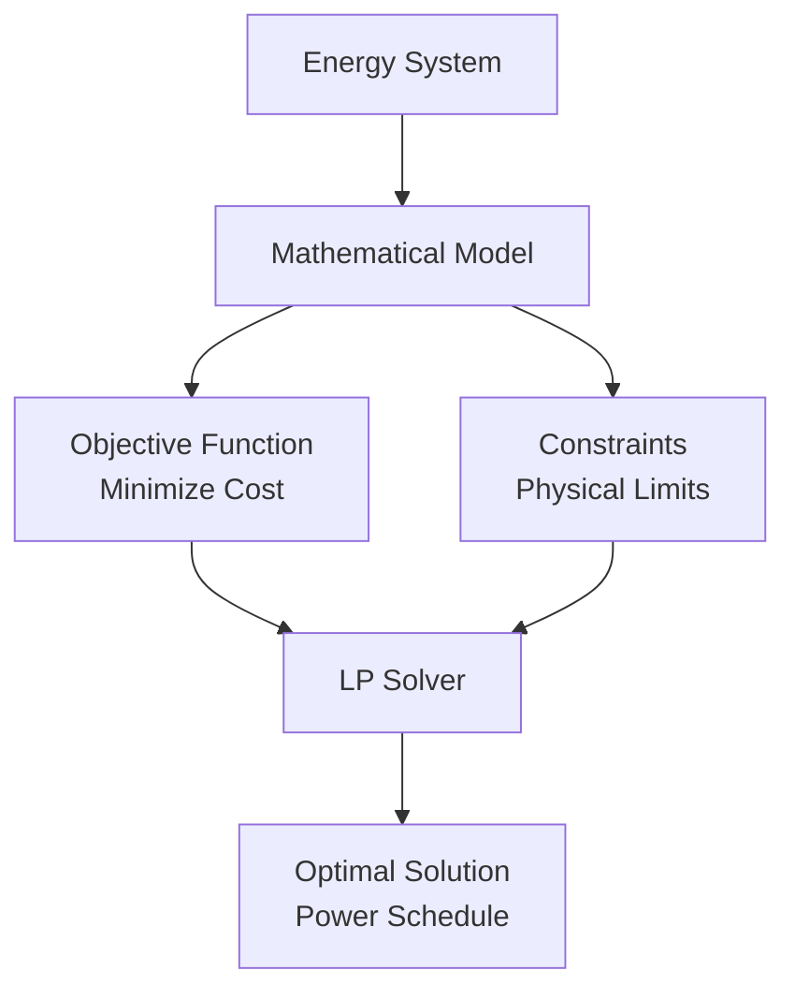
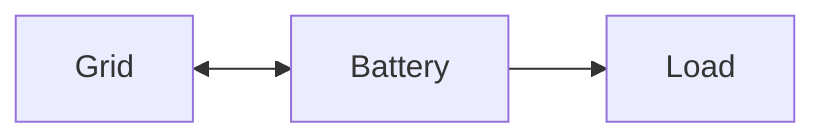

# Mathematical Modeling

This section explains how HAEO models your energy system using linear programming to find the optimal power flow that minimizes costs.

## What is Linear Programming?

Linear programming (LP) is an optimization technique that finds the best outcome in a mathematical model with linear relationships. HAEO uses LP to determine the optimal power flow across your energy network.

### Why Linear Programming?

Linear programming is ideal for energy optimization because:

1. **Fast solving**: Even large problems solve in seconds
2. **Global optimum**: Always finds the best solution (if one exists)
3. **Well-understood**: Mature algorithms and solvers
4. **Handles constraints**: Naturally models power limits, SOC ranges, etc.

### Key Concepts

**Objective Function**: What we want to minimize (total cost)

**Decision Variables**: What the optimizer controls (power flows)

**Constraints**: Rules that must be satisfied (power limits, SOC ranges, power balance)

**Optimal Solution**: The power schedule that minimizes cost while satisfying all constraints

## HAEO's Approach

HAEO models your energy system as:

1. **Network graph**: Entities (nodes) connected by power flows (edges)
2. **Time horizon**: Multiple time steps into the future
3. **Decision variables**: Power flow at each time step
4. **Constraints**: Physical and operational limits
5. **Objective**: Minimize total cost over the horizon

### Mathematical Representation

At a high level, HAEO solves:

$$
\begin{align}
\text{minimize} \quad & \sum\_{t} \text{Cost}(t) \\
\text{subject to} \quad & \text{Power balance at all nodes} \\
& \text{Energy storage dynamics} \\
& \text{Power limits} \\
& \text{Energy limits}
\end{align}
$$

Where $t$ indexes time steps over the optimization horizon.

## Model Components

### Time Discretization

HAEO divides the optimization horizon into discrete time steps:

- **Horizon**: Total optimization period (e.g., 48 hours)
- **Period**: Time step size (e.g., 5 minutes)
- **Time steps**: Horizon / Period (e.g., 576 steps)

Each decision variable is defined for every time step.

### Entity Models

Each [entity type](../user-guide/entities/index.md) has its own model:

- **[Battery](battery.md)**: Energy storage with SOC dynamics
- **[Grid](grid.md)**: Import/export with pricing
- **[Photovoltaics](photovoltaics.md)**: Generation with optional curtailment
- **[Loads](loads.md)**: Fixed or forecast-based consumption
- **[Connections](connections.md)**: Power flow constraints
- **[Net](net-entity.md)**: Power balance nodes

### Power Balance

At each net entity and time step, power flow must balance:

$$
\sum*{\text{inflow}} P*{\text{in}}(t) = \sum*{\text{outflow}} P*{\text{out}}(t)
$$

This is Kirchhoff's current law applied to power flow. See the [power balance documentation](power-balance.md) for details.

### Cost Calculation

The objective function sums all costs:

$$
\text{Total Cost} = \sum\_{t} \left( \text{Import Cost}(t) - \text{Export Revenue}(t) + \text{Storage Costs}(t) \right)
$$

See the [objective function documentation](objective-function.md) for the complete formulation.

## How to Read This Section

Each modeling page explains both the mathematical formulation and implementation details in a single, coherent narrative. The documentation uses mathematical notation alongside code examples to provide a complete understanding of how HAEO models each component.

## Topics Covered

### Foundation

- **[Linear Programming Overview](overview.md)** - Introduction to LP concepts
- **[Objective Function](objective-function.md)** - Cost minimization formulation
- **[Time Horizons](time-horizons.md)** - Time discretization and forecasting
- **[Power Balance](power-balance.md)** - Graph structure and Kirchhoff's law

### Component Models

- **[Battery Model](battery.md)** - Energy storage with SOC dynamics
- **[Grid Model](grid.md)** - Import/export with pricing
- **[Load Models](loads.md)** - Constant and forecast loads
- **[Photovoltaics Model](photovoltaics.md)** - Solar generation
- **[Connection Model](connections.md)** - Power flow constraints
- **[Net Entity Model](net-entity.md)** - Power balance nodes

## Example: Simple System

Let's model a simple system with grid, battery, and load:

### Variables

- $P\_{\text{import}}(t)$: Grid import power
- $P\_{\text{export}}(t)$: Grid export power
- $P\_{\text{charge}}(t)$: Battery charging power
- $P\_{\text{discharge}}(t)$: Battery discharging power
- $E\_{\text{battery}}(t)$: Battery energy level

### Objective

$$
\text{minimize} \sum*{t} \left( P*{\text{import}}(t) \cdot \text{Price}_{\text{import}}(t) - P_{\text{export}}(t) \cdot \text{Price}\_{\text{export}}(t) \right) \cdot \Delta t
$$

### Constraints

Power balance:

$$
P*{\text{import}}(t) - P*{\text{export}}(t) + P*{\text{discharge}}(t) - P*{\text{charge}}(t) = P\_{\text{load}}(t)
$$

Battery dynamics:

$$
E*{\text{battery}}(t+1) = E*{\text{battery}}(t) + \left( P*{\text{charge}}(t) \cdot \eta - \frac{P*{\text{discharge}}(t)}{\eta} \right) \cdot \Delta t
$$

Battery limits:

$$
E*{\text{min}} \leq E*{\text{battery}}(t) \leq E\_{\text{max}}
$$

Non-negativity:

$$
P*{\text{import}}(t), P*{\text{export}}(t), P*{\text{charge}}(t), P*{\text{discharge}}(t) \geq 0
$$

This simple system demonstrates all key modeling concepts used by HAEO.

## Units and Numerical Stability

HAEO uses specific unit conventions for numerical stability:

- **Power**: kilowatts (kW)
- **Energy**: kilowatt-hours (kWh)
- **Time**: hours (h)

This choice keeps numbers in similar ranges (avoiding very large or very small values) which improves solver performance and numerical accuracy.

See the [units documentation](../developer-guide/units.md) for detailed explanation.

## Solver Details

HAEO uses the [PuLP](https://github.com/coin-or/pulp) library with various solver backends:

- **HiGHS** (default): Modern, fast, open-source
- **CBC**: Reliable COIN-OR solver
- **GLPK**: GNU solver
- **Commercial**: CPLEX, Gurobi (if installed)

See the [solver reference](../reference/solvers.md) for comparisons and configuration.

## Next Steps

Explore specific modeling topics:

- [Linear Programming Overview](overview.md)

    Detailed introduction to linear programming concepts.

- [Objective Function](objective-function.md)

    How HAEO formulates the cost minimization problem.

- [Battery Model](battery.md)

    Complete mathematical model of energy storage.

- [Power Balance](power-balance.md)

    Graph structure and power flow constraints.

Or return to the [user guide](../user-guide/index.md) for configuration information.
