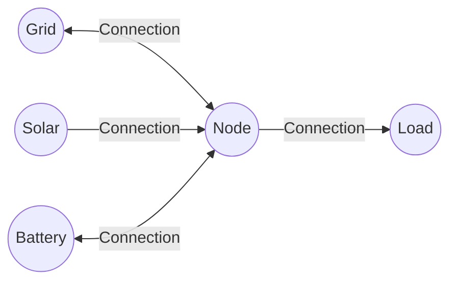

# Network Optimization Overview

HAEO uses linear programming to optimize energy flows across your network.
This page explains the high-level architecture and mathematical foundations.
For element-specific formulations, see the individual element pages.

## Linear Programming Overview

Linear programming finds optimal values for decision variables that minimize (or maximize) an objective function subject to linear constraints.

**Standard LP form**:

$$
\begin{align}
\text{minimize} \quad & c^T x \\
\text{subject to} \quad & Ax \leq b \\
& A_{\text{eq}} x = b_{\text{eq}} \\
& l \leq x \leq u
\end{align}
$$

Where:

- $x$: Decision variables (what the optimizer chooses)
- $c$: Objective coefficients (costs/prices)
- $A$, $b$: Inequality constraint matrices
- $A_{\text{eq}}$, $b_{\text{eq}}$: Equality constraint matrices
- $l$, $u$: Variable bounds

**Linearity requirement**: All relationships must be linear.
No quadratic terms ($x^2$), products ($xy$), or nonlinear functions ($\sin(x)$, etc.).

### Why linear programming?

LP fits home energy systems because power balances, costs, and most device constraints are linear.
It delivers a global optimum when a feasible solution exists and scales well as you extend the horizon or add elements.

!!! info "Linear Programming Approximations"

    HAEO uses pure linear programming rather than Mixed-Integer Linear Programming (MILP).
    While energy systems can include discrete decisions (binary on/off loads), HAEO models these using continuous LP approximations.
    This keeps solve times fast, and forecast uncertainties typically dominate any approximation errors.

## Mathematical Model Structure

HAEO formulates energy system optimization as a network where elements contribute to a unified linear program.
Each element defines its own decision variables, constraints, and cost terms.
The network aggregates these contributions into a single optimization problem.

### Model Aggregation

The complete optimization problem is built by combining contributions from all elements:

**Decision variables**: Each element introduces variables representing its behavior (power flows, energy states, etc.).
The complete variable set is the union of all element variables.

**Constraints**: Each element contributes constraints governing its operation.
The complete constraint set is the union of all element constraints plus network-wide power balance constraints.

**Objective function**: Each element contributes cost terms.
The objective minimizes the sum of all element costs.

### Solution Process

Optimization proceeds in two phases:

**Phase 1: Problem Formulation**

Elements construct their decision variables and constraints.
The network collects these contributions into matrices forming the standard LP problem.

**Phase 2: Solution**

The LP solver finds optimal values for all decision variables that minimize total cost while satisfying all constraints.

### Solution Outcomes

- **Optimal solution**: Satisfies all constraints with minimum total cost
- **Infeasible**: No solution exists that satisfies all constraints simultaneously

## Network Structure

HAEO models energy systems as directed graphs:

- **Elements**: Vertices that produce, consume, or store energy
- **Connections**: Directed edges that transfer power between elements
- **Nodes**: Balance points where power flows must sum to zero

### Element Registration

When a connection is added to the network, it registers itself with its source and target elements.
This allows elements to track their incoming and outgoing connections for constraint generation.

### Network Validation

Before optimization, the network validates its structure:

- All connection endpoints reference valid elements
- No connection has another connection as an endpoint
- All element dependencies are satisfied

This validation ensures the network forms a valid directed graph before attempting optimization.

## Time Discretization

The optimization horizon is divided into discrete periods:

- **Horizon**: Total optimization period (hours)
- **Period**: Time step duration (minutes)
- **Time steps**: $T = \text{Horizon} / \text{Period}$

Each decision variable exists for every time step.

## Power and Energy Discretization

HAEO distinguishes between two types of measurements across the optimization horizon:

**Power variables** represent average power over each period.
These are interval measurements—the "fences" in the fence post analogy.
With $T$ periods, power variables have $T$ values indexed as $t \in \{0, 1, \ldots, T-1\}$.

**Energy variables** represent instantaneous stored energy at time boundaries.
These are point measurements—the "posts" in the fence post analogy.
With $T$ periods, energy variables have $T+1$ values indexed as $t \in \{0, 1, \ldots, T\}$.

```mermaid
gantt
    title Power and Energy Variable Timing
    dateFormat X
    axisFormat %s
    section Variables
        E0 :milestone, 0, 0s
        P0 :active, 1s
        E1 :milestone,
        P1 :active, 1s
        E2 :milestone,
        P2 :active, 1s
        E3 :milestone,

```

**Energy values** (milestones) are measured at **4 time boundaries**: $E(0), E(1), E(2), E(3)$

**Power values** (bars) are measured over **3 time intervals**: $P(0), P(1), P(2)$

This distinction matters for cost calculations.
Prices apply to average power over intervals, which is then converted to energy:

$$
\text{Energy consumed} = P(t) \times \Delta t
$$

$$
\text{Cost} = P(t) \times \Delta t \times \text{price}(t)
$$

Where $\Delta t$ is the period duration in hours.

## Decision Variables and Constraints

The complete optimization problem includes decision variables and constraints from all network elements.

### Variable Structure

**Power variables** represent average power over each time period.
These are interval measurements spanning the optimization horizon with $T$ values.

**Energy variables** represent instantaneous stored energy at time boundaries.
These are point measurements with $T+1$ values.

Each element contributes its own variables based on its physical role (power flows, energy storage, curtailment decisions).

### Constraint Structure

**Element constraints** govern individual element behavior (capacity limits, efficiency losses, operating bounds).

**Network constraints** ensure power balance at connection points (Kirchhoff's law).

The complete constraint set ensures physically feasible operation while allowing optimization across the network.

## Objective Function

The optimization minimizes total system cost over the horizon:

$$
\text{minimize} \sum_{\text{elements}} \sum_{t=0}^{T-1} C_{\text{element}}(t)
$$

Where:

- $T$: Number of time periods
- $C_{\text{element}}(t)$: Cost contribution from each element at time $t$

Each element defines its own cost terms based on its role:

- Elements that interact with external systems (grids) contribute costs based on prices
- Elements with artificial costs (batteries, curtailment) guide optimizer behavior
- Elements without direct costs (loads, nodes) affect costs indirectly through energy balance

See individual element pages for specific cost formulations.

## Solver

HAEO uses **HiGHS** as its LP solver:

- **Open source**: MIT licensed
- **Fast**: State-of-the-art performance
- **Robust**: Handles large-scale problems reliably
- **Alpine Linux compatible**: Provides Python wheels that run on Home Assistant's Alpine Linux base
- **Actively maintained**: Continuous improvements

HiGHS is the only supported solver and cannot be changed via configuration.

## Units

HAEO uses consistent units for numerical stability:

- **Power**: kilowatts (kW)
- **Energy**: kilowatt-hours (kWh)
- **Time**: hours (h)
- **Cost**: dollars (\$)

This keeps values in similar numerical ranges, improving solver performance.
See [units documentation](../developer-guide/units.md) for details.

## Element Formulations

This overview describes the mathematical framework and aggregation process.
Each element type has detailed formulation documentation covering:

- Decision variables introduced
- Parameters from configuration or sensors
- Constraints contributed to the optimization
- Cost terms in the objective function
- Physical interpretation

The following pages provide complete mathematical models for each element type:

## Next Steps

- :material-battery-charging:{ .lg .middle } **Battery modeling**

    ---

    Understand energy storage formulation with SOC dynamics and efficiency.

    [:material-arrow-right: Battery model](battery.md)

- :material-transmission-tower:{ .lg .middle } **Grid modeling**

    ---

    Learn how bidirectional power flow and pricing work.

    [:material-arrow-right: Grid model](grid.md)

- :material-network:{ .lg .middle } **Connection modeling**

    ---

    Explore how power flows between elements with directional limits.

    [:material-arrow-right: Connection model](connections.md)

