# Load Modeling

This page explains how HAEO models electrical loads (consumption) using linear programming.

## Overview

A load in HAEO represents electricity consumption that must be met by the system.
HAEO supports two types of loads:

- **Constant Load**: Fixed power consumption that remains the same across all time periods
- **Forecast Load**: Variable consumption based on forecast data from sensors

Both load types are **non-controllable** - they represent demand that must be satisfied.
The optimization determines how to meet this demand (via solar, battery, or grid) rather than whether to meet it.

## Model Formulation

### Decision Variables

**Important**: Loads have NO decision variables.

- Constant loads are fixed parameters
- Forecast loads follow their forecast data
- The optimizer cannot change load consumption
- Instead, the optimizer decides how to supply the load

This makes loads the simplest entity type in HAEO from a modeling perspective.

### Parameters

#### Constant Load Parameters

- $P_{\text{constant}}$: Fixed power consumption (kW) - `power`
- $\Delta t$: Time step duration (hours) - `period`
- $T$: Number of time periods - `n_periods`

#### Forecast Load Parameters

- $P_{\text{forecast}}(t)$: Forecasted power consumption at time $t$ (kW) - from `forecast` sensors
- $\Delta t$: Time step duration (hours) - `period`
- $T$: Number of time periods - `n_periods`

### Constraints

#### Constant Load

For a constant load, the power consumption is the same at every time step:

$$
P_{\text{load}}(t) = P_{\text{constant}} \quad \forall t \in \{0, 1, \ldots, T-1\}
$$

**Implementation**: The power value is replicated for all time periods:

```python
power_consumption = [power] * n_periods  # List of identical constants
```

This creates a flat consumption profile across the entire optimization horizon.

#### Forecast Load

For a forecast load, the power consumption follows the forecast values:

$$
P_{\text{load}}(t) = P_{\text{forecast}}(t) \quad \forall t
$$

**Implementation**: The forecast sequence is used directly:

```python
power_consumption = forecast  # List of forecast values
```

The forecast must have exactly $T$ values, one for each time period.

#### Validation

Forecast loads require validation to ensure data integrity:

```python
if len(forecast) != n_periods:
    raise ValueError(f"forecast length must match n_periods")
```

### Cost Contribution

Loads themselves have **no direct cost** in the objective function.

$$
C_{\text{load}} = 0
$$

**Why no cost?**

- Loads represent fixed demand that must be met
- The cost of meeting demand comes from the supply sources (grid, battery)
- The optimization minimizes the cost of supplying the load, not the cost of the load itself

However, loads do affect total system cost indirectly:

- Higher loads → More grid import → Higher costs
- Loads during peak prices → Battery discharge opportunity
- Loads matched by solar → Reduced grid dependence

## Physical Interpretation

### Constant Load

Constant loads represent:

- **Baseline household consumption**: Refrigerator, network equipment, always-on devices
- **Fixed facility loads**: Server rooms, lighting, climate control set points
- **Approximate average consumption**: Simplified representation of variable load

**When to use**:

- When detailed load forecasting is not available
- For stable, predictable consumption patterns
- As a conservative baseline that other loads add to

**Typical values**:

| Application              | Typical Constant Load |
| ------------------------ | --------------------- |
| Small home (efficient)   | 0.3-0.5 kW            |
| Average home             | 0.8-1.5 kW            |
| Large home               | 1.5-3.0 kW            |
| Small commercial         | 5-15 kW               |
| Data center (per rack)   | 5-10 kW               |

### Forecast Load

Forecast loads represent:

- **Time-varying consumption**: Cooking, laundry, EV charging, HVAC
- **Weather-dependent loads**: Heating/cooling based on temperature forecasts
- **Scheduled activities**: Pre-planned high-consumption periods

**When to use**:

- When you have reliable consumption forecasts
- For loads with significant time variation
- To capture peak demand periods accurately

**Forecast sources**:

- Historical consumption patterns
- Machine learning predictions
- Weather-based models for HVAC
- Scheduled device usage (EV charging)

### Power Balance Integration

Loads participate in network power balance as:

- **Power consumption**: Removes power from the network
- **Must be satisfied**: Cannot be reduced or shifted (non-controllable)

From the network perspective:

$$
\sum_{\text{sources}} P_{\text{supply}}(t) \geq \sum_{\text{loads}} P_{\text{load}}(t) \quad \forall t
$$

HAEO ensures this through the power balance constraints at net entities.

## Example: Combined Load Modeling

Consider a household with both constant and forecast loads:

**System configuration**:

- Constant load: 1.2 kW (refrigerator, network, standby devices)
- Forecast load: Variable (lighting, appliances, HVAC)

**24-hour profile**:

| Time        | Constant Load | Forecast Load | Total Load | Activity              |
| ----------- | ------------- | ------------- | ---------- | --------------------- |
| 00:00-06:00 | 1.2 kW        | 0.5 kW        | 1.7 kW     | Night (sleeping)      |
| 06:00-08:00 | 1.2 kW        | 2.5 kW        | 3.7 kW     | Morning routine       |
| 08:00-17:00 | 1.2 kW        | 0.8 kW        | 2.0 kW     | Day (away)            |
| 17:00-22:00 | 1.2 kW        | 4.0 kW        | 5.2 kW     | Evening (cooking, TV) |
| 22:00-24:00 | 1.2 kW        | 1.5 kW        | 2.7 kW     | Night prep            |

```mermaid
gantt
    title Daily Load Profile
    dateFormat HH:mm
    axisFormat %H:%M

    section Total Load
    1.7 kW (Night): 00:00, 06:00
    3.7 kW (Morning): 06:00, 08:00
    2.0 kW (Day): 08:00, 17:00
    5.2 kW (Evening Peak): 17:00, 22:00
    2.7 kW (Night): 22:00, 24:00

    section Supply Strategy
    Battery (Off-peak Charged): 00:00, 06:00
    Grid + Solar: 06:00, 08:00
    Solar Only: 08:00, 17:00
    Battery Discharge: 17:00, 22:00
    Grid: 22:00, 24:00
```



### Optimization Strategy

HAEO optimizes how to meet this combined load profile:

**Night (00:00-06:00)**: Low load, off-peak prices

- Load: 1.7 kW
- Strategy: Use grid to charge battery while meeting load
- Prepare for expensive evening peak

**Morning (06:00-08:00)**: Morning peak, solar beginning

- Load: 3.7 kW
- Strategy: Combine solar and grid
- Hold battery for evening

**Daytime (08:00-17:00)**: Moderate load, peak solar

- Load: 2.0 kW
- Strategy: Solar covers all load + charges battery
- Prepare for evening peak

**Evening (17:00-22:00)**: Highest load, peak prices

- Load: 5.2 kW
- Strategy: Discharge battery to minimize grid import
- Most valuable battery discharge period

**Night prep (22:00-24:00)**: Declining load

- Load: 2.7 kW
- Strategy: Grid import (prices declining)
- May begin charging battery

### Energy Calculation

**Total daily energy consumption**:

$$
E_{\text{total}} = \sum_{t=0}^{T-1} P_{\text{load}}(t) \cdot \Delta t
$$

For our example (assuming 5-minute periods):

$$
E_{\text{total}} = (1.7 \times 6) + (3.7 \times 2) + (2.0 \times 9) + (5.2 \times 5) + (2.7 \times 2) = 69.6 \text{ kWh/day}
$$

## Numerical Considerations

### Units

HAEO uses kW for power and kWh for energy:

- **Power**: 2.5 kW (not 2500 W)
- **Energy**: 60 kWh = 2.5 kW × 24 hours
- **Time**: hours (not seconds)

Consistent units across all components ensure solver stability.

### Constant Load Sizing

Choose constant load values based on:

1. **Measured baseline**: Minimum overnight consumption
2. **Always-on devices**: Sum of standby and continuous loads
3. **Safety margin**: Add 10-20% for unmeasured loads

**Too low**: May result in infeasible solutions if actual consumption exceeds optimization
**Too high**: Reduces optimization benefit, over-imports from grid

### Forecast Accuracy

Forecast load accuracy directly impacts optimization quality:

**Accurate forecasts**:

- ✅ Optimal battery charging/discharging timing
- ✅ Minimal grid import during expensive periods
- ✅ Maximum solar self-consumption

**Poor forecasts**:

- ❌ Sub-optimal battery usage
- ❌ Unexpected grid imports
- ❌ Missed cost savings opportunities

**Improving forecasts**:

- Use historical consumption data
- Incorporate weather forecasts for HVAC loads
- Account for known schedules (work from home, EV charging)
- Regularly validate and tune forecast models

### Solver Considerations

Loads are the simplest entities for the solver:

- No decision variables to optimize
- No additional constraints
- Pure parameters in the power balance equations

This simplicity makes loads "free" from a computational perspective - you can have many loads without impacting solve time.

## Configuration Impact

### Constant vs Forecast Loads

**Use constant load when**:

- Consumption is genuinely stable (within 20%)
- Forecast data is unavailable or unreliable
- Quick setup is needed
- Consumption variation is small compared to total system

**Use forecast load when**:

- Consumption varies significantly by time
- Weather impacts load (HVAC)
- Scheduled high-consumption periods exist
- Accuracy is important for optimization value

**Best practice**: Combine both

- Constant load for baseline
- Forecast load for variable consumption
- Captures both predictable minimum and time-varying peaks

### Multiple Loads

HAEO supports multiple load entities:

- **Separated by function**: Base load, HVAC, EV charging
- **Different forecast methods**: Each load can use different sensors
- **Organizational clarity**: Easier to understand and debug

**Total system load**:

$$
P_{\text{total}}(t) = \sum_{\text{all loads}} P_{\text{load}}(t)
$$

All loads sum together in the power balance equations.

### Load Magnitude

**Undersized loads** (less than actual consumption):

- ❌ Optimization may be infeasible
- ❌ Real system cannot meet actual demand
- ❌ Poor real-world performance

**Accurate loads** (match actual consumption):

- ✅ Feasible optimizations
- ✅ Achievable strategies
- ✅ Expected cost savings

**Oversized loads** (more than actual consumption):

- ✅ Always feasible (conservative)
- ❌ Missed optimization opportunities
- ❌ Over-provisioned battery/grid

## Related Documentation

- [Load Configuration Guide](../user-guide/entities/loads.md) - User-facing configuration
- [Power Balance](power-balance.md) - How loads participate in network equations
- [Objective Function](objective-function.md) - How meeting load affects total cost
- [Battery Modeling](battery.md) - How batteries help meet peak loads

## Next Steps

Explore related modeling topics:

- [Photovoltaics Modeling](photovoltaics.md) - Generation that offsets loads
- [Grid Modeling](grid.md) - How grid meets remaining load
- [Net Entity Modeling](net-entity.md) - Where loads connect to the network

[:octicons-arrow-right-24: Continue to Net Entity Modeling](net-entity.md)
