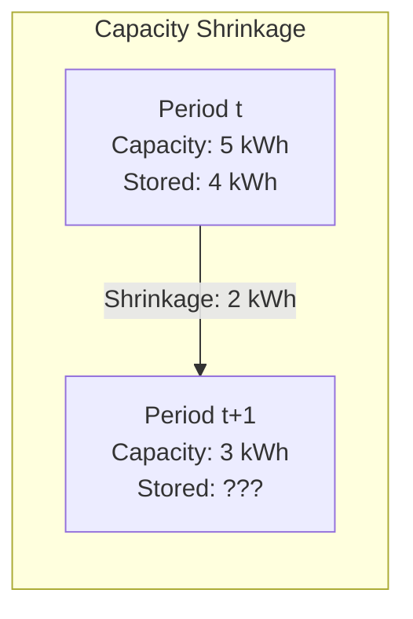
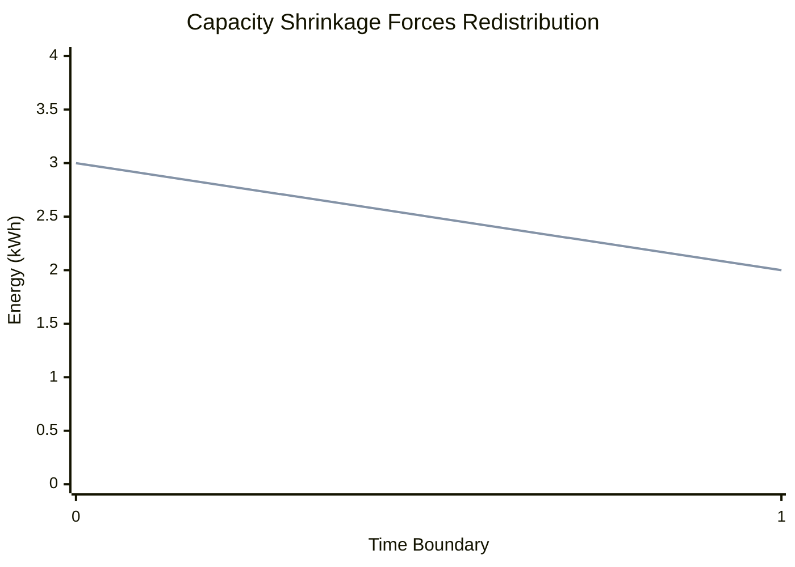

# Battery Balance Connection Model

The Battery Balance Connection model enforces energy redistribution between adjacent battery sections when capacities change dynamically.
It maintains correct ordering by ensuring energy flows down to fill lower sections before higher sections retain energy.

## Overview

When battery sections have dynamic capacity (for example, capacity that decreases over the optimization horizon), energy above the new capacity must be redistributed.
The balance connection handles this transparently through bookkeeping transfers that:

1. **Move excess energy up** when capacity shrinks (forced transfer)
2. **Return energy down** to fill available capacity (constrained slack variable)

This ensures sections are filled from bottom to top—lower sections (like undercharge and normal) fill before higher sections (like overcharge) can retain energy.

!!! note "Model Layer Element"

    BatteryBalanceConnection is a Model Layer primitive.
    Users don't configure these directly—the [Battery device adapter](../device-layer/battery.md) creates them automatically between adjacent sections.

## Physical Motivation

Consider a 3-section battery with sections filling in order: undercharge → normal → overcharge.

**Static capacity**: With constant capacity, connections with differentiated costs naturally guide charging into undercharge first, then normal, then overcharge.

**Dynamic capacity**: When capacity shrinks (e.g., time-of-use or degradation modeling), energy stored above the new capacity limit would violate SOC constraints.
The balance connection redistributes this energy:

The 4 kWh stored in a section that shrinks to 3 kWh cannot remain—1 kWh must transfer to the section above.

## Model Formulation

### Design Variables

For each time step $t \in \{0, 1, \ldots, T-1\}$:

- $P_{\downarrow}(t)$: Power flowing downward (upper → lower), decision variable
- $P_{\uparrow}(t)$: Power flowing upward (lower → upper), constant (not optimized)

### Parameters

- $C_{\text{lower}}(t)$: Lower section capacity at time boundary $t$ (kWh)
- $\Delta t(t)$: Period duration (hours)
- $E_{\text{lower}}(t)$: Stored energy in lower section at time $t$ (from Battery element)

### Derived Values

**Capacity shrinkage** at each period:

$$
\Delta C(t) = \max(0, C_{\text{lower}}(t) - C_{\text{lower}}(t+1))
$$

**Upward power** (constant, not a variable):

$$
P_{\uparrow}(t) = \frac{\Delta C(t)}{\Delta t(t)}
$$

This represents the forced bookkeeping transfer—energy that must move up because capacity shrank.

### Constraints

#### 1. Minimum Downward Transfer

Downward transfer must at least compensate the upward bookkeeping:

$$
P_{\downarrow}(t) \geq P_{\uparrow}(t) \quad \forall t
$$

This ensures any energy pushed up by capacity shrinkage flows back down.

#### 2. Fill Lower Section Capacity

Downward energy must fill the lower section's available capacity:

$$
P_{\downarrow}(t) \cdot \Delta t(t) \geq C_{\text{lower}}(t+1) - E_{\text{lower}}(t+1) \quad \forall t
$$

This constraint, combined with the lower section's SOC max constraint, ensures energy flows down to fill available capacity.

### Cost Contribution

Balance transfers are **cost-free**.
They represent internal energy redistribution, not real power flow, so they don't affect the optimization objective.

## How Ordering Works

The balance connection enforces bottom-up filling through the interaction of its constraints with battery section SOC constraints.

### Example: Two Sections with Shrinking Capacity

Consider undercharge (lower) and normal (upper) sections:

**Period 0**: Lower has 3 kWh capacity, upper has 8 kWh capacity
**Period 1**: Lower shrinks to 2 kWh capacity, upper unchanged

**What happens**:

1. Shrinkage = 3 - 2 = 1 kWh
2. Upward power = 1 kWh / period_duration (forced)
3. Downward power ≥ upward power (constraint 1)
4. Downward energy ≥ 2 - $E_{\text{lower}}(1)$ (constraint 2)

If lower section ends at 2 kWh stored (full), downward energy ≥ 0 is satisfied.
If lower section ends at 1.5 kWh stored, downward energy ≥ 0.5 kWh forces additional transfer.

**Key insight**: The lower section's SOC max constraint prevents overfilling (energy can't exceed 2 kWh).
The balance connection's constraint 2 forces enough energy down to fill to capacity.
Together, these ensure lower fills completely before upper retains energy.

### Multi-Section Ordering

With three sections (undercharge → normal → overcharge), two balance connections are created:

1. **undercharge ↔ normal**: Ensures undercharge fills before normal retains
2. **normal ↔ overcharge**: Ensures normal fills before overcharge retains

Energy cascades down through the chain, filling sections from bottom to top.

## Power Balance Integration

The balance connection participates in battery power balance like a standard connection:

**At upper battery** (source):

- Outflow: $-P_{\downarrow}(t)$ (power leaving to lower)
- Inflow: $+P_{\uparrow}(t)$ (power arriving from lower via bookkeeping)

**At lower battery** (target):

- Inflow: $+P_{\downarrow}(t)$ (power arriving from upper)
- Outflow: $-P_{\uparrow}(t)$ (power leaving via bookkeeping)

Because $P_{\downarrow} \geq P_{\uparrow}$, net flow is always downward or zero.

## Physical Interpretation

### Bookkeeping vs Real Power

The "upward" and "downward" transfers are **bookkeeping operations**, not real power flows.
They represent energy being redistributed between sections of the same physical battery.

In reality, when a section's capacity shrinks:

- The battery doesn't physically move energy between sections
- The optimization model rebalances which section "owns" the stored energy
- External connections (charging/discharging) handle real power flow

### Why Separate from Connection?

BatteryBalanceConnection differs from standard Connection:

| Aspect     | Connection              | BatteryBalanceConnection    |
| ---------- | ----------------------- | --------------------------- |
| Power      | Two decision variables  | One variable + one constant |
| Cost       | Can have transfer costs | Always zero cost            |
| Efficiency | Can have losses         | Always 100% (lossless)      |
| Purpose    | Model real power flow   | Energy bookkeeping          |

## Outputs

The balance connection provides power flow outputs:

| Output                        | Description                                  | Unit  |
| ----------------------------- | -------------------------------------------- | ----- |
| `balance_power_down`          | Downward transfer (upper → lower)            | kW    |
| `balance_power_up`            | Upward transfer (lower → upper, constant)    | kW    |
| `balance_min_transfer_down`   | Shadow price for minimum downward constraint | \$/kW |
| `balance_fill_lower_capacity` | Shadow price for fill capacity constraint    | \$/kW |

## Next Steps

- :material-battery-charging:{ .lg .middle } **Battery device layer**

    ---

    How balance connections integrate into multi-section batteries.

    [:material-arrow-right: Battery device modeling](../device-layer/battery.md)

- :material-battery:{ .lg .middle } **Battery model**

    ---

    Single-section battery formulation.

    [:material-arrow-right: Battery model](battery.md)

- :material-connection:{ .lg .middle } **Connection model**

    ---

    Standard power flow connections with costs.

    [:material-arrow-right: Connection model](connection.md)

