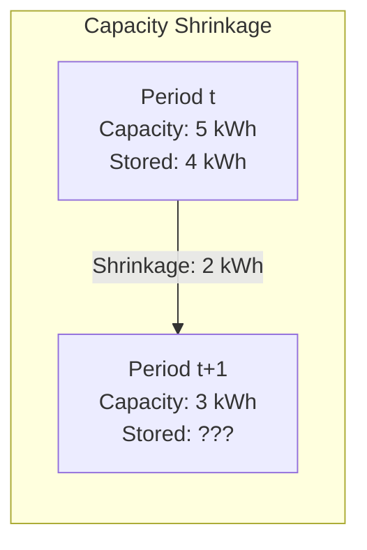

# Battery Balance Connection Model

The Battery Balance Connection model enforces energy redistribution between adjacent battery sections.
It ensures proper ordering by constraining lower sections to fill to capacity before upper sections can hold energy.

## Overview

When battery sections have dynamic capacity (for example, capacity that decreases over the optimization horizon), energy above the new capacity must be redistributed.
The balance connection handles this through:

1. **Downward flow** to fill lower sections from upper sections
2. **Upward flow** to evacuate excess when capacity shrinks
3. **Ordering enforcement** to ensure lower sections fill before upper sections retain energy
4. **Lossless transfer** to maintain energy conservation

This ensures sections fill from bottom to top—lower sections (like undercharge and normal) fill before higher sections (like overcharge) can retain energy.

!!! note "Model Layer Element"

    BatteryBalanceConnection is a Model Layer primitive.
    Users don't configure these directly—the [Battery device adapter](../device-layer/battery.md) creates them automatically between adjacent sections.

## Physical Motivation

Consider a 3-section battery with sections filling in order: undercharge → normal → overcharge.

**Ordering requirement**: Energy should always fill lower sections to capacity before being stored in higher sections.

**Dynamic capacity**: When capacity shrinks, energy stored above the new capacity limit would violate SOC constraints.
The balance connection redistributes this energy while maintaining the ordering invariant.

The 4 kWh stored in a section that shrinks to 3 kWh cannot remain—1 kWh must transfer to the section above.

## Model Formulation

### Design Variables

For each time step $t \in \{0, 1, \ldots, T-1\}$:

**Power variables**:

- $P_\downarrow(t)$: Power flowing downward (upper → lower), $\geq 0$
- $P_\uparrow(t)$: Power flowing upward (lower → upper), $\geq 0$

**Slack variables**:

- $S_\downarrow(t)$: Unmet demand slack for downward flow, $\geq 0$
- $S_\uparrow(t)$: Excess absorption slack for upward flow, $\geq 0$
- $S_\uparrow^{\max}(t)$: Upper bound slack for upward flow, $\geq 0$
- $S_{\text{ord}}(t)$: Ordering constraint slack, $\geq 0$

### Parameters

- $C_{\text{lower}}(t)$: Lower section capacity at time boundary $t$ (kWh)
- $\Delta t(t)$: Period duration (hours)
- $E_{\text{lower}}(t)$: Stored energy in lower section at time $t$ (from Battery element)
- $E_{\text{upper}}(t)$: Stored energy in upper section at time $t$ (from Battery element)

### Derived Quantities

**Demand** (room in lower section at start of period):

$$D(t) = C_{\text{lower}}(t) - E_{\text{lower}}(t) \geq 0$$

**Excess** (energy above new capacity):

$$X(t) = E_{\text{lower}}(t) - C_{\text{lower}}(t+1)$$

Excess can be positive (must evacuate) or negative (room available).

### Constraints

#### Downward Flow Constraints

The downward flow fills the lower section's demand, limited by upper section's available energy.

**1. Demand satisfaction (equality)**:

$$P_\downarrow(t) \cdot \Delta t + S_\downarrow(t) \cdot \Delta t = D(t)$$

Power plus slack equals demand. The slack represents unmet demand.

**2. Availability limit**:

$$P_\downarrow(t) \cdot \Delta t \leq E_{\text{upper}}(t)$$

Cannot transfer more than upper section has available.

**3. Minimum slack**:

$$S_\downarrow(t) \cdot \Delta t \geq D(t) - E_{\text{upper}}(t)$$

When demand exceeds availability, slack must absorb the difference.

Together, these give $P_\downarrow = \min(D, E_{\text{upper}}) / \Delta t$—the maximum possible downward transfer.

#### Upward Flow Constraints

The upward flow evacuates excess energy when capacity shrinks.
Uses a subtraction formulation where slack absorbs negative excess.

**4. Excess handling (equality with subtraction)**:

$$P_\uparrow(t) \cdot \Delta t - S_\uparrow(t) \cdot \Delta t = X(t)$$

When $X > 0$: $P_\uparrow \geq X / \Delta t$ (must push excess).
When $X \leq 0$: $S_\uparrow$ absorbs negative, allowing $P_\uparrow = 0$.

**5. Minimum slack for non-negativity**:

$$S_\uparrow(t) \cdot \Delta t \geq \max(0, -X(t))$$

Ensures $P_\uparrow \geq 0$ when excess is negative.

**6. Upper bound on upward flow**:

$$P_\uparrow(t) \cdot \Delta t \leq X(t) + S_\uparrow^{\max}(t) \cdot \Delta t$$

**7. Minimum for upper bound slack**:

$$S_\uparrow^{\max}(t) \cdot \Delta t \geq -X(t)$$

Constraints 6 and 7 together implement $P_\uparrow \leq \max(0, X) / \Delta t$:

- When $X \geq 0$: $S_\uparrow^{\max} = 0$, so $P_\uparrow \leq X / \Delta t$
- When $X < 0$: $S_\uparrow^{\max} = -X / \Delta t$, so $P_\uparrow \leq 0$

Combined with constraint 4: when $X > 0$, $P_\uparrow = X / \Delta t$ exactly.

#### Ordering Constraint

The ordering constraint ensures lower fills before upper retains energy.

**8. Upper section bounded by overflow**:

$$E_{\text{upper}}(t) + C_{\text{lower}}(t) - S_{\text{ord}}(t) \leq E_{\text{total}}$$

Where $E_{\text{total}} = E_{\text{lower}}(0) + E_{\text{upper}}(0)$ is the conserved total energy.

**9. Minimum ordering slack**:

$$S_{\text{ord}}(t) \geq C_{\text{lower}}(t) - E_{\text{total}}$$

Together these give $E_{\text{upper}} \leq \max(0, E_{\text{total}} - C_{\text{lower}})$—upper can only hold overflow.

### Unique Solutions

With the complete constraint set, each variable has a **unique** feasible value:

| Condition | $P_\downarrow$ | $P_\uparrow$ |
|-----------|----------------|--------------|
| $D \leq E_{\text{upper}}$ | $D / \Delta t$ | - |
| $D > E_{\text{upper}}$ | $E_{\text{upper}} / \Delta t$ | - |
| $X \leq 0$ | - | $0$ |
| $X > 0$ | - | $X / \Delta t$ |

There are no degenerate solutions—the constraints fully determine the power flows without requiring objective function tiebreakers.

### Cost Contribution

A minimal epsilon cost ensures numerical stability:

$$\text{cost} = \epsilon \cdot \sum_{t} \left[ 1000 \cdot S_{\text{ord}}(t) + 10 \cdot P_\uparrow(t) + P_\downarrow(t) + S_\uparrow^{\max}(t) \right]$$

The epsilon (typically $10^{-6}$) breaks ties within solver tolerance.
The hierarchy (ordering >> upward >> downward) matches physical priority:

1. Maintain ordering (highest priority)
2. Minimize upward flow (only when truly needed)
3. Minimize downward flow (transfer efficiently)

## How the Constraints Work Together

### Example: Initial Ordering Violation

**Initial state**: Lower has 1 kWh, upper has 2 kWh, capacity = 5 kWh

| Quantity | Value |
|----------|-------|
| $D$ | $5 - 1 = 4$ kWh |
| $X$ | $1 - 5 = -4$ kWh |
| $E_{\text{upper}}$ | $2$ kWh |

**Downward flow**:

- Demand = 4 kWh, available = 2 kWh
- $P_\downarrow = \min(4, 2) / \Delta t = 2$ kW (transfers all available)
- $S_\downarrow = 2$ kWh (unmet demand)

**Upward flow**:

- Excess = -4 kWh (negative, room available)
- $P_\uparrow = \max(0, -4) / \Delta t = 0$ kW

**Result**: 2 kWh flows down, lower ends at 3 kWh, upper ends at 0 kWh.

### Example: Capacity Shrinkage

**Initial state**: Lower has 4 kWh, upper has 3 kWh, capacity shrinks 5 → 3 kWh

| Quantity | Value |
|----------|-------|
| $D$ | $5 - 4 = 1$ kWh |
| $X$ | $4 - 3 = 1$ kWh |
| $E_{\text{upper}}$ | $3$ kWh |

**Downward flow** (based on old capacity):

- Demand = 1 kWh, available = 3 kWh
- $P_\downarrow = 1$ kW

**Upward flow** (based on new capacity):

- Excess = 1 kWh (positive, must evacuate)
- $P_\uparrow = 1$ kW

**Net flow**: $P_\downarrow - P_\uparrow = 0$ (no net transfer this period)

But after the period, with new capacity = 3 kWh:

- Lower = 4 + 1 - 1 = 4 kWh (still exceeds new capacity!)

This shows the ordering constraint works across periods—the next period will continue evacuating until lower ≤ new capacity.

## Power Balance Integration

The balance connection participates in battery power balance like a standard connection:

**At upper battery** (source):

- Outflow: $-P_\downarrow(t)$ (power leaving to lower)
- Inflow: $+P_\uparrow(t)$ (power arriving from lower)

**At lower battery** (target):

- Inflow: $+P_\downarrow(t)$ (power arriving from upper)
- Outflow: $-P_\uparrow(t)$ (power leaving to upper)

## Physical Interpretation

### Bookkeeping vs Real Power

The "upward" and "downward" transfers are **bookkeeping operations**, not real power flows.
They represent energy being redistributed between sections of the same physical battery.

In reality, when a section's capacity shrinks:

- The battery doesn't physically move energy between sections
- The optimization model rebalances which section "owns" the stored energy
- External connections (charging/discharging) handle real power flow

### Why Separate from Connection?

BatteryBalanceConnection differs from standard Connection:

| Aspect      | Connection              | BatteryBalanceConnection            |
| ----------- | ----------------------- | ----------------------------------- |
| Power       | Two decision variables  | Two decision variables + slacks     |
| Cost        | Can have transfer costs | Epsilon cost (for numerics)         |
| Efficiency  | Can have losses         | Always 100% (lossless)              |
| Purpose     | Model real power flow   | Energy ordering and balancing       |
| Constraints | Flow limits             | Demand, excess, and ordering        |
| Solution    | May have range          | Unique (fully determined)           |

## Outputs

The balance connection provides power flow outputs:

| Output               | Description                          | Unit  |
| -------------------- | ------------------------------------ | ----- |
| `balance_power_down` | Downward transfer (upper → lower)    | kW    |
| `balance_power_up`   | Upward transfer (lower → upper)      | kW    |
| `balance_slack_down` | Unmet demand slack                   | kW    |
| `balance_slack_up`   | Excess absorption slack              | kW    |

Constraint shadow prices are also available for debugging.

## Next Steps

- :material-battery-charging:{ .lg .middle } **Battery device layer**

    ---

    How balance connections integrate into multi-section batteries.

    [:material-arrow-right: Battery device modeling](../device-layer/battery.md)

- :material-battery:{ .lg .middle } **Battery model**

    ---

    Single-section battery formulation.

    [:material-arrow-right: Battery model](battery.md)

- :material-connection:{ .lg .middle } **Connection model**

    ---

    Standard power flow connections with costs.

    [:material-arrow-right: Connection model](connection.md)

