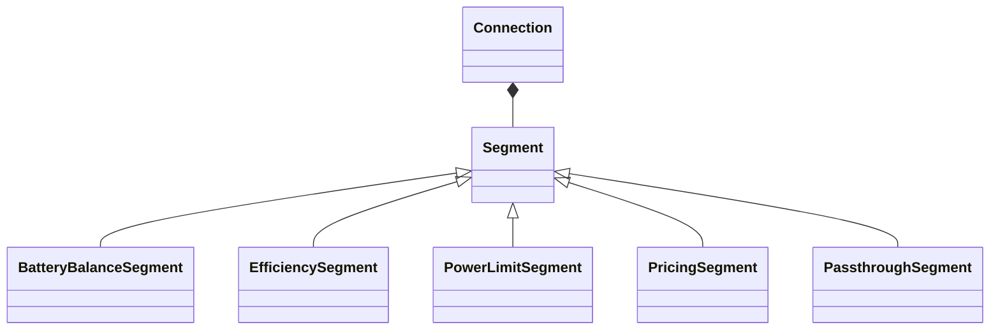

# Connections

Connections model power flow paths between [elements](../elements/index.md).
They define how power moves through the network and apply constraints, efficiency losses, and costs through ordered segments.

## Connection composition

HAEO uses a single Connection class that composes segment building blocks.
Connections define an ordered segment chain that transforms power as it moves between elements.

Composition rules:

- Segment configuration is an ordered mapping; keys become segment names.
- The segment chain is linked by equality constraints between adjacent segments.
- Segment outputs are grouped under the `segments` output using the configured names.
- A passthrough segment is created when no segments are provided.

## Connection type

**[Connection](connection.md)**:
Composable bidirectional connection with ordered segments.
Use segments to apply limits, efficiency losses, pricing, or internal balancing.

## Segment types

- **[Battery balance segment](../segments/battery-balance.md)** enforces ordering between battery sections.
- **[Efficiency segment](../segments/efficiency.md)** applies direction-specific efficiency multipliers.
- **[Power limit segment](../segments/power-limit.md)** enforces directional limits and time-slice coupling.
- **[Pricing segment](../segments/pricing.md)** adds directional cost terms to the objective.
- **[Passthrough segment](../segments/passthrough.md)** provides lossless flow with no constraints.

## Common interface

All connection types provide these properties for node power balance calculations:

| Property            | Description                                 |
| ------------------- | ------------------------------------------- |
| `source`            | Name of the source element                  |
| `target`            | Name of the target element                  |
| `power_into_source` | Effective power flowing into source element |
| `power_into_target` | Effective power flowing into target element |

The `power_into_*` properties include efficiency losses from the segment chain.
Elements do not need to account for segment details directly.

## Design philosophy

Connections are kept separate from elements to enable flexible network topologies:

- Elements define what they do (store energy, generate power, consume power).
- Connections define how elements interact (limits, efficiency, cost).

This separation allows the same element types to be connected in different ways depending on the physical system being modeled.

## Next Steps

- :material-connection:{ .lg .middle } **Connection model**

    ---

    Segment-based connection formulation.

    [:material-arrow-right: Connection formulation](connection.md)

- :material-layers:{ .lg .middle } **Segments**

    ---

    Segment catalog and formulations.

    [:material-arrow-right: Segment index](../segments/index.md)

- :material-battery-charging:{ .lg .middle } **Elements**

    ---

    Battery and Node model elements.

    [:material-arrow-right: Element types](../elements/index.md)

