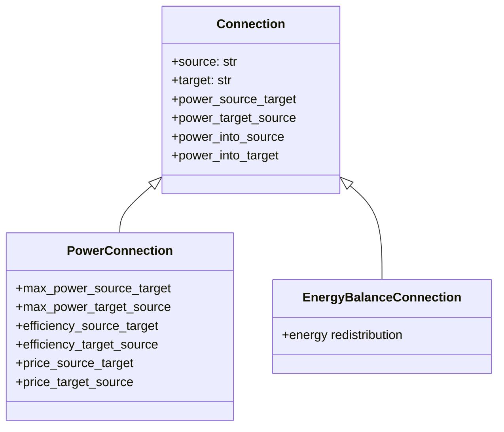

# Connections

Connections model power flow paths between [elements](../elements/index.md).
They define how power moves through the network and can apply constraints, efficiency losses, and costs to that flow.

## Connection class hierarchy

HAEO provides a hierarchy of connection types with increasing functionality:

## Connection types

**[Connection](connection.md)** (base class):
Lossless bidirectional power flow.
Provides the fundamental power variables and interface that all connections share.
Use when no efficiency, limits, or pricing are needed.

**[PowerConnection](power-connection.md)** (extends Connection):
Adds optional power limits, efficiency losses, and transfer costs.
This is the primary connection type for most user-configured connections.

**[EnergyBalanceConnection](../energy-balance-connection.md)**:
Specialized lossless energy redistribution between storage partitions.
Used internally by the Battery device to balance energy across SOC partitions.
Not typically used directly.

## Common interface

All connection types provide these properties for node power balance calculations:

| Property            | Description                                 |
| ------------------- | ------------------------------------------- |
| `source`            | Name of the source element                  |
| `target`            | Name of the target element                  |
| `power_into_source` | Effective power flowing into source element |
| `power_into_target` | Effective power flowing into target element |

The `power_into_*` properties handle efficiency losses internally, so elements don't need to know about connection efficiency.

## Design philosophy

Connections are kept separate from elements to enable flexible network topologies:

- Elements define what they do (store energy, generate power, consume power)
- Connections define how elements interact (power limits, efficiency, cost)

This separation allows the same element types to be connected in different ways depending on the physical system being modeled.

## Next Steps

- :material-connection:{ .lg .middle } **Connection (base)**

    ---

    Lossless bidirectional power flow.

    [:material-arrow-right: Connection formulation](connection.md)

- :material-power-plug:{ .lg .middle } **PowerConnection**

    ---

    Power limits, efficiency, and pricing.

    [:material-arrow-right: PowerConnection formulation](power-connection.md)

- :material-battery-charging:{ .lg .middle } **Elements**

    ---

    Battery and Node model elements.

    [:material-arrow-right: Element types](../elements/index.md)

