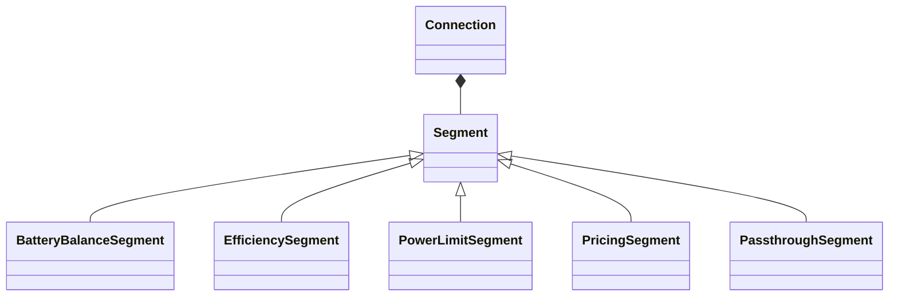

# Connections

Connections model power flow paths between [elements](../elements/index.md).
They define how power moves through the network and apply constraints, efficiency losses, and costs through ordered segments.

## Connection composition

HAEO uses a single Connection class that composes segment building blocks.
Battery balance is modeled by a dedicated segment inside a Connection.

## Connection types

**[Connection](connection.md)**:
Composable bidirectional connection with ordered segments.
Use segments to apply limits, efficiency losses, and pricing.

**Battery balance segment**:
Specialized energy redistribution between battery sections.
Used internally by the Battery device to enforce SOC ordering.

## Segment types

- **BatteryBalanceSegment** enforces ordering between battery sections.
- **EfficiencySegment** applies direction-specific efficiency multipliers.
- **PowerLimitSegment** enforces directional limits and time-slice coupling.
- **PricingSegment** adds directional cost terms to the objective.
- **PassthroughSegment** provides lossless flow with no constraints.

## Common interface

All connection types provide these properties for node power balance calculations:

| Property            | Description                                 |
| ------------------- | ------------------------------------------- |
| `source`            | Name of the source element                  |
| `target`            | Name of the target element                  |
| `power_into_source` | Effective power flowing into source element |
| `power_into_target` | Effective power flowing into target element |

The `power_into_*` properties include efficiency losses from the segment chain.
Elements do not need to account for segment details directly.

## Design philosophy

Connections are kept separate from elements to enable flexible network topologies:

- Elements define what they do (store energy, generate power, consume power).
- Connections define how elements interact (limits, efficiency, cost).

This separation allows the same element types to be connected in different ways depending on the physical system being modeled.

## Next Steps

- :material-connection:{ .lg .middle } **Connection model**

    ---

    Segment-based connection formulation.

    [:material-arrow-right: Connection formulation](connection.md)

- :material-battery-charging:{ .lg .middle } **Battery balance segment**

    ---

    Battery-specific redistribution constraints.

    [:material-arrow-right: Battery balance segment](../battery-balance-connection.md)

- :material-battery-charging:{ .lg .middle } **Elements**

    ---

    Battery and Node model elements.

    [:material-arrow-right: Element types](../elements/index.md)

