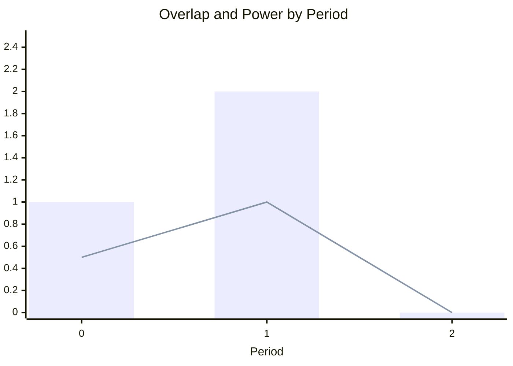

# Schedulable Load

A schedulable load models a deferrable energy consumer that must run for a fixed duration at a fixed power level, but the optimizer chooses when to start it within a scheduling window.

!!! note "Model Layer element"

    This page documents a **Model Layer** element—the building blocks of HAEO's linear programming formulation.
    Model Layer elements are composed by Device Layer elements through the adapter layer.

## Overview

The schedulable load element optimizes the start time of a fixed-duration, fixed-power consumption event.
Examples include:

- Electric vehicle charging sessions
- Pool pump cycles
- Dishwasher or washing machine runs
- Water heater boost cycles

The optimizer selects the optimal start time within a configurable window, allowing the load to run when energy prices are lowest or when excess solar generation is available.

## Model Formulation

The key insight is that the overlap between the load's active window $[s, s+d]$ and each time period $[b_t, b_{t+1}]$ determines how much energy is consumed in that period.
Using auxiliary variables to model the max and min operations, the formulation remains a pure LP without binary variables.

### Parameters

| Parameter        | Dimensions | Source        | Description                                                  |
| ---------------- | ---------- | ------------- | ------------------------------------------------------------ |
| $P$              | scalar     | Configuration | Load power consumption (kW)                                  |
| $d$              | scalar     | Configuration | Load run duration (hours)                                    |
| $s_{\min}$       | scalar     | Configuration | Earliest allowed start time (hours from horizon start)       |
| $s_{\max}$       | scalar     | Configuration | Latest allowed start time (hours from horizon start)         |
| $\Delta t$       | $T$        | Configuration | Time period durations (hours)                                |
| $b_t$            | $T+1$      | Derived       | Cumulative time at each boundary: $b_0 = 0$, $b_t = \sum_{i=0}^{t-1} \Delta t_i$ |

### Decision Variables

| Variable       | Dimensions | Domain                    | Description                                                |
| -------------- | ---------- | ------------------------- | ---------------------------------------------------------- |
| $s$            | scalar     | $[s_{\min}, s_{\max}]$    | Scheduled start time (hours from horizon start)            |
| $L_t$          | $T$        | $[0, H]$                  | Left edge: where active region starts in period $t$        |
| $R_t$          | $T$        | $[0, H + d]$              | Right edge: where active region ends in period $t$         |
| $\omega_t$     | $T$        | $[0, \Delta t]$           | Overlap: duration the load is active in period $t$ (hours) |

Where $H = \sum \Delta t$ is the total horizon length.

Power consumption is computed from overlap rather than stored as a decision variable:

$$
P_t = P \cdot \omega_t / \Delta t
$$

### Constraints

#### 1. Left Edge Constraints (models max)

The left edge of the active region in period $t$ is $\max(b_t, s)$:

$$
\begin{aligned}
L_t &\geq b_t \quad \forall t \in [0, T-1] \\
L_t &\geq s \quad \forall t \in [0, T-1]
\end{aligned}
$$

The LP relaxation naturally minimizes $L_t$ (to maximize overlap), pushing it to the larger of the two bounds.

#### 2. Right Edge Constraints (models min)

The right edge of the active region in period $t$ is $\min(b_{t+1}, s + d)$:

$$
\begin{aligned}
R_t &\leq b_{t+1} \quad \forall t \in [0, T-1] \\
R_t &\leq s + d \quad \forall t \in [0, T-1]
\end{aligned}
$$

The LP relaxation naturally maximizes $R_t$ (to maximize overlap), pushing it to the smaller of the two bounds.

#### 3. Overlap Constraints

The overlap in period $t$ is the difference between the right and left edges:

$$
\begin{aligned}
\omega_t &\geq R_t - L_t \quad \forall t \in [0, T-1] \\
\omega_t &\leq \Delta t \quad \forall t \in [0, T-1]
\end{aligned}
$$

The first constraint ensures overlap captures the active time.
The second constraint bounds overlap to at most the period duration.

#### 4. Total Overlap Constraint

The total overlap across all periods must equal the load duration:

$$
\sum_{t=0}^{T-1} \omega_t = d
$$

This constraint is crucial—it forces the optimizer to allocate exactly $d$ hours of activity across the periods, ensuring the full energy requirement is met.

#### 5. Start Time Bounds

The start time must fall within the scheduling window:

$$
s_{\min} \leq s \leq s_{\max}
$$

#### 6. Power Balance Constraint

Connection power is proportional to the overlap, linking the load to the network:

$$
P_{\text{connection}}(t) \cdot \Delta t = -P \cdot \omega_t \quad \forall t \in [0, T-1]
$$

The negative sign reflects that the load consumes power (power flows from the network into the load).
This constraint directly couples the overlap variables to the network power flow.

### Shadow Prices

| Constraint          | Unit   | Interpretation                                               |
| ------------------- | ------ | ------------------------------------------------------------ |
| `left_edge_boundary`| \$/kWh | Value of relaxing period boundary constraint on left edge    |
| `left_edge_start`   | \$/kWh | Value of relaxing start time constraint on left edge         |
| `right_edge_boundary`| \$/kWh | Value of relaxing period boundary constraint on right edge   |
| `right_edge_end`    | \$/kWh | Value of relaxing end time constraint on right edge          |
| `overlap_min`       | \$/kWh | Value of overlap exceeding right minus left edge             |
| `overlap_max`       | \$/kWh | Value of overlap exceeding period duration                   |
| `total_overlap`     | \$/kWh | Marginal value of total active duration                      |
| `earliest_start`    | \$/kWh | Value of being able to start earlier                         |
| `latest_start`      | \$/kWh | Value of being able to start later                           |
| `power_balance`     | \$/kW  | Marginal value of power at the load terminals                |

### Cost Contribution

The schedulable load has no inherent cost—it simply consumes power.
Costs are applied through the [Connection](../connections/index.md) elements linking the load to the network, where energy prices determine the optimal scheduling.

## Physical Interpretation

### Overlap-Based Energy Calculation

The model calculates how much of each time period overlaps with the load's active window.
This overlap determines the energy consumed in each period.

Consider a 2 kW load running for 1.5 hours starting at hour 0.5:

| Period | Time  | Overlap | Power  |
| ------ | ----- | ------- | ------ |
| 0      | 0–1 h | 0.5 h   | 1.0 kW |
| 1      | 1–2 h | 1.0 h   | 2.0 kW |
| 2      | 2–3 h | 0 h     | 0.0 kW |

### Why the Relaxation Works

The max/min constraints use inequality bounds, but the LP relaxation finds the correct solution because:

1. **Left edge minimization**: The optimizer pushes $L_t$ down to maximize overlap, but it cannot go below $\max(b_t, s)$ due to the constraints.

2. **Right edge maximization**: The optimizer pushes $R_t$ up to maximize overlap, but it cannot exceed $\min(b_{t+1}, s+d)$ due to the constraints.

3. **Total overlap enforcement**: The constraint $\sum \omega_t = d$ forces exactly $d$ hours of activity, preventing the optimizer from "spreading" the load unrealistically.

This formulation correctly handles all edge cases including loads that span multiple periods, partial period coverage, and variable period lengths.

### Example: Optimal Scheduling

Consider a 3 kW load running for 2 hours with periods of 1 hour each and connection costs of \$0.30, \$0.20, \$0.10, and \$0.25 per kWh respectively.

The optimizer chooses start time $s = 2.0$ hours to run during the cheapest periods (periods 2 and 3):

| Period | Interval | Overlap (h) | Power (kW) | Energy (kWh) | Cost   |
| ------ | -------- | ----------- | ---------- | ------------ | ------ |
| 0      | 0–1 h    | 0           | 0          | 0            | \$0.00 |
| 1      | 1–2 h    | 0           | 0          | 0            | \$0.00 |
| 2      | 2–3 h    | 1.0         | 3.0        | 3.0          | \$0.30 |
| 3      | 3–4 h    | 1.0         | 3.0        | 3.0          | \$0.75 |

Total cost: 3.0 × \$0.10 + 3.0 × \$0.25 = \$1.05

If the earliest start were $s_{\min} = 0$, the optimizer would instead place the load in periods 1 and 2:

| Period | Overlap (h) | Power (kW) | Cost   |
| ------ | ----------- | ---------- | ------ |
| 0      | 0           | 0          | \$0.00 |
| 1      | 1.0         | 3.0        | \$0.60 |
| 2      | 1.0         | 3.0        | \$0.30 |
| 3      | 0           | 0          | \$0.00 |

Total cost: 3.0 × \$0.20 + 3.0 × \$0.10 = \$0.90

### Model Assumptions

- **Fixed power**: The load runs at constant power $P$ when active
- **Fixed duration**: The load runs for exactly duration $d$ hours
- **Continuous start time**: Start time $s$ is a continuous variable (not restricted to period boundaries)
- **Single run**: The load runs once within the horizon (no repeated cycles)
- **No interruption**: Once started, the load runs to completion

### Limitations

- **Multi-phase loads**: Loads with variable power profiles during operation are not modeled (use multiple schedulable loads or forecast loads)
- **Recurring schedules**: For loads that run multiple times, create multiple schedulable load elements
- **Power ramping**: Instantaneous power transitions at start/end (physical ramp times not modeled)

## Next Steps

- :material-battery-charging:{ .lg .middle } **Battery model**

    ---

    See how batteries use similar cumulative energy tracking.

    [:material-arrow-right: Battery model](battery.md)

- :material-network:{ .lg .middle } **Network optimization**

    ---

    Understand how elements interact in the optimization.

    [:material-arrow-right: Network optimization overview](../index.md)

- :material-code-braces:{ .lg .middle } **Implementation**

    ---

    View the source code for the schedulable load model.

    [:material-arrow-right: Source code](https://github.com/hass-energy/haeo/blob/main/custom_components/haeo/model/schedulable_load.py)

