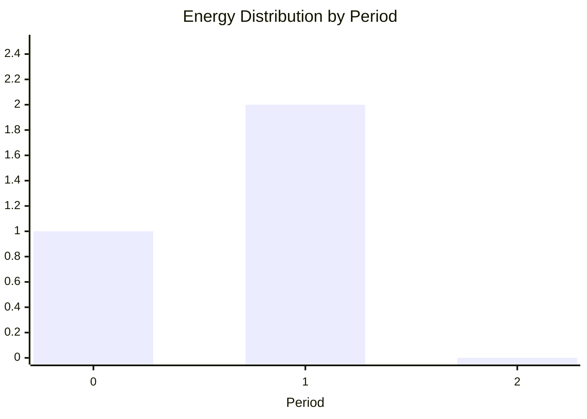

# Schedulable Load

A schedulable load models a deferrable energy consumer that must run for a fixed duration at a fixed power level, but the optimizer chooses when to start it within a scheduling window.

!!! note "Model Layer element"

    This page documents a **Model Layer** element—the building blocks of HAEO's linear programming formulation.
    Model Layer elements are composed by Device Layer elements through the adapter layer.

## Overview

The schedulable load element optimizes the start time of a fixed-duration, fixed-power consumption event.
Examples include:

- Electric vehicle charging sessions
- Pool pump cycles
- Dishwasher or washing machine runs
- Water heater boost cycles

The optimizer selects the optimal start time within a configurable window, allowing the load to run when energy prices are lowest or when excess solar generation is available.

## Model Formulation

The formulation uses period-boundary selection: one candidate start time per period boundary within the scheduling window.
For each candidate, the energy "smears in time" into the periods it overlaps with.
The constraint matrix has a consecutive-ones structure that often produces integer solutions from LP, though this is not guaranteed when additional constraints are present.

### Parameters

| Parameter      | Dimensions | Source        | Description                                                                      |
| -------------- | ---------- | ------------- | -------------------------------------------------------------------------------- |
| $P$            | scalar     | Configuration | Load power consumption (kW)                                                      |
| $d$            | scalar     | Configuration | Load run duration (hours)                                                        |
| $s_{\min}$     | scalar     | Configuration | Earliest allowed start time (hours from horizon start)                           |
| $s_{\max}$     | scalar     | Configuration | Latest allowed start time (hours from horizon start)                             |
| $\Delta t$     | $T$        | Configuration | Time period durations (hours)                                                    |
| `integer_mode` | enum       | Configuration | How to treat candidate selection variables (see below)                           |
| $b_t$          | $T+1$      | Derived       | Cumulative time at each boundary: $b_0 = 0$, $b_t = \sum_{i=0}^{t-1} \Delta t_i$ |

### Candidate Generation

Candidates are period boundaries within the scheduling window where the load can complete before the horizon ends:

$$
\mathcal{K} = \{ b_t : s_{\min} \leq b_t \leq s_{\max} \text{ and } b_t + d \leq H \}
$$

where $H = \sum \Delta t$ is the total horizon length.

### Energy Profiles

For each candidate start time $s_k$, precompute the energy consumed in each period:

$$
E_{k,t} = P \cdot \max\left(0, \min(b_{t+1}, s_k + d) - \max(b_t, s_k)\right)
$$

This is the overlap between the load's active window $[s_k, s_k + d]$ and the period $[b_t, b_{t+1}]$, multiplied by the power.

### Decision Variables

| Variable | Dimensions        | Domain   | Description                         |
| -------- | ----------------- | -------- | ----------------------------------- |
| $w_k$    | $\|\mathcal{K}\|$ | $[0,1]$  | Selection weight for candidate $k$  |
| $E_t$    | $T$               | $\geq 0$ | Energy consumed in period $t$ (kWh) |

Power consumption is computed from energy:

$$
P_t = E_t / \Delta t
$$

#### Integer Mode

The `integer_mode` parameter controls how $w_k$ variables are treated:

| Mode    | Variables                     | Overhead | Use Case                                               |
| ------- | ----------------------------- | -------- | ------------------------------------------------------ |
| `NONE`  | All continuous                | 1×       | Fastest, but may produce fractional solutions          |
| `FIRST` | First binary, rest continuous | ~1×      | **Default**. Crisp immediate decision, flexible future |
| `ALL`   | All binary                    | ~10×     | Guaranteed integer solutions in all cases              |

**When to use each mode**:

- **NONE**: Fastest option.
    LP may produce integer solutions depending on problem structure, but fractional results are possible when power limits, ramp constraints, or multiple loads interact.

- **FIRST** (default): Ensures the first candidate (current decision) is 0 or 1, while leaving future candidates continuous.
    Adds negligible overhead and handles most scenarios correctly.

- **ALL**: Guaranteed integer solutions for all candidates.
    Slower but eliminates any possibility of fractional scheduling.

See [Solver Philosophy](../../solver-philosophy.md) for background on LP vs MILP trade-offs.

### Constraints

#### 1. Selection Constraint

Exactly one candidate must be selected:

$$
\sum_{k \in \mathcal{K}} w_k = 1
$$

#### 2. Energy Balance Constraints

Energy in each period is determined by the selected candidate:

$$
E_t = \sum_{k \in \mathcal{K}} w_k \cdot E_{k,t} \quad \forall t \in [0, T-1]
$$

#### 3. Power Balance Constraint

Connection power is proportional to energy, linking the load to the network:

$$
P_{\text{connection}}(t) \cdot \Delta t = -E_t \quad \forall t \in [0, T-1]
$$

The negative sign reflects that the load consumes power from the network.

### LP Solution Properties

The constraint matrix has a consecutive-ones structure: each candidate $k$ affects a contiguous set of periods (those overlapping with $[s_k, s_k + d]$).

**In simple cases**: LP often produces integer solutions—exactly one $w_k = 1$ and all others $w_k = 0$.

**When LP may give fractional solutions**: Additional constraints can cause LP to spread selections across multiple candidates:

- Power limits on connections
- Ramp rate constraints
- Multiple loads sharing resources
- Energy caps or other coupling constraints

Use `integer_mode=FIRST` (default) to ensure crisp immediate decisions.
See [Solver Philosophy](../../solver-philosophy.md) for background on LP vs MILP trade-offs.

### Shadow Prices

| Constraint                       | Unit   | Interpretation                         |
| -------------------------------- | ------ | -------------------------------------- |
| `schedulable_load_choice`        | \$/kWh | Marginal value of selection constraint |
| `schedulable_load_power_balance` | \$/kW  | Marginal value of power at each period |

### Cost Contribution

The schedulable load has no inherent cost—it simply consumes power.
Costs are applied through the [Connection](../connections/index.md) elements linking the load to the network, where energy prices determine the optimal scheduling.

## Physical Interpretation

### Energy Distribution Across Periods

When a load starts at a period boundary, its energy distributes across the periods it overlaps.
Consider a 2 kW load running for 1.5 hours starting at hour 0.5:

| Period | Time  | Overlap | Energy  |
| ------ | ----- | ------- | ------- |
| 0      | 0–1 h | 0.5 h   | 1.0 kWh |
| 1      | 1–2 h | 1.0 h   | 2.0 kWh |
| 2      | 2–3 h | 0 h     | 0.0 kWh |

### Why Period-Boundary Selection Works

The formulation uses period boundaries as candidate start times because:

1. **Piecewise linear cost**: The cost function cost(s) is piecewise linear in the start time.
    Breakpoints occur at period boundaries where the energy profile changes.

2. **Sparse profiles**: Each candidate only affects a contiguous set of periods (those overlapping the load's active window).
    This creates a consecutive-ones matrix structure.

3. **Favorable LP structure**: The consecutive-ones structure often leads to integer LP solutions, reducing the need for binary variables in many cases.

### Example: Optimal Scheduling

Consider a 3 kW load running for 2 hours with periods of 1 hour each and connection costs of \$0.30, \$0.20, \$0.10, and \$0.25 per kWh respectively.

The optimizer chooses start time $s = 2.0$ hours to run during the cheapest periods (periods 2 and 3):

| Period | Interval | Energy (kWh) | Cost   |
| ------ | -------- | ------------ | ------ |
| 0      | 0–1 h    | 0            | \$0.00 |
| 1      | 1–2 h    | 0            | \$0.00 |
| 2      | 2–3 h    | 3.0          | \$0.30 |
| 3      | 3–4 h    | 3.0          | \$0.75 |

Total cost: 3.0 × \$0.10 + 3.0 × \$0.25 = \$1.05

### Model Assumptions

- **Fixed power**: The load runs at constant power $P$ when active
- **Fixed duration**: The load runs for exactly duration $d$ hours
- **Period-aligned starts**: Start time is restricted to period boundaries within the scheduling window
- **Single run**: The load runs once within the horizon (no repeated cycles)
- **No interruption**: Once started, the load runs to completion

### Limitations

- **Sub-period positioning**: Start times are restricted to period boundaries.
    Use finer time resolution near the present if precise timing matters.
- **Multi-phase loads**: Loads with variable power profiles during operation are not modeled (use multiple schedulable loads or forecast loads)
- **Recurring schedules**: For loads that run multiple times, create multiple schedulable load elements
- **Power ramping**: Instantaneous power transitions at start/end (physical ramp times not modeled)

## Next Steps

- :material-battery-charging:{ .lg .middle } **Battery model**

    ---

    See how batteries use similar cumulative energy tracking.

    [:material-arrow-right: Battery model](battery.md)

- :material-speedometer:{ .lg .middle } **Solver philosophy**

    ---

    Understand LP vs MILP trade-offs and when to use integer variables.

    [:material-arrow-right: Solver philosophy](../../solver-philosophy.md)

- :material-network:{ .lg .middle } **Network optimization**

    ---

    Understand how elements interact in the optimization.

    [:material-arrow-right: Network optimization overview](../../index.md)

- :material-code-braces:{ .lg .middle } **Implementation**

    ---

    View the source code for the schedulable load model.

    [:material-arrow-right: Source code](https://github.com/hass-energy/haeo/blob/main/custom_components/haeo/model/schedulable_load.py)

