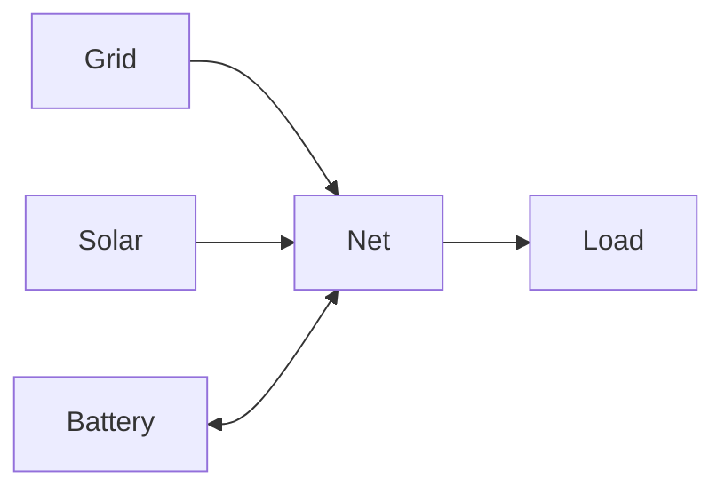
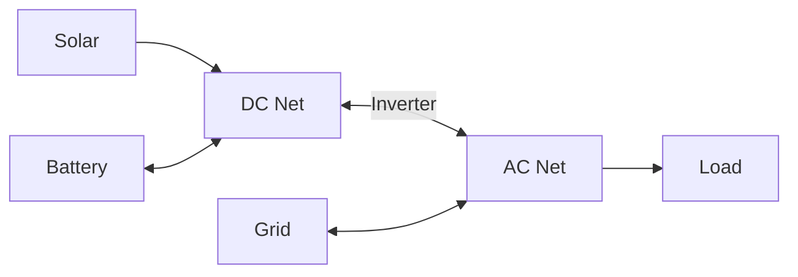

# Net Entity Modeling

Virtual balance nodes that enforce power conservation (Kirchhoff's law).

## Model Formulation

### Decision Variables

None - net entities only enforce constraints.

### Constraints

#### Power Balance

At each net entity and time step:

$$
\sum_{c \in \mathcal{C}_{\text{in}}} P_c(t) = \sum_{c \in \mathcal{C}_{\text{out}}} P_c(t)
$$

Where:

- $\mathcal{C}_{\text{in}}$: Inbound connections to net
- $\mathcal{C}_{\text{out}}$: Outbound connections from net
- $P_c(t)$: Power on connection $c$

## Physical Interpretation

**Virtual node**: Not a physical device, represents electrical junction.

**Kirchhoff's law**: Current in equals current out (applied to power).

**No storage**: Energy cannot accumulate at net (unlike battery).

## Use Cases

**Single net (simple)**:

Central hub where all entities connect.

**Dual net (AC/DC)**:

Separate buses with inverter connection between them.

## Configuration Impact

| Topology      | Complexity | Use When                         |
| ------------- | ---------- | -------------------------------- |
| Single net    | Simple     | Standard residential             |
| Multiple nets | Complex    | Hybrid inverters, multi-building |

**Well-formed network**: All entities must connect to at least one net, directly or indirectly.

## Related Documentation

- [Net Configuration](../user-guide/elements/net.md)
- [Modeling Overview](index.md)
- [Connection Modeling](connections.md)
- [Connections](connections.md)
