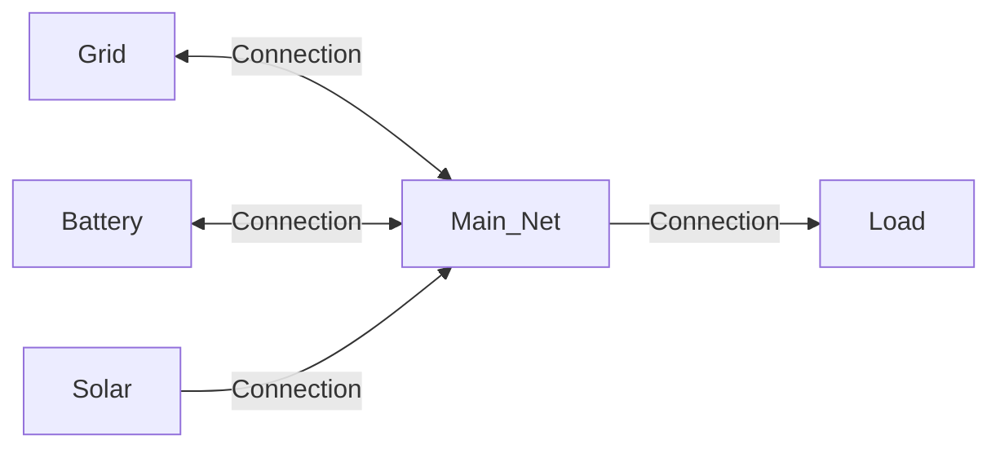
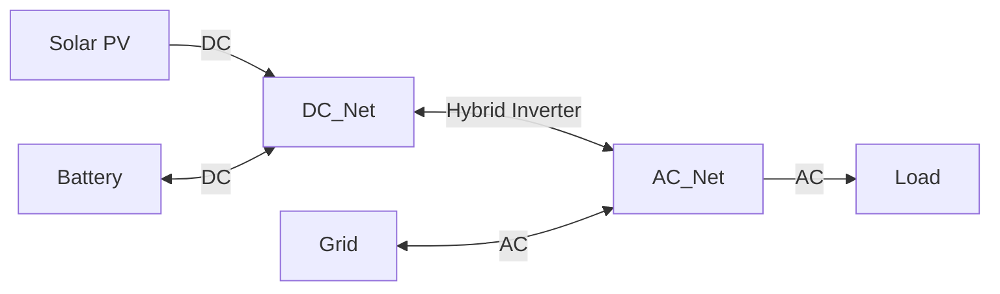
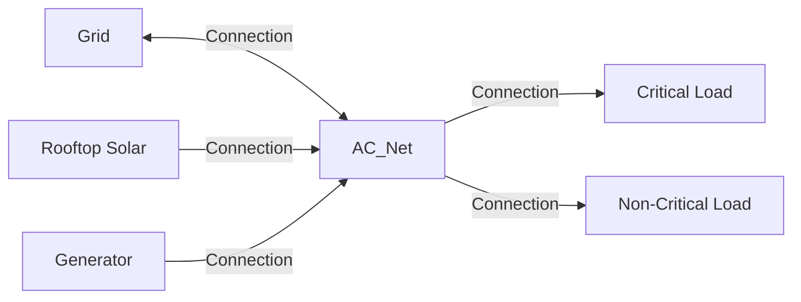
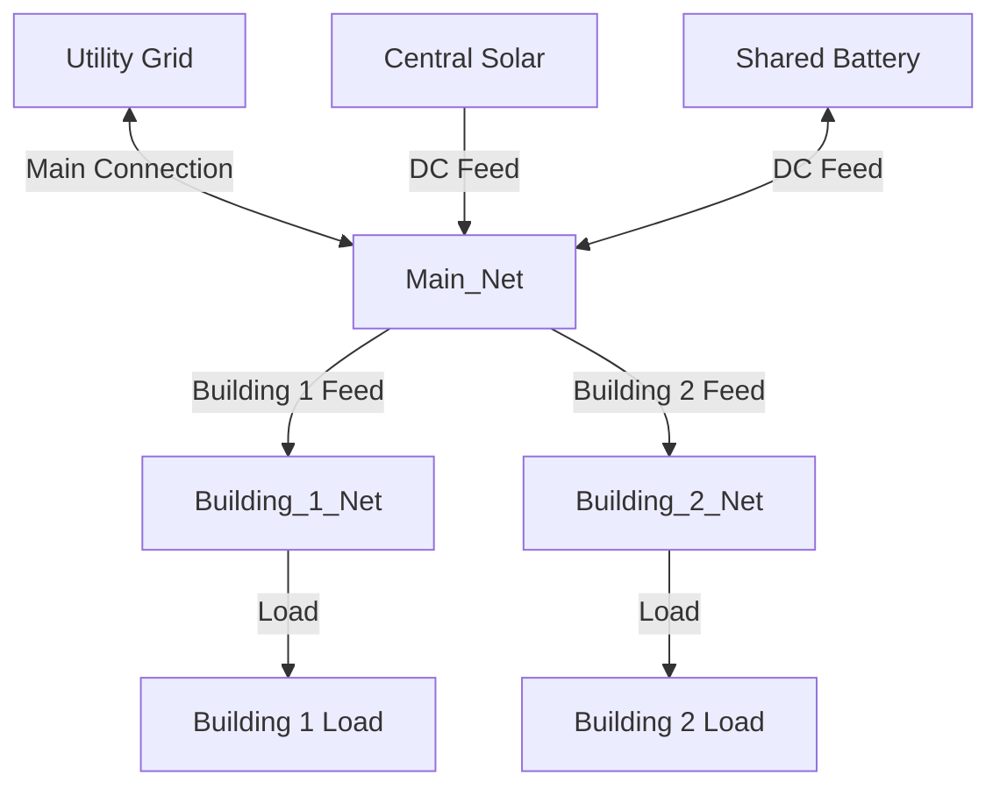
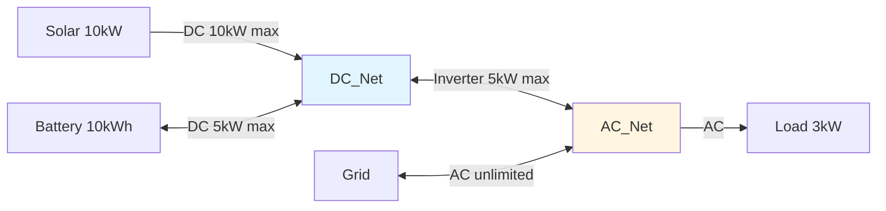

# Net Entity Modeling

This page explains how HAEO models net entities using linear programming.

## Overview

A net entity in HAEO is a **virtual node** that represents a power balance point in the network.
Unlike physical entities (batteries, grids, solar), net entities:

- **Have no physical properties**: No storage, no generation, no consumption
- **Enforce power balance**: Kirchhoff's current law at a point
- **Enable complex topologies**: Allow multiple entities to connect at a common point
- **Provide flexibility**: Model AC/DC separation, distribution hubs, connection points

Net entities are the "wiring" concept that allows HAEO to represent sophisticated electrical networks beyond simple star topologies.

## Model Formulation

### Decision Variables

**Net entities have NO decision variables**.

- They do not generate or consume power
- They do not store energy
- They simply connect other entities together
- All optimization happens in the connected entities and connections

### Parameters

Net entities require minimal configuration:

- $\text{name}$: Identifier for the net entity
- $\Delta t$: Time step duration (hours) - `period`
- $T$: Number of time periods - `n_periods`

That's it - no capacity, no power limits, no prices.

### Constraints

#### Power Balance Constraint

The fundamental constraint of a net entity is Kirchhoff's current law applied to power:

$$
\sum_{c \in \mathcal{C}_{\text{in}}} P_c(t) = \sum_{c \in \mathcal{C}_{\text{out}}} P_c(t) \quad \forall t
$$

Where:

- $\mathcal{C}_{\text{in}}$: Set of inbound connections (power flowing INTO the net)
- $\mathcal{C}_{\text{out}}$: Set of outbound connections (power flowing OUT OF the net)
- $P_c(t)$: Power flow on connection $c$ at time $t$ (kW)

**In words**: At every instant, the total power flowing into the net must equal the total power flowing out.

**Implementation**:

```python
for t in range(n_periods):
    inflow = sum(connection.power[t] for connection in net.inbound_connections)
    outflow = sum(connection.power[t] for connection in net.outbound_connections)
    problem += inflow == outflow, f"{net.name}_balance_{t}"
```

This constraint is added for every time step, ensuring power balance throughout the optimization horizon.

#### Connection Direction

Each connection has a defined direction:

- **Source → Target**: Power flows from source entity through net to target entity
- **Sign convention**: Positive $P_c(t)$ means power flows in the defined direction
- **Bidirectional**: Some connections allow negative power (flow reversal)

For a net entity:

- **Inbound connection**: Target is the net entity
- **Outbound connection**: Source is the net entity

### Cost Contribution

Net entities have **no direct cost**:

$$
C_{\text{net}} = 0
$$

They are purely topological constructs that enable other entities to interact.

## Physical Interpretation

### Electrical Circuit Analogy

Think of a net entity as a **junction** or **bus** in an electrical circuit:

```
        Grid
          |
          |
       [Net] <-- Virtual balance point
       /  |  \
      /   |   \
   Solar Batt Load
```

At the `[Net]` point:

- Power from Grid + Solar + Battery discharge = Load + Battery charge
- Kirchhoff's current law: $\sum I_{\text{in}} = \sum I_{\text{out}}$
- For power: $\sum P_{\text{in}} = \sum P_{\text{out}}$

### Real-World Analogies

**Electrical panel**: Your home's breaker panel

- Grid connection comes in
- Multiple circuits branch out
- Power balance is automatically maintained

**DC bus**: In a battery system

- Solar charge controller connects
- Battery connects
- Inverter draws power
- All share common voltage, balance power

**Distribution point**: In multi-building systems

- Main utility connection
- Branches to different buildings
- Central metering point

### Why Virtual?

Net entities are "virtual" because:

1. **No physical component**: Not a device you can touch
2. **No energy storage**: Power in = power out instantly
3. **No losses**: Ideal connection (losses modeled in connections if needed)
4. **Pure topology**: Defines network structure only

## Use Cases

### Use Case 1: Central Hub

**Scenario**: Single connection point for all entities



**Why needed**: Allows all four entities to interact at a common electrical point.

**Power balance**:

$$
P_{\text{grid}}(t) + P_{\text{solar}}(t) + P_{\text{battery\_discharge}}(t) = P_{\text{load}}(t) + P_{\text{battery\_charge}}(t)
$$

**Configuration**:

- Single net entity: `Main_Net`
- Four connections to the net
- Grid and battery are bidirectional (can source or sink)

### Use Case 2: AC/DC Separation

**Scenario**: Solar and battery on DC side, house load on AC side



**Why needed**: Models the physical electrical architecture with DC and AC sides separated by an inverter.

**Power balance on DC side**:

$$
P_{\text{solar}}(t) + P_{\text{battery\_discharge}}(t) = P_{\text{battery\_charge}}(t) + P_{\text{inverter}}(t)
$$

**Power balance on AC side**:

$$
P_{\text{inverter}}(t) + P_{\text{grid}}(t) = P_{\text{load}}(t)
$$

**Configuration**:

- Two net entities: `DC_Net` and `AC_Net`
- Hybrid inverter modeled as connection between them
- Connection may have power limits (inverter rating)

### Use Case 3: Multi-Source System

**Scenario**: Multiple generation sources with priority handling



**Why needed**: Single power balance point for diverse sources and multiple load types.

**Power balance**:

$$
P_{\text{grid}}(t) + P_{\text{solar}}(t) + P_{\text{gen}}(t) = P_{\text{critical}}(t) + P_{\text{noncritical}}(t)
$$

**Configuration**:

- Single AC net entity
- Three sources (grid, solar, generator)
- Two load types (critical, non-critical)

### Use Case 4: Complex Topology

**Scenario**: Building complex with multiple connection points



**Why needed**: Hierarchical network with multiple balance points.

**Power balance equations**:

At `Main_Net`:

$$
P_{\text{utility}}(t) + P_{\text{solar}}(t) + P_{\text{battery\_discharge}}(t) = P_{\text{B1\_feed}}(t) + P_{\text{B2\_feed}}(t) + P_{\text{battery\_charge}}(t)
$$

At `Building_1_Net`:

$$
P_{\text{B1\_feed}}(t) = P_{\text{load1}}(t)
$$

At `Building_2_Net`:

$$
P_{\text{B2\_feed}}(t) = P_{\text{load2}}(t)
$$

## Implementation Details

### Network Validation

HAEO validates the network structure before optimization:

**Checks performed**:

1. **No isolated nets**: Every net must have at least one connection
2. **Connected graph**: Network forms a connected graph
3. **No duplicate connections**: Each source-target pair is unique
4. **Valid references**: All connection endpoints reference existing entities

**Why validation matters**: An invalid network structure would create infeasible optimization problems.

### Constraint Generation

For each net entity, HAEO generates $T$ power balance constraints (one per time step).

**Computational impact**:

- Net entities are "cheap" computationally
- Each adds $T$ constraints (very simple equality constraints)
- No variables added
- Minimal impact on solve time

### Integration with Connections

Net entities work through connections:

1. **Connection creation**: Define source and target entities
2. **Power flow variables**: Connection creates $P_c(t)$ variables
3. **Balance constraints**: Net entity references connection power variables
4. **Optimization**: Solver determines power flows that satisfy all balances

## Example: Home System with Separate DC Bus

Consider a home with a hybrid inverter system:

**Physical setup**:

- 10 kW solar array (DC)
- 10 kWh battery (DC)
- 5 kW hybrid inverter
- Grid connection (AC)
- 3 kW average load (AC)

**HAEO configuration**:

- **DC_Net**: Connects solar and battery
- **AC_Net**: Connects grid and load
- **Hybrid Inverter Connection**: Between DC_Net and AC_Net (5 kW max)

**Network diagram**:



**Power balance equations**:

At DC_Net:

$$
P_{\text{solar}}(t) + P_{\text{battery\_discharge}}(t) = P_{\text{battery\_charge}}(t) + P_{\text{inverter\_to\_AC}}(t)
$$

At AC_Net:

$$
P_{\text{inverter\_from\_DC}}(t) + P_{\text{grid\_import}}(t) = P_{\text{load}}(t) + P_{\text{grid\_export}}(t)
$$

Inverter constraint (bidirectional connection):

$$
-5 \leq P_{\text{inverter}}(t) \leq 5 \quad \text{(kW)}
$$

- Positive: DC to AC (inverting)
- Negative: AC to DC (rare, only if inverter supports bidirectional operation)

**Optimization behavior**:

1. **Sunny day, low load**:

    - Solar generates 8 kW (DC_Net)
    - Load needs 3 kW (AC_Net)
    - Inverter transfers 3 kW DC→AC for load
    - Remaining 5 kW charges battery (DC_Net)

2. **Night, high load**:

    - Solar generates 0 kW
    - Load needs 5 kW (AC_Net)
    - Inverter at max 5 kW DC→AC
    - Battery discharges 5 kW (DC_Net)

3. **Evening peak pricing**:
    - Solar generates 2 kW (DC_Net)
    - Load needs 6 kW (AC_Net)
    - Battery discharges 3 kW (DC_Net)
    - Inverter transfers 5 kW DC→AC (max)
    - Grid imports 1 kW (AC_Net)

## Numerical Considerations

### Units

Net entities have no units (they're topological):

- Power balance uses kW
- Time uses hours
- No energy or capacity

### Solver Performance

Net entities have minimal solver impact:

- **Added constraints**: $T$ equality constraints per net
- **No variables**: Net entities don't create variables
- **Sparse matrices**: Each constraint references only connected variables
- **Fast solving**: Equality constraints are efficient for solvers

**Scaling**: You can have many net entities without significant performance impact.

### Network Complexity

More complex networks (more nets) provide:

- ✅ More accurate physical modeling
- ✅ Better representation of real systems
- ❌ More complex configuration
- ❌ Harder to debug

**Best practice**: Use the simplest topology that accurately represents your system.

## Configuration Impact

### Single Net vs Multiple Nets

**Single net (simple)**:

- ✅ Easy to configure
- ✅ Simple to understand
- ✅ Sufficient for most home systems
- ❌ Cannot model AC/DC separation
- ❌ Cannot represent complex topologies

**Multiple nets (complex)**:

- ✅ Accurate physical modeling
- ✅ Handles AC/DC systems properly
- ✅ Supports hierarchical structures
- ❌ More configuration overhead
- ❌ Requires understanding of network topology

### Net Naming

Good net entity names:

- `Main_Net`: Central connection point
- `DC_Bus`: DC side of hybrid inverter
- `AC_Panel`: AC distribution panel
- `Building_A_Net`: Specific building connection

Bad names:

- `Net1`, `Net2`: Not descriptive
- `Battery_Net`: Misleading (net isn't owned by battery)

### Troubleshooting

**Infeasible optimization with nets**:

1. Check all entities are connected
2. Verify connection directions are correct
3. Ensure at least one net has a grid or unlimited source
4. Check for isolated sub-networks

**Unbalanced power errors**:

1. Verify connection endpoints reference correct entities
2. Check for missing connections
3. Ensure loads are not too large for sources

## Related Documentation

- [Net Entity Configuration Guide](../user-guide/entities/net.md) - User-facing configuration
- [Power Balance](power-balance.md) - Detailed power balance mathematics
- [Connection Modeling](connections.md) - How connections work with nets
- [Network Architecture](../developer-guide/architecture.md) - System structure

## Next Steps

Explore related modeling topics:

- [Connection Modeling](connections.md) - How power flows between entities
- [Power Balance](power-balance.md) - Graph structure and Kirchhoff's law
- [Battery Modeling](battery.md) - Example of entity that connects to nets

[:octicons-arrow-right-24: Continue to Connection Modeling](connections.md)
