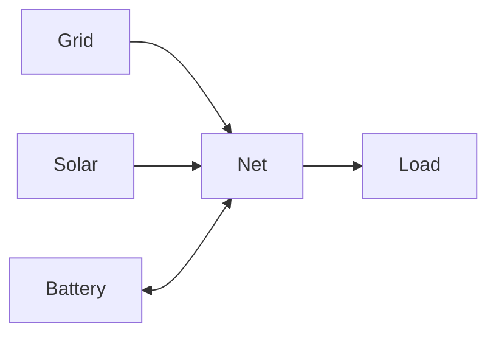
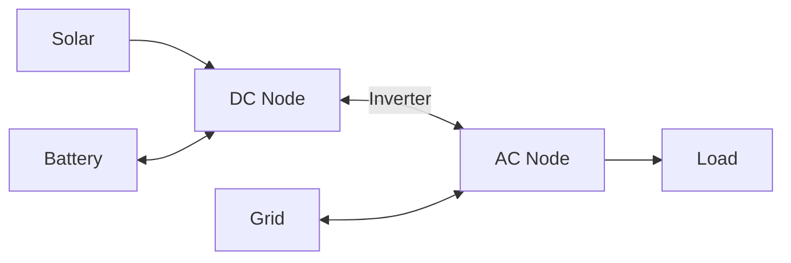

# Node Modeling

Virtual balance nodes that enforce power conservation (Kirchhoff's law).

## Model Formulation

### Decision Variables

None - nodes only enforce constraints.

### Constraints

#### Power Balance

At each node and time step:

$$
\sum_{c \in \mathcal{C}_{\text{in}}} P_c(t) = \sum_{c \in \mathcal{C}_{\text{out}}} P_c(t)
$$

Where:

- $\mathcal{C}_{\text{in}}$: Inbound connections to node
- $\mathcal{C}_{\text{out}}$: Outbound connections from node
- $P_c(t)$: Power on connection $c$

## Physical Interpretation

**Virtual node**: Not a physical device, represents electrical junction.

**Kirchhoff's law**: Current in equals current out (applied to power).

**No storage**: Energy cannot accumulate at a node (unlike battery).

## Use Cases

**Single net (simple)**:

Central hub where all elements connect.

**Dual node (AC/DC)**:

Separate buses with inverter connection between them.

## Configuration Impact

| Topology       | Complexity | Use When                         |
| -------------- | ---------- | -------------------------------- |
| Single node    | Simple     | Standard residential             |
| Multiple nodes | Complex    | Hybrid inverters, multi-building |

**Well-formed network**: All elements must connect to at least one node, directly or indirectly.

## Related Documentation

- [Node Configuration](../user-guide/elements/node.md)
- [Modeling Overview](index.md)
- [Connection Modeling](connections.md)
- [Connections](connections.md)
