# Photovoltaics Modeling

This page explains how HAEO models solar photovoltaic generation using linear programming.

## Overview

A photovoltaics system in HAEO represents solar generation with:

- **Generation forecasting**: Expected solar power output from weather-based forecasts
- **Optional curtailment**: Ability to reduce generation below forecast when economically beneficial
- **Production pricing**: Optional value/cost per kWh of generation
- **Zero fuel cost**: Solar generation itself has no variable operating cost (except optional pricing)

Solar systems are unique in HAEO because they are primarily forecast-driven rather than controllable, with the exception of curtailment when enabled.

## Model Formulation

### Decision Variables

The decision variables depend on whether curtailment is enabled:

**Without curtailment** (default):

- No decision variables - power output is fixed to forecast
- $P_{\text{solar}}(t) = P_{\text{forecast}}(t)$ (constant parameter)

**With curtailment enabled**:

- $P_{\text{solar}}(t)$: Actual solar generation (kW) - implemented as `{name}_power_{t}`
- This is an optimization variable bounded by the forecast

The curtailment flag fundamentally changes whether solar generation is fixed or optimizable.

### Parameters

The photovoltaics model requires these configuration parameters:

- $P_{\text{forecast}}(t)$: Forecasted solar power at time $t$ (kW) - from `forecast` sensors
- $c_{\text{production}}$: Optional production price (\$/kWh) - `production_price` (default: 0)
- $c_{\text{consumption}}$: Optional consumption price (\$/kWh) - `price_consumption` (rarely used)
- $\text{curtailment}$: Boolean flag - `curtailment` (default: false)
- $\Delta t$: Time step duration (hours) - `period`

**Production price usage**: Can represent:

- Feed-in tariff value (positive: generation has value)
- Solar contract costs (negative: generation has cost)
- Typically left at 0 (generation is "free")

### Constraints

#### Fixed Generation (No Curtailment)

When curtailment is disabled, generation must equal the forecast:

$$
P_{\text{solar}}(t) = P_{\text{forecast}}(t) \quad \forall t
$$

This is the default mode and represents a system where you cannot control solar output.

**Implementation**: The forecast values are used directly as constants, not variables:

```python
power_production = forecast  # List of constant values
```

#### Curtailment Constraints

When curtailment is enabled, generation can be reduced but not exceeded:

$$
0 \leq P_{\text{solar}}(t) \leq P_{\text{forecast}}(t) \quad \forall t
$$

**Physical interpretation**: You can turn down or turn off solar generation (e.g., by limiting inverter output), but you cannot generate more than the available sunlight.

**Implementation**: Variables are created with the forecast as upper bounds:

```python
power_production = [
    LpVariable(name=f"{name}_power_{i}", lowBound=0, upBound=forecast[i])
    for i in range(n_periods)
]
```

The optimizer determines optimal generation at each time step, potentially curtailing to avoid negative-value exports.

### Cost Contribution

Solar generation contributes to the objective function if production pricing is configured:

$$
C_{\text{solar}} = \sum_{t=0}^{T-1} P_{\text{solar}}(t) \cdot c_{\text{production}} \cdot \Delta t
$$

**Sign conventions**:

- **Positive** $c_{\text{production}}$: Generation has a cost (unusual, but models some contracts)
- **Negative** $c_{\text{production}}$: Generation has value (like a feed-in tariff offset)
- **Zero** (default): Generation is free, value comes from offsetting grid import

Most configurations use $c_{\text{production}} = 0$ because the value is already captured in reduced grid import costs or grid export revenue.

This is implemented as:

```python
if price_production is not None:
    for t in range(n_periods):
        objective += power_production[t] * price_production * period
```

## Physical Interpretation

### Solar Generation

Solar panels convert sunlight to electricity:

- **Morning**: Generation ramps up as sun rises
- **Midday**: Peak generation during maximum irradiance
- **Afternoon**: Generation ramps down as sun sets
- **Night**: Zero generation

The forecast captures expected generation based on:

- Historical weather patterns
- Cloud cover predictions
- System tilt and orientation
- Panel efficiency and degradation
- Temperature effects

### When Curtailment Occurs

HAEO will curtail solar generation when:

1. **Negative export prices**: Grid operator pays you to NOT export

    - $p_{\text{export}}(t) < 0$
    - Better to curtail than pay to export

2. **Export limits exceeded**: Grid connection cannot handle all solar power

    - $P_{\text{solar}}(t) + P_{\text{battery\_discharge}}(t) > P_{\text{export}}^{\max}$
    - Curtail to stay within limits

3. **Battery full + low load**: No local use for excess generation
    - Battery at maximum SOC
    - Load is fully met
    - Export is less valuable than potential future import savings
    - Rare in practice - usually export is better than curtailment

**Key insight**: Curtailment is an economic decision made by the optimizer, not a physical limitation.

### Power Balance Integration

Solar generation participates in network power balance as:

- **Power production**: Supplies power to the network
- **Cannot consume**: Unidirectional flow

From the network perspective:

$$
P_{\text{solar}}(t) \geq 0 \quad \text{(always producing or zero)}
$$

## Example: Solar System with Negative Export Prices

Consider a scenario where grid export prices occasionally go negative (you pay to export):

**System configuration**:

- 10 kW solar array
- Forecast: 8 kW peak generation at noon
- Grid export limit: 5 kW
- Curtailment: enabled

**Price schedule**:

| Time        | Import Price | Export Price | Condition                  |
| ----------- | ------------ | ------------ | -------------------------- |
| 06:00-12:00 | \$0.20/kWh   | \$0.08/kWh   | Normal: Export excess      |
| 12:00-14:00 | \$0.20/kWh   | -\$0.05/kWh  | Negative: Curtail excess   |
| 14:00-18:00 | \$0.20/kWh   | \$0.08/kWh   | Normal: Export excess      |
| Load        | 3 kW         | constant     | Typical daytime background |

```mermaid
gantt
    title Solar Generation with Curtailment
    dateFormat HH:mm
    axisFormat %H:%M

    section Export Price
    Normal $0.08: 06:00, 12:00
    Negative -$0.05: 12:00, 14:00
    Normal $0.08: 14:00, 18:00

    section Solar Strategy
    Generate 6kW (Ramping): 06:00, 09:00
    Generate 8kW (Peak): 09:00, 12:00
    Curtail to 3kW: 12:00, 14:00
    Generate 6kW (Ramping): 14:00, 18:00

    section Power Flow
    Export 3kW: 06:00, 09:00
    Export 5kW (Max): 09:00, 12:00
    Zero Export: 12:00, 14:00
    Export 3kW: 14:00, 18:00
```



### Optimization Logic

**06:00-12:00** (Normal export):

- Forecast: 6-8 kW
- Load: 3 kW
- Strategy: Generate at full forecast
    - Self-consume: 3 kW
    - Export: 3-5 kW (at \$0.08/kWh)
- Revenue: $(3 \text{ kW} \times 6 \text{ h} + 5 \text{ kW} \times 3 \text{ h}) \times 0.08 = \$2.64$

**12:00-14:00** (Negative export):

- Forecast: 8 kW
- Load: 3 kW
- Strategy: Curtail to 3 kW (match load exactly)
    - Self-consume: 3 kW
    - Export: 0 kW
    - Curtailment: 5 kW
- Benefit: Avoid paying $5 \text{ kW} \times 2 \text{ h} \times 0.05 = \$0.50$

**14:00-18:00** (Normal export):

- Forecast: 6-4 kW (ramping down)
- Load: 3 kW
- Strategy: Generate at full forecast
    - Self-consume: 3 kW
    - Export: 1-3 kW (at \$0.08/kWh)
- Revenue: $(3 \text{ kW} \times 4 \text{ h}) \times 0.08 = \$0.96$

**Total benefit**: $\$2.64 + \$0.50 + \$0.96 = \$4.10$

**Without curtailment**: Would pay $\$0.50$ to export during negative pricing → Only $\$3.60$ net

## Numerical Considerations

### Units

HAEO uses kW for power and kWh for energy:

- **Power**: 8 kW (not 8000 W)
- **Energy**: 40 kWh = 8 kW × 5 hours
- **Time**: hours (not seconds)

This maintains consistent units across all components.

### Forecast Integration

Solar forecasts must:

- Cover the entire optimization horizon
- Match the number of time periods
- Be in kW (not W or kWh)
- Account for system losses (inverter efficiency, soiling, etc.)

**Forecast sources**:

- Solcast Solar Forecast integration
- Open-Meteo Solar Forecast integration
- Custom sensors from weather APIs

**Forecast validation**:

```python
if len(forecast) != n_periods:
    raise ValueError(f"forecast length must match n_periods")
```

### Solver Considerations

**Without curtailment**:

- Solar generation is a constant parameter
- Simplest model - no additional variables
- Fastest to solve

**With curtailment**:

- Adds $T$ decision variables (one per time step)
- Adds $2T$ constraints (lower and upper bounds)
- Slightly more complex but usually negligible impact
- Only use if curtailment control is available

## Configuration Impact

### Curtailment Setting

**Disabled (default)**:

- ✅ Simpler model
- ✅ Faster optimization
- ✅ Represents most real systems accurately
- ❌ Cannot handle negative export prices optimally
- Use when: No inverter control or negative prices never occur

**Enabled**:

- ✅ Handles negative export prices
- ✅ Respects export limits better
- ✅ Optimizes inverter throttling
- ❌ Slightly more complex model
- Use when: Inverter supports curtailment control

### Production Price

**Zero (default)**:

- Solar value is implicit in grid cost reduction
- Most common configuration
- Clear separation: solar generates, grid/battery handle economics

**Positive value** (e.g., \$0.10/kWh):

- Models feed-in tariff separate from export price
- Useful for guaranteed solar payments
- Can represent renewable energy certificate values

**Negative value** (unusual):

- Models solar contract costs
- Rare but possible in some commercial arrangements

### Forecast Accuracy

Forecast errors impact optimization quality:

**Overestimated generation**:

- HAEO expects more solar than occurs
- May undercharge battery in anticipation
- May schedule too much export

**Underestimated generation**:

- HAEO expects less solar than occurs
- May import unnecessarily
- May not fully utilize battery

**Best practice**: Use high-quality forecast integrations and validate against actual generation over time.

## Related Documentation

- [Photovoltaics Configuration Guide](../user-guide/entities/photovoltaics.md) - User-facing configuration
- [Grid Modeling](grid.md) - How solar interacts with grid pricing
- [Battery Modeling](battery.md) - How solar charges batteries
- [Objective Function](objective-function.md) - How production costs contribute

## Next Steps

Explore related modeling topics:

- [Load Modeling](loads.md) - Consumption that solar can offset
- [Battery Modeling](battery.md) - Storage for excess solar
- [Power Balance](power-balance.md) - How solar integrates with the network

[:octicons-arrow-right-24: Continue to Load Modeling](loads.md)
