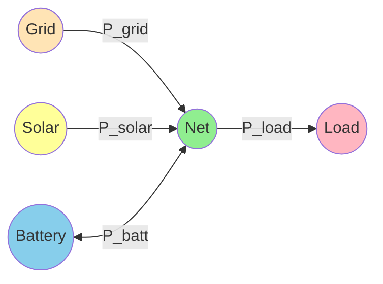
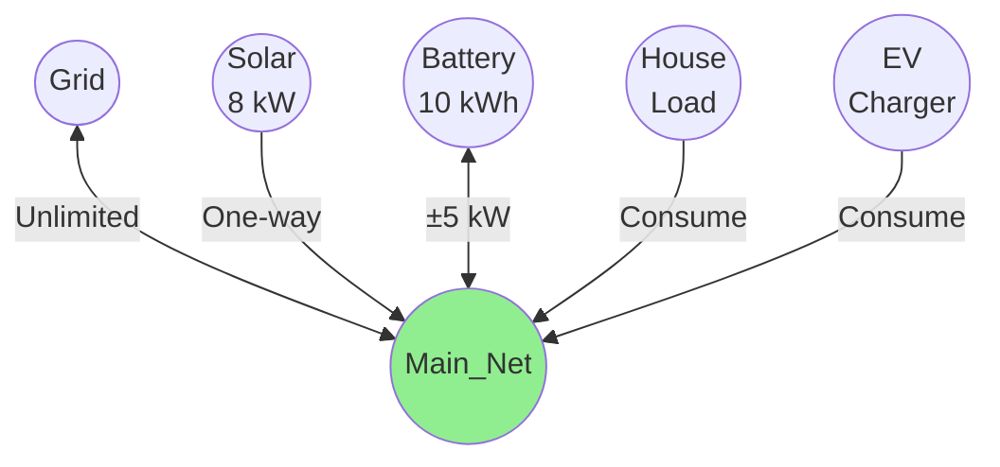
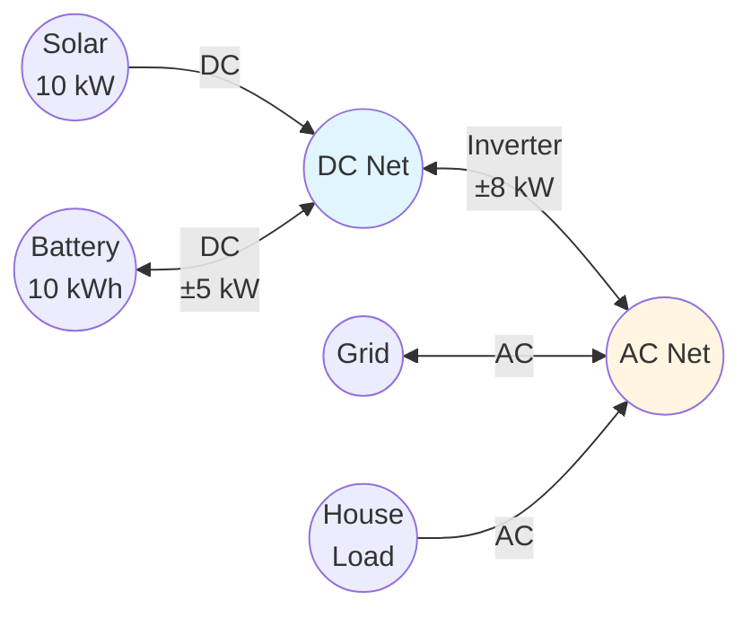
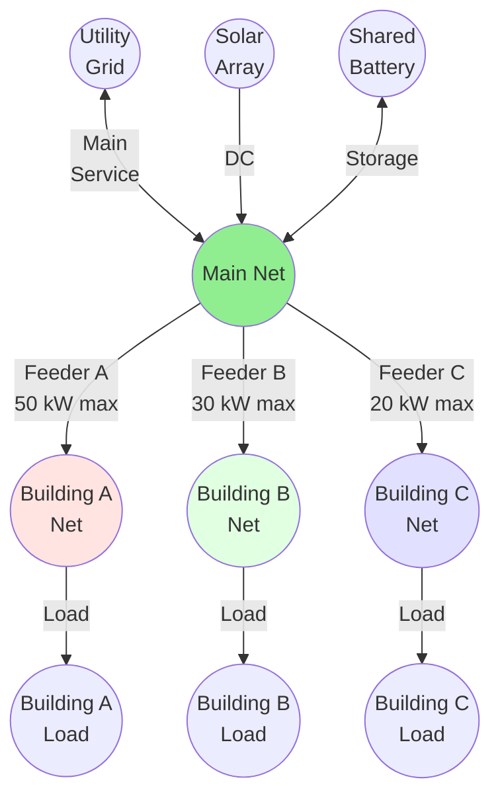
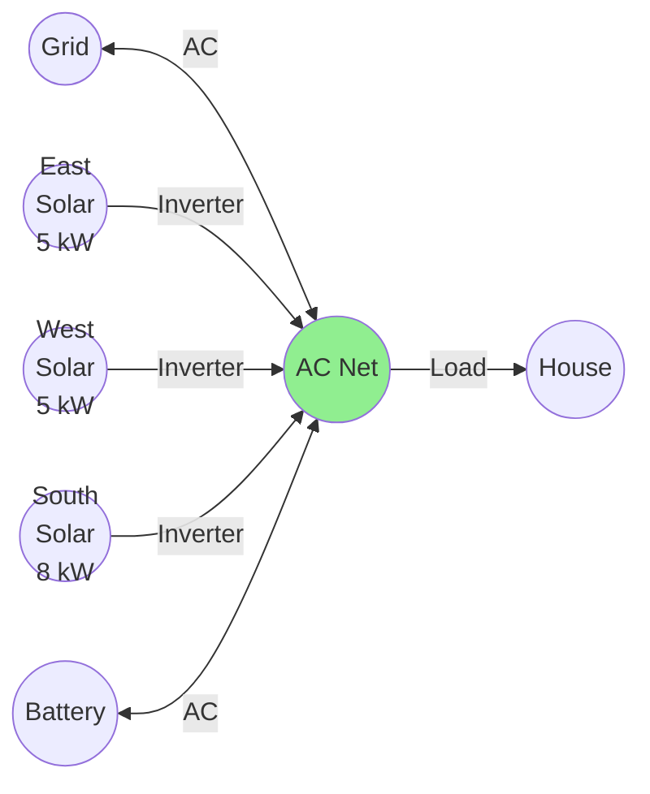
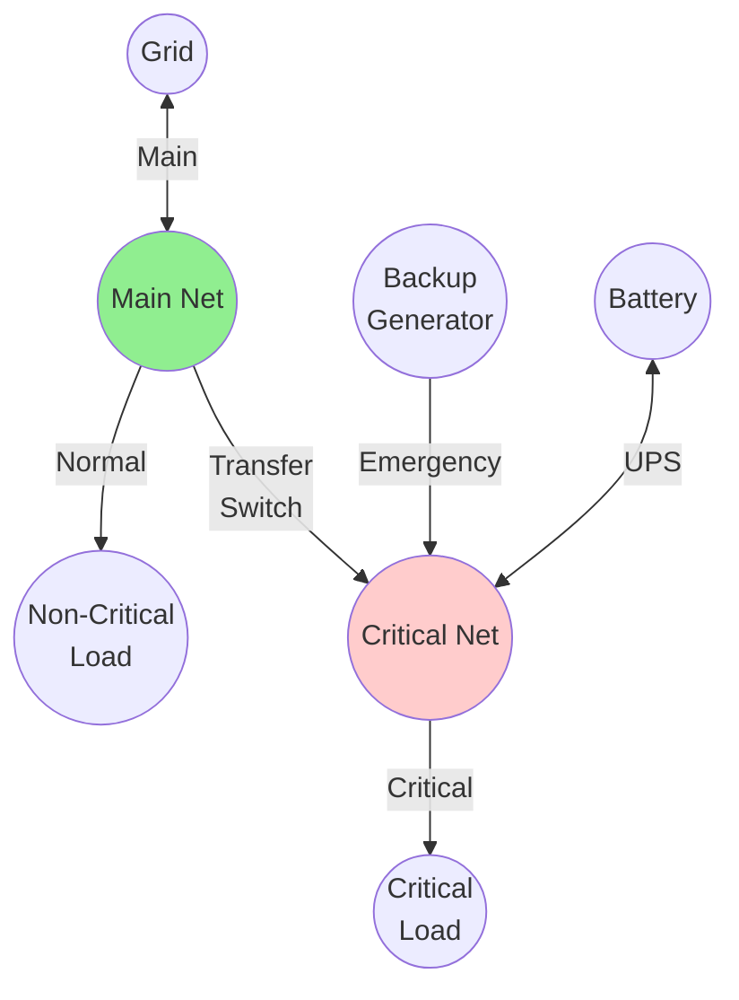

# Power Balance and Network Structure

This page explains how HAEO models the network graph structure and enforces power balance using Kirchhoff's current law.

## Overview

Power balance is the fundamental physical constraint that ensures **energy conservation** in HAEO's electrical network model.

Key concepts:

- **Kirchhoff's Current Law**: Current (power) flowing into a node equals current flowing out
- **Graph representation**: Network topology as nodes (entities) and edges (connections)
- **No energy storage at nodes**: Power in equals power out at every instant (except batteries)
- **Applied at net entities**: Balance points in the network where power flows converge

Power balance is what makes HAEO's optimization physically realizable - without it, solutions could violate conservation of energy.

## Graph Structure

HAEO represents your energy system as a **directed graph**:

### Nodes (Vertices)

**Entity nodes**: Physical components

- Battery: Can produce or consume power, stores energy
- Grid: Can produce (import) or consume (export) power
- Solar: Produces power
- Load: Consumes power
- **Net Entity**: Virtual node enforcing power balance

**Net entities are special**: They represent electrical junctions where power balance is enforced.

### Edges

**Connections**: Directed power flow paths

- **Direction**: Source → Target
- **Power variable**: $P_c(t)$ on connection $c$
- **Sign convention**: Positive = flow from source to target
- **Bidirectional**: Negative $P_c(t)$ means reverse flow (if allowed)

### Example: Simple System Graph



**Graph properties**:

- 5 nodes (4 entities + 1 net)
- 4 directed edges (connections)
- Net is the balance point

## Power Balance Constraint

### Fundamental Equation

At each net entity and every time step:

$$
\sum_{c \in \mathcal{C}_{\text{in}}} P_c(t) = \sum_{c \in \mathcal{C}_{\text{out}}} P_c(t)
$$

Where:

- $\mathcal{C}_{\text{in}}$: Set of inbound connections to the net
- $\mathcal{C}_{\text{out}}$: Set of outbound connections from the net
- $P_c(t)$: Power on connection $c$ at time $t$

**In words**: Total power flowing INTO a net entity equals total power flowing OUT.

### Kirchhoff's Current Law

Power balance is the electrical equivalent of Kirchhoff's Current Law:

$$
\sum I_{\text{in}} = \sum I_{\text{out}}
$$

For power at constant voltage:

$$
P = V \cdot I \implies \sum P_{\text{in}} = \sum P_{\text{out}}
$$

This is a fundamental law of electrical circuits - charge (and thus energy) cannot accumulate at a node.

### Applied to Simple System

For the example system above:

$$
P_{\text{grid}}(t) + P_{\text{solar}}(t) + P_{\text{batt,discharge}}(t) = P_{\text{load}}(t) + P_{\text{batt,charge}}(t)
$$

**Rearranged**:

$$
\underbrace{P_{\text{grid}}(t) + P_{\text{solar}}(t)}\_{\text{Generation}} = \underbrace{P_{\text{load}}(t)}\_{\text{Consumption}} + \underbrace{P_{\text{batt,charge}}(t) - P_{\text{batt,discharge}}(t)}\_{\text{Net Storage}}
$$

This must hold at every time step $t$.

## Implementation

### Network Building

HAEO builds the power balance constraints during network setup:

```python
def build_power_balance_constraints(net_entity):
    """Add power balance constraints for a net entity."""
    constraints = []

    for t in range(n_periods):
        # Sum inbound connection power flows
        inflow = lpSum([
            connection.power[t]
            for connection in net_entity.inbound_connections
        ])

        # Sum outbound connection power flows
        outflow = lpSum([
            connection.power[t]
            for connection in net_entity.outbound_connections
        ])

        # Enforce balance at this time step
        constraints.append(inflow == outflow)

    return constraints
```

### Connection Direction

Each connection has a defined source and target:

- **Inbound to net**: Connection where net is the **target**
- **Outbound from net**: Connection where net is the **source**

**Example**:

- Connection `Solar → Net`: Inbound to Net (solar supplies power TO net)
- Connection `Net → Load`: Outbound from Net (net supplies power TO load)

### Sign Conventions

**Positive power flow**: Flows in defined direction (source → target)

- Solar → Net: +5 kW means 5 kW from solar to net
- Net → Load: +3 kW means 3 kW from net to load

**Negative power flow**: Reverses direction (only if connection allows)

- Battery ↔ Net: -2 kW means 2 kW from net to battery (charging)

## Complex Topology Examples

### Example 1: Star Topology (Single Net)

**Most common configuration**: Everything connects to one central net.



**Power balance equation**:

$$
P_{\text{grid}}(t) + P_{\text{solar}}(t) + P_{\text{batt,out}}(t) = P_{\text{house}}(t) + P_{\text{ev}}(t) + P_{\text{batt,in}}(t)
$$

Where:

- $P_{\text{batt,out}}$: Battery discharge (net consuming from battery)
- $P_{\text{batt,in}}$: Battery charge (net supplying to battery)

**Characteristics**:

- ✅ Simple configuration
- ✅ Single balance equation per time step
- ✅ Easy to understand and debug
- ✅ Sufficient for most residential systems

### Example 2: AC/DC Separation (Dual Net)

**Hybrid inverter system**: Separate DC and AC buses.



**Power balance equations**:

At DC_Net:

$$
P_{\text{solar}}(t) + P_{\text{batt,discharge}}(t) = P_{\text{inverter,to\_AC}}(t) + P_{\text{batt,charge}}(t)
$$

At AC_Net:

$$
P_{\text{inverter,from\_DC}}(t) + P_{\text{grid,import}}(t) = P_{\text{load}}(t) + P_{\text{grid,export}}(t)
$$

Inverter constraint (connection between nets):

$$
-8 \leq P_{\text{inverter}}(t) \leq 8 \quad \text{(kW)}
$$

**Characteristics**:

- ✅ Models real hybrid inverter architecture
- ✅ Captures inverter power limits
- ✅ Separates DC and AC concerns
- ❌ More complex configuration

### Example 3: Multi-Building System (Hierarchical)

**Commercial/campus system**: Multiple buildings with shared generation.



**Power balance equations**:

At Main_Net:

$$
P_{\text{grid}}(t) + P_{\text{solar}}(t) + P_{\text{batt,out}}(t) = P_{\text{feederA}}(t) + P_{\text{feederB}}(t) + P_{\text{feederC}}(t) + P_{\text{batt,in}}(t)
$$

At Building_A_Net:

$$
P_{\text{feederA}}(t) = P_{\text{loadA}}(t)
$$

Similarly for Buildings B and C.

**Feeder constraints**:

$$
\begin{align}
0 \leq P_{\text{feederA}}(t) &\leq 50 \\
0 \leq P_{\text{feederB}}(t) &\leq 30 \\
0 \leq P_{\text{feederC}}(t) &\leq 20
\end{align}
$$

**Characteristics**:

- ✅ Models physical distribution hierarchy
- ✅ Captures feeder capacity limits
- ✅ Enables load balancing optimization
- ❌ Complex configuration
- ❌ More constraints (but still efficient)

### Example 4: Parallel Generation Sources

**Multiple solar arrays**: Different orientations/tracking.



**Power balance equation**:

$$
\begin{align}
& P_{\text{grid}}(t) + P_{\text{east}}(t) + P_{\text{west}}(t) + P_{\text{south}}(t) + P_{\text{batt,out}}(t) \\
& \quad = P_{\text{load}}(t) + P_{\text{batt,in}}(t)
\end{align}
$$

**Why multiple arrays?**:

- Different sun exposure (east gets morning, west gets afternoon)
- Better total daily generation
- Each has its own forecast sensor

**Characteristics**:

- ✅ Optimizes across generation profiles
- ✅ Each array can be curtailed independently (if enabled)
- ✅ More accurate modeling
- ✅ Minimal added complexity

### Example 5: Islanded Subsystem

**Emergency backup**: Critical loads with dedicated power.



**Power balance equations**:

At Main_Net (normal operation):

$$
P_{\text{grid}}(t) = P_{\text{nc\_load}}(t) + P_{\text{transfer}}(t)
$$

At Critical_Net:

$$
P_{\text{transfer}}(t) + P_{\text{generator}}(t) + P_{\text{batt,out}}(t) = P_{\text{c\_load}}(t) + P_{\text{batt,in}}(t)
$$

Transfer switch constraint (either grid or generator, not both):

$$
\begin{cases}
P_{\text{transfer}}(t) > 0, & P_{\text{generator}}(t) = 0 \quad \text{(normal)} \\
P_{\text{transfer}}(t) = 0, & P_{\text{generator}}(t) > 0 \quad \text{(backup)}
\end{cases}
$$

**Note**: This mutual exclusivity requires additional logic not shown here (MIP formulation).

## Network Validation

HAEO validates the network structure before optimization to ensure solvability:

### Connectivity Checks

**Every net must have connections**:

- At least one inbound OR outbound connection
- Prevents isolated nets (infeasible)

```python
for net in net_entities:
    if len(net.inbound) == 0 and len(net.outbound) == 0:
        raise ValueError(f"Net '{net.name}' is isolated")
```

**Connected graph**:

- All entities reachable from each other
- No disconnected subgraphs (usually unintended)

### Source Availability

**At least one unlimited source**:

- Grid with no import limit, OR
- Very large import limit relative to loads

Prevents infeasibility when loads exceed limited generation.

### Balance Feasibility

**Load cannot exceed maximum supply**:

- Sum of all generation + grid import ≥ sum of all loads
- Checked at each time step

## Numerical Considerations

### Constraint Count

Each net entity adds $T$ power balance constraints (one per time step):

**Example**: 48-hour horizon, 5-minute periods:

- $T = 576$ time steps
- 3 net entities
- Total: $3 \times 576 = 1728$ power balance constraints

**Solver efficiency**: Equality constraints are very efficient for LP solvers.

### Sparse Matrices

Power balance constraints create **sparse matrices**:

- Each constraint references only connections to that specific net
- Most entries in constraint matrix are zero
- Modern solvers exploit sparsity for speed

### Feasibility vs Optimality

**Feasible solution**: Satisfies all power balance constraints (and other constraints)

**Optimal solution**: Feasible solution with minimum cost

Power balance is the most fundamental constraint - without feasibility, there's no optimization.

## Physical Interpretation

### Conservation of Energy

Power balance ensures **energy conservation**:

$$
\frac{dE}{dt} = P_{\text{in}} - P_{\text{out}}
$$

At net entities (no storage):

$$
\frac{dE}{dt} = 0 \implies P_{\text{in}} = P_{\text{out}}
$$

Energy cannot accumulate or disappear at net entities.

### Real-Time Balance

In reality, power balance is maintained continuously by:

- **Frequency regulation**: Grid frequency adjusts to balance
- **Voltage control**: Local voltage reflects balance
- **Automatic systems**: Inverters and controllers respond instantly

HAEO's discrete-time model approximates this continuous balance at each time step.

### Load Following

Power balance requires generation to **follow load**:

- Generation adjusts to meet demand
- Grid provides the flexibility
- Battery helps smooth variations
- Solar is uncontrollable (except curtailment)

## Configuration Impact

### Single vs Multiple Nets

**Single net** (simple):

- ✅ Easy to configure
- ✅ One balance equation
- ✅ Sufficient for most systems
- Use when: Simple AC system, no DC separation needed

**Multiple nets** (complex):

- ✅ Models physical architecture
- ✅ Captures intermediate constraints
- ❌ More configuration
- Use when: Hybrid inverter, multi-building, or hierarchical systems

### Net Entity Naming

Good names describe the **electrical location**:

- `Main_AC_Panel`
- `DC_Bus`
- `Building_A_Distribution`
- `Critical_Load_Net`

Bad names:

- `Net1`, `Net2` (not descriptive)
- `Battery_Net` (misleading - nets don't "belong" to entities)

### Troubleshooting Balance Issues

**Infeasible optimization**:

1. Check all loads have power source
2. Verify grid has sufficient import capability
3. Ensure connections are properly directed
4. Validate no isolated nets exist

**Unexpected power flows**:

1. Verify connection directions (source/target)
2. Check connection power limits
3. Ensure net entities are at correct locations
4. Review entity connections list

## Related Documentation

- [Net Entity Modeling](net-entity.md) - Virtual nodes where balance is enforced
- [Connection Modeling](connections.md) - Power flow paths between entities
- [Network Architecture](../developer-guide/architecture.md) - Implementation details
- [Battery Modeling](battery.md) - Entities that participate in balance

## Next Steps

Explore related modeling topics:

- [Time Horizons](time-horizons.md) - How balance is maintained over time
- [Objective Function](objective-function.md) - What is optimized subject to balance
- [Net Entity Modeling](net-entity.md) - Where balance constraints are applied

[:octicons-arrow-right-24: Continue to Time Horizons](time-horizons.md)
