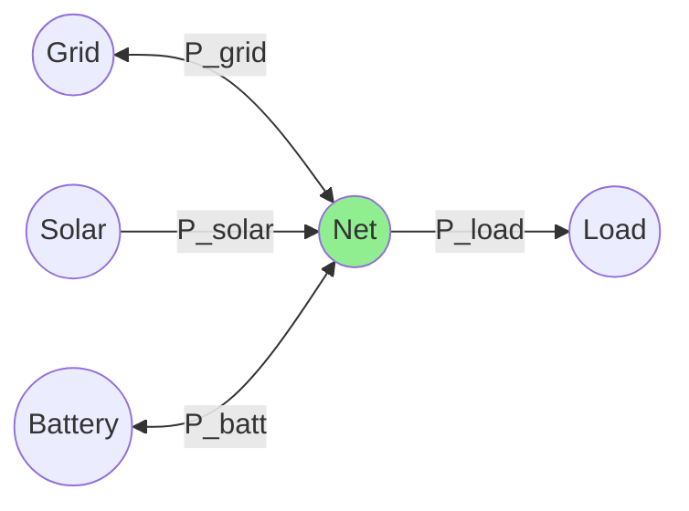
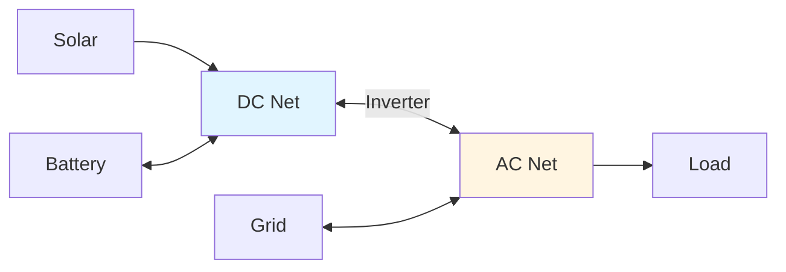

# Power Balance and Network Structure

HAEO models energy systems as directed graphs with power balance constraints.

## Graph Structure

**Nodes**: Entities (battery, grid, solar, load) and net entities (balance points)

**Edges**: Connections with power flow variables

**Direction**: Source → Target defines positive power flow direction

## Power Balance Constraint

At each net entity and time step:

$$
\sum_{c \in \mathcal{C}_{\text{in}}} P_c(t) = \sum_{c \in \mathcal{C}_{\text{out}}} P_c(t)
$$

Where:
- $\mathcal{C}_{\text{in}}$: Inbound connections (net is target)
- $\mathcal{C}_{\text{out}}$: Outbound connections (net is source)

**Physical meaning**: Kirchhoff's current law - power in equals power out.

## Implementation

```python
for net in net_entities:
    for t in range(n_periods):
        inflow = sum(conn.power[t] for conn in net.inbound)
        outflow = sum(conn.power[t] for conn in net.outbound)
        problem += inflow == outflow
```

One constraint per net per time step.

## Example: Simple System



**Power balance at Net**:

$$
P_{\text{grid}}(t) + P_{\text{solar}}(t) + P_{\text{batt,out}}(t) = P_{\text{load}}(t) + P_{\text{batt,in}}(t)
$$

Grid and solar are inflows. Load is outflow. Battery can be either (bidirectional).

## Complex Topology: AC/DC Separation



**Two power balances**:

At DC Net:
$$
P_{\text{solar}} + P_{\text{batt,out}} = P_{\text{inverter,to\_AC}} + P_{\text{batt,in}}
$$

At AC Net:
$$
P_{\text{inverter,from\_DC}} + P_{\text{grid,import}} = P_{\text{load}} + P_{\text{grid,export}}
$$

Inverter connection links the two nets with power limit constraints.

## Network Validation

HAEO validates before optimization:

1. **Connectivity**: All entities connect to at least one net
2. **Source availability**: At least one unlimited source (grid)
3. **Balance feasibility**: Load cannot exceed maximum supply

**Infeasibility causes**: Load too high, limits too restrictive, isolated sub-networks.

## Related Documentation

- [Net Entity Modeling](net-entity.md)
- [Connection Modeling](connections.md)
- [Battery Modeling](battery.md)
- [Grid Configuration](../user-guide/entities/grid.md)
