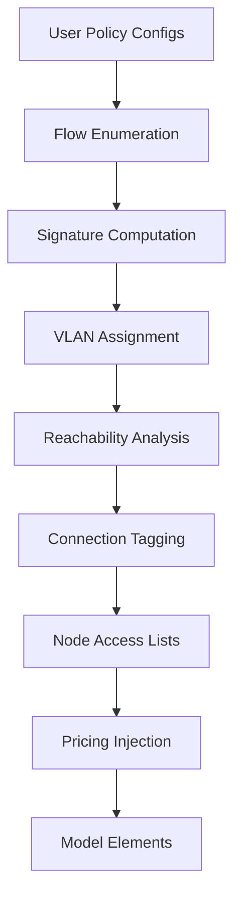

# Power Policies

Power policies control how energy flows through the HAEO network based on provenance.
They define which sources can reach which destinations, at what cost, and with what limits.

## Motivation

Standard HAEO optimizes total cost without tracking where power originates.
A kilowatt from the grid is indistinguishable from a kilowatt from solar once it enters the network.
This is fine for simple systems, but real-world energy economics often depend on provenance:

- **Network usage charges**: Grid power incurs distribution fees that solar doesn't.
- **Feed-in tariffs**: Solar exported to grid earns different rates than battery exports.
- **Demand charges**: Some destinations should only draw from specific sources.
- **Battery cycling costs**: Battery-sourced power has an implicit wear cost.

Policies add provenance tracking to the optimizer, enabling it to make source-aware decisions.

## Design Inspiration

The policy system draws on established techniques from computer networking,
where similar problems of tracking, routing, and controlling tagged flows are well-studied.

### VLAN Analogy

Power policies use **integer tags** analogous to VLANs (Virtual LANs) in Ethernet networking:

| Network Concept  | HAEO Equivalent          | Purpose                                         |
| ---------------- | ------------------------ | ----------------------------------------------- |
| VLAN ID          | Power tag (integer)      | Identifies power provenance                     |
| Trunk port       | Interior connection      | Carries multiple tags between nodes             |
| Access port      | Endpoint connection      | Node produces/consumes specific tags            |
| VLAN access list | Node consumption set     | Which tags a node can consume                   |
| Firewall rule    | Policy rule              | Allows/prices specific source→destination flows |
| Default deny     | Implicit policy behavior | No policy = no VLAN = no flow                   |

### Multi-Commodity Flow

Mathematically, tagged power flow is a **multi-commodity flow** problem — each tag is a
"commodity" with its own flow variables, sharing the same network capacity constraints.
This is a standard LP formulation that HiGHS solves natively.

### MPLS Label Optimization

The VLAN assignment algorithm is inspired by **MPLS label space optimization**.
In MPLS networks, routers assign labels to flows; flows with identical per-hop treatment
can share labels to reduce forwarding table size. Our policy signature algorithm applies
the same principle: sources with identical policy treatment share a tag.

### SDN / OpenFlow

The compilation pipeline mirrors **Software-Defined Networking** patterns:
a central controller (the compilation step) computes flow rules from high-level policies
and installs them on switches (connections/nodes). The data plane (LP model) then executes
the rules without understanding the policies themselves.

## Semantics

### Default Behavior (No Policies)

When no policies are configured, the system behaves identically to standard HAEO.
All connections carry only tag 0 (default). Power is fungible. No provenance tracking.

### Whitelist Model

When any policy is configured, the system switches to **whitelist mode**:

- **Covered flows**: Source→destination pairs matched by a policy are **allowed** with the
    specified price and/or limits.
- **Uncovered flows**: Source→destination pairs NOT matched by any policy are **implicitly
    disallowed**. The tags don't exist for that path, so power cannot flow.
- **"Any" wildcard**: `sources: ["*"]` or `destinations: ["*"]` matches all nodes, effectively
    creating a default-allow rule for those flows.

This is a **default-deny** model — policies grant permission. To allow all flows with no
restrictions, configure `* → *: $0`.

### Policy Stacking

Policies are **always additive**. When multiple policies match the same source→destination
pair, all of them apply independently:

- **Pricing**: Each matching policy adds its price. Battery paying $0.05 (group policy) and
    $0.03 (individual policy) pays \$0.08 total.
- **Limits**: Each matching policy adds its constraint. A group limit of 5 kW AND an
    individual limit of 2 kW both apply — the effective limit is the most restrictive
    combination.

Policies never replace each other. A more specific policy doesn't override a broader one —
it stacks on top.

**Example:**

```
Policy 1: Battery+Solar → Load: $0.05/kWh     (group)
Policy 2: Battery → Load: $0.03/kWh           (individual)
```

| Source         | Policies matched    | Total price |
| -------------- | ------------------- | ----------- |
| Solar → Load   | Policy 1            | \$0.05/kWh  |
| Battery → Load | Policy 1 + Policy 2 | \$0.08/kWh  |

Battery and Solar get separate VLANs because their policy signatures differ.
Each VLAN receives all applicable pricing segments.

### Group Constraints

Policies that apply to a **group** of sources create constraints on the **sum** of those
sources' VLANs. Individual policies create constraints on single VLANs.
Both coexist:

```
Policy 1: Battery+Solar → Load: limit 5 kW    (group)
Policy 2: Battery → Load: limit 2 kW          (individual)
```

| Constraint | Tags                      | Limit  |
| ---------- | ------------------------- | ------ |
| Group      | VLAN_solar + VLAN_battery | ≤ 5 kW |
| Individual | VLAN_battery              | ≤ 2 kW |

Result: Solar up to 5 kW, Battery up to 2 kW, combined maximum 5 kW.
This uses multi-tag scoping on the power limit segment: `power_limit(tags={1,2}, max=5kW)`
constrains the sum of VLANs 1+2.

## Compilation Pipeline

The compilation pipeline transforms user-configured policies into model-layer constructs.



### Step 1: Flow Enumeration

Expand each policy into concrete source→destination pairs:

- `Grid → Load: $0.05` → `{(Grid, Load, 0.05)}`
- `* → Load: $0.05` → `{(Grid, Load, 0.05), (Solar, Load, 0.05), (Battery, Load, 0.05)}`
- `Grid → *: $0.05` → `{(Grid, Load, 0.05), (Grid, Battery, 0.05), ...}`

### Step 2: Policy Signature Computation

For each source node, compute its **policy signature** — the set of `(destination, price_st, price_ts)`
tuples from all policies matching that source:

$$
\text{sig}(s) = \{(d, \pi_{st}, \pi_{ts}) \mid \text{policy}(s \to d, \pi_{st}, \pi_{ts})\}
$$

### Step 3: VLAN Assignment (Signature Merging)

Sources with identical policy signatures receive the **same VLAN ID**.
This produces the provably minimum number of VLANs:

- **Necessary**: Sources with different signatures need different VLANs (the optimizer
    must distinguish them for correct pricing at destinations).
- **Sufficient**: Sources with identical signatures can share a VLAN (no policy
    distinguishes them).

Number of VLANs = number of distinct non-empty signatures + 1 (for tag 0 / default).

Nodes with no policies (empty signature) get tag 0. When no policies exist at all,
only tag 0 exists — identical to standard HAEO.

### Step 4: Reachability Analysis

For each VLAN, compute which connections can carry it:

1. Find source nodes assigned to this VLAN.
2. Find destination nodes from policies matching this VLAN.
3. Compute connections on paths between sources and destinations.
4. Only these connections receive this VLAN's variables.

For tree topologies (most home energy systems), paths are unique and computable in O(N).
This prevents creating variables on connections that could never carry a given VLAN.

### Step 5: Connection Tagging

Each connection receives the set of VLANs that are reachable through it.
Interior connections ("trunks") may carry many VLANs. Endpoint connections
carry only the VLANs their node produces or consumes.

### Step 6: Node Access Lists

Each node gets a **consumption set** — the VLANs it's allowed to consume:

$$
\text{consume}(n) = \{v \mid \exists \text{ policy where } n \in \text{destinations and VLAN } v \text{ matches source}\}
$$

Power on a VLAN flows *through* a node freely (forwarding/routing).
It can only be *consumed* (terminated) if the VLAN is in the node's consumption set.

Source nodes produce power on their assigned VLAN only. This is enforced via the
existing `source_tag` mechanism on the Node element.

### Step 7: Pricing Injection

For each policy, add a scoped pricing segment at the destination connection:

- Segment type: `pricing` with `tag` = source VLAN
- Price: from the policy's `price_source_target` / `price_target_source`
- Placed on the destination node's connection (the "discriminating point")

## Mathematical Formulation

### Per-Tag Power Variables

Each segment creates LP variables per tag per direction:

$$
P^{st}_{v,t} \geq 0 \quad \forall v \in \text{Tags}(c), \; t \in \{0, \ldots, T-1\}
$$

Where $\text{Tags}(c)$ is the set of VLANs assigned to connection $c$.

### Total Power (Segment Constraints)

Existing segment constraints (power limits, efficiency, time-slice) operate on the total:

$$
P^{st}_t = \sum_{v \in \text{Tags}(c)} P^{st}_{v,t}
$$

### Node Power Balance (Per-Tag)

At each node, per-tag power must balance independently:

- **Junction nodes**: $\sum_c P^{tag}_{c,t} = 0$ for each tag (routing)
- **Source nodes**: only the source's own tag can have net outflow
- **Sink nodes**: only tags in the consumption set can have net inflow

### Policy Pricing

For each policy `(source_vlan, destination, price)`:

$$
C_{\text{policy}} = \sum_t P^{st}_{v,t} \cdot \pi \cdot \Delta t_t
$$

Applied at the destination connection, scoped to the source VLAN.

## Variable Count Analysis

| Scenario                  | VLANs | Connections with VLAN | Variables           |
| ------------------------- | ----- | --------------------- | ------------------- |
| No policies               | 1     | all × 1               | C × S × 2 × T       |
| 1 policy (Grid→Load)      | 2     | partial × 2           | < C × 2 × S × 2 × T |
| N sources, all same price | 2     | all × 2               | C × 2 × S × 2 × T   |
| N sources, all different  | N+1   | varies                | Σ_c K_c × S × 2 × T |

Where C = connections, S = segments/connection, T = periods, K_c = VLANs on connection c.

For typical home systems (C=5, S=3, T=100): base is 3,000 variables.
Each additional VLAN adds up to 3,000 more, but signature merging and reachability
pruning keep the actual count much lower in practice.

## Examples

### Example: Grid Surcharge

```
System: Grid ←→ Switchboard ←→ Load, Solar → Switchboard
Policy: Grid → Load: $0.05/kWh
```

Compilation:

1. Flows: {(Grid, Load, 0.05)}
2. Signatures: Grid={((Load, 0.05, None)}, Solar={}, Battery={}, Switchboard={}
3. VLANs: Grid=1, everything else=0. **2 VLANs total.**
4. Reachability: VLAN 1 flows Grid→Switchboard→Load (2 connections). VLAN 0 on all.
5. Node access: Load can consume VLAN 1 (policy allows Grid→Load).
6. Pricing: scoped pricing(tag=1, \$0.05) on Load's connection.

Result: Grid power pays \$0.05 surcharge at Load. Solar power flows freely. The optimizer
uses solar first (free), then grid (more expensive).

### Example: Default-Allow Equivalent

```
Policy: * → *: $0
```

All sources get the same signature: {(every_dest, 0, None)}. All merge into VLAN 1.
**2 VLANs total** — functionally identical to no policies, but with provenance tracking.

## Implementation Location

The compilation pipeline lives in `core/adapters/tariff_compilation.py` (to be renamed
`policy_compilation.py`). It runs as a post-processing step in `collect_model_elements()`
after all adapters produce their model element configs.

The model layer (segments, connections, nodes) is policy-unaware — it operates on
integer tags and scoped segments without understanding the policy semantics.

## External vs Internal Pricing

HAEO distinguishes between two types of costs:

**External prices** are real market costs from sensors — what you actually pay or earn.
These stay on the element that interfaces with the external system:

- Grid import/export prices (from your energy retailer)
- Feed-in tariff rates

External prices are configured on the Grid element's pricing segment and driven by
external sensor data. They are NOT policies.

**Internal policies** are valuations you choose to apply — they guide the optimizer
without representing real money changing hands:

- Battery discharge wear cost (\$0.02/kWh)
- Battery charge incentive (\$0.001/kWh)
- Solar export surcharge
- Source-destination routing costs

Internal policies should be configured as **power policies**, not as pricing segments
on individual elements. This eliminates dual configuration and makes the cost structure
explicit: "Battery to anything costs \$0.02/kWh because of wear."

!!! note "Migration path"

    Battery pricing segments (`price_source_target`, `price_target_source`) are candidates
    for migration to the policy system. The equivalent policy configuration:

    - Battery discharge cost → `Battery → *: $0.02/kWh`
    - Battery charge incentive → `* → Battery: -$0.001/kWh`

    SOC-based pricing (state-dependent penalties) remains a specialised segment because
    it depends on dynamic battery state, not flat per-kWh rates.

## Future: SOC-Based VLANs

Battery partitions (SOC ranges) could be modelled as separate VLANs, where power
from different SOC levels carries different tags. This would enable SOC-dependent
pricing through the standard policy system rather than specialised segments.
This is a challenging LP modelling problem and is tracked separately.
