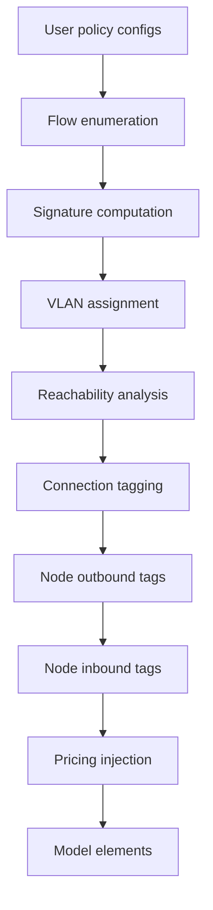

# Power policies

Power policies control how energy flows through the HAEO network based on provenance.
They define which sources can reach which destinations, at what cost, and with what limits.

## Motivation

Standard HAEO minimizes total cost without tracking where power originates.
A kilowatt from the grid is indistinguishable from a kilowatt from solar once it enters the network.
That behavior is often sufficient for simple systems.
Real-world energy economics can still depend on provenance.

- **Network usage charges**: Grid power can incur distribution fees that local generation does not.
- **Feed-in tariffs**: Export rates can differ by source.
- **Demand constraints**: Some destinations should only draw from specific sources.
- **Battery wear valuation**: Battery-sourced power can carry an internal cycling cost.

Policies add provenance tracking so the optimizer can make source-aware decisions.

## Design inspiration

The policy system borrows concepts from networking, where tagged flow control is well established.

### VLAN analogy

Power policies use integer tags that are analogous to VLAN IDs in Ethernet.

| Network concept  | HAEO equivalent          | Purpose                                  |
| ---------------- | ------------------------ | ---------------------------------------- |
| VLAN ID          | Power tag (integer)      | Identifies power provenance              |
| Trunk port       | Interior connection      | Carries multiple tags between nodes      |
| Access port      | Endpoint connection      | Node produces or consumes specific tags  |
| VLAN access list | Node inbound tags        | Defines which tags a node can consume    |
| Firewall rule    | Policy rule              | Prices specific source-destination flows |
| Default allow    | Implicit policy behavior | No policy means free flow on tag 0       |

### Multi-commodity flow

Tagged power flow is a multi-commodity flow formulation.
Each tag acts as a separate commodity with its own flow variables.
All commodities share the same physical network capacities.
This is a standard LP formulation that HiGHS solves natively.

### MPLS label optimization

VLAN assignment is inspired by MPLS label optimization.
Flows with identical treatment can share labels in MPLS.
HAEO applies the same principle by letting sources with identical policy signatures share a tag.

### SDN and OpenFlow

The compilation pipeline mirrors software-defined networking patterns.
A central controller (the compilation step) derives flow rules from high-level policies and installs them on switches (connections and nodes).
The data plane (the LP model) executes those rules without understanding the policies themselves.

## Semantics

### Default behavior without policies

When no policies are configured, behavior matches standard HAEO.
All connections carry only tag 0.
Power is fungible and provenance is not tracked.

### Default-allow model

Policies add costs to specific flows.
Flows without a matching policy are unrestricted.

- **Policied sources**: Assigned a VLAN and forced onto it via `outbound_tags`. Their power carries the configured policy costs at the destination.
- **Unpolicied sources**: Produce on tag 0 (the default tag) at zero policy cost.
- **Sink nodes**: Accept all active VLANs plus tag 0, so both policied and unpolicied power can reach any sink.
- **Wildcard matching**: `sources: ["*"]` or `destinations: ["*"]` matches capability-appropriate nodes (sources or sinks respectively).

This model avoids creating unnecessary VLANs for unpolicied flows.
Only sources with explicit policies receive non-zero tags.

### Policy stacking

Policies are additive.
When multiple policies match the same source-destination pair, all matching rules apply.

- **Pricing**: Matching prices sum — Battery paying `$0.05` (group policy) and `$0.03` (individual policy) pays `$0.08` total.
- **Limits**: Matching constraints all apply, and the effective limit is their combined feasible region.

Policies do not override one another.
A specific policy stacks on top of broader policies.

```
Policy 1: Battery+Solar -> Load: $0.05/kWh   (group)
Policy 2: Battery -> Load: $0.03/kWh         (individual)
```

| Source          | Policies matched    | Total price |
| --------------- | ------------------- | ----------- |
| Solar -> Load   | Policy 1            | `$0.05/kWh` |
| Battery -> Load | Policy 1 + Policy 2 | `$0.08/kWh` |

Battery and solar receive different VLANs because their signatures differ.
Each VLAN gets all applicable pricing segments.

### Group constraints

Policies that target source groups constrain the sum of those source VLANs.
Policies that target one source constrain one VLAN.
Both kinds can coexist.

```
Policy 1: Battery+Solar -> Load: limit 5 kW
Policy 2: Battery -> Load: limit 2 kW
```

| Constraint | Tags                        | Limit     |
| ---------- | --------------------------- | --------- |
| Group      | `VLAN_solar + VLAN_battery` | `<= 5 kW` |
| Individual | `VLAN_battery`              | `<= 2 kW` |

Result: Solar can draw up to 5 kW, Battery up to 2 kW, combined maximum 5 kW.
This uses multi-tag scoping: `power_limit(tags={1,2}, max=5kW)` constrains the sum of VLANs 1 and 2.

## Compilation pipeline

The compiler transforms policy definitions into model-layer constructs.



### Step 1: Flow enumeration

Each policy expands to concrete source-destination tuples.

- `Grid -> Load: $0.05` becomes `{(Grid, Load, 0.05)}`.
- `* -> Load: $0.05` becomes all sources paired with `Load`.
- `Grid -> *: $0.05` becomes all destinations paired with `Grid`.

### Step 2: Policy signature computation

For each source node, compute a policy signature.
A signature is the set of `(destination, price_st, price_ts)` tuples matched for that source.

$$
\text{sig}(s) = \{(d, \pi_{st}, \pi_{ts}) \mid \text{policy}(s \to d, \pi_{st}, \pi_{ts})\}
$$

### Step 3: VLAN assignment

Sources with identical signatures share one VLAN.
Sources with different signatures must use different VLANs — at least one policy treats them differently, so the optimizer must be able to distinguish them.
The resulting VLAN count is the provably minimum: the number of distinct non-empty signatures, plus tag 0.

Nodes with empty signatures use tag 0.
When no policies exist at all, only tag 0 exists — identical to standard HAEO.

### Step 4: Reachability analysis

For each VLAN, compute which connections can carry it using directed reachability.

1. Identify source nodes assigned to that VLAN.
2. Identify destination nodes matched by policies for that VLAN.
3. Compute forward reachability from sources (following connection direction) and backward reachability from destinations (reverse direction).
4. Assign VLAN variables only to connections whose endpoints both appear in the intersection of forward and backward reachable sets.

This avoids creating variables on impossible routes.
Directed reachability prevents tags from leaking onto connections that happen to be adjacent but not on a valid source-to-destination path.
For tree topologies, which cover most home energy systems, paths between any two nodes are unique and the computation is linear in the node count.

### Step 5: Connection tagging

Each connection receives all VLANs that can traverse it.
Interior connections (trunks) can carry many VLANs.
Endpoint connections carry only the VLANs their node produces or consumes.

### Step 6: Node outbound tags

Each source node gets `outbound_tags` constraining which tags it can produce on.
Policied sources produce only on their assigned VLAN.
Unpolicied source-capable nodes produce only on tag 0, preventing unnecessary production decomposition.

### Step 7: Node inbound tags

Sink nodes get `inbound_tags` listing which VLANs they can consume.
All sinks accept tag 0 (unpolicied power) plus all active policy VLANs.
This default-allow approach ensures both policied and unpolicied power can reach any sink.

Power can still pass through a non-sink node on any VLAN for routing.
Junction nodes (neither source nor sink) do not receive inbound tags.

### Step 8: Pricing injection

For each policy, inject a pricing segment at the destination connection.

- Segment type is `pricing`.
- Segment `tag` is the source VLAN.
- Price fields map from `price_source_target` and `price_target_source`.

## Mathematical formulation

### Per-tag power variables

Each segment creates non-negative variables per tag and period.

$$
P^{st}_{v,t} \geq 0 \quad \forall v \in \text{Tags}(c), \; t \in \{0, \ldots, T-1\}
$$

### Total power in segment constraints

Segment constraints operate on aggregate directional power.

$$
P^{st}_t = \sum_{v \in \text{Tags}(c)} P^{st}_{v,t}
$$

### Per-tag node balance

Node balance applies independently for each tag.

- Junction nodes: $\sum_c P^{tag}_{c,t} = 0$ for each tag (routing).
- Source nodes: only the source's own tag can have net outflow.
- Sink nodes: only tags in the node's `inbound_tags` set can have net inflow.

### Policy pricing term

For policy `(source_vlan, destination, price)`, the policy cost contribution is:

$$
C_{\text{policy}} = \sum_t P^{st}_{v,t} \cdot \pi \cdot \Delta t_t
$$

This term is scoped to the source VLAN at the destination connection.

## Variable count analysis

| Scenario                          | VLANs | Connections with VLAN | Variable form                             |
| --------------------------------- | ----- | --------------------- | ----------------------------------------- |
| No policies                       | 1     | all x 1               | $C \times S \times 2 \times T$            |
| One policy (`Grid -> Load`)       | 2     | partial x 2           | $< C \times 2 \times S \times 2 \times T$ |
| All sources same policy signature | 2     | often broad           | $C \times 2 \times S \times 2 \times T$   |
| All sources distinct signatures   | $N+1$ | varies by route       | $\sum_c K_c \times S \times 2 \times T$   |

`C` is connection count, `S` is segments per connection, `T` is period count, and `K_c` is VLAN count on connection `c`.
Signature merging and reachability pruning reduce variable growth compared with naive one-tag-per-source assignment.

## Examples

### Grid surcharge

```
System: Grid <-> Switchboard <-> Load, Solar -> Switchboard
Policy: Grid -> Load: $0.05/kWh
```

Compilation summary:

1. Flows: `{(Grid, Load, 0.05)}`.
2. Signatures: Grid has `{(Load, 0.05)}`, others have empty signatures.
3. VLANs: Grid gets VLAN 1, others stay on tag 0.
4. Reachability: VLAN 1 appears only on directed path from Grid to Load.
5. Outbound tags: Grid produces on VLAN 1, Solar produces on tag 0.
6. Inbound tags: Load accepts tag 0 and VLAN 1.
7. Pricing: destination connection gets `pricing(tag=grid_vlan, $0.05)`.

Result:
Grid power carries the surcharge to `Load`.
Solar power flows freely on tag 0 at zero policy cost and is preferred when cheaper.

### Selective pricing

```
System: Grid <-> Switchboard <-> Load, Solar -> Switchboard, Battery <-> Switchboard
Policy: Battery -> *: $0.02/kWh
```

Battery gets a VLAN with a discharge wear cost.
Solar and Grid stay on tag 0 (no policy targets them) at zero cost.
All sink destinations accept tag 0 and Battery's VLAN, so Solar and Grid power reaches them freely.
Battery power carries the `$0.02/kWh` wear cost everywhere it flows.

## Implementation location

The compilation pipeline runs in `custom_components/haeo/core/adapters/policy_compilation.py`.
It executes as a post-processing step in `collect_model_elements()` after adapter element configs are assembled.
The model layer remains policy-unaware and operates only on tags and scoped segments.

## External and internal pricing

HAEO separates external market pricing from internal valuation policies.

**External pricing** represents real market costs or credits — what you actually pay or earn.
These belong on the element that interfaces with the external system:

- Grid import and export prices from your energy retailer.
- Feed-in tariff rates.

External prices are configured on pricing segments and driven by sensor data.
They are not policies.

**Internal policies** are valuations you choose to apply to guide the optimizer, without representing real money changing hands:

- Battery discharge wear cost (`$0.02/kWh`).
- Battery charge incentive (`-$0.001/kWh`).
- Source-destination routing penalties.

These should be configured as power policies so the cost structure is explicit: "Battery to anything costs `$0.02/kWh` because of wear."

!!! note "Migration path"

    Battery flat pricing fields (`price_source_target`, `price_target_source`) can map to policies.
    Battery discharge cost can become `Battery -> *: $0.02/kWh`.
    Battery charge incentive can become `* -> Battery: -$0.001/kWh`.
    SOC-dependent valuation still requires state-dependent modeling rather than flat per-kWh policies.

## Future work: SOC-based VLANs

Battery SOC partitions could be modeled as separate VLANs so different SOC regions carry different tags.
That approach could enable SOC-dependent valuation through the same policy machinery.
This remains an open modeling topic.

## Next Steps

<div class="grid cards" markdown>

- :material-cog-play:{ .lg .middle } **Policy walkthrough**

    ---

    Configure policy rules end to end in Home Assistant.

    [:material-arrow-right: Power policies walkthrough](../walkthroughs/power-policies.md)

- :material-wrench:{ .lg .middle } **Compilation internals**

    ---

    Review implementation details and compiler behavior.

    [:material-arrow-right: Policy compilation](../developer-guide/policy-compilation.md)

- :material-network:{ .lg .middle } **VLAN optimization**

    ---

    Dive into signature merging and tag minimization rationale.

    [:material-arrow-right: VLAN optimization](../developer-guide/vlan-optimization.md)

</div>
