# Time Horizons and Forecasting

This page explains how HAEO discretizes time and integrates forecast data into its linear programming model.

## Overview

Time is fundamental to energy optimization:

- **When to charge**: Off-peak prices vs peak prices
- **When to discharge**: High-value periods
- **How far ahead**: Balance near-term certainty with long-term planning

HAEO uses **discrete-time** optimization with a rolling horizon approach to handle the continuous nature of energy systems while maintaining computational efficiency.

## Time Discretization

### Core Concepts

HAEO divides time into discrete periods:

**Horizon** ($H$): Total optimization period (hours)

- How far into the future to optimize
- Default: 48 hours
- Range: 1-168 hours (1 week max)

**Period** ($\Delta t$): Time step size (hours)

- Resolution of optimization
- Default: 5 minutes = 0.0833 hours
- Range: 1-60 minutes

**Number of periods** ($T$): Total time steps

$$
T = \frac{H}{\Delta t} = \frac{\text{Horizon (hours)}}{\text{Period (hours)}}
$$

**Example**:

- Horizon: 48 hours
- Period: 5 minutes = 5/60 hours
- Number of periods: $T = 48 / (5/60) = 576$ time steps

### Mathematical Representation

Each decision variable is defined for every time step:

$$
\begin{align}
P(0), P(1), P(2), \ldots, P(T-1) \quad &\text{(Power at each step)} \\
E(0), E(1), E(2), \ldots, E(T-1) \quad &\text{(Energy at each step)}
\end{align}
$$

Time index $t \in \{0, 1, \ldots, T-1\}$ represents:

- $t=0$: Current time (now)
- $t=1$: One period from now ($\Delta t$ hours)
- $t=T-1$: End of horizon ($H$ hours from now)

### Period Duration Impact

**Shorter periods** (e.g., 1 minute):

- ✅ Higher temporal resolution
- ✅ More accurate optimization
- ❌ More decision variables ($T$ increases)
- ❌ Longer solve times
- ❌ More forecast data required

**Longer periods** (e.g., 30 minutes):

- ✅ Faster optimization
- ✅ Fewer variables
- ❌ Coarser resolution
- ❌ May miss rapid price changes
- ✅ Less forecast data required

**Sweet spot**: 5-10 minutes for most systems

- Captures price variations in time-of-use tariffs
- Reasonable computational load
- Aligns with typical forecast resolutions

## Rolling Horizon Optimization

### Receding Horizon Control

HAEO uses a **rolling horizon** strategy:

```mermaid
gantt
    title Rolling Horizon Optimization
    dateFormat HH:mm
    axisFormat %H:%M

    section Optimization 1
    Optimize 48h ahead: 00:00, 48h
    Execute first 5min: crit, 00:00, 5m

    section Optimization 2
    Optimize 48h ahead: 00:05, 48h
    Execute first 5min: crit, 00:05, 5m

    section Optimization 3
    Optimize 48h ahead: 00:10, 48h
    Execute first 5min: crit, 00:10, 5m
```



**Process**:

1. **Optimize**: Plan power flows for next $H$ hours
2. **Execute**: Implement only the first period's plan
3. **Wait**: Execute for duration $\Delta t$
4. **Re-optimize**: Update with new forecasts and current state
5. **Repeat**: Continuously adapt

### Why Only Execute First Period?

**Uncertainty increases with time**:

- Current conditions: Known accurately
- Near future (minutes): Quite certain
- Far future (hours): Less certain
- Distant future (days): Uncertain

**Forecasts improve over time**:

- Weather predictions become more accurate as time approaches
- Price forecasts may be updated
- System state changes (actual consumption, generation)

**Re-optimization adapts**:

- Corrects for forecast errors
- Responds to actual conditions
- Incorporates new information

### Re-optimization Frequency

HAEO re-optimizes on a **fixed schedule**:

**Default interval**: 5 minutes (matches period duration)

**Timing considerations**:

- **Too frequent** (e.g., every minute):
    - ❌ Excessive computational load
    - ❌ Rapid control changes (unnecessary)
    - ❌ No significant information gain
- **Too infrequent** (e.g., every hour):
    - ❌ Slow response to changes
    - ❌ Larger forecast errors accumulate
    - ❌ Missed optimization opportunities
- **Optimal** (matching period):
    - ✅ Timely response
    - ✅ Reasonable compute load
    - ✅ Fresh forecasts incorporated

### Horizon Length Impact

**Shorter horizon** (e.g., 12 hours):

- ✅ Faster optimization (fewer variables)
- ✅ Better forecast accuracy
- ❌ Misses long-term opportunities
- ❌ Cannot plan overnight charging for next evening

**Longer horizon** (e.g., 72 hours):

- ✅ Better long-term planning
- ✅ Captures multi-day patterns
- ❌ Slower optimization
- ❌ Less accurate distant forecasts
- ❌ Most benefit is in near term anyway

**Recommended**: 48 hours

- Covers two complete diurnal cycles
- Allows planning overnight charge for next day's peak
- Forecasts still reasonably accurate
- Computational load is manageable

## Forecast Integration

### Required Forecasts

HAEO requires forecast data for time-varying parameters:

**Grid prices**:

- $p_{\text{import}}(0), p_{\text{import}}(1), \ldots, p_{\text{import}}(T-1)$
- $p_{\text{export}}(0), p_{\text{export}}(1), \ldots, p_{\text{export}}(T-1)$

**Solar generation**:

- $P_{\text{solar}}(0), P_{\text{solar}}(1), \ldots, P_{\text{solar}}(T-1)$

**Load consumption** (if forecast load):

- $P_{\text{load}}(0), P_{\text{load}}(1), \ldots, P_{\text{load}}(T-1)$

**Battery state** (initial condition):

- $E_{\text{battery}}(0)$ (current SOC)

### Forecast Sources

**Home Assistant integrations**:

- **Nordpool**: Electricity price forecasts
- **Solcast**: Solar generation forecasts
- **Open-Meteo**: Weather-based solar forecasts
- **Custom sensors**: Load prediction models

**Forecast format**:

```yaml
sensor.grid_import_price:
  state: 0.25  # Current price ($/kWh)
  attributes:
    forecast:
      - datetime: "2025-10-12T10:30:00+00:00"
        value: 0.25
      - datetime: "2025-10-12T10:35:00+00:00"
        value: 0.26
      # ... T values total
```

### Forecast Alignment

Forecasts must align with optimization time grid:

**Time alignment**:

- First forecast: Current time ($t=0$)
- Subsequent forecasts: Every $\Delta t$ hours
- Last forecast: $H$ hours ahead

**Length requirement**:

$$
\text{len(forecast)} = T = \frac{H}{\Delta t}
$$

**Example**: 48-hour horizon, 5-minute periods

- Need 576 forecast values
- Spaced 5 minutes apart
- From now until 48 hours ahead

### Forecast Interpolation

If forecast resolution differs from optimization period:

**Coarser forecasts** (e.g., hourly forecasts for 5-min periods):

- Interpolate between forecast points
- Linear interpolation is typical
- Or hold constant for each forecast interval

**Finer forecasts** (e.g., 1-min forecasts for 5-min periods):

- Average or sample at optimization periods
- Reduce to required resolution

### Handling Missing Forecasts

**Strategies**:

1. **Hold last known value**: Use most recent forecast
2. **Historical average**: Use typical pattern
3. **Conservative approach**: Assume worst-case
4. **Skip optimization**: Wait for forecast availability

**HAEO behavior**: Optimization fails if required forecasts are unavailable.

## Temporal Discounting

### Future Value Uncertainty

Costs in the distant future are less certain and less valuable:

**Present value** vs **future value**:

- $t=0$: Certain (current)
- $t=10$: Near future (fairly certain)
- $t=T-1$: Distant future (uncertain)

### Battery Charge Cost Diminishing

HAEO applies **temporal diminishing** to battery charge costs:

$$
c_{\text{charge}}(t) = c_{\text{charge,base}} \cdot \frac{T - t}{T}
$$

**Effect**:

- Early periods: High charge cost (discourage early charging)
- Later periods: Low charge cost (encourage charging when needed)

**Rationale**:

- Avoid charging "just in case"
- Wait until future conditions are more certain
- Charge closer to when battery will be used

**Example** with $c_{\text{charge,base}} = 0.05$ and $T = 100$:

| Time $t$ | Remaining | Multiplier | Effective Cost |
| -------- | --------- | ---------- | -------------- |
| 0        | 100       | 1.00       | \$0.050/kWh    |
| 25       | 75        | 0.75       | \$0.038/kWh    |
| 50       | 50        | 0.50       | \$0.025/kWh    |
| 75       | 25        | 0.25       | \$0.013/kWh    |
| 99       | 1         | 0.01       | \$0.001/kWh    |

Charging at $t=99$ is much "cheaper" from degradation perspective.

### Discharge Cost (Constant)

Discharge costs remain **constant**:

$$
c_{\text{discharge}}(t) = c_{\text{discharge,base}} \quad \forall t
$$

**Why no diminishing?**:

- Discharge is responding to immediate needs
- Not speculative (unlike early charging)
- Value is captured in grid cost savings

## Example: 48-Hour Optimization Cycle

### System Configuration

- **Horizon**: 48 hours
- **Period**: 5 minutes
- **Re-optimize**: Every 5 minutes
- **Solar**: 8 kW, forecast available
- **Battery**: 10 kWh, 5 kW power
- **Load**: 3 kW average, with peaks

### Timeline

```mermaid
gantt
    title 48-Hour Rolling Optimization
    dateFormat YYYY-MM-DD HH:mm
    axisFormat %H:%M

    section Optimization 1 (00:00)
    Plan 00:00-48:00: 2025-10-12 00:00, 48h
    Execute 00:00-00:05: crit, 2025-10-12 00:00, 5m

    section Optimization 2 (00:05)
    Plan 00:05-48:05: 2025-10-12 00:05, 48h
    Execute 00:05-00:10: crit, 2025-10-12 00:05, 5m

    section Optimization 3 (00:10)
    Plan 00:10-48:10: 2025-10-12 00:10, 48h
    Execute 00:10-00:15: crit, 2025-10-12 00:10, 5m
```

### Optimization at 00:00

**Input data**:

- Current time: 00:00
- Horizon: 48 hours (until 00:00 day after tomorrow)
- Battery SOC: 50%
- Forecasts: Prices, solar, load for next 48 hours

**Optimization**:

- Plans battery charging during off-peak tonight
- Anticipates solar generation tomorrow
- Schedules battery discharge for tomorrow evening peak

**Output**:

- Power flows for all 576 time steps
- **Execute**: Only the $t=0$ plan (00:00-00:05)

### Optimization at 00:05

**Input data**:

- Current time: 00:05
- Horizon: 48 hours (until 00:05 day after tomorrow)
- Battery SOC: 51% (actual after 5 minutes)
- **Updated forecasts**: New data from 00:05 onward

**Changes from previous**:

- Actual battery charge was 51%, not the 52% planned (forecast error)
- Solar forecast for tomorrow updated with new weather model
- Price forecast unchanged (already known for tomorrow)

**Re-optimization**:

- Adjusts plan based on actual 51% SOC
- Incorporates updated solar forecast
- **Execute**: Only the new $t=0$ plan (00:05-00:10)

### This Process Repeats

Every 5 minutes:

- New current state
- Updated forecasts (when available)
- Re-optimize 48 hours ahead
- Execute only the first 5 minutes
- Adapt continuously

## Numerical Considerations

### Variable Count

Total optimization variables scales with horizon and period:

$$
\text{Variables} = \sum_{\text{entities}} (\text{variables per entity}) \times T
$$

**Example** with 4 entities:

- Grid: 2 variables per period (import, export) × 576 = 1152
- Battery: 3 variables per period (charge, discharge, energy) × 576 = 1728
- Solar: 0 or 1 variable per period (if curtailment) × 576 = 0-576
- Load: 0 variables (fixed)
- **Total**: ~3000-4000 variables

### Solve Time Scaling

Solve time increases with problem size:

| Horizon | Period | Variables | Typical Solve Time |
| ------- | ------ | --------- | ------------------ |
| 24h     | 10min  | ~1000     | 0.1-0.5s           |
| 48h     | 5min   | ~4000     | 0.5-2s             |
| 72h     | 5min   | ~6000     | 1-5s               |
| 168h    | 5min   | ~14000    | 5-20s              |

**Solver efficiency**: Modern LP solvers (HiGHS) are very fast for these problem sizes.

### Forecast Data Volume

Forecast storage requirements:

- 48-hour horizon, 5-minute periods: 576 values per forecast sensor
- Multiple forecast sensors: Grid import, export, solar, load
- Total: ~2000-3000 values per optimization

**Memory impact**: Negligible on modern systems

## Configuration Impact

### Horizon Selection

**Short horizon** (12-24 hours):

- Use when: Limited forecast availability
- Use when: Rapid computation needed
- ❌ Miss multi-day patterns

**Medium horizon** (48 hours) - **Recommended**:

- ✅ Captures diurnal patterns
- ✅ Reasonable solve time
- ✅ Good forecast accuracy

**Long horizon** (72-168 hours):

- Use when: Multi-day price patterns exist
- Use when: Need weekly optimization
- ❌ Slower solve times
- ❌ Forecast accuracy degrades

### Period Selection

**Fine resolution** (1-2 minutes):

- Use when: Rapid price changes
- Use when: High accuracy needed
- ❌ Much slower optimization

**Medium resolution** (5-10 minutes) - **Recommended**:

- ✅ Captures price variations
- ✅ Fast solve times
- ✅ Practical forecast resolution

**Coarse resolution** (15-30 minutes):

- Use when: Stable prices
- Use when: Speed critical
- ❌ May miss opportunities

### Re-optimization Frequency

**Matches period** (recommended):

- Execute one period
- Re-optimize with latest data
- Continuous adaptation

**Less frequent** (every few periods):

- Reduces computational load
- Increases forecast error impact
- Use only if computation is constrained

## Related Documentation

- [Objective Function](objective-function.md) - How costs accumulate over time
- [Configuration Guide](../user-guide/configuration.md) - Setting horizon and period
- [Forecasts & Sensors](../user-guide/forecasts-and-sensors.md) - Forecast data sources
- [Battery Modeling](battery.md) - Temporal diminishing in charge costs

## Next Steps

Explore related modeling topics:

- [LP Overview](overview.md) - How LP solves the optimization problem
- [Objective Function](objective-function.md) - What is optimized over time
- [Battery Modeling](battery.md) - How batteries enable time-shifting

[:octicons-arrow-right-24: Continue to LP Overview](overview.md)
