# Time Horizons and Forecasting

HAEO discretizes time and uses rolling horizon optimization with forecasts.

## Time Discretization

**Horizon** ($H$): Total optimization period (hours, default 48)

**Period** ($\Delta t$): Time step size (hours, default 5 min = 0.0833 h)

**Number of periods** ($T$):

$$
T = \frac{H}{\Delta t}
$$

Example: 48 hours ÷ (5/60 hours) = 576 time steps.

## Rolling Horizon

```mermaid
gantt
    title Rolling Optimization
    dateFormat HH:mm
    axisFormat %H:%M
    
    section Opt 1
    Plan 48h: 00:00, 48h
    Execute 5min: crit, 00:00, 5m
    
    section Opt 2
    Plan 48h: 00:05, 48h
    Execute 5min: crit, 00:05, 5m
```

**Process**:
1. Optimize for next $H$ hours
2. Execute only first period
3. Wait $\Delta t$
4. Re-optimize with updated data
5. Repeat

**Why**: Forecasts improve over time. Re-optimizing adapts to actual conditions.

## Forecast Integration

**Required forecasts**:
- Grid prices: $p_{\text{import}}(t), p_{\text{export}}(t)$
- Solar: $P_{\text{solar}}(t)$
- Load (if forecast type): $P_{\text{load}}(t)$
- Battery SOC: Initial $E(0)$

**Sources**: Home Assistant forecast sensors (Nordpool, Solcast, etc.)

**Length**: Must cover full horizon (e.g., 576 values for 48h/5min)

**Alignment**: Forecasts interpolated/aligned to optimization time grid

## Temporal Diminishing

Battery charge costs decrease over time:

$$
c_{\text{charge}}(t) = c_{\text{charge,base}} \cdot \frac{T - t}{T}
$$

**Effect**: Discourages early charging when future is uncertain.

| Time | Remaining | Multiplier | Effective Cost |
|------|-----------|------------|----------------|
| 0    | T         | 1.00       | Full cost      |
| T/2  | T/2       | 0.50       | Half cost      |
| T-1  | 1         | ~0         | Near zero      |

## Configuration Impact

| Parameter | Lower | Higher |
|-----------|-------|--------|
| Horizon | Faster solve, misses long-term | Better planning, slower |
| Period | Fewer variables, coarser | More accurate, more variables |

**Recommended**: 48-hour horizon, 5-minute period (good balance).

## Related Documentation

- [Objective Function](objective-function.md)
- [Battery Modeling](battery.md)
- [Configuration Guide](../user-guide/configuration.md)
- [Forecasts Guide](../user-guide/forecasts-and-sensors.md)
