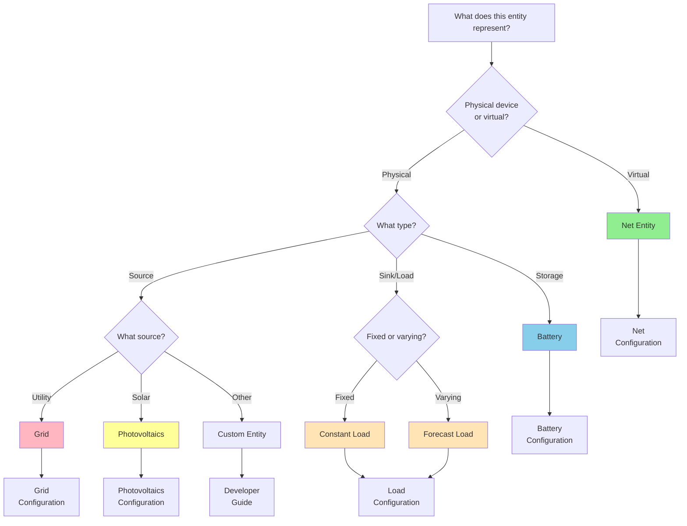

# Entity Type Reference

Complete reference for all entity types supported by HAEO with configuration complexity indicators and selection guidance.

## Entity Types Overview

| Entity        | Power Direction | Storage | Forecasts      | Complexity | Typical Applications                           |
| ------------- | --------------- | ------- | -------------- | ---------- | ---------------------------------------------- |
| Battery       | Bidirectional   | Yes     | SOC sensor     | Medium     | Home batteries, EV storage, stationary storage |
| Grid          | Bidirectional   | No      | Price sensors  | Simple     | Utility connection, import/export              |
| Photovoltaics | Generation      | No      | Solar forecast | Simple     | Rooftop solar, ground mount, tracking arrays   |
| Constant Load | Consumption     | No      | None           | Simple     | Baseline loads, always-on devices              |
| Forecast Load | Consumption     | No      | Load forecast  | Medium     | Variable loads, HVAC, scheduled consumption    |
| Net           | Pass-through    | No      | None           | Simple     | Virtual balance points, distribution hubs      |

## Detailed Capabilities

### Battery

**Capabilities**:

- ✅ Bidirectional power flow (charge/discharge)
- ✅ Energy storage tracking (SOC)
- ✅ Power limits (charge/discharge rates)
- ✅ Efficiency modeling (round-trip losses)
- ✅ SOC range constraints (min/max)
- ✅ Degradation cost modeling (optional)

**Decision Variables**: Charge power, discharge power, energy level

**Constraints**:

- Energy balance (relates power to SOC over time)
- SOC limits (min/max percentage)
- Power limits (max charge/discharge rates)
- Initial SOC (from sensor)

**Best for**: Systems with energy storage that can be charged during low prices and discharged during high prices.

**Configuration Complexity**: Medium

- Requires capacity, power limits, efficiency
- Needs SOC sensor integration
- Optional degradation cost configuration

### Grid

**Capabilities**:

- ✅ Bidirectional power flow (import/export)
- ✅ Time-varying pricing (via forecasts)
- ✅ Optional power limits (import/export caps)
- ✅ Unlimited capacity (if no limits set)

**Decision Variables**: Import power, export power

**Constraints**:

- Non-negativity (import ≥ 0, export ≥ 0)
- Optional limits (max import/export)

**Best for**: Connection to utility network, enabling import when needed and export when beneficial.

**Configuration Complexity**: Simple

- Requires price forecast sensors
- Optional import/export limits

### Photovoltaics

**Capabilities**:

- ✅ Generation based on weather forecast
- ✅ Optional curtailment (reduce below forecast)
- ✅ Optional production pricing
- ✅ Zero fuel cost

**Decision Variables**: Generation power (if curtailment enabled), otherwise fixed

**Constraints**:

- Non-negativity (generation ≥ 0)
- Upper bound (generation ≤ forecast)
- Exact match (generation = forecast) if curtailment disabled

**Best for**: Solar generation systems with weather-based forecasting.

**Configuration Complexity**: Simple

- Requires generation forecast
- Optional curtailment flag
- Optional production price

### Constant Load

**Capabilities**:

- ✅ Fixed power consumption
- ✅ Simple configuration
- ✅ No forecasting required

**Decision Variables**: None (constant parameter)

**Constraints**: Fixed consumption value

**Best for**: Baseline household loads, always-on devices, simplified consumption modeling.

**Configuration Complexity**: Simple

- Only requires power value

### Forecast Load

**Capabilities**:

- ✅ Time-varying consumption
- ✅ Forecast-based patterns
- ✅ Weather-responsive (if forecast includes)

**Decision Variables**: None (follows forecast)

**Constraints**: Fixed to forecast values

**Best for**: Variable loads, HVAC, scheduled activities, accurate consumption modeling.

**Configuration Complexity**: Medium

- Requires forecast sensor creation
- Needs forecast accuracy tuning

### Net Entity

**Capabilities**:

- ✅ Virtual balance node (not physical)
- ✅ Enforces power balance (Kirchhoff's law)
- ✅ Enables complex topologies
- ✅ No configuration beyond name

**Decision Variables**: None (enforces constraints only)

**Constraints**: Power balance (inflows = outflows)

**Best for**: Connection hubs, AC/DC separation, hierarchical distribution, complex networks.

**Configuration Complexity**: Simple

- Only requires name
- Complexity is in network topology, not entity itself

## Entity Selection Guide

### Decision Tree



### Quick Selection Guide

**"I need to model..."**

- **My utility connection** → Grid entity
- **Solar panels on my roof** → Photovoltaics entity
- **Home battery system** → Battery entity
- **Always-on devices (refrigerator, network)** → Constant Load
- **Variable usage (HVAC, cooking)** → Forecast Load
- **Connection point for multiple entities** → Net entity

**"My system has..."**

- **Just solar and grid** → Grid + Photovoltaics + Constant/Forecast Load + Net (simple)
- **Solar, battery, and grid** → Grid + Photovoltaics + Battery + Load + Net (typical)
- **Hybrid inverter (AC/DC separation)** → Two nets (DC_Net, AC_Net) + entities on appropriate sides
- **Multiple buildings** → Multiple nets with hierarchy + feeders as connections

## Configuration Comparison

### Required Fields

| Entity           | Name | Type-Specific Fields              | Sensors/Forecasts Required |
| ---------------- | ---- | --------------------------------- | -------------------------- |
| **Battery**      | ✓    | Capacity, power limits, SOC range | SOC sensor                 |
| **Grid**         | ✓    | -                                 | Import/export price        |
| **Photovoltaics**| ✓    | -                                 | Generation forecast        |
| **Constant Load**| ✓    | Power value                       | None                       |
| **Forecast Load**| ✓    | -                                 | Load forecast              |
| **Net**          | ✓    | None                              | None                       |

### Optional Fields

| Entity           | Limits         | Pricing          | Other Options      |
| ---------------- | -------------- | ---------------- | ------------------ |
| **Battery**      | Charge/discharge | Degradation costs | Initial SOC, efficiency |
| **Grid**         | Import/export  | -                | None               |
| **Photovoltaics**| -              | Production price | Curtailment flag   |
| **Constant Load**| -              | -                | None               |
| **Forecast Load**| -              | -                | None               |
| **Net**          | -              | -                | None               |

## Typical System Configurations

### Configuration 1: Simple Grid + Load

**Entities**: Grid, Constant Load, Net

**Complexity**: Minimum

**Use case**: Understanding HAEO basics, no optimization value (no storage or variable pricing)

```yaml
participants:
  grid:
    type: grid
    name: "Grid"
  load:
    type: constant_load
    name: "House Load"
    power: 3.0
  main:
    type: net
    name: "Main Net"

connections:
  - source: grid
    target: main
  - source: main
    target: load
```

### Configuration 2: Solar + Grid + Load

**Entities**: Grid, Photovoltaics, Constant Load, Net

**Complexity**: Low

**Use case**: Solar self-consumption optimization

```yaml
participants:
  grid: {...}
  solar:
    type: photovoltaics
    name: "Rooftop Solar"
    forecast: sensor.solar_forecast
  load: {...}
  main: {...}

connections:
  - source: grid
    target: main
  - source: solar
    target: main
  - source: main
    target: load
```

### Configuration 3: Solar + Battery + Grid + Load

**Entities**: Grid, Photovoltaics, Battery, Forecast Load, Net

**Complexity**: Medium

**Use case**: Complete home energy management with storage and time-shifting

```yaml
participants:
  grid: {...}
  solar: {...}
  battery:
    type: battery
    name: "Home Battery"
    capacity: 10.0
    max_charge_power: 5.0
    max_discharge_power: 5.0
  load:
    type: forecast_load
    name: "House Load"
    forecast: sensor.load_forecast
  main: {...}

connections:
  - source: grid
    target: main
  - source: solar
    target: main
  - source: battery
    target: main
  - source: main
    target: load
```

### Configuration 4: Hybrid Inverter System (AC/DC)

**Entities**: Grid, Photovoltaics, Battery, Loads, Two Nets

**Complexity**: High

**Use case**: Accurate modeling of hybrid inverter architecture

```yaml
participants:
  # DC side
  solar: {...}
  battery: {...}
  dc_net:
    type: net
    name: "DC Bus"

  # AC side
  grid: {...}
  load: {...}
  ac_net:
    type: net
    name: "AC Panel"

connections:
  # DC side
  - source: solar
    target: dc_net
  - source: battery
    target: dc_net

  # Inverter
  - source: dc_net
    target: ac_net
    max_power: 8.0      # Inverter limit
    min_power: -8.0     # Bidirectional

  # AC side
  - source: grid
    target: ac_net
  - source: ac_net
    target: load
```

## Constraint Summary

### Power Balance Constraints

**All entities** participate in power balance at net entities:

$$
\sum_{\text{sources}} P_{\text{out}} = \sum_{\text{sinks}} P_{\text{in}}
$$

### Entity-Specific Constraints

**Battery**:

- Energy balance: $E(t+1) = E(t) + \Delta E$
- SOC limits: $E_{\min} \leq E(t) \leq E_{\max}$
- Power limits: $0 \leq P_{\text{charge}} \leq P_{\max}$, $0 \leq P_{\text{discharge}} \leq P_{\max}$

**Grid**:

- Non-negativity: $P_{\text{import}} \geq 0$, $P_{\text{export}} \geq 0$
- Optional limits: $P_{\text{import}} \leq P_{\max}$, $P_{\text{export}} \leq P_{\max}$

**Photovoltaics**:

- Non-negativity: $P_{\text{solar}} \geq 0$
- Forecast bound: $P_{\text{solar}} \leq P_{\text{forecast}}$ (if curtailment)
- Exact match: $P_{\text{solar}} = P_{\text{forecast}}$ (no curtailment)

**Loads**:

- Fixed value: $P_{\text{load}} = P_{\text{constant}}$ or $P_{\text{load}} = P_{\text{forecast}}(t)$

**Connections**:

- Power limits: $P_{\min} \leq P_{\text{connection}} \leq P_{\max}$

## Configuration Documentation

### Detailed Guides

For comprehensive configuration information, see:

- [Battery Configuration](../user-guide/entities/battery.md) - Complete battery setup
- [Grid Configuration](../user-guide/entities/grid.md) - Grid connection and pricing
- [Photovoltaics Configuration](../user-guide/entities/photovoltaics.md) - Solar system setup
- [Load Configuration](../user-guide/entities/loads.md) - Load modeling (constant and forecast)
- [Net Configuration](../user-guide/entities/net.md) - Network topology and balance points
- [Connections](../user-guide/connections.md) - Connecting entities together

### Modeling Details

For mathematical formulations, see:

- [Battery Modeling](../modeling/battery.md) - Energy storage mathematics
- [Grid Modeling](../modeling/grid.md) - Import/export formulation
- [Photovoltaics Modeling](../modeling/photovoltaics.md) - Solar generation model
- [Load Modeling](../modeling/loads.md) - Consumption models
- [Net Entity Modeling](../modeling/net-entity.md) - Power balance enforcement
- [Connection Modeling](../modeling/connections.md) - Power flow constraints

## Related Documentation

- [Configuration Guide](../user-guide/configuration.md) - Getting started with configuration
- [Connections Guide](../user-guide/connections.md) - Connecting entities
- [Troubleshooting](../user-guide/troubleshooting.md) - Common configuration issues
- [Examples](../user-guide/examples/) - Complete system examples

## Next Steps

After selecting your entities:

- Configure each entity following the detailed guides above
- Define connections between entities
- Add required sensor integrations
- Test your configuration

[:octicons-arrow-right-24: Continue to Sensors Reference](sensors.md)
