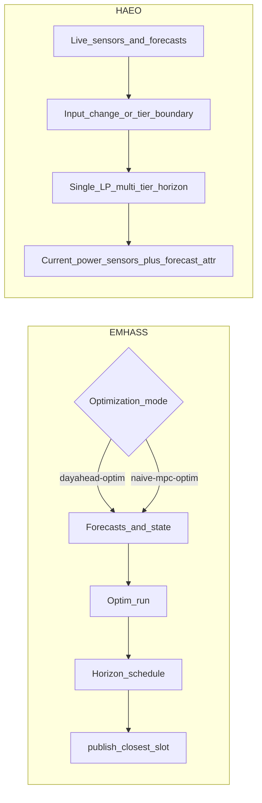

# HAEO vs EMHASS

When exploring energy optimization solutions for Home Assistant, you'll likely encounter two actively maintained projects: HAEO and EMHASS.
Both aim to optimize home energy usage but take fundamentally different architectural approaches.
This page provides a fair, technical comparison to help you choose the solution that best fits your needs.

## Quick comparison

| Feature                   | HAEO                                 | EMHASS                                               |
| ------------------------- | ------------------------------------ | ---------------------------------------------------- |
| **Type**                  | Native integration                   | Add-on or Docker/standalone service                  |
| **Maintenance**           | Active                               | Active                                               |
| **Installation**          | HACS → Integration                   | Add-on store, Docker, or standalone                  |
| **HA requirements**       | Any installation method              | Add-on needs OS/Supervised; Docker works anywhere    |
| **Configuration**         | UI-based                             | Web UI + configuration files                         |
| **Network topology**      | Flexible graph                       | Fixed structure                                      |
| **Optimization**          | Pure LP; MILP only when needed       | LP + MILP for deferrable loads                       |
| **Solver**                | HiGHS (bundled, only option)         | HiGHS (bundled default since v0.17)                  |
| **Typical price model**   | Volatile / real-time tariffs         | Day-ahead / stable daily schedules (MPC for dynamic) |
| **Optimization cadence**  | Automatic (events + tier boundaries) | Day-ahead (scheduled) or MPC (`naive-mpc-optim`)     |
| **Power policies**        | Source→target provenance pricing     | Global import/export and unit costs in config        |
| **Horizon resolution**    | Multi-tier (e.g. 1 min → 60 min)     | Uniform optimization timestep                        |
| **Forecasting**           | Via other HA integrations            | Built-in ML and solar forecasting                    |
| **Primary use case**      | Battery/solar/grid optimization      | Appliance scheduling + battery/solar                 |
| **Deferrable appliances** | Planned (LP-first; not yet)          | Core feature (full-horizon MILP)                     |
| **Multi-element support** | Multiple batteries/arrays/grids      | Limited                                              |
| **Integration method**    | Native HA sensors                    | Sensors + REST API + shell commands                  |

## Origins and optimization philosophy

The deepest differences are **how you price power by provenance**, **how often you re-optimize**, and **what each tool is best at scheduling**—not the solver or programming language alone.

### EMHASS: day-ahead origins, MPC for rolling horizons

EMHASS grew out of **European-style** residential setups where electricity prices for the **next day** are often known in advance (fixed tariffs, published day-ahead markets, or stable daily schedules).
The classic workflow is **`dayahead-optim`**: treat forecasts and prices for the horizon as given, solve once, save a **complete timestep schedule**, then **publish** the power setpoint for the **closest timestep** to the current time.

That model fits when you want every slot in the day filled with a planned action ahead of time—especially **deferrable loads** (washing machines, EV chargers, pool pumps) that need explicit on/off scheduling.
Deferrable loads use **mixed-integer** variables (binary on/off and startup decisions), with an automatic **LP relaxation fallback** if the MILP solve fails or times out.

EMHASS is **not limited to a single daily run**.
The **`naive-mpc-optim`** action implements rolling-horizon control: re-run the optimizer on a schedule you define (for example, every 30 minutes), passing updated battery SOC, deferrable-load remaining hours, and fresh forecasts as **runtime parameters**.
Each run replaces the published horizon schedule; automations still follow the current `sensor.p_*` values.
This is well suited to dynamic tariffs and changing state, but you wire the cadence yourself (automations, `rest_command`, or shell calls)—it is not built into the Home Assistant integration the way HAEO's event-driven coordinator is.
See the [EMHASS MPC study case](https://emhass.readthedocs.io/en/latest/study_cases/mpc.html).

Since the v0.17 rewrite, EMHASS uses **CVXPY** with vectorized constraint building and defaults to **HiGHS** as its solver, with substantially faster solves than earlier releases.
Day-ahead remains the most documented entry point; MPC is the path for volatile prices within EMHASS.

### HAEO: continuous re-optimization

HAEO was designed for **volatile, frequently changing** electricity markets—typical of **Australian** deployments using integrations such as [Amber Electric](https://www.home-assistant.io/integrations/amberelectric/) or [AEMO NEM](https://www.home-assistant.io/integrations/aemo/)—where spot or forecast prices can shift materially within the day.
Rather than locking in a full day plan when prices were fixed, HAEO **re-optimizes** whenever inputs change (debounced) and at **finest-tier** horizon boundaries so the **current** recommended power tracks live conditions.

HAEO uses a **single LP solve** over a **multi-tier** horizon—not two separate optimizers.
Near-term tiers use fine intervals (for example, 1-minute steps) for precise immediate decisions; distant tiers use coarser intervals (for example, 30–60 minutes) for multi-day **lookahead** without over-committing to hour-by-hour detail far in the future.
See [time discretization](../modeling/index.md#time-discretization) and [how data updates work](data-updates.md).

Results appear as native Home Assistant sensors with **current optimal power** plus **forecast attributes** for future intervals.
Automations read live sensor values rather than a pre-published daily CSV schedule.

Neither project is limited to one country.
For **volatile tariffs**, HAEO's native re-optimization is turnkey; EMHASS can match much of that behavior with **`naive-mpc-optim`** plus your own scheduling glue.
For **provenance-aware economics** (different value for the same kWh depending on whether it came from solar, grid, or battery), HAEO's **power policies** are a major differentiator—see below.

### HAEO power policies

HAEO's [**power policies**](../walkthroughs/power-policies.md) attach **source→destination** prices and limits to energy flow using a **tagged provenance** model ([modeling reference](../modeling/tagged-power.md)).
The optimizer distinguishes, for example, solar→load (free self-consumption) from solar→grid (feed-in tariff), or battery→load (cheap) from battery→grid (discouraged export)—without treating all power as fungible once it enters the network.

Policies compile into the linear program automatically and surface in the UI on a dedicated **Policies** device.
Battery charge/discharge costs, export incentives, and similar rules are expressed as policies rather than a single global import/export price.
EMHASS sets import/export unit costs and deferrable-load parameters in configuration; it does not offer an equivalent graph-wide provenance and policy compiler.

## Architectural differences

Beyond scheduling philosophy, the projects differ in scope and integration style:

**EMHASS** takes an integrated approach: forecasting, machine learning, thermal loads, and deferrable load scheduling live in one package with a more standard system topology.

**HAEO** follows the Unix philosophy: do one thing well.
It focuses on optimization with a flexible graph-based network model, **power policies for source-aware economics**, and relies on other Home Assistant integrations for forecasts and prices.
The network solve is **pure LP by default**; mixed-integer variables are a **last resort** when linear modeling cannot match the required behaviour (see [Deferrable loads (planned)](#deferrable-loads-planned)).
The flexibility to model diverse topologies through connections (and Advanced Mode elements) is its defining software-architecture characteristic.

## EMHASS

[GitHub](https://github.com/davidusb-geek/emhass) • [Documentation](https://emhass.readthedocs.io/) • [Community discussion](https://community.home-assistant.io/t/emhass-an-energy-management-for-home-assistant/338126)

**Status**: Actively maintained, mature project with established community

### Overview

EMHASS (Energy Management for Home Assistant) is a Python service (Home Assistant add-on, Docker, or standalone) that optimizes home energy management.
Its origins are **day-ahead** scheduling; **`naive-mpc-optim`** adds rolling-horizon re-runs for dynamic prices and updated state.
It excels at scheduling deferrable loads (washing machines, dishwashers, EV chargers, pool pumps) to minimize costs and maximize self-consumption of solar energy.

### Strengths

- **Rolling MPC mode**: `naive-mpc-optim` re-optimizes on a user-defined cadence with fresh SOC, forecasts, and deferrable-load windows
- **Deferrable load MILP**: Binary variables model on/off and startup decisions for true appliance scheduling (with LP fallback)
- **Fast modern backend**: CVXPY vectorization and bundled HiGHS (see [EMHASS v0.17 release notes](https://github.com/davidusb-geek/emhass/blob/master/CHANGELOG.md))
- **Built-in forecasting**: Includes machine learning-based load forecasting and integrates with solar forecasting services (Solcast, Forecast.Solar)
- **Purpose-built for deferrable loads**: Designed specifically for appliance scheduling and load management
- **Mature and proven**: Established project with large community, extensive real-world deployments, and comprehensive documentation
- **Separate machine capability**: Can run on a different machine than Home Assistant, beneficial for resource-constrained systems
- **Simple installation**: Direct installation from Home Assistant add-on store
- **Thermal load support**: Can model and optimize thermal loads (hot water heaters, etc.)

### Limitations

- **Add-on requires HA OS/Supervised**: The Home Assistant add-on does not run on Container or Core; Docker/standalone is an alternative install path
- **Fixed network topology**: Less flexible for modeling custom or complex system architectures
- **Configuration complexity**: Despite simpler architecture, configuration can be complex and requires understanding many parameters
- **Limited multi-element support**: Harder to model multiple batteries, arrays, or custom grid configurations
- **Integration overhead**: Uses combination of sensors, REST API, and shell commands rather than native integration
- **No provenance policies**: Economics are configured via global costs and load parameters, not source→target flow rules across the network
- **MPC is DIY**: Continuous re-optimization requires automations or external triggers; not event-driven inside HA by default

### Best for

- Day-ahead or stable daily electricity tariffs (or MPC with automations for dynamic tariffs)
- Users needing discrete appliance/load scheduling
- Those wanting built-in ML and solar forecasting
- Home Assistant OS or Supervised (add-on) or Docker/standalone deployments
- Standard solar + battery + grid setups
- Resource-constrained HA instances (can offload to separate machine)
- Users preferring add-on installation model
- Systems with thermal loads

## HAEO

[GitHub](https://github.com/hass-energy/haeo) • [Documentation](../index.md) • [GitHub discussions](https://github.com/hass-energy/haeo/discussions)

**Status**: Actively maintained, newer project

### Overview

HAEO (Home Assistant Energy Optimizer) is a native Home Assistant integration that optimizes energy networks through flexible topology modeling.
It targets **volatile price environments** with continuous re-optimization and a **multi-tier** planning horizon.
Its key innovations are **power policies** for provenance-aware economics and modeling diverse system structures through connections between elements.

### How HAEO chooses what to do now

On each optimization cycle, HAEO solves one LP over all tiers and publishes **current optimal power** on element sensors, with **forecast attributes** for upcoming intervals.
When Amber, AEMO, or other price sensors update, debounced re-optimization adjusts the near-term plan without requiring a separate day-ahead job.
Match tier 1 duration to your fastest-updating price or forecast sensor for best results in volatile markets.

### Strengths

- **Power policies**: Source→target pricing and limits with tagged provenance—model self-consumption vs export, battery export premiums, and chain-specific costs in one optimization ([power policies walkthrough](../walkthroughs/power-policies.md))
- **Flexible network topology**: Model any system structure through connections. Graph-based approach enables emergent behavior for complex systems
- **Native Home Assistant integration**: Works with any HA installation method (OS, Supervised, Container, Core)
- **Full UI configuration**: Everything configurable through Home Assistant's UI with organized devices
- **Multiple element support**: Easy support for multiple batteries, solar arrays, grids, and loads
- **Modern codebase**: Python 3.13+, platinum-level code quality standards, strong typing, comprehensive testing
- **Lower latency**: Runs alongside Home Assistant instance for minimal delay
- **Native sensor integration**: Sensors organized into devices, persist between reboots, leverage native HA features
- **Unique features**: Policy-driven battery charge/discharge and overcharge/undercharge economics, flexible network modeling via connections
- **Extensibility**: Graph structure allows modeling diverse energy systems without code changes

### Limitations (today)

- **No deferrable loads yet**: Appliance on/off scheduling is not available in HAEO today; use EMHASS (or fixed/forecast loads) until deferrable support ships
- **Graph complexity**: Requires understanding topology and connection concepts, which adds initial learning curve
- **Smaller community**: Less historical deployment volume than EMHASS, though actively developed
- **Requires HACS**: Additional step before installation (though HACS is very common)
- **Setup complexity**: Flexibility means more configuration options and decisions
- **External forecasting dependency**: Relies entirely on other HA integrations for forecast data

### Deferrable loads (planned) {#deferrable-loads-planned}

HAEO treats **mixed-integer programming (MILP) as a tool of last resort**.
The goal is to keep the main solve **pure LP** for performance on Home Assistant hardware, and add integers only when no linear formulation can achieve the same outcome.

Deferrable appliance support is **planned** with that philosophy—it is not a port of EMHASS's full-horizon MILP schedule.
The current **design direction** (element types, constraints, and UI still open) is:

- Keep the **tiered LP** for batteries, grid, solar, and policies across the horizon.
- Prefer **linear** ways to represent deferrable behaviour (forecast-shaped load, penalties, slacks) wherever they are good enough.
- If a discrete **run-now** decision truly needs integers (for example, whether to start a load this interval), use a **minimal** integer part for that decision—not a separate on/off binary for every future timestep.
- Leave **later intervals continuous** on the existing time grid.

Treat this as **design intent**, not a committed roadmap.
Until it ships, EMHASS remains the practical choice for full deferrable MILP scheduling, including feeding published load forecasts into HAEO as described in [Can you use both?](#can-you-use-both).

**Tradeoffs (today)**: HAEO optimizes the whole network in LP with policies; EMHASS embeds rich per-slot deferrable MILP in a fixed template.
That LP-first stance is expected to continue: deferrables will use MILP only where LP cannot substitute.

### Best for

- Volatile or real-time electricity pricing with native event-driven re-optimization (for example, Australian spot or 30-minute tariffs)
- Source-aware tariffs and incentives (solar export, battery export limits, chain-specific costs) via power policies
- Complex or custom system topologies
- Users with multiple batteries, arrays, or grids
- Home Assistant Container or Core installations
- Those preferring native HA integration
- Users valuing UI-based configuration
- Systems needing modeling flexibility (AC/DC splits, hybrid inverters, multiple meters)
- Users who prioritize modern code quality and software architecture
- Systems requiring flexible battery SOC pricing strategies (overcharge/undercharge economics)

## Technical comparison

### Network modeling

| Feature                     | HAEO                         | EMHASS        |
| --------------------------- | ---------------------------- | ------------- |
| Multiple batteries          | Yes (unlimited)              | Limited       |
| Multiple solar arrays       | Yes (unlimited)              | Limited       |
| Custom topology             | Flexible graph               | Fixed         |
| Hybrid inverters            | Via connection configuration | Via config    |
| Multiple grids              | Yes                          | No            |
| Non-electric energy systems | Yes (via connections)        | Thermal loads |
| AC/DC network splits        | Yes (via connections)        | No            |

### Optimization

| Feature                        | HAEO                                            | EMHASS                               |
| ------------------------------ | ----------------------------------------------- | ------------------------------------ |
| Algorithm                      | Pure LP; MILP last resort (deferrables planned) | LP; MILP for deferrable loads        |
| Solver                         | HiGHS (only option)                             | HiGHS (default, bundled)             |
| Scheduling model               | Automatic continuous re-optimization            | Day-ahead or MPC (`naive-mpc-optim`) |
| Power policies (provenance)    | Yes (UI + tagged-flow compiler)                 | No (global/unit costs in config)     |
| Discrete decisions             | LP-first; integers only if needed (planned)     | Yes for deferrable loads (on/off)    |
| Time horizon                   | Tier presets or custom (multi-day)              | Configurable                         |
| Time resolution                | Multi-tier (per-tier interval duration)         | Uniform `optimization_time_step`     |
| Battery management             | Charge/discharge rates                          | Charge/discharge                     |
| Overcharge/undercharge pricing | Yes (economic)                                  | No                                   |

### Integration and setup

| Feature             | HAEO                                  | EMHASS                                                    |
| ------------------- | ------------------------------------- | --------------------------------------------------------- |
| Installation method | HACS → Integration                    | Add-on store, Docker, or standalone                       |
| HA compatibility    | All (OS, Supervised, Container, Core) | Native add-on: OS/Supervised; Docker: any HA install type |
| Configuration       | Full UI-based                         | Web UI + YAML files                                       |
| Learning curve      | Moderate (graph/topology concepts)    | Moderate (many config parameters)                         |
| Setup complexity    | High flexibility = more decisions     | Simpler architecture, complex config                      |
| Documentation       | Growing                               | Extensive, mature                                         |
| Community size      | Smaller (newer)                       | Larger (established)                                      |

### Features

| Feature              | HAEO                                            | EMHASS                          |
| -------------------- | ----------------------------------------------- | ------------------------------- |
| Power policies       | Yes (core differentiator)                       | No                              |
| Forecasting          | Via HA integrations (modular)                   | Built-in ML + solar forecasting |
| Sensor integration   | Native HA devices and sensors                   | Published sensors + REST API    |
| Deferrable loads     | Planned (LP-first; use EMHASS until then)       | Yes (core feature)              |
| Thermal loads        | Not yet                                         | Yes (built-in)                  |
| Appliance scheduling | Planned (see deferrable loads above)            | Yes (full-horizon MILP)         |
| Battery optimization | Yes (core feature)                              | Yes (core feature)              |
| Solar optimization   | Yes (core feature)                              | Yes (core feature)              |
| Control method       | HA automations with sensors                     | Shell commands, REST, sensors   |

## When to choose each solution

### Choose EMHASS if you

- Have day-ahead or stable daily electricity prices and want a full-day schedule
- Need discrete appliance or load scheduling (washing machine, EV charger timing)
- Want built-in machine learning and solar forecasting without installing separate integrations
- Prefer add-on installation model
- Need to run optimization on a separate machine (resource-constrained HA)
- Want an established project with proven track record and large community
- Need thermal load optimization
- Are running Home Assistant OS or Supervised

### Choose HAEO if you

- Have volatile or frequently updating electricity prices and need recommendations that track live data
- Have a complex or custom system topology that doesn't fit standard patterns
- Need to model multiple batteries, solar arrays, or grid connections
- Are running Home Assistant Container or Core (where add-ons aren't available)
- Prefer native Home Assistant integration with lower latency
- Want UI-based configuration for all settings
- Value modern codebase with strong typing and comprehensive testing
- Need battery overcharge/undercharge economic modeling
- Want to model non-standard systems (AC/DC splits, multiple meters, custom connections)
- Prioritize software quality and maintainability

## Can you use both?

Yes—and for some homes that is the best split of responsibilities.

HAEO and EMHASS overlap on battery and solar if you run full optimizations in both, which is usually redundant.
A practical **complementary** setup keeps each tool focused on what it does best:

| Role                                                    | Tool       | What it does                                                 |
| ------------------------------------------------------- | ---------- | ------------------------------------------------------------ |
| Deferrable loads, thermal storage, ML load/PV forecasts | **EMHASS** | MILP scheduling for appliances, heat pumps, EV windows, etc. |
| Battery, grid, solar, topology, provenance pricing      | **HAEO**   | Continuous LP over your network with **power policies**      |

**Feeding EMHASS into HAEO**

After EMHASS publishes optimization sensors (for example `sensor.p_deferrable0`, load forecasts, or price forecasts), point HAEO **Load** (or other) element inputs at those entities as **entity-driven** forecasts.
HAEO auto-detects the [`emhass` forecast format](forecasts-and-sensors.md#supported-forecast-formats) and fuses the series onto its tiered horizon—same as Amber, Nordpool, or other supported integrations.

Typical wiring:

1. EMHASS runs `dayahead-optim` or `naive-mpc-optim` and `publish-data` for deferrable loads and optional load/PV forecasts.
2. HAEO models the **aggregate** system (battery, grid, solar, inverter topology) and treats EMHASS-scheduled consumption as **known or forecast load** on a Load element.
3. HAEO optimizes when to import, export, charge, or curtail given that load shape and your policies—not re-solving appliance on/off windows.

!!! tip "Avoid double control"

    Do not let HAEO and EMHASS both command the same battery or the same deferrable load without clear separation.
    Use EMHASS for scheduled loads; use HAEO sensors for grid/battery/inverter automations (or the reverse scope per device).

Many users still pick **one** optimizer for simplicity.
If you need deferrable-load MILP **and** HAEO's policies or graph topology, combining them is a supported and documented path—not a hack.

## Making your choice

Consider these factors:

1. **Price volatility**: Stable day-ahead tariffs → EMHASS `dayahead-optim`; volatile tariffs → HAEO native updates or EMHASS `naive-mpc-optim` with automations
2. **Provenance pricing**: Chain-specific solar/battery/grid economics → HAEO policies; global tariff + loads → EMHASS
3. **System complexity**: Simple standard setup → either works; complex topology → HAEO
4. **Installation method**: HA OS/Supervised add-on → either works; Container/Core native → HAEO; EMHASS via Docker possible on any install
5. **Optimization type**: Full-horizon deferrable MILP today → EMHASS; battery/solar/grid with provenance policies → HAEO (deferrables planned, LP-first with MILP only if needed)
6. **Configuration preference**: UI-based → HAEO; file-based acceptable → EMHASS
7. **Forecasting**: Want built-in → EMHASS; happy using other integrations → HAEO
8. **Project maturity**: Want longest track record → EMHASS; modern native integration → HAEO
9. **Resource constraints**: Need separate machine → EMHASS; prefer integrated → HAEO
10. **Combined stack**: Deferrable/thermal scheduling in EMHASS, network + policies in HAEO with EMHASS sensors as inputs

## Getting help

### HAEO support

- [GitHub issues](https://github.com/hass-energy/haeo/issues) - Bug reports and feature requests
- [GitHub discussions](https://github.com/hass-energy/haeo/discussions) - Questions and community support
- [Documentation](../index.md) - Comprehensive guides

### EMHASS support

- [GitHub repository](https://github.com/davidusb-geek/emhass) - Code and issues
- [Documentation](https://emhass.readthedocs.io/) - Setup and configuration guides
- [Community forum](https://community.home-assistant.io/t/emhass-an-energy-management-for-home-assistant/338126) - Active discussion thread

## Conclusion

Both HAEO and EMHASS are actively maintained, quality projects that solve real energy optimization problems for Home Assistant users.
Both now use **HiGHS** as their default solver—the meaningful differences are **power policies**, **scheduling setup**, **topology flexibility**, and **integration model**:

- **EMHASS**: Day-ahead or MPC (`naive-mpc-optim`), integrated forecasting, full-horizon MILP deferrable scheduling, mature community
- **HAEO**: Native continuous re-optimization, **power policies**, multi-tier **pure LP** horizon, modular forecasting, flexible graph topology; **deferrable loads planned** with LP-first design and MILP only as a last resort (not EMHASS-style per-slot binaries across the whole day)

Neither is objectively "better."
Choose based on whether you need **deferrable appliance scheduling today** (EMHASS), **source→target policy economics** (HAEO), **complex topologies** (HAEO), and how you want to handle **volatile prices**—HAEO out of the box, or EMHASS with MPC automations you maintain yourself.
You can also **combine** them: EMHASS schedules loads and publishes forecasts; HAEO ingests those sensors and optimizes the rest of the network until native deferrable support is available.

## Next steps

- :material-download:{ .lg .middle } **Install HAEO**

    ---

    Get started with HAEO by installing it through HACS and setting up your first energy network.

    [:material-arrow-right: Installation guide](installation.md)

- :material-connection:{ .lg .middle } **Understand forecasting**

    ---

    Learn how HAEO uses forecast data from Home Assistant sensors to optimize your energy system.

    [:material-arrow-right: Forecasts and sensors](forecasts-and-sensors.md)

- :material-help-circle:{ .lg .middle } **Troubleshooting**

    ---

    Find solutions to common issues and get help with HAEO configuration.

    [:material-arrow-right: Troubleshooting guide](troubleshooting.md)

- :material-github:{ .lg .middle } **Join the community**

    ---

    Connect with other HAEO users, ask questions, and share your experiences.

    [:material-arrow-right: GitHub discussions](https://github.com/hass-energy/haeo/discussions)

