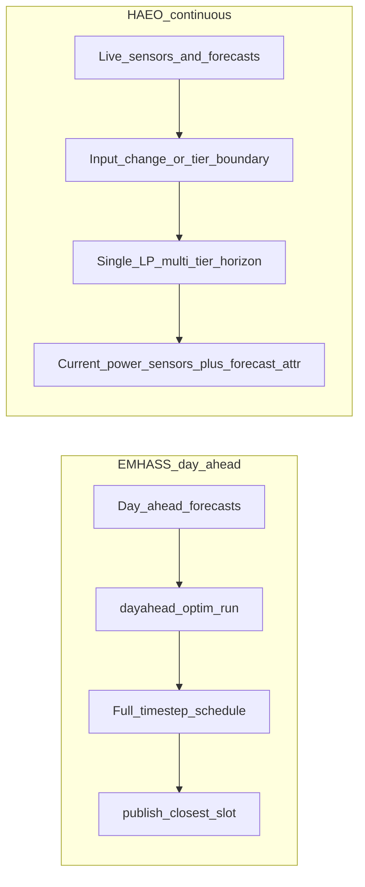

# HAEO vs EMHASS

When exploring energy optimization solutions for Home Assistant, you'll likely encounter two actively maintained projects: HAEO and EMHASS.
Both aim to optimize home energy usage but take fundamentally different architectural approaches.
This page provides a fair, technical comparison to help you choose the solution that best fits your needs.

## Quick comparison

| Feature                   | HAEO                                  | EMHASS                                            |
| ------------------------- | ------------------------------------- | ------------------------------------------------- |
| **Type**                  | Native integration                    | Add-on or Docker/standalone service               |
| **Maintenance**           | Active                                | Active                                            |
| **Installation**          | HACS → Integration                    | Add-on store, Docker, or standalone               |
| **HA requirements**       | Any installation method               | Add-on needs OS/Supervised; Docker works anywhere |
| **Configuration**         | UI-based                              | Web UI + configuration files                      |
| **Network topology**      | Flexible graph                        | Fixed structure                                   |
| **Optimization**          | Linear programming (LP)               | LP + MILP for deferrable loads                    |
| **Solver**                | HiGHS (bundled, only option)          | HiGHS (bundled default since v0.17)               |
| **Typical price model**   | Volatile / real-time tariffs          | Day-ahead / stable daily schedules                |
| **Optimization cadence**  | Continuous (events + tier boundaries) | Day-ahead run + publish current timestep          |
| **Horizon resolution**    | Multi-tier (e.g. 1 min → 60 min)      | Uniform optimization timestep                     |
| **Forecasting**           | Via other HA integrations             | Built-in ML and solar forecasting                 |
| **Primary use case**      | Battery/solar/grid optimization       | Appliance scheduling + battery/solar              |
| **Deferrable appliances** | Not supported (by design)             | Core feature (MILP)                               |
| **Multi-element support** | Multiple batteries/arrays/grids       | Limited                                           |
| **Integration method**    | Native HA sensors                     | Sensors + REST API + shell commands               |

## Origins and optimization philosophy

The deepest difference between HAEO and EMHASS is not the solver or programming language—it is **when and how** each project expects you to commit to a schedule.

### EMHASS: day-ahead planning

EMHASS grew out of **European-style** residential setups where electricity prices for the **next day** are often known in advance (fixed tariffs, published day-ahead markets, or stable daily schedules).
The primary workflow is **`dayahead-optim`**: treat forecasts and prices for the horizon as given, solve once, save a **complete timestep schedule**, then **publish** the power setpoint for the **closest timestep** to the current time.

That model fits when you want every slot in the day filled with a planned action ahead of time—especially **deferrable loads** (washing machines, EV chargers, pool pumps) that need explicit on/off scheduling.
Deferrable loads use **mixed-integer** variables (binary on/off and startup decisions), with an automatic **LP relaxation fallback** if the MILP solve fails or times out.

Since the v0.17 rewrite, EMHASS uses **CVXPY** with vectorized constraint building and defaults to **HiGHS** as its solver (~0.1s typical for standard cases).
Day-ahead remains the mental model even though the engine is much faster than earlier releases.

### HAEO: continuous re-optimization

HAEO was designed for **volatile, frequently changing** electricity markets—typical of **Australian** deployments using integrations such as [Amber Electric](https://www.home-assistant.io/integrations/amberelectric/) or [AEMO NEM](https://www.home-assistant.io/integrations/aemo/)—where spot or forecast prices can shift materially within the day.
Rather than locking in a full day plan when prices were fixed, HAEO **re-optimizes** whenever inputs change (debounced) and at **finest-tier** horizon boundaries so the **current** recommended power tracks live conditions.

HAEO uses a **single LP solve** over a **multi-tier** horizon—not two separate optimizers.
Near-term tiers use fine intervals (for example, 1-minute steps) for precise immediate decisions; distant tiers use coarser intervals (for example, 30–60 minutes) for multi-day **lookahead** without over-committing to hour-by-hour detail far in the future.
See [time discretization](../../modeling/index.md#time-discretization) and [how data updates work](data-updates.md).

Results appear as native Home Assistant sensors with **current optimal power** plus **forecast attributes** for future intervals.
Automations read live sensor values rather than a pre-published daily CSV schedule.

Neither project is limited to one country—choose based on whether your tariffs and workflows look more like **stable day-ahead planning** or **continuous response to changing prices**.

## Architectural differences

Beyond scheduling philosophy, the projects differ in scope and integration style:

**EMHASS** takes an integrated approach: forecasting, machine learning, thermal loads, and deferrable load scheduling live in one package with a more standard system topology.

**HAEO** follows the Unix philosophy: do one thing well.
It focuses on optimization with a flexible graph-based network model and relies on other Home Assistant integrations for forecasts and prices.
The flexibility to model diverse topologies through connections (and Advanced Mode elements) is its defining software-architecture characteristic.

## EMHASS

[GitHub](https://github.com/davidusb-geek/emhass) • [Documentation](https://emhass.readthedocs.io/) • [Community discussion](https://community.home-assistant.io/t/emhass-an-energy-management-for-home-assistant/338126)

**Status**: Actively maintained, mature project with established community

### Overview

EMHASS (Energy Management for Home Assistant) is a Python service (Home Assistant add-on, Docker, or standalone) that optimizes home energy management through **day-ahead optimization**.
It excels at scheduling deferrable loads (washing machines, dishwashers, EV chargers, pool pumps) to minimize costs and maximize self-consumption of solar energy.

### Strengths

- **Deferrable load MILP**: Binary variables model on/off and startup decisions for true appliance scheduling (with LP fallback)
- **Fast modern backend**: CVXPY vectorization and bundled HiGHS deliver sub-second solves for typical configurations
- **Built-in forecasting**: Includes machine learning-based load forecasting and integrates with solar forecasting services (Solcast, Forecast.Solar)
- **Purpose-built for deferrable loads**: Designed specifically for appliance scheduling and load management
- **Mature and proven**: Established project with large community, extensive real-world deployments, and comprehensive documentation
- **Separate machine capability**: Can run on a different machine than Home Assistant, beneficial for resource-constrained systems
- **Simple installation**: Direct installation from Home Assistant add-on store
- **Thermal load support**: Can model and optimize thermal loads (hot water heaters, etc.)

### Limitations

- **Add-on requires HA OS/Supervised**: The Home Assistant add-on does not run on Container or Core; Docker/standalone is an alternative install path
- **Fixed network topology**: Less flexible for modeling custom or complex system architectures
- **Configuration complexity**: Despite simpler architecture, configuration can be complex and requires understanding many parameters
- **Limited multi-element support**: Harder to model multiple batteries, arrays, or custom grid configurations
- **Integration overhead**: Uses combination of sensors, REST API, and shell commands rather than native integration

### Best for

- Day-ahead or stable daily electricity tariffs
- Users needing discrete appliance/load scheduling
- Those wanting built-in ML and solar forecasting
- Home Assistant OS or Supervised (add-on) or Docker/standalone deployments
- Standard solar + battery + grid setups
- Resource-constrained HA instances (can offload to separate machine)
- Users preferring add-on installation model
- Systems with thermal loads

## HAEO

[GitHub](https://github.com/hass-energy/haeo) • [Documentation](../index.md) • [GitHub discussions](https://github.com/hass-energy/haeo/discussions)

**Status**: Actively maintained, newer project

### Overview

HAEO (Home Assistant Energy Optimizer) is a native Home Assistant integration that optimizes energy networks through flexible topology modeling.
It targets **volatile price environments** with continuous re-optimization and a **multi-tier** planning horizon.
Its key software innovation is modeling diverse system structures through connections between elements, enabling custom configurations that emerge from the graph itself.

### How HAEO chooses what to do now

On each optimization cycle, HAEO solves one LP over all tiers and publishes **current optimal power** on element sensors, with **forecast attributes** for upcoming intervals.
When Amber, AEMO, or other price sensors update, debounced re-optimization adjusts the near-term plan without requiring a separate day-ahead job.
Match tier 1 duration to your fastest-updating price or forecast sensor for best results in volatile markets.

### Strengths

- **Flexible network topology**: Model any system structure through connections - the strongest differentiator. Graph-based approach enables emergent behavior for complex systems
- **Native Home Assistant integration**: Works with any HA installation method (OS, Supervised, Container, Core)
- **Full UI configuration**: Everything configurable through Home Assistant's UI with organized devices
- **Multiple element support**: Easy support for multiple batteries, solar arrays, grids, and loads
- **Modern codebase**: Python 3.13+, platinum-level code quality standards, strong typing, comprehensive testing
- **Lower latency**: Runs alongside Home Assistant instance for minimal delay
- **Native sensor integration**: Sensors organized into devices, persist between reboots, leverage native HA features
- **Unique features**: Battery overcharge/undercharge pricing (economic incentives for extended SOC ranges), flexible network modeling via connections
- **Extensibility**: Graph structure allows modeling diverse energy systems without code changes

### Limitations

- **Continuous optimization**: Linear programming only (MILP intentionally avoided for simplicity and solve speed), cannot optimize discrete appliance on/off decisions
- **Graph complexity**: Requires understanding topology and connection concepts, which adds initial learning curve
- **Smaller community**: Less historical deployment volume than EMHASS, though actively developed
- **Requires HACS**: Additional step before installation (though HACS is very common)
- **Setup complexity**: Flexibility means more configuration options and decisions
- **External forecasting dependency**: Relies entirely on other HA integrations for forecast data
- **Missing features**: Thermal loads and deferrable load scheduling are planned future additions

**Tradeoffs**: HAEO trades appliance scheduling capability for simpler configuration, faster solve times, and more flexible network topology modeling.
The linear programming approach ensures reliable sub-second optimization even on resource-constrained hardware.

### Best for

- Volatile or real-time electricity pricing (for example, Australian spot or 30-minute tariffs)
- Complex or custom system topologies
- Users with multiple batteries, arrays, or grids
- Home Assistant Container or Core installations
- Those preferring native HA integration
- Users valuing UI-based configuration
- Systems needing modeling flexibility (AC/DC splits, hybrid inverters, multiple meters)
- Users who prioritize modern code quality and software architecture
- Systems requiring flexible battery SOC pricing strategies (overcharge/undercharge economics)

## Technical comparison

### Network modeling

| Feature                     | HAEO                         | EMHASS        |
| --------------------------- | ---------------------------- | ------------- |
| Multiple batteries          | Yes (unlimited)              | Limited       |
| Multiple solar arrays       | Yes (unlimited)              | Limited       |
| Custom topology             | Flexible graph               | Fixed         |
| Hybrid inverters            | Via connection configuration | Via config    |
| Multiple grids              | Yes                          | No            |
| Non-electric energy systems | Yes (via connections)        | Thermal loads |
| AC/DC network splits        | Yes (via connections)        | No            |

### Optimization

| Feature                        | HAEO                                    | EMHASS                                    |
| ------------------------------ | --------------------------------------- | ----------------------------------------- |
| Algorithm                      | Linear programming (LP)                 | LP; MILP for deferrable loads             |
| Solver                         | HiGHS (only option)                     | HiGHS (default, bundled)                  |
| Scheduling model               | Continuous re-optimization              | Day-ahead schedule + publish closest slot |
| Discrete decisions             | No (continuous only)                    | Yes for deferrable loads (on/off control) |
| Time horizon                   | Tier presets or custom (multi-day)      | Configurable                              |
| Time resolution                | Multi-tier (per-tier interval duration) | Uniform `optimization_time_step`          |
| Battery management             | Charge/discharge rates                  | Charge/discharge                          |
| Overcharge/undercharge pricing | Yes (economic)                          | No                                        |

### Integration and setup

| Feature             | HAEO                                  | EMHASS                                                    |
| ------------------- | ------------------------------------- | --------------------------------------------------------- |
| Installation method | HACS → Integration                    | Add-on store, Docker, or standalone                       |
| HA compatibility    | All (OS, Supervised, Container, Core) | Native add-on: OS/Supervised; Docker: any HA install type |
| Configuration       | Full UI-based                         | Web UI + YAML files                                       |
| Learning curve      | Moderate (graph/topology concepts)    | Moderate (many config parameters)                         |
| Setup complexity    | High flexibility = more decisions     | Simpler architecture, complex config                      |
| Documentation       | Growing                               | Extensive, mature                                         |
| Community size      | Smaller (newer)                       | Larger (established)                                      |

### Features

| Feature              | HAEO                          | EMHASS                          |
| -------------------- | ----------------------------- | ------------------------------- |
| Forecasting          | Via HA integrations (modular) | Built-in ML + solar forecasting |
| Sensor integration   | Native HA devices and sensors | Published sensors + REST API    |
| Deferrable loads     | Not yet (planned)             | Yes (core feature)              |
| Thermal loads        | Planned                       | Yes (built-in)                  |
| Appliance scheduling | Not yet (planned)             | Yes (MILP-based)                |
| Battery optimization | Yes (core feature)            | Yes (core feature)              |
| Solar optimization   | Yes (core feature)            | Yes (core feature)              |
| Control method       | HA automations with sensors   | Shell commands, REST, sensors   |

## When to choose each solution

### Choose EMHASS if you

- Have day-ahead or stable daily electricity prices and want a full-day schedule
- Need discrete appliance or load scheduling (washing machine, EV charger timing)
- Want built-in machine learning and solar forecasting without installing separate integrations
- Prefer add-on installation model
- Need to run optimization on a separate machine (resource-constrained HA)
- Want an established project with proven track record and large community
- Need thermal load optimization
- Are running Home Assistant OS or Supervised

### Choose HAEO if you

- Have volatile or frequently updating electricity prices and need recommendations that track live data
- Have a complex or custom system topology that doesn't fit standard patterns
- Need to model multiple batteries, solar arrays, or grid connections
- Are running Home Assistant Container or Core (where add-ons aren't available)
- Prefer native Home Assistant integration with lower latency
- Want UI-based configuration for all settings
- Value modern codebase with strong typing and comprehensive testing
- Need battery overcharge/undercharge economic modeling
- Want to model non-standard systems (AC/DC splits, multiple meters, custom connections)
- Prioritize software quality and maintainability

## Can you use both?

Technically, yes.
They have overlapping capabilities but could be complementary:

- **HAEO** for battery and solar optimization with flexible topology
- **EMHASS** for discrete appliance scheduling

However, in practice, most users will choose one or the other since both handle battery and solar optimization, which creates redundancy.
The overlap is significant enough that running both adds complexity without major benefit for most systems.

## Making your choice

Consider these factors:

1. **Price volatility**: Stable day-ahead tariffs → EMHASS; volatile real-time tariffs → HAEO
2. **System complexity**: Simple standard setup → either works; complex topology → HAEO
3. **Installation method**: HA OS/Supervised add-on → either works; Container/Core native → HAEO; EMHASS via Docker possible on any install
4. **Optimization type**: Appliance scheduling → EMHASS; battery/solar/grid continuous control → HAEO
5. **Configuration preference**: UI-based → HAEO; file-based acceptable → EMHASS
6. **Forecasting**: Want built-in → EMHASS; happy using other integrations → HAEO
7. **Project maturity**: Want longest track record → EMHASS; modern native integration → HAEO
8. **Resource constraints**: Need separate machine → EMHASS; prefer integrated → HAEO

## Getting help

### HAEO support

- [GitHub issues](https://github.com/hass-energy/haeo/issues) - Bug reports and feature requests
- [GitHub discussions](https://github.com/hass-energy/haeo/discussions) - Questions and community support
- [Documentation](../index.md) - Comprehensive guides

### EMHASS support

- [GitHub repository](https://github.com/davidusb-geek/emhass) - Code and issues
- [Documentation](https://emhass.readthedocs.io/) - Setup and configuration guides
- [Community forum](https://community.home-assistant.io/t/emhass-an-energy-management-for-home-assistant/338126) - Active discussion thread

## Conclusion

Both HAEO and EMHASS are actively maintained, quality projects that solve real energy optimization problems for Home Assistant users.
Both now use **HiGHS** as their default solver—the meaningful differences are **scheduling philosophy**, **topology flexibility**, and **integration model**:

- **EMHASS**: Day-ahead planning, integrated forecasting, MILP-based deferrable load scheduling, mature community
- **HAEO**: Continuous re-optimization over a multi-tier horizon, modular forecasting, flexible graph topology, native HA integration

Neither is objectively "better."
Choose based on whether your electricity market and workflow favor a **pre-planned daily schedule** (EMHASS) or **ongoing response to changing prices** (HAEO), plus whether you need **appliance on/off scheduling** or **complex multi-element topologies**.

## Next steps

- :material-download:{ .lg .middle } **Install HAEO**

    ---

    Get started with HAEO by installing it through HACS and setting up your first energy network.

    [:material-arrow-right: Installation guide](installation.md)

- :material-connection:{ .lg .middle } **Understand forecasting**

    ---

    Learn how HAEO uses forecast data from Home Assistant sensors to optimize your energy system.

    [:material-arrow-right: Forecasts and sensors](forecasts-and-sensors.md)

- :material-help-circle:{ .lg .middle } **Troubleshooting**

    ---

    Find solutions to common issues and get help with HAEO configuration.

    [:material-arrow-right: Troubleshooting guide](troubleshooting.md)

- :material-github:{ .lg .middle } **Join the community**

    ---

    Connect with other HAEO users, ask questions, and share your experiences.

    [:material-arrow-right: GitHub discussions](https://github.com/hass-energy/haeo/discussions)

