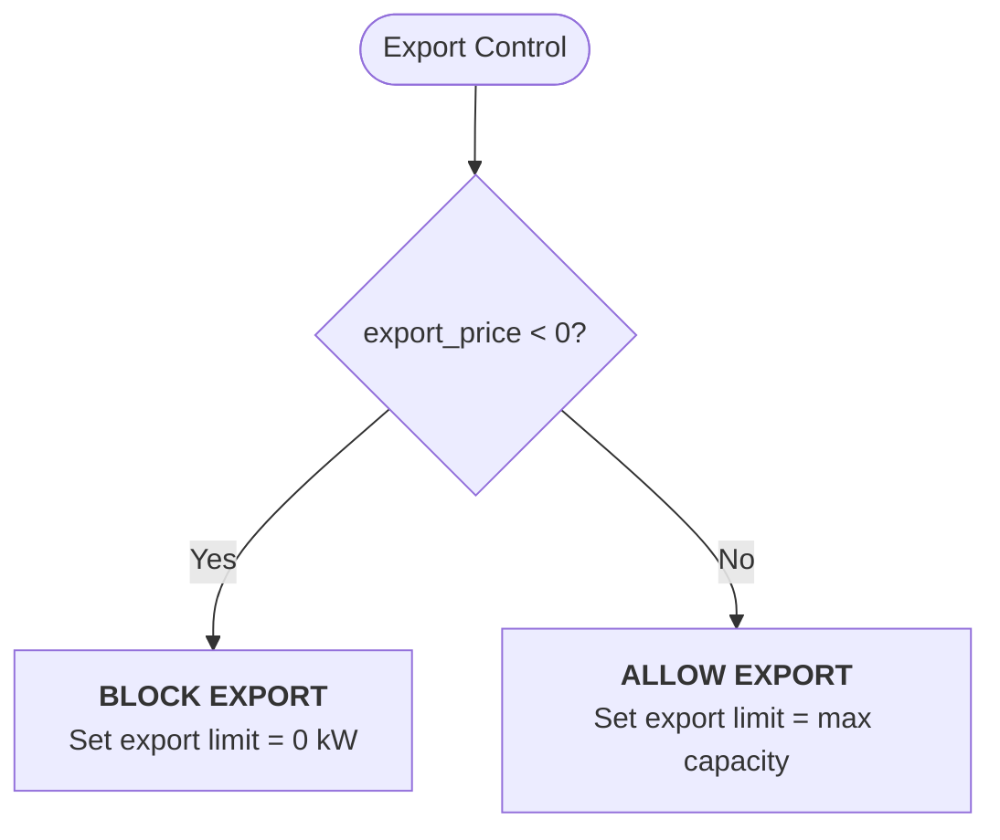
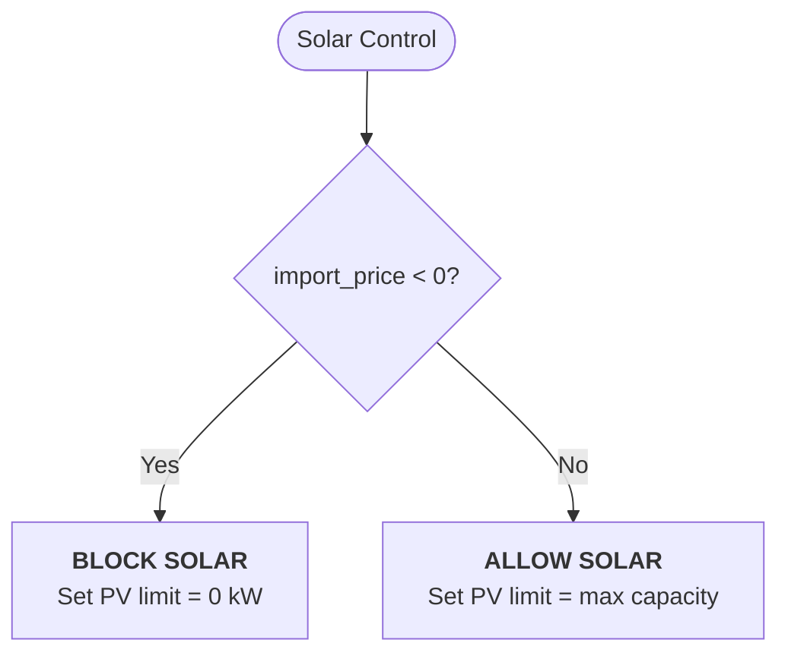
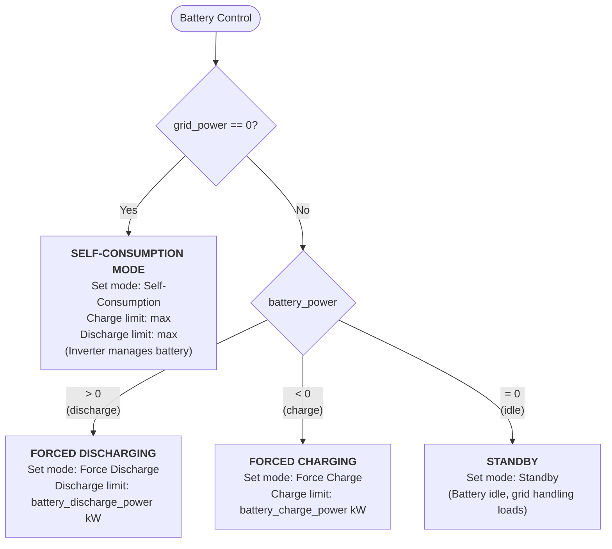

# Automation examples

This guide explains how to control your real-world battery and inverter systems using HAEO's optimization results.

## Overview

HAEO solves the optimization problem and tells you **what** should happen via sensors.
Your automations translate this into **how** to make it happen with your specific hardware.

This guide covers:

1. **Understanding HAEO outputs** - Which sensors to use
2. **Energy control concepts** - Power priorities and curtailment
3. **Operating modes** - How modes implement priorities
4. **Implementation patterns** - Examples using HAEO sensors

## Understanding HAEO Outputs

HAEO produces sensor outputs that represent the optimal energy plan. Your automation reads these sensors and configures your hardware accordingly.

These sensors are integration-agnostic—they work regardless of your electricity provider or pricing structure.

### Key Sensors

| HAEO Sensor                        | Unit   | Type   | Meaning                                                               |
| ---------------------------------- | ------ | ------ | --------------------------------------------------------------------- |
| **Battery**                        |        |        |                                                                       |
| `sensor.{battery}_charge_power`    | kW     | Output | Optimal battery charging power                                        |
| `sensor.{battery}_discharge_power` | kW     | Output | Optimal battery discharging power                                     |
| **Grid**                           |        |        |                                                                       |
| `sensor.{grid}_import_power`       | kW     | Output | Optimal grid import power                                             |
| `sensor.{grid}_export_power`       | kW     | Output | Optimal grid export power                                             |
| `number.{grid}_import_price`       | \$/kWh | Input  | Current price to buy from grid (aggregated from your pricing sources) |
| `number.{grid}_export_price`       | \$/kWh | Input  | Current price to sell to grid (aggregated from your pricing sources)  |
| **Solar**                          |        |        |                                                                       |
| `sensor.{solar}_power`             | kW     | Output | Optimal solar output                                                  |
| `number.{solar}_forecast`          | kW     | Input  | Solar forecast from weather integration                               |

**Sign convention**: Power sensors are always positive or zero.

- `charge_power` and `discharge_power` are mutually exclusive (only one can be > 0)
- `import_power` and `export_power` are mutually exclusive (only one can be > 0)

!!! tip "Detecting curtailment"

    Compare `sensor.{solar}_power` to `number.{solar}_forecast`:

    - **`solar_power < solar_forecast`**: Some curtailment is active (could be export or generation)
    - **`solar_power = 0` AND `solar_forecast > 0`**: Solar generation curtailed (grid pays you to import)
    - **`solar_power > 0` BUT `< solar_forecast`**: Export curtailed only (can't export at negative price)

!!! note "Configuration vs status"

    Entities like `switch.{solar}_curtailment` are **inputs** (configuration) that tell HAEO what's allowed, not **outputs** (status) showing what HAEO decided. Use the power sensors to determine actual operating state.

## Energy Control Concepts

HAEO's optimization determines the most economical way to operate your system based on all available information: forecasts, prices, constraints, and costs.
Rather than following fixed rules, understand what HAEO's outputs tell you about the optimal strategy.

### Understanding HAEO's Decisions

HAEO's sensors tell you **what to do** at each moment.
The combination of sensor values reveals the optimal strategy:

| HAEO Output Pattern                                       | What It Means         | System Configuration                                               |
| --------------------------------------------------------- | --------------------- | ------------------------------------------------------------------ |
| `grid_import_power` = 0, `grid_export_power` = 0          | No grid activity      | **Self-consumption mode**: Use solar for loads, excess to battery  |
| `battery_charge_power` > 0, `grid_import_power` > 0       | Charging from grid    | **Forced charging**: Grid prices are cheap, store for later        |
| `battery_discharge_power` > 0, `grid_export_power` > 0    | Discharging to grid   | **Forced discharging**: Export prices are high, sell stored energy |
| `battery_charge_power` = 0, `battery_discharge_power` = 0 | Battery idle          | **Standby**: Battery shouldn't charge or discharge right now       |
| `solar_power` < forecast                                  | Curtailing generation | **Curtailment active**: Using/exporting solar would lose money     |

!!! tip "Economic optimization, not fixed rules"

    HAEO doesn't follow fixed priority rules like "always use battery before grid."

    **Example**: If grid import price is -$0.10/kWh (you get paid to import) and export price later is $0.30/kWh, HAEO will:

    1. Import from grid NOW (getting paid \$0.10/kWh)
    2. Keep battery charged (not using stored energy)
    3. Export battery contents LATER (\$0.30/kWh revenue)

    Result: $0.40/kWh profit vs $0.30/kWh if you'd used battery first.

    The sensors encode these complex trade-offs—your automation just implements them.

### Self-Consumption vs Curtailment

These are different concepts:

**Self-consumption**: Using generated solar power locally instead of exporting

- HAEO output: `solar_power` used for loads/battery, not exported
- Usually economically favorable when import prices are positive

**Curtailment**: Intentionally limiting generation even when available

- HAEO output: `solar_power` < forecast
- Happens when using/exporting solar would cost money or is limited by constraints

**When curtailment occurs**:

1. **Negative export price**: `number.{grid}_export_price` < 0 (you'd pay to export)
2. **Negative import price**: `number.{grid}_import_price` < 0 (grid pays you to consume, so don't use solar)
3. **Export limit reached**: Battery full, loads satisfied, can't export more

### Curtailment Implementation

Curtailment controls are based on price signals, but are set independently from battery mode selection.

#### Export Curtailment

Negative export prices mean you'd pay to export electricity.

**Automation approach**: Check `export_price` and set grid export limit accordingly (see examples below)

**What HAEO does**: When export price is negative, HAEO's optimization won't recommend grid export

#### PV Curtailment

Negative import prices mean the grid pays you to import electricity.

**Automation approach**: Check `import_price` and set PV generation limit accordingly (see examples below)

**What HAEO does**: When import price is negative, HAEO may recommend curtailing solar (shown by `solar_power < solar_forecast`)

## Operating Modes

Most battery/inverter systems provide several operating modes.
Each mode implements a different priority configuration.

### Understanding Control vs Mode

**Four independent controls**:

1. **Solar power limit**: Allow full generation or curtail (0 kW)
2. **Grid export limit**: Allow export or curtail (0 kW)
3. **Battery charge rate**: Charge at specified rate or don't charge (0 kW)
4. **Battery discharge rate**: Discharge at specified rate or don't discharge (0 kW)

**Modes** are just labels for common combinations of these controls.

### Automation Approach

You can automate in two ways:

**Option A: Four separate automations** (recommended for clarity)

- Solar curtailment automation
- Export curtailment automation
- Battery charge automation
- Battery discharge automation

**Option B: One combined automation**

- Read all HAEO sensors
- Set all four controls based on decision trees below

### Automation Decision Trees

The automation logic is based on HAEO's power flow recommendations. Here's how to translate HAEO outputs into hardware controls:

#### 1. Export Curtailment (Price-based)



---

#### 2. Solar Curtailment (Price-based)



---

#### 3. Battery Mode Selection (Power flow-based)



**Key insight**:

- **Self-consumption mode** (`grid_power = 0`): No net grid activity. Set battery limits to MAX, letting the inverter manage charging from excess solar and discharging to meet loads
- **Forced modes** (`battery_power ≠ 0`): HAEO wants specific charge/discharge rates
- **Standby** (`battery_power = 0`, `grid_power ≠ 0`): Battery idle while grid is active. This includes exporting excess solar with battery idle.

---

### How Modes Work

| Condition                                | Mode               | Charge Limit         | Discharge Limit | What It Means                                                                                                                                        |
| ---------------------------------------- | ------------------ | -------------------- | --------------- | ---------------------------------------------------------------------------------------------------------------------------------------------------- |
| `grid_power` = 0                         | Self-Consumption   | MAX                  | MAX             | No net grid activity. Inverter manages battery based on solar excess/deficit. Battery may charge from excess solar or discharge to meet loads.       |
| `battery_power` < 0                      | Forced Charging    | `abs(battery_power)` | 0               | Import from grid to charge battery at specified rate                                                                                                 |
| `battery_power` > 0                      | Forced Discharging | 0                    | `battery_power` | Discharge battery to grid at specified rate                                                                                                          |
| `battery_power` = 0<br/>`grid_power` ≠ 0 | Standby            | 0                    | 0               | Battery idle. Could be exporting excess solar, importing for loads, or both. HAEO wants to preserve battery capacity for better opportunities later. |

## Common Mode Descriptions

Understanding what each operating mode does:

### Self-Consumption Mode

**When**: `grid_import_power` = 0 AND `grid_export_power` = 0

**Configuration**:

- Battery mode: Self-Consumption / Maximum Self-Consumption
- Charge limit: **Maximum**
- Discharge limit: **Maximum**
- Inverter manages battery based on solar availability

**Energy flow**: Solar → Loads, excess solar → Battery (if room), Battery → Loads (if needed)

**Why**: No grid energy trading is economical right now. Let the system operate naturally, charging battery from excess solar and discharging to loads as needed.

**Key point**: Charge/discharge limits are set to MAX because we don't know ahead of time whether solar will be excess or deficit. The inverter's self-consumption logic handles the real-time decision.

---

### Forced Charging Mode

**When**: `battery_charge_power` > 0 (typically with `grid_import_power` > 0)

**Configuration**:

- Battery mode: Command Charging / Force Charge
- Charge limit: **`battery_charge_power` kW** (specific rate)
- Discharge limit: 0
- Actively import from grid to charge battery

**Energy flow**: Grid → Battery (at specified rate), Solar + Grid → Loads

**Why**: Grid prices are cheap now relative to later. HAEO calculated it's profitable to buy and store grid energy now for use/export during expensive periods.

**Typical occurrence**: Off-peak tariff periods, negative import pricing, before forecasted price spikes.

---

### Forced Discharging Mode

**When**: `battery_discharge_power` > 0 (typically with `grid_export_power` > 0)

**Configuration**:

- Battery mode: Command Discharging / Force Discharge
- Charge limit: 0
- Discharge limit: **`battery_discharge_power` kW** (specific rate)
- Actively discharge battery to grid

**Energy flow**: Battery → Grid (at specified rate), Solar → Grid/Loads

**Why**: Export prices are high. Current export revenue exceeds future value of stored energy.

**Typical occurrence**: Peak pricing periods (evening demand spikes), grid stress events with high spot prices.

---

### Standby Mode

**When**: `battery_charge_power` = 0 AND `battery_discharge_power` = 0 (with grid activity)

**Configuration**:

- Battery mode: Standby
- Charge limit: 0
- Discharge limit: 0
- Battery completely idle

**Energy flow**: Grid ↔ Loads, Solar → Loads/Grid (if available), battery not involved

**Why**: HAEO doesn't want battery involvement right now. Could be:

- Exporting excess solar (battery already at optimal SOC)
- Importing for loads (saving battery capacity for better opportunities)
- Preserving battery for future charge/discharge cycles

**Key point**: This is the mode when `battery_power = 0` and `grid_power ≠ 0`. If you're exporting (`grid_power < 0`), it's likely excess solar being exported naturally, not battery discharge. HAEO is choosing to keep the battery idle for later use.

**Typical occurrence**: Daytime solar export with battery full, or grid import during moderate-price periods.

---

### Curtailed Modes

Curtailment controls (export limit, PV limit) apply **on top of** any mode above:

**Export Curtailment** (`export_price` < 0):

- Export limit = 0 kW
- Any mode above, but cannot send power to grid
- Solar can still power loads and charge battery (in self-consumption mode)

**PV Curtailment** (`import_price` < 0):

- PV limit = 0 kW
- Any mode above, but solar generation disabled
- Grid powers everything (you get paid to import)

**Full Curtailment** (both prices < 0):

- Both limits = 0 kW
- Solar off, export blocked
- Typically in Forced Charging mode (grid pays you to import and charge battery)

---

## Implementation Mapping

Different inverter/battery systems use different names for the same concepts.
Here's how to map HAEO's recommendations to your hardware:

| Concept                     | Sigenergy System                               | Your System |
| --------------------------- | ---------------------------------------------- | ----------- |
| **Self-consumption mode**   | `Maximum Self Consumption`                     | ???         |
| **Export excess mode**      | `Maximum Self Consumption` (with battery idle) | ???         |
| **Forced charging mode**    | `Command Charging (PV First)`                  | ???         |
| **Forced discharging mode** | `Command Discharging (PV First)`               | ???         |
| **Battery idle (any mode)** | `Standby`                                      | ???         |
| **Charge rate limit**       | `number.sigen_plant_ess_max_charging_limit`    | ???         |
| **Discharge rate limit**    | `number.sigen_plant_ess_max_discharging_limit` | ???         |
| **Export limit**            | `number.sigen_plant_grid_export_limitation`    | ???         |
| **PV generation limit**     | `number.sigen_plant_pv_max_power_limit`        | ???         |

!!! tip "Finding your system's controls"

    Check your inverter integration's entities:

    1. Go to Settings → Devices & Services
    2. Find your inverter/battery integration
    3. Look for `select` entities (mode selection) and `number` entities (power limits)
    4. Fill in the "Your System" column above with your entity IDs

## Example Automations

### Example 1: Complete Battery Management

This automation mirrors the reference implementation, controlling battery mode based on HAEO's power flow recommendations:

```yaml
automation:
  - alias: 'HAEO: Battery Management'
    description: Control battery system using HAEO energy plan
    trigger:
      - platform: state
        entity_id:
          - sensor.main_battery_charge_power
          - sensor.main_battery_discharge_power
          - sensor.main_grid_import_power
          - sensor.main_grid_export_power
        from:
        to:
    variables:
      battery_power: "{{ states('sensor.main_battery_charge_power') | float(0) - states('sensor.main_battery_discharge_power')
        | float(0) }}"
      grid_power: "{{ states('sensor.main_grid_import_power') | float(0) - states('sensor.main_grid_export_power')
        | float(0) }}"
      max_charge_rate: "{{ state_attr('number.battery_max_charging_limit', 'max')
        | float(10) }}"
      max_discharge_rate: "{{ state_attr('number.battery_max_discharging_limit', 'max')
        | float(10) }}"
    action:
      - choose:
          # Self-Consumption: No net grid activity
          - conditions:
              - condition: template
                value_template: '{{ grid_power == 0 }}'
            sequence:
              - service: select.select_option
                target:
                  entity_id: select.battery_mode
                data:
                  option: Maximum Self Consumption  # or your system's equivalent
              - service: number.set_value
                target:
                  entity_id: number.battery_max_charging_limit
                data:
                  value: '{{ max_charge_rate }}'
              - service: number.set_value
                target:
                  entity_id: number.battery_max_discharging_limit
                data:
                  value: '{{ max_discharge_rate }}'

          # Forced Discharging: Discharge requested
          - conditions:
              - condition: template
                value_template: '{{ battery_power > 0 }}'
            sequence:
              - service: select.select_option
                target:
                  entity_id: select.battery_mode
                data:
                  option: Command Discharging (PV First)  # or your system's equivalent
              - service: number.set_value
                target:
                  entity_id: number.battery_max_discharging_limit
                data:
                  value: "{{ states('sensor.main_battery_discharge_power') | float(0)
                    }}"

          # Forced Charging: Charge requested
          - conditions:
              - condition: template
                value_template: '{{ battery_power < 0 }}'
            sequence:
              - service: select.select_option
                target:
                  entity_id: select.battery_mode
                data:
                  option: Command Charging (PV First)  # or your system's equivalent
              - service: number.set_value
                target:
                  entity_id: number.battery_max_charging_limit
                data:
                  value: "{{ states('sensor.main_battery_charge_power') | float(0)
                    }}"

          # Standby: Battery idle
          - conditions:
              - condition: template
                value_template: '{{ battery_power == 0 }}'
            sequence:
              - service: select.select_option
                target:
                  entity_id: select.battery_mode
                data:
                  option: Standby  # or your system's equivalent
    mode: single
```

**Key points**:

- **`battery_power`**: Net battery power (positive = discharging, negative = charging)
- **`grid_power`**: Net grid power (positive = importing, negative = exporting)
- **Self-consumption** (`grid_power = 0`): Sets limits to MAX—inverter decides whether to charge/discharge based on solar
- **Forced modes** (`battery_power ≠ 0`): HAEO calculated exact charge/discharge rates
- **Standby** (`battery_power = 0`, `grid_power ≠ 0`): Battery idle. May be exporting excess solar, importing for loads, or both—battery just not participating.
- Replace entity IDs and mode names with your system's equivalents

---

### Example 2: Curtailment Control

Separate automation to handle negative prices (based on reference implementation):

```yaml
automation:
  - alias: 'HAEO: Curtailment Control'
    description: Manage negative energy prices by curtailing export and solar
    variables:
      max_export_kw: 30   # Your system's max export capacity
      max_pv_kw: 100      # Your system's max PV capacity
    trigger:
      - platform: numeric_state
        entity_id: number.main_grid_export_price
        below: 0
        id: negative_fit
      - platform: numeric_state
        entity_id: number.main_grid_export_price
        above: 0
        id: positive_fit
      - platform: numeric_state
        entity_id: number.main_grid_import_price
        above: 0
        id: positive_price
      - platform: numeric_state
        entity_id: number.main_grid_import_price
        below: 0
        id: negative_price
    action:
      # Export curtailment
      - if:
          - condition: numeric_state
            entity_id: number.main_grid_export_price
            below: 0
        then:
          - service: number.set_value
            target:
              entity_id: number.grid_export_limitation
            data:
              value: 0
            alias: Block export (negative feed-in price)
        else:
          - service: number.set_value
            target:
              entity_id: number.grid_export_limitation
            data:
              value: '{{ max_export_kw }}'
            alias: Allow export

      # Solar curtailment
      - if:
          - condition: numeric_state
            entity_id: number.main_grid_import_price
            below: 0
        then:
          - service: number.set_value
            target:
              entity_id: number.pv_max_power_limit
            data:
              value: 0
            alias: Block solar (negative import price, get paid to import)
        else:
          - service: number.set_value
            target:
              entity_id: number.pv_max_power_limit
            data:
              value: '{{ max_pv_kw }}'
            alias: Allow solar
    mode: single
```

**Key points**:

- **Triggered by price changes**: Responds immediately when prices cross zero
- **Export curtailment**: Blocks export when feed-in price is negative
- **Solar curtailment**: Blocks solar when import price is negative (grid pays you to import)
- **Independent of battery mode**: Curtailment applies regardless of what battery is doing

---

### Example 3: Combined Implementation (Sigenergy Example)

Complete implementation showing both battery management and curtailment together (adapted from reference site):

```yaml
automation:
  # Battery Management
  - alias: 'HAEO: Sigenergy Battery Management'
    description: Control Sigenergy battery using HAEO plan
    trigger:
      - platform: state
        entity_id:
          - sensor.main_battery_charge_power
          - sensor.main_battery_discharge_power
          - sensor.main_grid_import_power
          - sensor.main_grid_export_power
        from:
        to:
    variables:
      battery_power: "{{ states('sensor.main_battery_charge_power') | float(0) - states('sensor.main_battery_discharge_power')
        | float(0) }}"
      grid_power: "{{ states('sensor.main_grid_import_power') | float(0) - states('sensor.main_grid_export_power')
        | float(0) }}"
      max_charge: "{{ states('sensor.sigen_plant_ess_rated_charging_power') | float(0)
        }}"
      max_discharge: "{{ states('sensor.sigen_plant_ess_rated_discharging_power')
        | float(0) }}"
    action:
      - choose:
          # Self-consumption
          - conditions:
              - condition: template
                value_template: '{{ grid_power == 0 }}'
            sequence:
              - service: select.select_option
                target:
                  entity_id: select.sigen_plant_remote_ems_control_mode
                data:
                  option: Maximum Self Consumption
              - service: number.set_value
                target:
                  entity_id: number.sigen_plant_ess_max_charging_limit
                data:
                  value: '{{ max_charge }}'
              - service: number.set_value
                target:
                  entity_id: number.sigen_plant_ess_max_discharging_limit
                data:
                  value: '{{ max_discharge }}'

          # Forced discharging
          - conditions:
              - condition: template
                value_template: '{{ battery_power > 0 }}'
            sequence:
              - service: select.select_option
                target:
                  entity_id: select.sigen_plant_remote_ems_control_mode
                data:
                  option: Command Discharging (PV First)
              - service: number.set_value
                target:
                  entity_id: number.sigen_plant_ess_max_discharging_limit
                data:
                  value: "{{ states('sensor.main_battery_discharge_power') | float(0)
                    }}"

          # Forced charging
          - conditions:
              - condition: template
                value_template: '{{ battery_power < 0 }}'
            sequence:
              - service: select.select_option
                target:
                  entity_id: select.sigen_plant_remote_ems_control_mode
                data:
                  option: Command Charging (PV First)
              - service: number.set_value
                target:
                  entity_id: number.sigen_plant_ess_max_charging_limit
                data:
                  value: "{{ states('sensor.main_battery_charge_power') | float(0)
                    }}"

          # Standby
          - conditions:
              - condition: template
                value_template: '{{ battery_power == 0 }}'
            sequence:
              - service: select.select_option
                target:
                  entity_id: select.sigen_plant_remote_ems_control_mode
                data:
                  option: Standby
    mode: single

  # Curtailment
  - alias: 'HAEO: Sigenergy Curtailment'
    description: Manage negative prices with curtailment
    variables:
      max_export_kw: 30
      max_pv_kw: 100
    trigger:
      - platform: numeric_state
        entity_id: number.main_grid_export_price
        below: 0
        id: negative_fit
      - platform: numeric_state
        entity_id: number.main_grid_export_price
        above: 0
        id: positive_fit
      - platform: numeric_state
        entity_id: number.main_grid_import_price
        above: 0
        id: positive_price
      - platform: numeric_state
        entity_id: number.main_grid_import_price
        below: 0
        id: negative_price
      - platform: state
        entity_id: sensor.sigen_plant_grid_connection_status
        from:
        to:
        id: grid_connection_change
    action:
      # Export curtailment
      - if:
          - condition: numeric_state
            entity_id: number.main_grid_export_price
            below: 0
        then:
          - service: number.set_value
            target:
              entity_id: number.sigen_plant_grid_export_limitation
            data:
              value: 0
        else:
          - service: number.set_value
            target:
              entity_id: number.sigen_plant_grid_export_limitation
            data:
              value: '{{ max_export_kw }}'

      # Solar curtailment (only when on-grid)
      - if:
          - condition: numeric_state
            entity_id: number.main_grid_import_price
            below: 0
          - condition: state
            entity_id: sensor.sigen_plant_grid_connection_status
            state: On Grid
        then:
          - service: number.set_value
            target:
              entity_id: number.sigen_plant_pv_max_power_limit
            data:
              value: 0
        else:
          - service: number.set_value
            target:
              entity_id: number.sigen_plant_pv_max_power_limit
            data:
              value: '{{ max_pv_kw }}'
    mode: single
```

---

### Example 4: Optimization Failure Notification

Monitor optimization status and get notified if it fails:

```yaml
automation:
  - alias: 'HAEO: Optimization Status Monitor'
    description: Alert when optimization fails
    trigger:
      - platform: state
        entity_id: sensor.main_network_optimization_status
        to: error
    action:
      - service: notify.notify
        data:
          title: HAEO Optimization Failed
          message: >
            HAEO optimization encountered an error at {{ now().strftime('%H:%M') }}.
            Check logs for details.
```

---

## Troubleshooting

```yaml
automation:
  - alias: 'HAEO: Notify on Optimization Failure'
    description: Send notification when energy optimization fails
    trigger:
      - platform: state
        entity_id: sensor.main_network_optimization_status
        to: failed
    action:
      - service: notify.persistent_notification
        data:
          title: Energy optimization failed
          message: >
            The HAEO energy optimization has failed.
            Please check the system logs for details.
```

**Customization options**:

- Add conditions to only notify during certain hours
- Use mobile app notifications: replace `notify.persistent_notification` with `notify.mobile_app_*`
- Include diagnostic info in the message using sensors

## Best Practices

### Safely Apply Optimization Recommendations

- **Check sensor availability**: Use `not in ['unavailable', 'unknown']` template conditions
- **Validate ranges**: Ensure values are within hardware limits before applying
- **Manual override**: Create an `input_boolean.haeo_manual_override` to disable automations when needed
- **Gradual rollout**: Start with notifications only, then enable control once you're confident

### Handle Frequent Updates

- **Add `for:` duration**: Debounce rapid changes to avoid thrashing hardware
- **Use numeric_state triggers**: React only to significant changes (e.g., > 0.5 kW difference)
- **Rate limiting**: Use `mode: single` to prevent overlapping automation runs
- **Last value tracking**: Store applied values in `input_number` helpers and only update when change is meaningful

### Protect Real Hardware

- **Enforce limits**: Double-check values against hardware specifications
- **Verify application**: Read back sensor values after applying setpoints to confirm acceptance
- **Audit trail**: Log every change with `logbook.log` service calls
- **Monitor mode**: During initial setup, use notifications instead of actual control to observe behavior

!!! warning "Commission safely"

    During initial setup:

    1. Test with notifications only (no actual control)
    2. Verify HAEO outputs match expectations
    3. Enable one control at a time (battery, then curtailment, etc.)
    4. Monitor for several days before trusting fully

## Troubleshooting

### Automation Not Triggering

**Check these common issues**:

1. **Entity ID typo**: Verify exact sensor entity IDs in Developer Tools → States
2. **State format**: Numeric sensors should have numeric states, not strings
3. **Trigger conditions**: Ensure the sensor actually changes values
4. **Automation disabled**: Check that the automation toggle is on in the UI

**Debug with traces**:

1. Go to Settings → Automations & Scenes
2. Click on your automation
3. Click the three dots → "Traces"
4. Review execution history and variable values

### Mode Not Changing

**Possible causes**:

- Mode selection entity ID is incorrect
- Mode option name doesn't match your system exactly (check for extra spaces)
- System requires additional entities to be set first
- Manual control is enabled on the inverter

**Solutions**:

- Check Developer Tools → Services to test mode changes manually
- Review your inverter's documentation for required control sequence
- Verify remote control is enabled on the physical device

### Curtailment Not Working

**Possible causes**:

- Export/PV limit entities are incorrect
- System doesn't support active power limiting
- Limits are overridden by other automations or inverter settings

**Solutions**:

- Test limit changes manually via Developer Tools → Services
- Check if your inverter supports the required control mode
- Review inverter configuration for conflicting settings

### Getting Current State Values

Use Developer Tools → States to inspect sensor values:

```
sensor.main_network_optimization_status: "success"
sensor.main_battery_charge_power: 3.5
sensor.main_battery_discharge_power: 0.0
number.main_grid_export_price: 0.15
number.main_grid_import_price: 0.28
```

This helps verify HAEO is producing expected outputs.

## Advanced Automations

### Using Shadow Prices for Constraint Analysis

HAEO provides shadow price sensors that indicate which constraints are limiting optimal operation.
Shadow prices represent the marginal value of relaxing a constraint—if non-zero, the optimizer wishes it had more capacity in that area.

#### Available Shadow Price Sensors

**Battery constraints**:

- `sensor.{battery}_shadow_price_power_consumption_max` - Charging rate limit
- `sensor.{battery}_shadow_price_power_production_max` - Discharging rate limit

**Solar constraints**:

- `sensor.{solar}_forecast_limit_shadow_price` - Solar generation forecast limit

**Grid constraints**:

- `sensor.{grid}_shadow_price_import_limit` - Grid import limit
- `sensor.{grid}_shadow_price_export_limit` - Grid export limit

**Inverter constraints** (if using hybrid inverter):

- `sensor.{inverter}_shadow_price_power_consumption_max` - Inverter AC→DC power limit
- `sensor.{inverter}_shadow_price_power_production_max` - Inverter DC→AC power limit

#### Interpreting Shadow Prices

**Zero shadow price**: The constraint is not binding (you're not hitting the limit)

**Non-zero shadow price**: The constraint is active and limiting optimal operation

!!! example "Shadow price analysis"

    Suppose you see:

    ```yaml
    sensor.main_battery_shadow_price_power_consumption_max: 0.15  # Non-zero
    sensor.main_battery_shadow_price_power_production_max: 0.0   # Zero
    sensor.main_grid_shadow_price_import_limit: 0.0              # Zero
    sensor.main_inverter_shadow_price_power_consumption_max: 0.0 # Zero
    ```

    **Interpretation**: The battery charging rate limit is the binding constraint.
    The system wants to charge faster, but the battery's max charge rate is limiting it.

    Grid and inverter limits are not constraining—you have headroom there.

    **Action**: If consistently non-zero, consider whether your battery charge rate limit in HAEO's configuration is too conservative.

#### Finding the Binding Constraint

When multiple shadow prices are non-zero, the **largest** value indicates the most restrictive constraint.

!!! example "Multiple constraints"

    ```yaml
    sensor.main_battery_shadow_price_power_consumption_max: 0.05
    sensor.main_grid_shadow_price_import_limit: 0.20
    sensor.main_inverter_shadow_price_power_consumption_max: 0.12
    ```

    **Interpretation**: Grid import limit ($0.20/kW) is the most restrictive constraint, followed by inverter limit ($0.12/kW), then battery charging rate (\$0.05/kW).

    **Action**: Increasing grid import limit would provide the most value. Battery and inverter limits matter less right now.

#### Automation Example: Constraint Alerting

Create notifications when constraints are consistently binding:

```yaml
automation:
  - alias: 'HAEO: Alert on Binding Constraints'
    description: Notify when a constraint is consistently limiting optimization
    trigger:
      - platform: numeric_state
        entity_id:
          - sensor.main_battery_shadow_price_power_consumption_max
          - sensor.main_battery_shadow_price_power_production_max
          - sensor.main_grid_shadow_price_import_limit
          - sensor.main_grid_shadow_price_export_limit
        above: 0.10  # Significant shadow price (adjust threshold)
        for:
          hours: 1   # Sustained for at least 1 hour
    action:
      - service: notify.notify
        data:
          title: 'HAEO: Constraint Binding'
          message: >
            {{ trigger.to_state.attributes.friendly_name }}
            has been limiting optimization for 1 hour.
            Current shadow price: {{ trigger.to_state.state }} $/kW

            Consider reviewing your system limits in HAEO configuration.
```

#### Shadow Prices for Solar Forecasting

The solar forecast shadow price helps identify when solar capacity is limiting:

```yaml
sensor.main_solar_forecast_limit_shadow_price: 0.25  # Non-zero
```

**Interpretation**: The optimizer wants more solar generation than forecasted.

**Common causes**:

1. **Overnight periods**: Battery wants to charge, but solar isn't available (expected)
2. **Daytime with curtailment**: You're artificially limiting solar, but shouldn't be
3. **Forecast too conservative**: Weather forecast underestimating actual generation

**Action**:

- If overnight: This is normal and expected
- If daytime and curtailing: Review curtailment logic
- If consistently high: Check forecast accuracy against actual generation

#### Shadow Price Summary

| Shadow Price Pattern         | Indicates                             | Possible Action                                                         |
| ---------------------------- | ------------------------------------- | ----------------------------------------------------------------------- |
| Battery charge limit high    | Wants to charge faster                | Review battery max charge rate config                                   |
| Battery discharge limit high | Wants to discharge faster             | Review battery max discharge rate config                                |
| Grid import limit high       | Wants to import more                  | Review grid import limit, or this is expected during supply constraints |
| Grid export limit high       | Wants to export more                  | Review grid export limit or network capacity                            |
| Inverter AC→DC limit high    | Inverter can't handle charging power  | Inverter capacity limiting charging                                     |
| Inverter DC→AC limit high    | Inverter can't handle discharge power | Inverter capacity limiting discharging                                  |
| Solar forecast limit high    | Wants more solar                      | Check if curtailment is appropriate                                     |

!!! warning "Use shadow prices for diagnosis, not control"

    Shadow prices tell you **what constraints are binding**, not what actions to take.

    Use them for:

    - Configuration validation (are your limits correct?)
    - System diagnostics (why isn't optimization performing better?)
    - Alerting (notify when limits are consistently hit)

    Don't use them to override HAEO's recommended power values—the optimizer already accounts for all constraints when computing optimal power flows.

## Additional Resources

- [Home Assistant Automation Documentation](https://www.home-assistant.io/docs/automation/)
- [Template Documentation](https://www.home-assistant.io/docs/configuration/templating/)
- [Understanding HAEO Results](optimization.md)
- [Battery Configuration](elements/battery.md)
- [Grid Configuration](elements/grid.md)
- [Solar Configuration](elements/solar.md)

## Need Help?

If you have questions or need help creating automations:

- Check the [HAEO GitHub Discussions](https://github.com/hass-energy/haeo/discussions)
- Review existing automation examples from the community
- Ask in the Home Assistant Community forums with the `haeo` tag
- Share your system's control entities so others can help adapt examples
