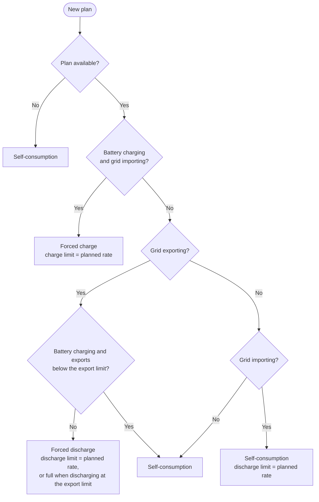

# Automating your hardware

HAEO plans how your battery, grid, and solar should run, but it does not control any hardware itself.
You turn the plan into action with Home Assistant automations that drive your inverter.
This page explains how to do that well: which outputs to read, how to choose your inverter's mode from them, where to set limits, which price guards to add, and how to drive chargers and appliances.

The [Sigenergy walkthrough](../walkthroughs/sigenergy-system.md#automate-the-plant) builds the complete automation for one real system.
Read this page first to understand why it is built the way it is, then adapt it to your own inverter.

## Don't copy planned power into setpoints

The simplest approach is to copy each planned power straight into a hardware setpoint, such as the battery's planned charge power into a charge limit.
It works while the forecasts are exact, and goes wrong as soon as they are not.

A planned power below a device's limit does not always mean HAEO wants that device held at that power.
Often the device is below its limit because something else decides its power:

- The battery charges at 2 kW because it reaches full at the end of the period, not because 2 kW is the right rate.
- The battery charges with the solar left over once the house is served and exports reach their limit, so its planned power is only as accurate as the solar and load forecasts.
- The grid exports at the export limit, and the battery's planned discharge is whatever tops it up to that limit.

In each case the right hardware behavior is to let the device run freely and let the real constraint stop it.
Pinning the device to the planned number instead makes it fight reality.
If solar comes in below forecast, a battery forced to charge at its planned rate makes up the difference by importing from the grid, which the plan never intended.
If solar comes in above forecast, a battery capped at its planned charge rate leaves the extra to be exported cheaply or curtailed.
If the house uses more than forecast, a battery held at its planned discharge leaves the rest to be imported.

So read the plan for what it does, not for its exact numbers:

- **Pick a mode** from what the plan does with the grid and the battery.
- **Set limits only where they matter**, and leave the hardware free everywhere else, so forecast errors land somewhere useful.
- **Add simple price guards** so negative prices are handled even when the forecast is off.

## Inverter modes

Most hybrid inverters offer an equivalent set of operating modes, under different names:

| Mode                 | What the inverter does                                                                                                       |
| -------------------- | ---------------------------------------------------------------------------------------------------------------------------- |
| **Self-consumption** | Solar first serves the house, any surplus charges the battery, and the battery covers any shortfall before the grid is used. |
| **Forced charge**    | Charges the battery at a set rate, using solar first and the grid for the rest.                                              |
| **Forced discharge** | Discharges the battery at a set rate, serving the house first and exporting the rest.                                        |

Self-consumption is the inverter's natural behavior: it keeps the grid near zero by itself, reacting to the real solar and load second by second.
Most of the time HAEO's plan agrees with it.
The forced modes are for the times the plan trades energy with the grid, which self-consumption never does.

Alongside the mode, most inverters accept a maximum charge rate and a maximum discharge rate.
These are the limits the rules below set.
A discharge limit of zero holds the battery back while the inverter stays in self-consumption, so surplus solar can still charge it.
If your inverter has no discharge limit, use its standby mode wherever a rule sets the discharge limit to zero.

Some inverters, such as Deye's, take time slots with a target state of charge instead of power limits.
The same rules apply, with each limit written as a state of charge from the battery's [state of charge sensor](elements/battery.md#state-of-charge-sensor) and its `forecast` attribute:

| Limit                            | Time slot setting                                                            |
| -------------------------------- | ---------------------------------------------------------------------------- |
| Both limits at full rate         | Grid charging off, state of charge at the battery's minimum                  |
| Charge limit at the planned rate | Grid charging on, state of charge at the plan's level when charging ends     |
| Discharge limit at zero          | Grid charging off, state of charge at the current level                      |
| Discharge limit at planned rate  | Grid charging off, state of charge at the plan's level when discharging ends |

## Choosing a mode

HAEO's battery and grid each have an **Active power** sensor whose state is the planned power for the current period.
The [battery's](elements/battery.md#active-power) and the [grid's](elements/grid.md#active-power) pages say which direction each sign means.
An element's entity IDs start with its name, so a battery named "Battery" has `sensor.battery_active_power` and a grid named "Grid" has `sensor.grid_active_power`.
Treat values close to zero, such as within 0.1 kW, as zero.

Check these rules in order and use the first that matches:


```mermaid
flowchart TD
    Start([New plan]) --> Avail{Plan available?}
    Avail -- No --> SC1[Self-consumption]
    Avail -- Yes --> Imp1{Battery charging<br/>and grid importing?}
    Imp1 -- Yes --> FC[Forced charge<br/>charge limit = planned rate]
    Imp1 -- No --> Exp{Grid exporting?}
    Exp -- Yes --> Lim{Battery charging and exports<br/>below the export limit?}
    Lim -- No --> FD[Forced discharge<br/>discharge limit = planned rate,<br/>or full when discharging at the export limit]
    Lim -- Yes --> SC3[Self-consumption]
    Exp -- No --> Imp2{Grid importing?}
    Imp2 -- Yes --> SC2[Self-consumption<br/>discharge limit = planned rate]
    Imp2 -- No --> SC3
```

1. **No plan: self-consumption.**
    When HAEO's outputs are unavailable or have stopped updating, for example because an optimization failed or **Auto optimize** is off, there is no current plan to follow.
    Self-consumption is the safe default, because it never deliberately trades with the grid.

2. **Charging while importing: forced charge at the planned rate.**
    The plan buys energy from the grid to store, usually because it is cheap now.
    Self-consumption never charges from the grid, so only a forced charge achieves this.
    The planned rate matters here, since it sets how much the battery buys.
    When solar also charges the battery, a forced charge makes up any shortfall in solar from the grid.
    If your inverter can limit how much the battery draws from the grid, set that to the planned charge minus the planned solar from the solar element's [power sensor](elements/solar.md#power), or zero if solar covers the charge.
    The battery then takes the grid energy the plan buys and no more, and charges less when solar falls short.
    On an inverter that can only turn grid charging on or off, turn it on only when the planned charge is more than the planned solar.

3. **Exporting: forced discharge at the planned rate.**
    The plan sells energy to the grid, from the battery or from solar.
    Self-consumption would never export from the battery, and would put surplus solar into the battery rather than the grid.
    The planned discharge rate is zero whenever the battery is not planned to discharge, so a dip in solar shrinks exports rather than draining the battery.
    When the battery discharges with the grid planned at its export limit, set the discharge limit to full rather than the planned rate.
    The export limit is what decides the battery's power there, so the inverter can top up exports from the battery whenever solar falls short.
    Only do this while the battery is planned to discharge: a battery planned idle or charging is keeping its energy for later, and topping up exports from it would drain it.
    The charge limit stays at full, so solar beyond the forecast first raises exports to the export limit and then charges the battery rather than being curtailed.
    That is also why a battery charging at the export limit belongs here: the plan exports all it can and stores what is left over, which is exactly what a forced discharge does with the excess.
    A battery charging while exports stay below the limit falls through to rule 5.

4. **Importing: self-consumption, with the discharge limit at the planned rate.**
    The plan covers part of the house from the battery and imports the rest, or holds the battery idle, rationing its energy for later.
    The planned rate is zero when the battery is idle, so it holds its charge.
    Self-consumption follows the real load, so the battery never exports when the house uses less than forecast, and the limit keeps the rest of its energy for later.
    With the charge limit at full, any solar beyond the forecast charges the battery rather than being exported.

5. **Anything else: self-consumption.**
    The plan balances the house, solar, and battery with no grid flow, or charges the battery from solar while exporting below the export limit.
    The plan only splits surplus solar between the battery and the grid when the battery cannot take more, because it is at its maximum rate or becomes full, or when storing and exporting are worth the same.
    Self-consumption with full limits does the same with the real solar: it charges the battery as fast as it will go and exports the rest.
    With full limits, the inverter follows the real solar and load instead of the forecast.

## Set limits only where they matter

Each rule sets a limit only where the plan's number carries meaning:

- The charge limit when the battery charges from the grid, because it sets how much energy the battery buys.
- The discharge limit when the battery discharges or is held idle, because it sets how much energy the battery gives up now.

Set every other limit to the battery's full rating, every time the rules run.
A limit left over from an earlier period would otherwise keep holding the battery back after the plan has changed.

The full limits are what absorb forecast errors.
Whatever the mode, leave somewhere for surplus solar to go: the battery's charge limit, the export, or a charger following its own plan.
If every path is capped at its planned power, solar beyond the forecast is curtailed.
Curtailed solar also shows up in the measured generation, so anything that learns from it, such as a solar forecast that adjusts to recent output, keeps planning low.

Set your inverter's own export limit to match the export limit in HAEO.
Rule 3 relies on the inverter stopping exports at that limit when the battery discharges at full rate.
If the grid has an export limit, its `number.{name}_export_limit` [input entity](elements/grid.md#input-entities) holds the current value, so an automation can read it from HAEO instead of repeating it.

## Price guards

Two small automations handle negative prices directly from the current price, independently of the mode rules.
They hold even when the forecast is off, because they read the price rather than the plan.

- **Negative export price: set the export limit to zero.**
    Exporting costs you money, so stop the inverter exporting at all.
    Surplus solar goes into the battery or is curtailed instead.
- **Negative import price: set the solar limit to zero.**
    Importing pays you, so stop solar generating and let the grid supply the house and the battery.

HAEO's grid has `number.{name}_import_price` and `number.{name}_export_price` [input entities](elements/grid.md#input-entities) whose state is the current price, so the guards can use the same prices as the plan.
While a price is unavailable the guards leave the limits as they are, rather than treating the missing price as zero.

!!! warning "Replace the placeholders"

    `number.YOUR_INVERTER_EXPORT_LIMIT` and `number.YOUR_INVERTER_SOLAR_LIMIT` stand for your inverter's export and solar limit controls.
    Replace them with your inverter's entity IDs, and replace the `10` in each with your inverter's normal limit.
    No such entities exist, so the guards control nothing until you do.

Create each as its own automation:

```yaml
alias: HAEO export price guard
description: Stop exporting while the export price is negative.
triggers:
  - trigger: state
    entity_id: number.grid_export_price
    to:
  - trigger: homeassistant
    event: start
conditions:
  - "{{ has_value('number.grid_export_price') }}"
actions:
  - action: number.set_value
    target:
      entity_id: number.YOUR_INVERTER_EXPORT_LIMIT
    data:
      # kW: 0 while exporting costs money, otherwise your normal export limit
      value: "{{ 0 if states('number.grid_export_price') | float < 0 else 10 }}"
mode: queued
```

```yaml
alias: HAEO import price guard
description: Stop solar generating while the import price is negative.
triggers:
  - trigger: state
    entity_id: number.grid_import_price
    to:
  - trigger: homeassistant
    event: start
conditions:
  - "{{ has_value('number.grid_import_price') }}"
actions:
  - action: number.set_value
    target:
      entity_id: number.YOUR_INVERTER_SOLAR_LIMIT
    data:
      # kW: 0 while importing pays, otherwise your inverter's full solar rating
      value: "{{ 0 if states('number.grid_import_price') | float < 0 else 10 }}"
mode: queued
```

The [solar element's curtailment](elements/solar.md#curtailment) setting should be enabled when your inverter can limit solar, so the plan also expects curtailment at these times.

## Why this works

Each rule only steps in where the plan does something the inverter would not do on its own:

- A negative export price caps export.
- A negative import price caps solar.
- Forced modes run only while the plan trades energy with the grid.
- Limits follow the plan only where its number is a decision, and stay at full rate everywhere else.

The rest of the time the inverter runs in self-consumption and absorbs forecast errors by itself.
Two mistakes undo this, and the rules avoid both.
Charging from solar in forced charge buys every shortfall in solar from the grid.
Capping the battery's charge at its planned rate while it charges from solar curtails every gain in solar.

## Chargers and appliances

An EV charger or an appliance such as a pool pump or hot water system is simpler to drive than an inverter.
Nothing else decides its power, so its planned power is the setpoint to follow.
The battery, with its limits from the rules above, takes up the difference when solar or the house differs from the forecast:

- **Follow the planned power.**
    An [EV](elements/ev.md#power-sensors) has a `sensor.{name}_charge_power` sensor, and a [deferrable load](elements/deferrable_load.md#sensors-created) has `sensor.{name}_power`.
    Set your charger's current or power limit from it whenever it changes.
- **Start and stop at a threshold.**
    Start the device when the planned power rises above a threshold, and stop it when the plan drops below.
    Pick a threshold at or above the lowest power the device can run at, such as an EV charger's minimum current or an appliance's rated power.
    Small planned powers below it are skipped rather than run at a power the device cannot hold.
- **Ride through short pauses.**
    If the device is slow or unreliable to restart, such as an EV charger that has to handshake with the car, look ahead in the planned power's `forecast` attribute when the plan drops below the threshold.
    If charging resumes within a few minutes, hold the device at its minimum instead of stopping it, and stop it only for longer pauses.
- **Let it settle before starting.**
    Wait a minute or two after the device becomes ready, such as after a plug-in or a stop, before starting it, if starting it straight away makes it fault.
- **Convert for efficiency.**
    HAEO plans an EV's charge power on the home side of its charging losses, and its charge efficiency is the share that reaches the car.
    If your charger's limit applies to the power it delivers to the car, multiply the planned power by the charge efficiency first, or the charger draws more than planned.
- **Count faults as unplugged.**
    If your plugged-in sensor reports words, choose its fault and alarm states as well as its idle state as the states meaning unplugged.
    The charger cannot charge in them, so HAEO then plans around a charger that cannot deliver rather than counting on it.
- **Re-check periodically.**
    Run the automation every few minutes as well as on changes, so a missed start or stop is corrected.

The [EV walkthrough](../walkthroughs/adding-an-ev.md#automate-the-charger) builds a complete charger automation that does all of this.

## Keep it safe

- **Add a manual switch.**
    Create an `input_boolean` helper and add it as a condition, so you can stop the automation and take over at any time.
    When it turns off, return the inverter to self-consumption with full limits once, so it is not left in a forced mode.
    If the inverter is unreachable at that moment, hand back when it reconnects.
- **Fall back to self-consumption.**
    Use it whenever HAEO's outputs are unavailable.
    Skip a run entirely when the inverter's own controls are unavailable, rather than writing values you cannot check.
    You can add your own conditions to the fallback too, such as your internet connection being down, so the inverter stops following a plan built on stale prices.
- **Fall back when the plan stops updating.**
    HAEO's output sensors keep their last state when it stops optimizing without failing, such as while [Auto optimize](optimization.md#auto-optimize) is off.
    The [optimizer status](optimization.md#status) sensor's `last_run` attribute is the time the latest plan finished.
    Treat the plan as unavailable once that is older than a few periods, and run the automation every few minutes so it notices.
- **Watch for failures.**
    HAEO's outputs become unavailable when an optimization fails, so the fallback applies automatically.
    [Monitor with automations](data-updates.md#monitor-with-automations) shows how to be notified when it happens.
- **Write only what changes.**
    Every optimization updates the forecast attributes of HAEO's sensors, even when the current value stays the same.
    Add an empty `to:` to state triggers so they fire only when the state itself changes, not when only its attributes do, and skip writes that would not change the inverter's current value.
- **Commission in monitor-only mode.**
    Replace the hardware actions with notifications at first, and compare them with what your inverter does on its own.
- **Check where values are measured.**
    HAEO's power values follow a [fixed convention](measurement-points.md) for where they are measured.
    If your inverter's limits refer to a different point, convert them first.

## Troubleshooting

### Automation not triggering

1. **Entity ID typo**: Check the exact entity IDs under **Developer tools** → **States**.
2. **Manual switch off**: Check that the switch the automation tests is on.
3. **Automation disabled**: Check that the automation is enabled.

### Inverter not doing what the plan expects

Open the automation's [trace](https://www.home-assistant.io/docs/automation/troubleshooting/) to see which rule matched and which values it read.
Compare the mode it chose with the battery and grid active power sensors at that time.
If the mode is right but the inverter behaves differently, check the option names your inverter's mode select accepts, and the units of its limit entities.

## Next steps

<div class="grid cards" markdown>

- :material-solar-power-variant:{ .lg .middle } **See a complete example**

    ---

    Build the full automation for a Sigenergy system, step by step.

    [:material-arrow-right: Sigenergy walkthrough](../walkthroughs/sigenergy-system.md#automate-the-plant)

- :material-car-electric:{ .lg .middle } **Automate an EV charger**

    ---

    Follow HAEO's charging plan with a Sigenergy DC charger.

    [:material-arrow-right: EV walkthrough](../walkthroughs/adding-an-ev.md#automate-the-charger)

- :material-graph:{ .lg .middle } **Optimization results**

    ---

    Learn how to read the plan you automate.

    [:material-arrow-right: Understanding results](optimization.md)

- :material-battery-charging:{ .lg .middle } **Battery configuration**

    ---

    Review the battery sensors the rules read.

    [:material-arrow-right: Battery guide](elements/battery.md)

- :material-transmission-tower:{ .lg .middle } **Grid configuration**

    ---

    Review the grid sensors and price inputs the rules read.

    [:material-arrow-right: Grid guide](elements/grid.md)

</div>
