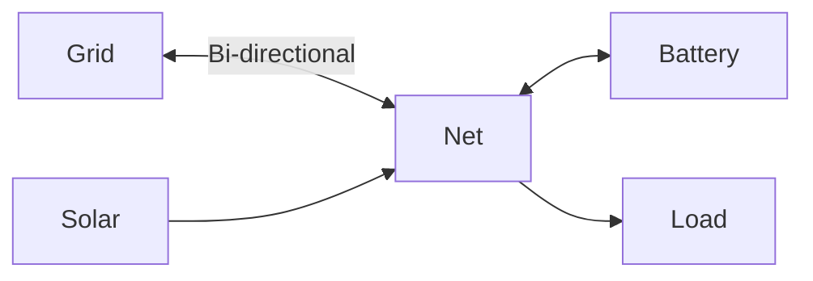

# Configuration

This guide explains how to configure your first HAEO energy network.
It uses the Home Assistant UI.

## Overview

HAEO configuration happens entirely through Home Assistant's UI. You'll:

1. Create a **Hub** (the main integration entry coordinating optimization)
2. Add **Element Entries** (batteries, grids, solar, loads)
3. Add **Connection Entries** (defining how energy flows between elements)

## Creating Your First Hub

### Step 1: Add the Integration

1. Navigate to **Settings** → **Devices & Services**
2. Click the **Add Integration** button (+ in bottom right)
3. Search for **HAEO** or **Home Assistant Energy Optimization**
4. Click on it to start the configuration flow

### Step 2: Configure Hub Settings

You'll see the hub configuration form with these fields:

#### Name

A unique name for your energy hub (e.g., "Home Energy System").

!!! tip "Multiple Hubs"

    You can create multiple separate hubs if you have distinct energy systems.
    This is useful for:

    - Separate buildings (main house and guest house)
    - Testing configurations without affecting your main hub
    - Different optimization strategies for different areas

    Each hub manages its own set of element and connection entries independently.

#### Horizon Hours

The optimization time horizon in hours (1-168).
This determines how far into the future HAEO optimizes.

Choose a horizon that matches the length of your forecasts so the optimizer can see the same window of data.
Set at least 48 hours whenever forecasts support it because that lets batteries plan a full charge and discharge cycle with awareness of the next day's demand.
Drop to 36 hours only when your available forecasts are shorter and accept that the optimizer will take smaller planning steps.
Extending beyond 48 hours only helps if your battery capacity can sustain useful energy decisions over that period, so small batteries that empty daily will not benefit from very long horizons.
Shorter horizons solve faster but provide less lookahead, while longer horizons add planning at the cost of additional solve time.

#### Period Minutes

The time resolution for optimization in minutes (1-60).
Each period is one time step in the optimization.

Set the period to match the resolution of your most important sensor or price input whenever possible.
Shorter periods give finer control but increase solve time, while longer periods reduce detail and solve faster.
If optimizations feel slow, increase the period before reducing the horizon.

#### Optimizer

The linear programming solver to use:

- **HiGHS** (Recommended): Fast, reliable, no external dependencies
- **CBC**: COIN-OR solver, good for large problems
- **GLPK**: GNU Linear Programming Kit
- **PULP_CBC_CMD**: Alternative CBC interface
- **CPLEX**: Commercial solver (requires separate installation and license)
- **GUROBI**: Commercial solver (requires separate installation and license)

See the [LP Solvers reference](../reference/solvers.md) for detailed comparisons.

### Step 3: Complete Hub Setup

Click **Submit** to create your hub. HAEO will create the hub device and initial sensors.

!!! success "Hub Created"

    You'll see a success message and HAEO hub will appear in your integrations list.
    The hub is now ready to coordinate optimization, but you need to add elements first.

## Adding Elements

After creating your hub, add elements to represent your devices.
Use the hub page in **Settings → Devices & Services** to create each element from the same interface.

### Adding an Element

1. Navigate to **Settings** → **Devices & Services**
2. Find your **HAEO** hub integration
3. Click on the hub to open its details page
4. Click **Add Entry**
5. Choose the element type you want to add
6. Fill in the configuration fields shown in the form
7. Click **Submit** to create the element

!!! note "Network entry"

    A network entry appears automatically when you set up your hub.
    It provides optimization sensors for the overall system and does not require manual configuration.

### Available Elements

HAEO models your energy system using different element types.
Each element represents a physical or logical component:

| Element Type      | Description                      | Use Case                      |
| ----------------- | -------------------------------- | ----------------------------- |
| **Battery**       | Energy storage with SOC tracking | Home batteries, EV as storage |
| **Grid**          | Bi-directional grid connection   | Main grid, separate meters    |
| **Photovoltaics** | Solar generation                 | Rooftop solar, ground-mount   |
| **Constant Load** | Fixed power loads                | Base load, always-on devices  |
| **Forecast Load** | Variable loads with forecasts    | Household consumption         |
| **Net**           | Virtual power balance node       | Grouping connection points    |

See the [elements overview](elements/index.md) for more details about each type.

### Configuration Steps

Each element type has its own configuration requirements. See the detailed guides:

- [Battery Configuration](elements/battery.md)
- [Grid Configuration](elements/grid.md)
- [Photovoltaics Configuration](elements/photovoltaics.md)
- [Load Configuration](elements/constant-load.md)
- [Node Configuration](elements/node.md)

!!! tip "Configuration Order"

    We recommend adding elements in this order:

    1. Grid (your connection to the electricity network)
    2. Battery (if you have one)
    3. Photovoltaics (if you have solar)
    4. Loads (constant or forecast)
    5. Nodes (for complex topologies)

## Defining Connections

Connections define how energy flows between elements in your network.

### What are Connections?

A connection represents a power flow path between two elements:

- **Source**: Where energy comes from
- **Target**: Where energy goes to
- **Constraints**: Optional min/max power limits

### Adding Connections

Connections are added from the same hub page as elements:

1. Navigate to **Settings** → **Devices & Services**
2. Find your **HAEO** hub integration
3. Click on the hub to open its details page
4. Click **Add Entry**
5. Select **Connection** from the element type list
6. Select the source and target elements (from your existing elements)
7. Configure optional power limits and efficiency
8. Click **Submit** to create the connection

See the [Connections guide](elements/connections.md) for detailed information and examples.

### Example Network Topology

Here's a typical home energy system:

This requires these connections:

1. Grid ↔ Net (bi-directional)
2. Battery ↔ Net (bi-directional)
3. Solar → Net (one-way)
4. Net → Load (one-way)

## Viewing Configuration

### Integration Page

On the HAEO integration page, you'll see:

- **Network device**: Represents your entire energy system
- **Network sensors**: Optimization status, cost, duration
- **Element sensors**: Power, energy, SOC for each configured element

### Device Page

Click on the network device to see:

- All sensors associated with the network
- Configuration information
- Diagnostic data

### Sensors

HAEO creates multiple sensors for monitoring:

- **Optimization sensors**: Cost, status, duration
- **Power sensors**: Current optimal power for each element (kW)
- **Energy sensors**: Current energy level (batteries, kWh)
- **SOC sensors**: Battery state of charge (%)

Each sensor includes forecast attributes with future timestamped values.

See the [Understanding Results guide](optimization.md) for details on interpreting sensor values.

## Modifying Configuration

### Editing Elements

To edit an existing element:

1. Navigate to **Settings** → **Devices & Services**
2. Find the element entry you want to edit
3. Click **Configure** on that entry
4. Update the configuration
5. Click **Submit**

!!! warning "Reconfiguration Impact"

    Modifying elements triggers a new optimization.
    Sensors may show "unknown" briefly while recalculating.

### Removing Elements

To remove an element:

1. Navigate to **Settings** → **Devices & Services**
2. Find your **HAEO** hub integration
3. Click on the hub to see the list of configured items
4. Find the element you want to remove
5. Click the three-dot menu next to it
6. Select **Delete**
7. Confirm removal

!!! danger "Cascade Effects"

    If the element is used in connections with other elements, removing it may affect network connectivity.
    The hub will automatically adjust optimization for remaining elements.

### Editing Connections

To edit an existing connection:

1. Navigate to **Settings** → **Devices & Services**
2. Find your **HAEO** hub integration
3. Click on the hub to see the list of configured items
4. Select the connection you want to edit
5. Click **Reconfigure**
6. Click **Reconfigure**
7. Update the configuration (power limits, efficiency, etc.)
8. Click **Submit**

### Removing Connections

To remove a connection:

1. Navigate to **Settings** → **Devices & Services**
2. Find your **HAEO** hub integration
3. Click on the hub to see the list of configured items
4. Find the connection you want to remove
5. Click the three-dot menu next to it
6. Select **Delete**
7. Confirm removal

!!! info "Network Impact"

    Removing a connection may affect energy flow paths in your network.
    Ensure remaining connections maintain network connectivity for optimal results.

### Editing Hub Settings

To change optimization settings for the hub:

1. Navigate to **Settings** → **Devices & Services**
2. Find the HAEO hub entry
3. Click **Configure** on the hub entry
4. Modify horizon hours, period minutes, or optimizer
5. Click **Submit**

Changes to hub settings trigger immediate re-optimization with the new parameters.
Review the [horizon guidance](#horizon-hours) before adjusting that value.

## Validation

HAEO validates your configuration to prevent common errors:

### Element Name Uniqueness

Each element must have a unique name within its hub.

- ❌ **Invalid**: Two batteries named "Battery"
- ✅ **Valid**: "Battery1" and "Battery2"

### Connection Validity

Connections must reference existing elements.

- ❌ **Invalid**: Connection from "Battery" to "Solar" when "Solar" doesn't exist
- ✅ **Valid**: Connection only created after both elements exist

### Power Limits

Min/max power values must be logical.

- ❌ **Invalid**: Max power < Min power
- ✅ **Valid**: Min ≤ Max

### Network Connectivity

While not strictly enforced, your network should form a connected graph for meaningful optimization.

!!! warning "Disconnected Networks"

    If your network has isolated subgraphs (elements not connected to others), HAEO will still optimize but may produce unexpected results.
    Use the [troubleshooting guide](troubleshooting.md#graph-isnt-connected-properly) to diagnose connectivity issues.

## Best Practices

### Start Simple

Begin with a minimal configuration:

1. Grid + Battery + Connection
2. Verify optimization works
3. Add complexity gradually

### Use Meaningful Names

Choose descriptive element names using friendly, readable format:

- ✅ "Main Battery", "Grid Import", "Rooftop Solar"
- ❌ "Battery1", "Thing", "Device"

### Document Constraints

Keep notes about why you chose specific limits (capacity, power rates) for future reference.

### Monitor Performance

Watch optimization duration in the sensor. If it takes too long:

- Reduce horizon hours only after consulting the [horizon guidance](#horizon-hours)
- Increase period minutes
- Simplify your network

See [performance considerations](optimization.md#performance-considerations) for more details.

## Next Steps

Use these resources to expand your configuration and understand the results.

- :material-cog-transfer-outline:{ .lg .middle } __Configure individual elements__

    Set up batteries, grids, photovoltaics, and loads with detailed guidance.

    [:material-arrow-right: Element guides](elements/index.md)

- :material-view-dashboard-outline:{ .lg .middle } __Understand optimization outputs__

    Interpret HAEO sensor data and forecast attributes.

    [:material-arrow-right: Optimization overview](optimization.md)

- :material-play-circle-outline:{ .lg .middle } __Review a complete example__

    Follow a full walkthrough that combines all configuration steps.

    [:material-arrow-right: Sigenergy example](examples/sigenergy-system.md)

