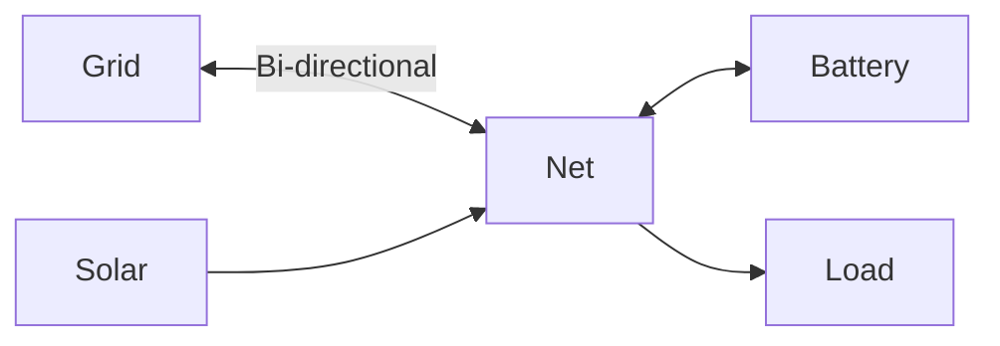

# Configuration

This guide explains how to configure your first HAEO energy network.
It uses the Home Assistant UI.

## Overview

HAEO configuration happens entirely through Home Assistant's UI. You'll:

1. Create a **Network** (the main integration entry)
2. Add **Entities** (batteries, grids, solar, loads)
3. Define **Connections** (how energy flows between entities)

The integration automatically validates your configuration and runs optimizations based on your settings.

## Creating Your First Network

### Step 1: Add the Integration

1. Navigate to **Settings** → **Devices & Services**
2. Click the **Add Integration** button (+ in bottom right)
3. Search for **HAEO** or **Home Assistant Energy Optimization**
4. Click on it to start the configuration flow

### Step 2: Configure Network Settings

You'll see the network configuration form with these fields:

#### Name

A unique name for your energy network (e.g., "Home Energy System").

!!! tip "Multiple Networks"

    You can create multiple separate networks if you have distinct energy systems (e.g., main house and guest house).

#### Horizon Hours

The optimization time horizon in hours (1-168).

- **Default**: 48 hours
- **Shorter (12-24h)**: Faster optimization, less lookahead
- **Longer (72-168h)**: Better long-term decisions, slower computation

!!! info "Choosing a Horizon"

    Consider your forecast availability:

    - If you have 24-hour price forecasts, use at least 24 hours
    - If you have 48-hour solar forecasts, use 48 hours or more
    - Balance forecast availability with computational performance

#### Period Minutes

The time step for optimization in minutes (1-60).

- **Default**: 5 minutes
- **Smaller (1-5min)**: Higher resolution control, more variables
- **Larger (15-60min)**: Faster solving, coarser control

!!! warning "Computational Impact"

    Smaller periods create more optimization variables:

    - 5-minute periods over 48 hours = 576 time steps
    - 15-minute periods over 48 hours = 192 time steps
    - 60-minute periods over 48 hours = 48 time steps

    More time steps = longer optimization time.

#### Optimizer

The linear programming solver to use:

- **HiGHS** (Recommended): Fast, reliable, no external dependencies
- **CBC**: COIN-OR solver, good for large problems
- **GLPK**: GNU Linear Programming Kit
- **PULP_CBC_CMD**: Alternative CBC interface
- **CPLEX**: Commercial solver (requires separate installation and license)
- **GUROBI**: Commercial solver (requires separate installation and license)

See the [LP Solvers reference](../reference/solvers.md) for detailed comparisons.

### Step 3: Complete Initial Setup

Click **Submit** to create your network. HAEO will create the network device and initial sensors.

!!! success "Network Created"

    You'll see a success message and HAEO will appear in your integrations list.

## Adding Entities

After creating your network, you need to add entities representing your energy devices.

### Opening Options Flow

1. Find HAEO in **Settings** → **Devices & Services**
2. Click **Configure** on the HAEO integration
3. Select the operation you want to perform

### Available Entity Types

HAEO supports several entity types:

| Entity Type       | Description                      | Use Case                      |
| ----------------- | -------------------------------- | ----------------------------- |
| **Battery**       | Energy storage with SOC tracking | Home batteries, EV as storage |
| **Grid**          | Bi-directional grid connection   | Main grid, separate meters    |
| **Photovoltaics** | Solar generation                 | Rooftop solar, ground-mount   |
| **Constant Load** | Fixed power loads                | Base load, always-on devices  |
| **Forecast Load** | Variable loads with forecasts    | Household consumption         |
| **Net**           | Virtual power balance node       | Grouping connection points    |

### Configuration Steps

Each entity type has its own configuration requirements. See the detailed guides:

- [Battery Configuration](entities/battery.md)
- [Grid Configuration](entities/grid.md)
- [Photovoltaics Configuration](entities/photovoltaics.md)
- [Load Configuration](entities/loads.md)
- [Net Entity Configuration](entities/net.md)

!!! tip "Configuration Order"

    We recommend adding entities in this order:

    1. Grid (your connection to the electricity network)
    2. Battery (if you have one)
    3. Photovoltaics (if you have solar)
    4. Loads (constant or forecast)
    5. Net entities (for complex topologies)

## Defining Connections

Connections define how energy flows between entities in your network.

### What are Connections?

A connection represents a power flow path between two entities:

- **Source**: Where energy comes from
- **Target**: Where energy goes to
- **Constraints**: Optional min/max power limits

### Adding Connections

1. In the HAEO options flow, select **Add Connection**
2. Choose the **source** entity
3. Choose the **target** entity
4. Set optional **min/max power limits** (in kW)

See the [Connections guide](connections.md) for detailed information and examples.

### Example Network Topology

Here's a typical home energy system:

This requires these connections:

1. Grid ↔ Net (bi-directional)
2. Battery ↔ Net (bi-directional)
3. Solar → Net (one-way)
4. Net → Load (one-way)

## Viewing Configuration

### Integration Page

On the HAEO integration page, you'll see:

- **Network device**: Represents your entire energy system
- **Network sensors**: Optimization status, cost, duration
- **Entity sensors**: Power, energy, SOC for each configured entity

### Device Page

Click on the network device to see:

- All sensors associated with the network
- Configuration information
- Diagnostic data

### Sensors

HAEO creates multiple sensors for monitoring:

- **Optimization sensors**: Cost, status, duration
- **Power sensors**: Current optimal power for each entity (kW)
- **Energy sensors**: Current energy level (batteries, kWh)
- **SOC sensors**: Battery state of charge (%)

Each sensor includes forecast attributes with future timestamped values.

See the [Understanding Results guide](optimization.md) for details on interpreting sensor values.

## Modifying Configuration

### Editing Entities

1. Open HAEO options flow
2. Select **Edit [Entity Type]**
3. Choose the entity to edit
4. Update the configuration
5. Click **Submit**

!!! warning "Reconfiguration Impact"

    Modifying entities triggers a new optimization. Sensors may show "unknown" briefly while recalculating.

### Removing Entities

1. Open HAEO options flow
2. Select **Remove [Entity Type]**
3. Choose the entity to remove
4. Confirm removal

!!! danger "Cascade Effects"

    Removing an entity that has connections will also remove those connections. Ensure your network remains connected.

### Removing Connections

1. Open HAEO options flow
2. Select **Remove Connection**
3. Choose the connection to remove
4. Confirm removal

## Validation

HAEO validates your configuration to prevent common errors:

### Entity Name Uniqueness

Each entity must have a unique name within the network.

- ❌ **Invalid**: Two batteries named "Battery"
- ✅ **Valid**: "Battery1" and "Battery2"

### Connection Validity

Connections must reference existing entities.

- ❌ **Invalid**: Connection from "Battery" to "Solar" when "Solar" doesn't exist
- ✅ **Valid**: Connection only created after both entities exist

### Power Limits

Min/max power values must be logical.

- ❌ **Invalid**: Max power < Min power
- ✅ **Valid**: Min ≤ Max

### Network Connectivity

While not strictly enforced, your network should form a connected graph for meaningful optimization.

!!! warning "Disconnected Networks"

If your network has isolated subgraphs (entities not connected to others), HAEO will still optimize.
It may produce unexpected results.
Use the [troubleshooting guide](troubleshooting.md#graph-isnt-connected-properly) to diagnose connectivity issues.

## Best Practices

### Start Simple

Begin with a minimal configuration:

1. Grid + Battery + Connection
2. Verify optimization works
3. Add complexity gradually

### Use Meaningful Names

Choose descriptive entity names:

- ✅ "Main_Battery", "Grid_Import", "Rooftop_Solar"
- ❌ "Battery1", "Thing", "Device"

### Document Constraints

Keep notes about why you chose specific limits (capacity, power rates) for future reference.

### Monitor Performance

Watch optimization duration in the sensor. If it takes too long:

- Reduce horizon hours
- Increase period minutes
- Simplify your network

See [performance considerations](optimization.md#performance-considerations) for more details.

## Next Steps

Now that you understand the basics, dive into configuring specific entity types:

- [Battery Configuration](entities/battery.md)

    Configure battery storage with capacity, SOC, and efficiency settings.

- [Grid Configuration](entities/grid.md)

    Set up grid import/export with pricing and power limits.

- [Solar Configuration](entities/photovoltaics.md)

    Configure photovoltaics with forecast integration.

- [Load Configuration](entities/loads.md)

    Set up constant or forecast-based loads.

Or see a complete example system:

[:octicons-arrow-right-24: Sigenergy System Example](examples/sigenergy-system.md)
