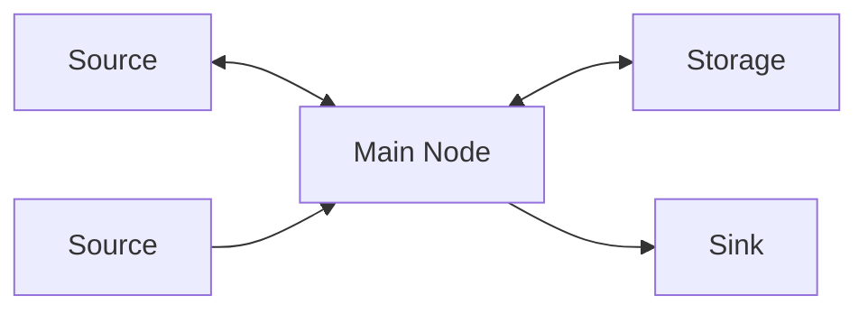

# Configuration

This guide explains how to configure your first HAEO energy network using the Home Assistant UI.

For more details on Home Assistant integration setup, see the [Home Assistant integration setup guide](https://www.home-assistant.io/getting-started/integration/).

## Overview

HAEO configuration happens entirely through Home Assistant's UI. You'll:

1. Create a **Hub** (the main integration entry coordinating optimization)
2. Add **Element Entries** (batteries, grids, solar, loads)
3. Add **Connection Entries** (defining how energy flows between elements)

## Creating Your First Hub

### Add the integration

1. Navigate to **Settings** → **Devices & Services**
2. Click the **Add Integration** button (+ in bottom right)
3. Search for **HAEO** or **Home Assistant Energy Optimizer**
4. Click on it to start the configuration flow

### Configure hub settings

The hub configuration form includes these fields:

#### Name

A unique name for your energy hub (for example, "Home Energy System").

!!! tip "Multiple Hubs"

    You can create multiple separate hubs for distinct energy systems (separate buildings, testing configurations, different optimization strategies).
    Each hub manages its own set of element and connection entries independently.

#### Interval Tiers

HAEO uses dynamic interval sizing to balance precision and performance.
Configure up to four tiers, each specifying how many intervals to create and their duration in minutes.

| Tier | Default Count | Default Duration | Purpose                             |
| ---- | ------------- | ---------------- | ----------------------------------- |
| 1    | 5             | 1 minute         | High-resolution near-term decisions |
| 2    | 5             | 5 minutes        | Short-term response                 |
| 3    | 46            | 30 minutes       | Day-ahead planning                  |
| 4    | 48            | 60 minutes       | Extended horizon                    |

The defaults create approximately 104 intervals spanning roughly 72 hours:

- 5 × 1 min = 5 minutes of fine-grained control
- 5 × 5 min = 25 minutes of responsive planning
- 46 × 30 min ≈ 23 hours of day-ahead optimization
- 48 × 60 min = 48 hours of extended lookahead

**Why variable intervals?**

Near-term decisions benefit from high resolution because they directly influence immediate actions.
Distant periods can use coarser resolution since forecasts become less reliable further out and battery decisions today rarely depend on hour-by-hour precision three days from now.

**Tuning tips**:

- Set tier counts to zero to disable a tier entirely
- Increase tier 1 count for faster-responding systems (EV chargers, heat pumps)
- Reduce tier 4 count if optimization takes too long
- Match tier 1 duration to your fastest-updating price or forecast sensor

HAEO uses intelligent forecast cycling to extend partial forecast data across the full horizon.
A 24-hour solar forecast automatically cycles to cover longer horizons with time-of-day alignment preserved.

#### Advanced Mode

Advanced Mode is a hub-level setting that enables access to raw modeling elements for advanced users.

**When enabled**, Advanced Mode makes additional element types available that provide direct access to model layer components.
These advanced elements require manual connection configuration and are intended for users who understand the underlying optimization model.

**When disabled** (default), only standard elements are available.
Standard elements provide automatic connections and optimized behavior suitable for most use cases.

Most users should leave Advanced Mode disabled.
Enable Advanced Mode only if you need direct control over the underlying model layer components.

See the [elements overview](elements/index.md) for details on which elements require Advanced Mode.

Click **Submit** to create your hub.

## Adding Elements

After creating your hub, add elements to represent your devices through the Home Assistant UI.

1. Navigate to **Settings** → **Devices & Services**
2. Find your **HAEO** integration
3. Click on the integration card to open the hub details page
4. Click the **`:` menu button** (three vertical dots in top right)
5. Select **Add Entry** from the dropdown menu
6. Choose the element type you want to add from the list
7. Complete the configuration
8. Click **Submit** to create the element

**Editing existing elements**: Click the :material-cog: **cog icon** next to each element entry to modify its configuration.

### Element configuration

Most elements use a two-step configuration process:

**Step 1 - Entity selection**: Enter the element name, select connection targets, and choose entities for each field.
Select "Configurable Entity" if you want to enter a constant value instead of linking to a sensor.

**Step 2 - Configurable values**: Enter constant values for any fields where you selected "Configurable Entity".
This step is skipped if all fields are linked to sensors.

!!! tip "Optional fields"

    For optional fields like power limits, leave the field empty if you don't need that constraint.
    The optimization will run without that limit applied.

!!! note "Network entry"

    A network entry appears automatically when you set up your hub.
    It provides optimization sensors for the overall system and does not require manual configuration.

### Available element types

HAEO provides element types for modeling different aspects of energy systems:
energy storage, power generation, consumption, grid connections, and network topology.

Most elements create automatic connections to simplify configuration.
Some advanced elements provide direct access to model layer components and require manual connection setup.

See the [elements overview](elements/index.md) for detailed configuration guides for each element type.

## Defining Connections

Connections define how energy flows between elements.
Add them from the same hub page as elements by selecting **Connection** from the element type list.

### Example network topology

This network requires connections between elements and the central node.
Most elements create these connections automatically.
You only need explicit Connection elements when you need custom power flow paths, efficiency losses, or transmission costs.

See the [Connections guide](elements/connections.md) for detailed information and examples.

## Viewing Configuration

### Integration page

On the HAEO integration page, you'll see:

- **Network device**: Represents your entire energy system
- **Network sensors**: Optimization status, cost, duration
- **Element sensors**: Power, energy, SOC for each configured element

Each sensor includes forecast attributes with future timestamped values.
See the [Understanding Results guide](optimization.md) for details on interpreting sensor values.

## Modifying Configuration

### Editing elements and connections

Use the **Configure** button on each entry in **Settings** → **Devices & Services** to edit parameters.
Changes trigger a new optimization.

### Removing elements and connections

Use the three-dot menu on each entry to delete it.
The hub automatically adjusts optimization for remaining elements.

!!! danger "Cascade effects"

    Removing elements used in connections may affect network connectivity.

### Editing hub settings

Click **Configure** on the hub entry to modify interval tiers or optimizer.
Changes trigger immediate re-optimization with the new parameters.

## Best Practices

### Start simple

Begin with a minimal configuration to verify optimization works, then add complexity gradually.

**Recommended first configuration**:

- One grid connection element with import/export pricing
- One energy storage element with current state tracking
- One consumption element (constant or forecast-based)
- Connections linking these elements through a central node

This simple network is enough to test optimization behavior before adding generation sources, additional loads, or complex connection patterns.

### Use meaningful names

Choose descriptive element names using friendly, readable format:

- ✅ "Main Battery", "Grid Import", "Rooftop Solar"
- ❌ "Battery1", "Thing", "Device"

### Monitor performance

Watch optimization duration in the sensor.
If it takes too long, adjust interval tiers (increase durations or reduce counts).
See [performance considerations](optimization.md#performance-considerations) for more details.

## Next Steps

Use these resources to expand your configuration and understand the results.

- :material-cog-transfer-outline:{ .lg .middle } __Configure individual elements__

    Set up elements for your energy system with detailed guidance.

    [:material-arrow-right: Element guides](elements/index.md)

- :material-view-dashboard-outline:{ .lg .middle } __Understand optimization outputs__

    Interpret HAEO sensor data and forecast attributes.

    [:material-arrow-right: Optimization overview](optimization.md)

- :material-play-circle-outline:{ .lg .middle } __Review a complete example__

    Follow a full walkthrough that combines all configuration steps.

    [:material-arrow-right: Sigenergy example](examples/sigenergy-system.md)

