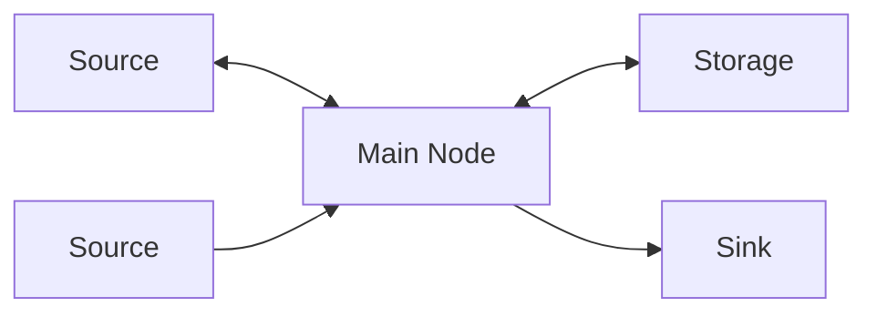

# Configuration

This guide explains how to configure your first HAEO energy network using the Home Assistant UI.

For more details on Home Assistant integration setup, see the [Home Assistant integration setup guide](https://www.home-assistant.io/getting-started/integration/).

## Overview

HAEO configuration happens entirely through Home Assistant's UI. You'll:

1. Create a **Hub** (the main integration entry coordinating optimization)
2. Add **Element Entries** (batteries, grids, solar, loads)
3. Add **Connection Entries** (defining how energy flows between elements)

## Creating Your First Hub

### Add the integration

1. Navigate to **Settings** → **Devices & Services**
2. Click the **Add Integration** button (+ in bottom right)
3. Search for **HAEO** or **Home Assistant Energy Optimizer**
4. Click on it to start the configuration flow

### Configure hub settings

The hub configuration form includes these fields:

#### Name

A unique name for your energy hub (for example, "Home Energy System").

!!! tip "Multiple Hubs"

    You can create multiple separate hubs for distinct energy systems (separate buildings, testing configurations, different optimization strategies).
    Each hub manages its own set of element and connection entries independently.

#### Planning horizon

The planning horizon sets how far ahead HAEO plans and how long each period in the plan is.
Choose **Preset** or **Forecast sensor**.

**Preset** plans 2, 3, 5, or 7 days ahead (5 days by default).
Choose a horizon that matches your forecast coverage.
Periods start at 1 minute, then grow to 5, 30, and 60 minutes further out.
Each change in period length lines up with the clock, and the horizon ends exactly the chosen number of days after it starts.

Near-term decisions benefit from high resolution because they directly influence immediate actions.
Distant periods can use coarser resolution since forecasts become less reliable further out and battery decisions today rarely depend on hour-by-hour precision three days from now.

HAEO uses [forecast cycling](forecasts-and-sensors.md#forecast-coverage-and-cycling) to extend partial forecast data across the full horizon.
A 24-hour solar forecast cycles to cover longer horizons with time-of-day alignment preserved.

**Forecast sensor** takes the horizon from a sensor whose `forecast` attribute lists the period boundaries.
Use it when you want a period layout the presets do not offer, or to plan two hubs on the same horizon.
The attribute is a list of points, and the `time` of each point is a period boundary, so a forecast with 25 points describes 24 periods.
Any other keys in a point, such as `value`, are ignored.
Another hub's horizon sensor publishes exactly this format.
The horizon updates whenever the sensor's forecast times change.

The setup and options forms reject a sensor that does not report at least two increasing times.
They also reject the hub's own sensors, because those are calculated on its horizon.
If the sensor is not available when Home Assistant starts, HAEO retries setting up the hub until it is.
If the sensor later stops reporting a usable forecast, HAEO keeps planning with the last horizon it read and logs a warning.

For example, this [template sensor](https://www.home-assistant.io/integrations/template/) describes 48 hours of 15-minute periods, starting at the current quarter hour:

```yaml
template:
  - sensor:
      - name: Planning horizon
        state: '48'
        attributes:
          forecast: >-
            
            {% set start = start - timedelta(minutes=start.minute % 15) %}
            
            
            
            
            
            {{ ns.points }}
```

The template renders again every minute, but the forecast only changes at each quarter hour, so the horizon moves forward every 15 minutes.

!!! note "Upgrading from custom tiers"

    Earlier versions offered a **Custom** horizon with up to four tiers of interval counts and durations.
    Custom tiers are no longer available.
    When you upgrade, a hub that used custom tiers switches to the 5-day preset, and a hub on a preset keeps it.
    To recreate a custom layout, build a sensor that lists your period boundaries and choose it as a **Forecast sensor**.

#### Expose raw model elements

**Expose raw model elements** is a hub-level setting that shows low-level model building blocks you connect manually.

**When enabled**, additional element types become available that provide direct access to model layer components.
These raw model elements require manual connection configuration and are intended for deliberately building the optimization model yourself.

**When disabled** (default), only standard elements are available.
Standard elements provide automatic connections and optimized behavior suitable for most use cases.

Most users should leave this setting off.
Turn it on only if you are deliberately building the optimization model yourself.

See the [elements overview](elements/index.md) for the raw model elements it exposes.

Click **Submit** to create your hub.

## Adding Elements

After creating your hub, add elements to represent your devices through the Home Assistant UI.

1. Navigate to **Settings** → **Devices & Services**
2. Find your **HAEO** integration
3. Click on the integration card to open the hub details page
4. Click the **menu button** (three vertical dots, top right)
5. Select **Add Entry** from the dropdown menu
6. Choose the element type you want to add from the list
7. Complete the configuration
8. Click **Submit** to create the element

**Editing existing elements**: Click the :material-cog: **cog icon** next to each element entry to modify its configuration.

### Element configuration

Most elements are configured in a single step where you enter:

1. **Element name**: A unique, descriptive name for the element
2. **Connection target**: Which element this connects to (for elements that require connections)
3. **Input fields**: For each field, choose how to provide the value

Some elements add a follow-up step when optional settings are enabled.
For example, the battery flow adds a partitions step when you enable undercharge and overcharge configuration.

#### Input field options

Each input field provides a dropdown with these choices:

| Choice       | Use When                                         |
| ------------ | ------------------------------------------------ |
| **Entity**   | Value should come from a Home Assistant sensor   |
| **Constant** | Value is fixed (enter it directly in the form)   |
| **None**     | Don't use this constraint (optional fields only) |

- Select **Entity** to link the field to one or more sensors (for example, a price forecast sensor)
- Select **Constant** to enter a fixed value directly (for example, a battery capacity of 10 kWh)
- Select **None** for optional fields you don't need (for example, no export limit)

!!! tip "Constant values are adjustable"

    Fields configured with "Constant" create input entities in Home Assistant.
    You can adjust these values at runtime without reconfiguring the element.

!!! note "Network entry"

    A network entry appears automatically when you set up your hub.
    It provides optimization sensors for the overall system and does not require manual configuration.

### Available element types

HAEO provides element types for modeling different aspects of energy systems:
energy storage, power generation, consumption, grid connections, and network topology.

Most elements create automatic connections to simplify configuration.
Some raw model elements provide direct access to model layer components and require manual connection setup.

See the [elements overview](elements/index.md) for detailed configuration guides for each element type.

## Defining Connections

Connections define how energy flows between elements.
Add them from the same hub page as elements by selecting **Connection** from the element type list.

### Example network topology


```mermaid
graph LR
    Source1[Source] <--> Net[Main Node]
    Net <--> Storage[Storage]
    Source2[Source] --> Net
    Net --> Sink[Sink]
```

This network requires connections between elements and the central node.
Most elements create these connections automatically.
You only need explicit Connection elements when you need custom power flow paths, efficiency losses, or transmission costs.

See the [Connections guide](elements/connections.md) for detailed information and examples.

## Viewing Configuration

### Integration page

On the HAEO integration page, you'll see:

- **Network device**: Represents your entire energy system
- **Network sensors**: Optimization status, cost, duration
- **Element sensors**: Power, energy, SOC for each configured element

Each sensor includes forecast attributes with future timestamped values.
See the [Understanding Results guide](optimization.md) for details on interpreting sensor values.

## Modifying Configuration

### Editing elements and connections

Use the **Configure** button on each entry in **Settings** → **Devices & Services** to edit parameters.
Changes trigger a new optimization.

### Removing elements and connections

Use the three-dot menu on each entry to delete it.
The hub automatically adjusts optimization for remaining elements.

!!! danger "Cascade effects"

    Removing elements used in connections may affect network connectivity.

### Editing hub settings

Click **Configure** on the hub entry to modify the planning horizon or advanced settings.
Changes trigger immediate re-optimization with the new parameters.

## Best Practices

### Start simple

Begin with a minimal configuration to verify optimization works, then add complexity gradually.

**Recommended first configuration**:

- One grid connection element with import/export pricing
- One energy storage element with current state tracking
- One consumption element (constant or forecast-based)
- Connections linking these elements through a central node

This simple network is enough to test optimization behavior before adding generation sources, additional loads, or complex connection patterns.

### Use meaningful names

Choose descriptive element names using friendly, readable format:

- ✅ "Main Battery", "Grid Import", "Rooftop Solar"
- ❌ "Battery1", "Thing", "Device"

### Monitor performance

Watch optimization duration in the sensor.
If it takes too long, choose a shorter preset or a forecast sensor with fewer periods.
See [performance considerations](optimization.md#performance-considerations) for more details.

## Next steps

Use these resources to expand your configuration and understand the results.

<div class="grid cards" markdown>

- :material-cog-transfer-outline:{ .lg .middle } __Configure individual elements__

    Set up elements for your energy system with detailed guidance.

    [:material-arrow-right: Element guides](elements/index.md)

- :material-view-dashboard-outline:{ .lg .middle } __Understand optimization outputs__

    Interpret HAEO sensor data and forecast attributes.

    [:material-arrow-right: Optimization overview](optimization.md)

- :material-play-circle-outline:{ .lg .middle } __Review a complete example__

    Follow a full walkthrough that combines all configuration steps.

    [:material-arrow-right: Sigenergy walkthrough](../walkthroughs/sigenergy-system.md)

</div>
