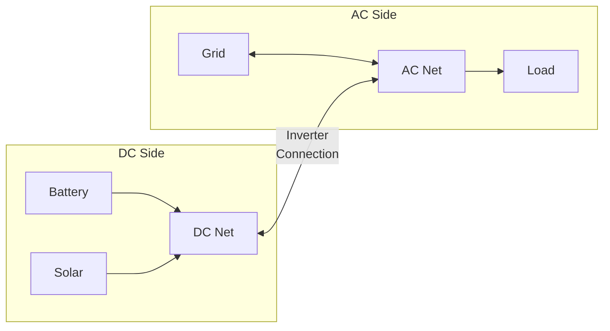

# Connections

Connections define how power flows between entities in your network.

## Overview

A connection represents a power flow path from a source entity to a target entity, with optional power limits.

## Configuration

### Source

The entity where power comes from.

### Target

The entity where power goes to.

### Min Power (Optional)

Minimum power flow (kW). Can be negative for bidirectional flow.

### Max Power (Optional)

Maximum power flow (kW).

## Examples

### Bidirectional Connection

Grid ↔ Battery:

```yaml
Source: Grid
Target: Battery
Min Power: -10 kW # Can flow either direction
Max Power: 10 kW
```

### Unidirectional Connection

Solar → Net:

```yaml
Source: Solar
Target: Net
Min Power: 0 kW # One-way only
Max Power: None # Unlimited
```

## Network Topology


## Troubleshooting

See [troubleshooting guide](troubleshooting.md#graph-isnt-connected-properly) for connection issues.

## Modeling Hybrid Inverters {#hybrid-inverters}

Hybrid inverters (AC-DC converters) can be modeled as connections between net entities:



### Configuration

Create two net entities (DC and AC) and connect them with power limits:

```yaml
Source: DC Net
Target: AC Net
Min Power: -5 kW # 5kW charging (AC→DC)
Max Power: 5 kW # 5kW discharging (DC→AC)
```

The connection limits represent the inverter's power rating.

!!! tip "Power Limits: Elements vs Connections"
    - **Element limits** (battery charge/discharge rates) represent device capabilities.
    - **Connection limits** (inverter ratings) represent power flow constraints.

    Both are respected during optimization.

## Related Documentation

- [Power Balance](../modeling/power-balance.md)
- [Connection Modeling](../modeling/connections.md)

[:octicons-arrow-right-24: Continue to Understanding Results](optimization.md)
