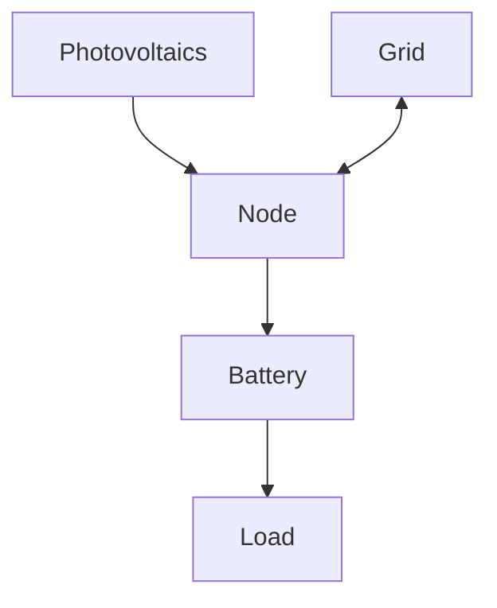

# Elements

Elements are the building blocks of your HAEO energy network.
Each element represents a physical device or logical component in your energy system.

!!! info "Elements vs Home Assistant Entities"

    In HAEO documentation:

    - **Element** = A component in your energy optimization (battery, grid, solar, etc.)
    - **Entity** = A Home Assistant sensor or device entity (e.g., `sensor.battery_power`)

    This page describes HAEO elements. Each element creates several Home Assistant entities (sensors).

## Element Types

HAEO supports several element types for modeling your energy system:

| Element Type                          | Description                                                               | Key Features                               |
| ------------------------------------- | ------------------------------------------------------------------------- | ------------------------------------------ |
| **[Battery](battery.md)**             | Energy storage with state of charge tracking                              | SOC tracking, efficiency, charge/discharge |
| **[Grid](grid.md)**                   | Bi-directional grid connection                                            | Import/export, dynamic pricing             |
| **[Photovoltaics](photovoltaics.md)** | Solar power generation                                                    | Forecast integration, curtailment          |
| **[Load](load.md)**                   | Power consumption                                                         | Constant or forecast-based patterns        |
| **[Node](node.md)**                   | Virtual power balance node                                                | Grouping connections, complex topologies   |
| **[Connections](connections.md)**     | Power flow between elements (configuration, grouped here for convenience) | Directional flow limits                    |

## How Elements Work Together

Elements work together once you connect them to match your real-world wiring.
HAEO balances available energy, expected consumption, and any limits you set so the total system stays within bounds.
In a typical home system, solar may feed a common node, the grid can import or export, and a battery shifts energy between time periods.

Example layout:

This layout lets HAEO decide when to store solar, rely on the grid, or draw from a battery while keeping every connection within the limits you configured.
See the [modeling documentation](../../modeling/index.md) for the underlying mathematics.

## Configuration Approach

When configuring elements:

1. **Start simple**: Begin with just a grid and one other element
2. **Add gradually**: Introduce complexity one element at a time
3. **Verify each step**: Check that optimization produces reasonable results
4. **Use realistic values**: Base constraints on actual device specifications

## Next Steps

Explore detailed configuration for each element type:

- :material-battery:{ .lg .middle } __Battery configuration__

    Energy storage with SOC tracking and efficiency modeling.

    [:material-arrow-right: Battery guide](battery.md)

- :material-power-plug:{ .lg .middle } __Grid configuration__

    Import/export with dynamic or fixed pricing.

    [:material-arrow-right: Grid guide](grid.md)

- :material-weather-sunny:{ .lg .middle } __Photovoltaics configuration__

    Solar generation with curtailment options.

    [:material-arrow-right: Photovoltaics guide](photovoltaics.md)

- :material-gauge:{ .lg .middle } __Load configuration__

    Power consumption with constant or forecast-based patterns.

    [:material-arrow-right: Load guide](load.md)

- :material-source-branch:{ .lg .middle } __Node configuration__

    Virtual power balance nodes.

    [:material-arrow-right: Node guide](node.md)

