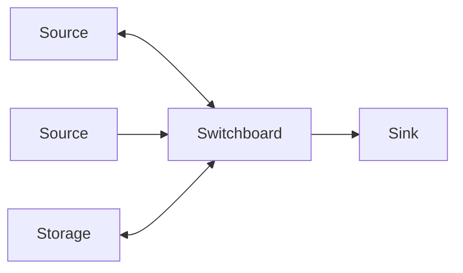
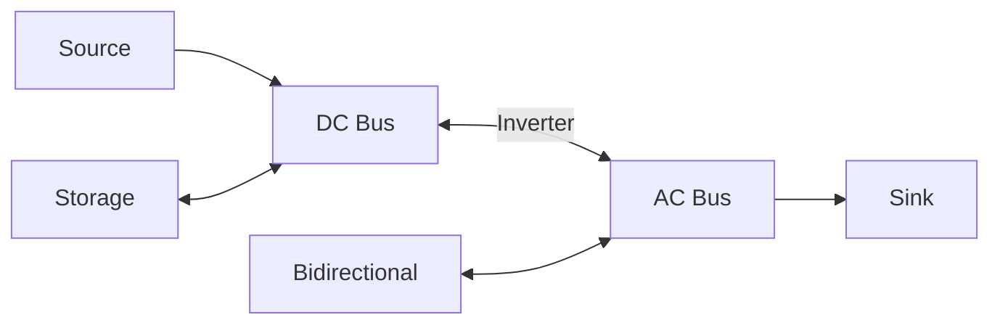
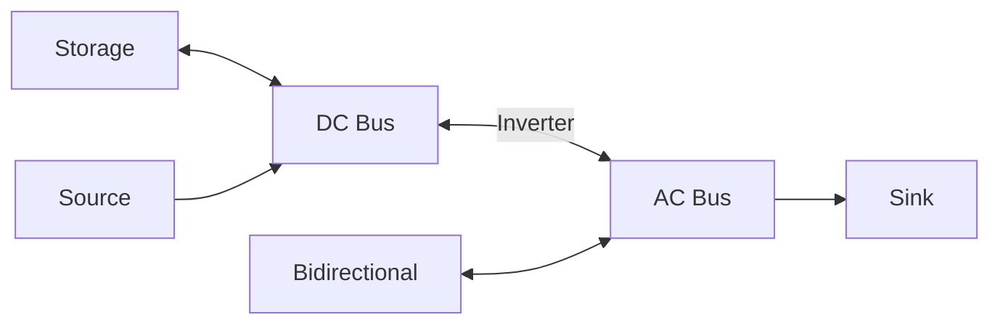

# Junction

A junction is a point in your network where connections meet.
All power flowing in equals all power flowing out (Kirchhoff's current law).

!!! warning "Advanced Element"

    HAEO creates a junction named Switchboard when you set up a hub.
    Creating **additional** junctions requires **Advanced Mode** to be enabled on your hub.
    In standard mode, the Switchboard is sufficient for most residential systems.

## Configuration

| Field             | Type   | Required | Default | Description                         |
| ----------------- | ------ | -------- | ------- | ----------------------------------- |
| **[Name](#name)** | String | Yes      | -       | Unique identifier for this junction |

A junction has no other settings and creates no input entities.

See [Where values are measured](../measurement-points.md) for the convention HAEO uses for where limits, prices, and reported power apply.

## Name

Unique identifier for this junction within your HAEO configuration.
Used to identify the junction in connection endpoints.

Choose descriptive names based on electrical location: "Switchboard", "AC Panel", "DC Bus", "Sub Panel"

## Purpose

Junctions are connection points where power balance is enforced:

$$
\text{Power In} = \text{Power Out}
$$

Junctions are not physical devices.
They represent electrical buses where power is shared between the elements connected to them.
A junction cannot produce or consume power itself.
Power enters and leaves the network only through elements that set a price and a limit on it, such as a [grid](grid.md), [solar](solar.md), [battery](battery.md), or [load](load.md).

If you need a point that produces or consumes unlimited power, use a [node](node.md) instead.

!!! tip "Automatic switchboard"

    HAEO creates a junction named Switchboard when you set up a hub.
    This central connection point is sufficient for most residential energy systems.
    You only need to create additional junctions if you have complex multi-bus topologies (e.g., separate AC/DC buses).

    If the Switchboard is deleted in non-advanced mode, HAEO recreates it on the next integration reload to maintain network connectivity.

!!! info "Junctions and power policies"

    Junctions pass [power policy](../../modeling/tagged-power.md) provenance through unchanged.
    This is what lets a `Solar → Grid` policy price the whole chain through your switchboard and inverter.
    Junctions are not offered as policy sources or destinations, because power never starts or ends at a junction.
    See [Node roles and policy scope](../../modeling/tagged-power.md#node-roles-and-policy-scope) for the full rules.

!!! note "Upgrading from earlier versions"

    Earlier versions used a node for the switchboard and for every other connection point.
    When you upgrade, the Switchboard and every node that neither produces nor consumes power become junctions with the same name.
    Outside Advanced Mode, every node becomes a junction.
    In Advanced Mode, any other node that can produce or consume power, or whose switch is driven by an entity, stays a node.
    When a node that had its source or sink switch turned on becomes a junction, HAEO raises a repair issue for it.
    The junction keeps the node's device and power balance sensor, so their entity IDs, areas, and history carry over.

## Use Cases

**Single junction (simple)**: Central hub for all elements.

Most residential systems use the Switchboard only.

**Multiple junctions (complex)**: Separate AC/DC or hierarchical distribution.

## Configuration Example

Simple junction for connecting elements:

| Field    | Value     |
| -------- | --------- |
| **Name** | Sub Panel |

Then connect elements to "Sub Panel" via connections.

!!! warning "Deleting junctions"

    If you delete a junction, you must update all connections that reference it.
    Connections cannot have endpoints that don't exist.

## Sensors Created

### Sensor Summary

A Junction element creates 1 device in Home Assistant with the following sensors.

| Sensor                                                       | Unit   | Description                         |
| ------------------------------------------------------------ | ------ | ----------------------------------- |
| [`sensor.{name}_power_balance_shadow_price`](#power-balance) | \$/kWh | Local energy price at this junction |

### Power Balance

Displayed as "Power balance shadow price".
The marginal cost or value of power at this point in the network.
See the [Shadow Prices modeling guide](../../modeling/shadow-prices.md) for general shadow price concepts.

This shadow price represents the "local spot price" for energy at this connection point.
It shows how much the total system cost would change if you could inject or extract 1 kW of power at this junction.

**Interpretation**:

- **Positive value**: Represents the cost of power at this junction
    - Higher values indicate expensive power (e.g., importing during peak prices)
    - Shows what you would save by reducing consumption or adding generation at this junction
- **Negative value**: Represents surplus power at this junction (uncommon)
    - Indicates more generation than consumption
    - Shows the value that could be captured by adding loads or storage at this junction
- **Differences between junctions**: Reveal the economic value of power transfer between network locations
    - Larger differences indicate stronger incentive for power flow between junctions
    - Help identify valuable connection points in the network

**Example**: A value of 0.22 means power at this junction costs \$0.22 per kWh at this time period, reflecting the marginal cost to supply this location in the network.

**Note**: For physical power measurements, monitor connected entity sensors instead.
Junctions only provide shadow prices, not physical power flow data.

---

All sensors include a `forecast` attribute containing future optimized values for upcoming periods.

## Troubleshooting

**Infeasible optimization**: Check all elements connected, sufficient sources exist, connection directions correct, limits not too restrictive.

**Unexpected power flows**: Verify connection endpoints, review junction names unique, check connection min/max power limits.

## Multiple Junctions

**Use when**:

- Physical separation (AC/DC buses in hybrid inverter systems)
- Intermediate limits (inverter capacity, feeder constraints)
- Hierarchical distribution (main panel and sub-panels)

**Configuration**: Enable Advanced Mode on your hub, then create additional junctions and link them with connections.

**Complexity**: Requires more configuration and adds more constraints, but accurately models real system architecture.

### Hybrid Inverter Example

For hybrid (AC/DC) inverter systems, use separate AC and DC junctions with a connection between them:

The **connection** between the DC and AC junctions represents the inverter.
Set connection power limits to match the inverter rating.

| Connection      | Max Power                            |
| --------------- | ------------------------------------ |
| DC Bus → AC Bus | Inverter output rating (e.g., 10 kW) |
| AC Bus → DC Bus | Inverter input rating (e.g., 10 kW)  |

The [Inverter](inverter.md) element builds this pattern for you, including its own DC bus.
See [Connections](connections.md) for detailed configuration guidance.

## Next steps

- :material-connection:{ .lg .middle } **Configure connections**

    ---

    Learn how to connect elements using power flow connections.

    [:material-arrow-right: Connections guide](connections.md)

- :material-source-branch:{ .lg .middle } **Nodes**

    ---

    Add a point that produces or consumes unlimited power behind a priced connection.

    [:material-arrow-right: Node guide](node.md)

- :material-math-integral:{ .lg .middle } **Junction modeling**

    ---

    Understand the power balance formulation at junctions.

    [:material-arrow-right: Junction modeling](../../modeling/device-layer/junction.md)

- :material-chart-line:{ .lg .middle } **Understand optimization**

    ---

    See how power flows through junctions during optimization.

    [:material-arrow-right: Optimization results](../optimization.md)

